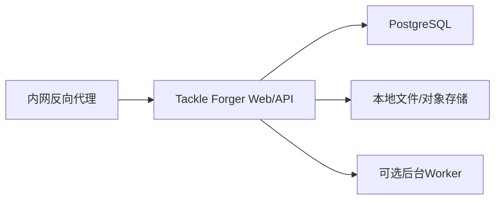

# 钓具配置工坊：已确认设计决策补充 001

> 日期：2026-07-20  
> 状态：部分已确认，部分推荐默认  
> 主设计文档：[`2026-07-20-template-series-generation-system-design-v2.md`](./2026-07-20-template-series-generation-system-design-v2.md)

本文补充并修正主设计文档中关于钓法、品质、功能专精、属性平衡预算、服务器资源、软兼容分数、SKU身份和被动词条执行的设计。

## 1. 决策摘要

| 主题 | 决策 |
| --- | --- |
| 钓法与类型 | 数据和规则保持两层；界面可以合并成一个操作步骤 |
| 计算顺序 | 重量基准 → 钓法系数 → 类型系数 → 功能 → 性能 → 品质 |
| 品质 | C/绿、B/蓝、A/紫、S/橙，是同一套品质的两种表示 |
| Function Level | 功能定位不是等级；Level表示该功能的专精强度，建议改名Function Intensity |
| 预算 | 区分“属性平衡预算”和“服务器资源预算”；前文Patch预算指前者 |
| 软兼容分 | 使用-3到+3的可解释序数分，只排序和预警，不修改属性、不覆盖硬兼容 |
| SKU | SKU是玩家看到的钓具抽屉/重量规格入口，不是购买对象 |
| Model | Model是玩家实际选择和购买的具体型号 |
| 被动词条 | 永久属性进入静态配置；条件型能力通过版本化事件协议进入模拟器 |

## 2. 钓法与类型：两层数据，一个操作步骤

### 2.1 决策

钓法和类型应保持两个独立规则层：

```text
重量段中性模板
→ 钓法 Method Profile
→ 类型 Type Profile
→ 功能定位
→ 性能定位
→ 品质
```

在工作台界面中，可以把前两项合并为“玩法与结构”步骤，让设计者连续选择；但数据库、规则版本和计算轨迹必须分开。

### 2.2 为什么不合并成“钓法×类型”一层

合并后会出现规则复制：

```text
路亚×纺车
路亚×水滴
浮钓×纺车
浮钓×其他类型
……
```

同一个类型的结构差异会在每种钓法下重复维护。新增钓法或类型时，组合数量成倍增加。

分层后：

- 钓法只回答玩法环境、施力方式和参数域如何变化；
- 类型只回答直柄/枪柄、纺车/水滴等硬件结构如何变化；
- Method × Type是否适配，由兼容规则负责；
- 少数真正依赖两者组合的修正，用条件规则表达，不复制整个系数表。

### 2.3 计算语义

乘法系数虽然数学上可以交换，但系统仍保持固定顺序，因为：

- 部分参数使用add、min、max或set；
- 类型规则可能假设钓法规则已经建立某个基准；
- 固定顺序才能产生稳定、可解释的轨迹。

建议模型：

```ts
interface MethodProfile {
  id: string;
  name: string;
  rules: AdjustmentRule[];
  supportedParameterKeys: string[];
  constraintRuleIds: string[];
}

interface TypeProfile {
  id: string;
  name: string;
  rodStructure: string;
  reelStructure: string;
  rules: AdjustmentRule[];
  compatibilityRuleIds: string[];
}
```

若需要“路亚中的水滴轮额外修正”，保存一条带条件的Interaction Rule：

```text
WHEN method = lure AND type = baitcast
APPLY rules = [...]
```

不要把它变成第三份完整的“路亚×水滴模板”。

## 3. 品质映射：C/B/A/S = 绿/蓝/紫/橙

### 3.1 已确认映射

| 品质ID建议 | 字母 | 颜色 | 含义 |
| --- | --- | --- | --- |
| quality_c_green | C | 绿 | 基础合格 |
| quality_b_blue | B | 蓝 | 主力标准 |
| quality_a_purple | A | 紫 | 高阶专精 |
| quality_s_orange | S | 橙 | 旗舰完成度 |

字母与颜色是同一品质的两种展示方式，不应维护两套规则。

### 3.2 数据建议

```ts
interface QualityProfile {
  id: string;
  rank: 1 | 2 | 3 | 4;
  gradeCode: "C" | "B" | "A" | "S";
  colorCode: "green" | "blue" | "purple" | "orange";
  displayName: string;
  rules: AdjustmentRule[];
  priceIndex: number;
}
```

后续把工作簿和种子数据中的“金”统一迁移为“橙”。历史快照可保留旧显示名，但内部Quality ID不变。

## 4. Function Level：定位和专精强度是两个概念

### 4.1 功能定位不是等级

功能定位回答：

> 这件装备主要擅长什么玩法？

例如：

- 泛用；
- 远投；
- 精细感知；
- 快速操控；
- 障碍强攻；
- 大饵动力；
- 持久征服。

这些是并列类别，不是从低到高的等级。

### 4.2 Level表示专精强度

附件中的I/II/III表示同一功能的专精程度：

| 建议名称 | 数值 | 含义 |
| --- | --- | --- |
| 轻度专精 | 1 | 优势和代价较轻，接近中性 |
| 标准专精 | 2 | 功能表达明确 |
| 极致专精 | 3 | 优势最大，同时代价也最大 |

因此建议把字段从`functionLevel`改名为：

```text
functionIntensity
```

或中文“功能专精强度”。这能避免与品质等级混淆。

### 4.3 它和品质无关

品质代表整体完成度和投入，功能专精强度代表偏科程度。

例如：

- C/绿的障碍强攻III：制作普通，但非常偏向强拔，代价明显；
- S/橙的泛用I：完成度很高，但仍然是低偏科泛用装备；
- S/橙不能因为品质高，就在障碍强攻上压过同重量的专精装备。

### 4.4 系列默认规则

严格系列必须固定`functionProfileId`。

`functionIntensity`建议默认固定；只有在明确设计“重量越高、专精越强”的系列时，才允许：

```text
intensityPolicy = weight_curve
```

并要求设计者显式预览和批准强度曲线。

## 5. 两种预算必须分开命名

### 5.1 属性平衡预算

主设计文档中的“预算上限”指游戏数值的属性平衡预算，不是CPU、内存或磁盘。

建议统一改称：

```text
Attribute Balance Budget / 属性平衡预算
```

它回答：

- 一个Function Profile能获得多少优势；
- 必须付出多少自重、抛投、线径等代价；
- Series、Weight Variant、Model Variant的Patch最多能偏离基底多少；
- 是否形成无代价全优解。

原“Patch预算上限”应改称“Patch属性偏移上限”。

### 5.2 服务器资源预算

内网使用Dell R730，并已运行十多个服务。对本系统而言，主要负载是：

- 小规模规则计算；
- JSON状态和版本读写；
- Excel/飞书导入；
- 批量重算；
- 配置快照和历史记录。

派生模板按需计算，不预先持久化整个笛卡尔积，因此资源需求较低。

建议初始资源限制：

| 组件 | 常态建议 | 批量任务峰值建议 |
| --- | --- | --- |
| Web/API服务 | 0.5–1 CPU、1GB RAM | 1–2 CPU、2GB RAM |
| 后台重算Worker | 可与Web合并 | 1–2 CPU、1–2GB RAM |
| 数据库 | 复用现有PostgreSQL优先 | 根据并发和备份调整 |
| 文件/快照 | 初期数GB足够 | 设置版本保留和备份策略 |

以上是启动配额，不是硬件容量判断；上线后按实际批量重算时长和内存峰值调整。

### 5.3 推荐部署形态



建议：

- 初期使用一个应用容器即可；
- 批量重算明显影响交互时再拆Worker；
- 不需要为了模板查询立即引入Redis；
- 派生模板使用进程缓存或数据库缓存；
- 配置健康检查、日志轮换、每日数据库备份；
- 给服务设置明确CPU/内存上限，避免影响R730上的其他服务。

## 6. 软兼容 Affinity Score

### 6.1 它是什么

硬兼容回答：

> 这个组合能不能成立？

软兼容分回答：

> 在所有能成立的组合中，这个组合有多符合玩法、结构和系列概念？

它用于：

- 候选排序；
- 最近派生模板同分时决胜；
- 系列一致性解释；
- 给设计者“不推荐但允许”的提醒。

它不用于：

- 直接修改任何属性；
- 覆盖硬禁止；
- 自动替设计者更改系列类型；
- 代替最终数值校验。

### 6.2 推荐分值：-3到+3

不建议直接使用-100到+100。过细的分值会制造虚假精度，也很难维护。

| 分值 | 含义 |
| --- | --- |
| +3 | 强协同，是典型搭配 |
| +2 | 明显适配 |
| +1 | 略有帮助 |
| 0 | 中性 |
| -1 | 略有冲突 |
| -2 | 不推荐，但仍可成立 |
| -3 | 强冲突，应要求设计理由，但不是物理禁止 |

物理上不能成立的组合使用`deny`，不使用-3代替。

### 6.3 分组计算，避免规则数量污染结果

软兼容按解释轴分组：

```text
method_type
type_weight
type_function
function_performance
material_function
quality_specialization
model_component
```

每个轴只采用“最具体且优先级最高”的一条匹配规则，避免某个方向因为规则写得多就获得更高分。

```text
AffinityScore = Σ(axisScore × axisWeight) / Σ(axisWeight)
```

最终结果仍在-3到+3之间。

推荐初始权重：

| 轴 | 权重 |
| --- | --- |
| method_type | 1.2 |
| type_weight | 1.2 |
| type_function | 1.5 |
| function_performance | 1.5 |
| material_function | 1.0 |
| quality_specialization | 0.8 |
| model_component | 1.5 |

权重必须配置化，并通过真实系列样本校准。

### 6.4 示例：1.8kg障碍强攻系列

目标组合：

```text
钓法：路亚
目标重量：1.8kg
类型：水滴+枪柄
功能：障碍强攻
性能：高强骨架
线材：PE
```

可能命中的解释：

| 轴 | 分值 | 权重 | 理由 |
| --- | --- | --- | --- |
| method_type | +2 | 1.2 | 路亚与水滴枪柄明显适配 |
| type_weight | +1 | 1.2 | 1.8kg处于常规水滴可用区间 |
| type_function | +3 | 1.5 | 水滴枪柄非常适合障碍强攻 |
| function_performance | +3 | 1.5 | 高强骨架直接支持强拔和耐力 |
| material_function | +2 | 1.0 | PE适合粗线强拔 |

```text
总分 = (2×1.2 + 1×1.2 + 3×1.5 + 3×1.5 + 2×1.0)
     / (1.2 + 1.2 + 1.5 + 1.5 + 1.0)
     ≈ 2.28
```

结论为“强适配”。

如果把性能改为轻量材料：

- function_performance可能从+3降为-1；
- 组合仍可以成立；
- 系统提示“轻量方向与障碍强攻的高负载概念存在冲突”；
- 设计者可以保留，但需要接受强度不足或增加成本的后果。

### 6.5 展示阈值

| 总分 | 展示 |
| --- | --- |
| ≥ 1.5 | 强适配 |
| 0.5–1.49 | 推荐 |
| -0.49–0.49 | 中性 |
| -1.49–-0.5 | 适配较弱，显示warning |
| < -1.5 | 不推荐，批准时要求理由 |

不要仅展示总分。界面必须同时展示每个轴的贡献和自然语言理由。

### 6.6 数据结构

```ts
interface AffinityRule {
  id: string;
  axis: AffinityAxis;
  when: CompatibilityCondition[];
  score: -3 | -2 | -1 | 0 | 1 | 2 | 3;
  weightOverride?: number;
  reason: string;
  priority: number;
  specificity: number;
  version: string;
}

interface AffinityResult {
  score: number;
  label: "strong" | "recommended" | "neutral" | "weak" | "discouraged";
  contributions: Array<{
    axis: AffinityAxis;
    score: number;
    weight: number;
    ruleId: string;
    reason: string;
  }>;
}
```

## 7. SKU是抽屉，Model是购买对象

### 7.1 已确认身份层级

```text
Collection 产品族
└─ Series 严格系列
   └─ SKU 钓具抽屉/重量规格入口
      ├─ Model 快调短竿型号
      ├─ Model 慢调长竿型号
      └─ Model 其他具体型号
```

SKU负责：

- 在玩家界面中占据一个商品卡片或抽屉入口；
- 表达系列、目标重量、功能和核心词条；
- 聚合多个可购买Model；
- 提供默认排序和推荐型号。

Model负责：

- 玩家实际选择和购买；
- 具体调性、长度、柄型、轮体和线组；
- 价格、库存、解锁条件和耐久状态；
- 最终配置快照。

### 7.2 交易和存档引用

购买记录、玩家背包和装备实例必须引用：

```text
modelId + configurationSnapshotId
```

不能只保存skuId，否则以后新增、删除或调整抽屉中的型号时，历史装备无法复现。

建议模型：

```ts
interface SkuDrawer {
  id: string;
  seriesId: string;
  targetWeightKg: number;
  matchedProjectionId: string;
  modelIds: string[];
  defaultModelId?: string;
  displayOrder: number;
}

interface PurchasableModel {
  id: string;
  skuId: string;
  configurationSnapshotId: string;
  price: number;
  unlockRequirementIds: string[];
  inventoryPolicyId?: string;
}
```

## 8. 被动词条是否进入钓鱼模拟器

### 8.1 结论

只要被动词条向玩家承诺了机械效果，就必须以某种方式进入模拟器。

但不是所有词条都需要使用动态事件系统。先区分三类：

| 类型 | 示例 | 执行位置 |
| --- | --- | --- |
| static_modifier | 永久+5%回弹、-8%自重 | 配置生成阶段，写入最终属性 |
| simulation_effect | 张力突增时降低耐久损耗 | 钓鱼模拟器事件系统 |
| descriptive_only | 品牌故事、收藏描述 | 不产生玩法属性 |

### 8.2 为什么不能只计品质分

如果“抗冲击”“热衰减抑制”等被动词条只增加品质分，却不改变实际钓鱼过程，会产生三个问题：

1. 玩家看到的承诺与实际体验不一致；
2. 系统无法判断词条真实强度；
3. 品质和价格会为不存在的能力付费。

因此，具有玩法承诺的被动词条必须具备可执行定义或被标记为尚未实现，不能只保存描述文本。

### 8.3 静态能力直接编译

永久生效且没有条件、时间或叠层的能力，应继续使用AdjustmentRule：

```text
高感度：回弹指数 × 1.08
轻量化：杆自重 × 0.94
强化齿轮：轮最大耐力 × 1.10
```

它们在配置生成阶段应用，模拟器只读取最终值，不需要专门理解词条。

### 8.4 动态被动使用声明式事件协议

建议定义有限、版本化的事件集合：

```text
CastStart
CastRelease
HookSet
TensionUpdated
TensionSpike
ReelTick
HeatUpdated
ImpactReceived
LineAbrasion
FatigueTick
FightEnded
```

被动定义：

```ts
interface PassiveEffectDefinition {
  id: string;
  name: string;
  executionMode: "simulation_effect";
  trigger: SimulationEventType;
  conditions: PassiveCondition[];
  effects: PassiveOperation[];
  durationSeconds?: number;
  cooldownSeconds?: number;
  maxStacks?: number;
  resourceCost?: PassiveResourceCost;
  simulatorContractVersion: string;
  balanceScenarioIds: string[];
}
```

不要让配置人员写任意脚本。使用受限操作：

- multiply_parameter；
- add_parameter；
- reduce_damage；
- reduce_durability_loss；
- clamp_tension；
- add_heat；
- reduce_heat；
- add_temporary_tag；
- consume_resource。

### 8.5 示例：抗冲击

```text
触发：TensionSpike
条件：瞬时张力增量超过安全工作拉力的20%
效果：本次杆耐久损耗 × 0.75
代价：触发后2秒内回弹指数 × 0.95
冷却：8秒
```

该词条的价值不应只按“耐久+25%”静态估计，而应在标准模拟场景中评估触发频率和实际节省的耐久。

### 8.6 发布门槛

| executionMode | 发布要求 |
| --- | --- |
| static_modifier | 有确定规则、计算轨迹和属性预算 |
| simulation_effect | 模拟器支持对应contractVersion，并通过场景回归 |
| descriptive_only | 不进入玩法品质分，不声称机械效果 |

增加校验：

- `PASSIVE_HANDLER_MISSING`：模拟器不支持该被动；
- `PASSIVE_UNBOUNDED_STACK`：叠层无上限；
- `PASSIVE_NO_COST_OR_LIMIT`：强效果没有成本、冷却或触发限制；
- `PASSIVE_DESCRIPTION_MISMATCH`：描述与执行定义不一致；
- `PASSIVE_SIMULATOR_VERSION_MISMATCH`：快照与模拟器协议版本不匹配。

### 8.7 推荐落地顺序

1. 先把现有直接属性词条统一标记为static_modifier；
2. 选择3–5个最重要的动态被动，建立最小事件协议；
3. 为每个动态被动建立标准战斗/钓鱼场景；
4. 用模拟结果反推词条品质分和价格预算；
5. 再逐步开放更多触发器和操作，不在首版支持任意脚本。

## 9. 对主设计文档的修订清单

后续实现以本补充决策为准：

1. 在模板执行顺序中加入独立Method Profile层；
2. Quality改为C/绿、B/蓝、A/紫、S/橙统一映射；
3. `functionLevel`改名为`functionIntensity`；
4. “Patch预算”改名为“Patch属性偏移上限”；
5. `affinityScore`采用-3到+3分组加权模型；
6. 删除familySkuId/modelSkuId的歧义，使用skuId表示抽屉、modelId表示购买对象；
7. Affix增加executionMode和模拟器协议版本；
8. 发布快照增加simulatorContractVersion；
9. 被动玩法效果未实现时阻止正式发布。
