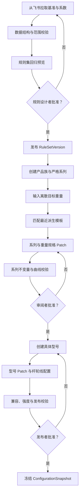

# 钓具配置工坊：多级模板、系列、型号与配置生成系统设计 v2

> 状态：设计提案  
> 日期：2026-07-20  
> 适用范围：淡水路亚杆、轮、线装备配置工作台  
> 主要输入：《淡水路亚杆轮线装备设计.xlsx》、现有 Tackle Forger 规则引擎与系列规划功能

## 0. 执行摘要

本设计把装备生产过程定义为一条可解释、可人工干预、可版本复现的生产链：

```text
飞书源数据
→ 已发布规则集
→ 多维派生模板
→ 系列定义
→ 离散重量规格
→ 具体型号
→ 最终配置快照
```

关键决定如下：

1. **重量不做连续插值。** 1.5kg、1.8kg等离散目标重量，从已经完成规则交叉演绎的派生模板中寻找最接近结果。
2. **派生模板不可直接修改。** 人工调整以 Series、Weight Variant、Model Variant 三层 Patch 保存。
3. **钓法、类型、功能、性能、品质是独立维度。** 它们拥有确定执行顺序，但不需要把每个笛卡尔组合永久保存为独立实体。
4. **兼容性不是一张简单布尔表。** 系统同时支持硬禁止、条件允许、软适配评分和计算后的数值闭环。
5. **系列必须有稳定身份。** 一个严格系列对应一个钓法、一个结构类型、一个核心功能、一个性能方向、一组核心词条和一个品质层级。
6. **营销产品族与严格系列分开。** 产品族可以包容多个结构或功能；严格系列不能。
7. **优势和代价必须同时可解释。** 例如障碍强攻提高拉力、耐力，同时增加自重并降低抛投；自重增加必须计为负收益。
8. **自动校验贯穿每一步，但人工审批集中在三个关卡。** 分别是规则源发布、系列/重量规格批准、型号/配置发布。
9. **已发布配置永远冻结。** 上游规则变化只生成升级候选，不静默修改正式商品。

## 1. 产品目标与边界

### 1.1 要解决的问题

装备设计当前同时涉及：

- 飞书维护的重量基准和系数；
- 类型、功能、性能、品质的交叉演绎；
- 同一系列覆盖多个离散目标重量；
- 一个重量规格下包含多个具体型号；
- 人工精调与通用规则之间的治理；
- 杆、轮、线的结构兼容与强度闭环；
- 商品叙事、词条、品质与最终数值的一致性。

如果把每一级结果都复制成完整模板，将产生大量重复数据，并使上游修改难以传播。反过来，如果只保存最终值，又无法解释来源、复现历史或学习人工调整。

因此，本系统采用：

> 版本化源规则 + 确定性派生结果 + 分层 Patch + 不可变发布快照。

### 1.2 主要用户

| 用户 | 主要任务 | 需要的系统能力 |
| --- | --- | --- |
| 规则设计者 | 维护重量模板、类型和定位系数 | 批量预览、差异检查、回归验证、发布规则集 |
| 系列设计者 | 定义产品族、系列、重量跨度和词条 | 最近模板匹配、系列一致性、批量重量预览 |
| 型号设计者 | 设计快调短竿、慢调长竿等具体型号 | 型号约束、局部 Patch、杆轮线配置闭环 |
| 审阅者 | 判断设计是否合理并批准 | 计算轨迹、优势/代价、兼容原因、前后对比 |
| 发布者 | 冻结正式配置并管理升级 | 版本、快照、冲突保护、升级候选 |

### 1.3 非目标

本轮不直接解决：

- 钓鱼战斗模拟器的完整事件逻辑；
- 玩家背包、商城、制造和掉落经济；
- 美术资产生产；
- 不同游戏模式下的动态平衡热更新。

这些系统可以消费本系统发布的配置快照，但不应反向改变历史配置。

## 2. 领域模型

### 2.1 核心层级


### 2.2 术语定义

| 对象 | 定义 | 是否可直接编辑 |
| --- | --- | --- |
| Method | 路亚、浮钓等玩法参数域和兼容空间 | 是 |
| WeightTemplate | 某钓法、某重量段的中性杆轮线基准 | 是 |
| TypeProfile | 纺车+直柄、水滴+枪柄等结构套系 | 是 |
| FunctionProfile | 泛用、远投、障碍强攻等横向玩法取舍 | 是 |
| PerformanceProfile | 轻量、高强、回弹、散热等工艺方向 | 是 |
| QualityProfile | 品质投入、价格和完成度预算 | 是 |
| DerivedProjection | 上述规则计算后的可复现结果 | 否，只能预览 |
| Collection | 营销产品族，可包容多个严格系列 | 是 |
| SeriesDefinition | 具有稳定概念和不变量的严格系列 | 是 |
| WeightVariant | 系列在一个离散目标重量上的规格 | 仅编辑 Patch |
| ModelVariant | 某重量规格下的具体调性、长度、结构型号 | 是 |
| ConfigurationSnapshot | 发布时冻结的最终杆轮线配置 | 否 |
| AdjustmentPatch | 对继承结果的局部修正 | 是 |
| CompatibilityRule | 结构、玩法、材质和型号之间的兼容规则 | 是 |
| SeriesInvariantPolicy | 系列内部必须保持一致或连续的规则 | 是 |

## 3. 端到端工作流

### 3.1 主流程



### 3.2 三个人工关卡

| 关卡 | 审阅对象 | 通过后结果 |
| --- | --- | --- |
| 规则源发布 | 重量模板、系数、兼容规则、参数元数据 | 新 RuleSetVersion |
| 系列批准 | 系列概念、重量列表、匹配结果、系列 Patch | 已批准 SeriesRevision |
| 型号发布 | 型号、最终参数、词条、配置闭环 | ConfigurationSnapshot |

中间每一级都可以人工预览、检视和调整，但不强制额外审批。

## 4. 多级模板体系

### 4.1 模板不是多份复制数据

系统区分三种数据：

1. **源定义**：人工维护的重量模板、系数、限制和规则。
2. **派生结果**：根据规则集确定性计算、可随时重建的只读结果。
3. **发布快照**：正式发布时冻结、以后不可被上游静默改变的结果。

派生模板的稳定键建议为：

```text
methodId
+ weightTemplateId
+ typeProfileId
+ functionProfileId/functionLevel
+ performanceProfileId/performanceLevel
+ qualityProfileId
+ materialPolicyId
+ ruleSetVersion
```

组合数量较大时不必预先保存全部结果。可以按需计算并缓存，缓存失效条件只有：

- RuleSetVersion变化；
- 源规则内容哈希变化；
- 计算内核版本变化。

### 4.2 标准执行顺序

```text
重量基准
→ 钓法规则
→ 类型规则
→ 功能定位
→ 性能定位
→ 品质规则
→ 材质/线材策略
→ 边界与安全限制
→ 派生模板
```

系列、重量规格和型号 Patch 不属于模板本体，统一在派生结果之后执行。

### 4.3 每层预览

每个派生预览都应提供以下列：

| 参数 | 中性基准 | 本层前值 | 本层操作 | 操作数 | 本层后值 | 累计变化 | 效用 |
| --- | --- | --- | --- | --- | --- | --- | --- |
| 杆最大拉力 | 2.7 | 2.7 | multiply | 1.18 | 3.186 | +18% | 优势 |
| 杆自重 | 105g | 105g | multiply | 1.12 | 117.6g | +12% | 代价 |

用户可以从任一级展开完整轨迹，但调整不会改写派生模板，而是生成有作用域的 Patch。

## 5. 最近派生模板匹配

### 5.1 原则

目标重量不插值。系统从满足系列维度的派生模板集合中选择最接近结果。

例如1.5kg和1.8kg都位于T04的1–2kg范围内，因此都可以选择基于T04生成的同一个派生模板。二者随后通过 WeightVariant Patch 或 ModelVariant 形成差异。

### 5.2 匹配顺序

匹配采用分层排序，不使用一个不可解释的混合总分：

1. 严格匹配 Method、Type、Function、Performance、Quality等身份维度。
2. 执行硬兼容规则，删除禁止组合。
3. 优先选择重量范围包含目标重量的 WeightTemplate。
4. 多个候选都包含目标重量时，比较标称重量的比例距离。
5. 仍相同时，比较软兼容偏好分。
6. 最后才比较归一化属性距离。

比例距离：

```text
weightDistance = abs(ln(targetWeightKg / nominalWeightKg))
```

使用比例距离是因为0.1–100kg跨越三个数量级；在线性距离下，重型区间会压倒轻型区间。

### 5.3 边界语义

重量段统一采用：

```text
[fishMinKg, fishMaxKg)
```

最后一个重量段的上界允许闭合。若历史数据在边界处重叠，则优先：

1. 人工固定的模板；
2. 标称重量距离更近者；
3. 较窄重量范围；
4. 更高规则版本中的明确优先级。

### 5.4 匹配记录

```ts
interface ProjectionMatch {
  targetWeightKg: number;
  matchedProjectionId: string;
  weightTemplateId: string;
  ruleSetVersion: string;
  weightDistance: number;
  compatibilityScore: number;
  reason: string[];
  alternativeProjectionIds: string[];
  pinnedByUser: boolean;
  matchedAt: string;
}
```

Patch不得参与反向匹配。只有用户主动“重新匹配”时，系统才允许替换 matchedProjectionId。

### 5.5 同基底重量规格

同一系列的多个重量规格可以命中同一个派生模板。系统增加以下检查：

| 校验码 | 条件 | 级别 |
| --- | --- | --- |
| SIBLING_SHARED_BASE | 多个重量规格命中同一派生模板 | info |
| SIBLING_VARIANTS_IDENTICAL | 基底和最终关键参数均相同 | warning |
| SIBLING_WEIGHT_ORDER | 更高目标重量的承载曲线反而下降 | error/warning |

## 6. Patch 模型

### 6.1 Patch作用域

```text
派生模板
→ Series Patch
→ Weight Variant Patch
→ Model Variant Patch
→ 发布前临时修正
→ 配置快照
```

作用域越靠后，影响范围越小，优先级越高。

### 6.2 数据结构

```ts
interface AdjustmentPatch {
  id: string;
  scopeType: "series" | "weight_variant" | "model_variant";
  scopeId: string;
  stage: "series" | "weight" | "model" | "final_review";
  parameterKey: string;
  operation: "add" | "multiply" | "set" | "min" | "max";
  operand: number | string;
  condition?: PatchCondition;
  order: number;
  baseProjectionId: string;
  baseRuleSetVersion: string;
  reason: string;
  touchedBy: string;
  status: "draft" | "approved" | "superseded";
  createdAt: string;
}
```

### 6.3 操作选择

| 操作 | 含义 | 上游变化后的行为 |
| --- | --- | --- |
| multiply | 与基底同比变化 | 自动重新应用 |
| add | 固定绝对补偿 | 自动重新应用，检查量纲 |
| set | 锁定为确定值 | 标记必须人工复核 |
| min/max | 设置边界 | 自动重新应用 |

### 6.4 屏蔽继承规则

数值 Patch 和规则屏蔽应分开：

```ts
interface RuleSuppressionPatch {
  id: string;
  scopeType: "series" | "weight_variant" | "model_variant";
  scopeId: string;
  suppressedRuleId: string;
  replacementRuleId?: string;
  reason: string;
  baseRuleSetVersion: string;
}
```

这样系统能够区分“最终值恰好相同”和“明确不继承某条规则”。

### 6.5 冲突语义

同一参数出现多个 Patch 时：

1. 按作用域顺序执行；
2. 同作用域按 order执行；
3. 同作用域出现多个 set时阻止批准；
4. 修改已被 set锁定的参数时必须显式解除锁定；
5. 所有冲突保留来源和解决记录。

## 7. 兼容系统

### 7.1 四种兼容判断

| 类型 | 回答的问题 | 结果 |
| --- | --- | --- |
| 物理兼容 | 能否组成合法杆轮线装备 | allow/deny |
| 条件兼容 | 满足哪些条件后才能成立 | require |
| 设计适配 | 是否符合玩法和商品概念 | prefer/discourage |
| 数值闭环 | 计算后的承载、饵重、线号是否合理 | error/warning/pass |

### 7.2 规则结构

```ts
interface CompatibilityRule {
  id: string;
  sourceType: CompatibilityEntityType;
  sourceId: string;
  targetType: CompatibilityEntityType;
  targetId: string;
  relation: "allow" | "deny" | "require" | "prefer" | "discourage";
  affinityScore: number;
  conditions: CompatibilityCondition[];
  requirements: CompatibilityRequirement[];
  severity: "error" | "warning" | "info";
  reason: string;
  sourceReference?: string;
  priority: number;
  version: string;
  enabled: boolean;
}
```

涉及三项以上对象时，不应继续扩展二维矩阵，而应使用条件规则：

```text
WHEN type = 水滴+枪柄 AND targetWeight < 0.5kg
REQUIRE performance in [轻量材料, 抛投系统] OR modelTag = BFS
OTHERWISE warning: 轻饵启动能力不足
```

### 7.3 必须覆盖的关系

| 关系 | 典型检查 |
| --- | --- |
| Method × Type | 钓法是否支持该结构套系 |
| Type × Weight | BFS、常规水滴、大型纺车、圆鼓轮的重量边界 |
| Type × Function | 水滴/纺车对障碍、轻饵、远投的偏好 |
| Function × Performance | 远投×抛投系统、持久×散热等协同 |
| Quality × PerformanceLevel | 紫/金品质所需的性能投入级别 |
| LineMaterial × Weight | 碳线主线、尼龙、PE的适用范围 |
| LineMaterial × Function | 远投、感度、障碍耐磨和缓冲的取舍 |
| Model × Reel | 柄型、轮型、轮体尺寸和安装关系 |
| Rod × Reel × Line | 拉力比、安全工作拉力和线容量 |

### 7.4 建议的软适配

| 功能 | 强协同性能 | 次优但可用 | 可能冲突 |
| --- | --- | --- | --- |
| 精细感知 | 轻量材料、高回弹竿体 | 抛投系统 | 过重高强骨架 |
| 快速操控 | 高回弹竿体、传动散热 | 轻量材料 | 低速重型持久配置 |
| 远投 | 抛投系统、轻量材料 | 高回弹竿体 | 过粗线组、超重轮体 |
| 障碍强攻 | 高强骨架、耐久工艺 | 传动散热 | 极轻且低强度结构 |
| 大饵动力 | 高强骨架、传动散热 | 耐久工艺 | 轻饵专用结构 |
| 持久征服 | 耐久工艺、传动散热 | 高强骨架 | 小线容、极轻轮体 |

软适配分只参与候选排序和解释，不能覆盖硬禁止。

### 7.5 兼容结果

```ts
interface CompatibilityResult {
  hardStatus: "pass" | "fail";
  requirements: string[];
  warnings: string[];
  affinityScore: number;
  matchedRuleIds: string[];
  reasons: string[];
}
```

## 8. 产品族、系列、重量规格和型号

### 8.1 为什么需要产品族

现有附件中的“青芦·入门”“河脊·强韧”等系列同时包容多个类型和功能。它们更接近统一品牌叙事下的产品族。

严格系列则承担数值和玩法一致性，不能同时表示完全不同的结构与功能。

```text
Collection：青芦
├─ Series：青芦·直柄泛用
├─ Series：青芦·枪柄操控
└─ Series：青芦·枪柄障碍
```

产品界面仍可按Collection聚合展示，不会损失营销表达。

### 8.2 SeriesDefinition

```ts
interface SeriesDefinition {
  id: string;
  collectionId?: string;
  name: string;
  description: string;
  fishingMethodId: string;
  typeProfileId: string;
  qualityProfileId: string;
  coreFunctionId: string;
  functionLevelPolicy: LevelPolicy;
  performanceProfileId: string;
  performanceLevelPolicy: LevelPolicy;
  coreAffixIds: string[];
  secondaryAffixPoolIds: string[];
  forbiddenAffixIds: string[];
  targetWeightsKg: number[];
  invariantPolicyId: string;
  seriesSignatureId: string;
  patchIds: string[];
  status: "draft" | "in_review" | "approved" | "published" | "superseded";
  revision: number;
}
```

### 8.3 WeightVariant

```ts
interface WeightVariant {
  id: string;
  seriesId: string;
  targetWeightKg: number;
  projectionMatch: ProjectionMatch;
  patchIds: string[];
  finalValues: Record<string, number | string>;
  validationSummary: ValidationSummary;
  status: "draft" | "approved" | "published";
}
```

### 8.4 ModelVariant

```ts
interface ModelVariant {
  id: string;
  weightVariantId: string;
  name: string;
  action: string;
  hardness: string;
  lengthM: number;
  rodStructureId: string;
  reelStructureId: string;
  reelSize?: string;
  lineMaterialId: string;
  componentSelections: Record<string, string>;
  affixIds: string[];
  patchIds: string[];
  finalValues: Record<string, number | string>;
  status: "draft" | "approved" | "published";
}
```

如果业务界面坚持把WeightVariant称为SKU，数据库中应区分：

- `familySkuId`：重量规格卡片；
- `modelSkuId`：玩家最终选择的具体型号。

## 9. 系列不变量

### 9.1 不变量分类

| 类别 | 规则 | 失败处理 |
| --- | --- | --- |
| 身份不变量 | 钓法、类型、品质、核心功能、性能方向一致 | 阻止批准 |
| 集合不变量 | 全部规格包含核心词条，不包含禁用词条 | 阻止批准 |
| 方向不变量 | 强化和代价方向与系列叙事一致 | 警告/阻止 |
| 曲线不变量 | 随目标重量增加，关键承载能力不逆向跳变 | 警告/阻止 |
| 范围不变量 | 长度、调性、传动比等保持在系列许可范围 | 警告 |
| 型号不变量 | 型号变化不能改变系列身份和核心能力 | 阻止发布 |
| 版本不变量 | 发布结果引用完整且不可变的规则版本 | 阻止发布 |

### 9.2 精确身份不变量

默认要求全部重量规格和型号保持：

- fishingMethodId；
- typeProfileId；
- qualityProfileId；
- coreFunctionId；
- performanceProfileId；
- coreAffixIds；
- 品牌、视觉语言和命名语义。

功能级和性能级默认固定。若允许随重量变化，必须显式声明 `weightCurve`，并展示曲线。

### 9.3 系列方向签名

```ts
interface SeriesSignatureAxis {
  parameterGroup: string;
  expectedDirection: "positive" | "negative" | "neutral" | "contextual";
  importance: number;
  tolerance: number;
}
```

例如障碍强攻系列：

```text
拉力：positive
耐力：positive
饵重上限：positive
自重：positive，但标记为代价
抛投：negative
轻饵启动：neutral/negative
```

每个重量规格允许幅度不同，但不得出现与系列签名相反的主方向。

### 9.4 重量曲线不变量

随着targetWeightKg增加，默认要求：

- 杆最大拉力不下降；
- 轮最大拉力不下降；
- 线最大拉力不下降；
- 安全工作拉力不下降；
- 杆轮耐力不下降；
- 饵重上限不下降；
- 推荐线号总体不下降。

杆长、传动比、调性和回弹属于情境参数，不强制单调，只检查系列许可范围。

### 9.5 词条不变量

词条分为：

- `coreAffixIds`：所有重量和型号必须携带；
- `secondaryAffixPoolIds`：允许型号差异；
- `forbiddenAffixIds`：与系列概念冲突；
- `optionalSlots`：允许变化的次级词条数量。

核心词条决定系列身份，次级词条负责型号差异，二者不可混用。

### 9.6 一致性分数

系列一致性分数只用于排序和预警，不代替硬规则：

```text
CoherenceScore =
  方向签名符合度 × 40%
+ 核心词条覆盖度 × 30%
+ 软兼容适配度 × 20%
+ 重量曲线平滑度 × 10%
```

身份、核心词条、硬兼容和版本完整性仍以单独门槛判断。

## 10. 优势、代价与数值预算

### 10.1 参数效用元数据

```ts
interface ParameterDefinition {
  key: string;
  label: string;
  itemKind: "rod" | "reel" | "line";
  unit: string;
  precision: number;
  benefitMode: "higher_better" | "lower_better" | "target_range" | "contextual";
  balanceWeight: number;
  normalizationScale: number;
  targetRange?: { min: number; max: number };
  parameterGroup: string;
}
```

示例：

| 参数 | benefitMode |
| --- | --- |
| 最大拉力、耐力、回弹 | higher_better |
| 杆自重、轮自重、等强线径 | lower_better |
| 杆轮拉力比、线轮拉力比 | target_range |
| 长度、传动比、调性 | contextual |

### 10.2 乘法型规则的预算贡献

```text
impact = directionSign × balanceWeight × ln(after / before)
```

其中：

- higher_better的directionSign为+1；
- lower_better的directionSign为-1；
- contextual不进入通用优劣总分；
- target_range按偏离目标范围的程度计分。

因此杆自重×1.12会产生负贡献，而拉力×1.18产生正贡献。

### 10.3 加法型规则的预算贡献

```text
impact = directionSign × balanceWeight × (after - before) / normalizationScale
```

normalizationScale由参数注册表配置，避免“100点耐力”和“0.05抛投加成”无法比较。

### 10.4 分层预算政策

| 层 | 预算原则 |
| --- | --- |
| Type | 塑造操作差异，整体接近中性 |
| Function | 必须同时包含优势和代价，禁止全优 |
| Performance | 允许有限净增益，由性能级和成本支持 |
| Quality | 允许更高净增益，但不能改变用途边界 |
| Series Patch | 小幅概念塑形，不应修复系统性规则错误 |
| Weight Patch | 只处理离散重量规格差异 |
| Model Patch | 只处理具体长度、调性、零件和结构差异 |

### 10.5 防止无代价最优解

系统执行Pareto支配检查：

> 在同重量、同品质、同价格预算下，如果组合A在所有关键有效属性上都不差于组合B，并且至少一项更好，则B被A支配。

功能定位出现支配关系时通常是设计错误；性能或品质层出现支配关系时可以允许，但必须由价格、稀有度或制造成本解释。

另外增加：

- `FUNCTION_NO_TRADEOFF`：功能定位没有任何有效代价；
- `QUALITY_CROSSES_PURPOSE`：高品质泛用装备跨用途击败同品质专精装备；
- `PATCH_BUDGET_EXCEEDED`：局部Patch把规格推离系列预算；
- `MASS_COST_MISSING`：增重未进入代价说明。

## 11. 校验体系

### 11.1 校验阶段

| 阶段 | 校验 |
| --- | --- |
| 导入 | ID、字段、单位、范围、重复、空表、版本冲突 |
| 规则集 | 运算合法性、条件合法性、预算、Pareto、回归差异 |
| 派生模板 | 数值范围、公式、轨迹完整性、结构兼容 |
| 系列 | 身份不变量、词条、重量覆盖、方向签名 |
| 重量规格 | 最近匹配、同基底重复、单调曲线、Patch预算 |
| 型号 | 调性、长度、轮型、线材、组件匹配 |
| 最终配置 | 杆轮线拉力比、安全工作拉力、发布版本完整性 |

### 11.2 严重级别

| 级别 | 含义 | 行为 |
| --- | --- | --- |
| error | 物理不兼容、身份破坏、版本缺失、关键数值非法 | 阻止批准/发布 |
| warning | 软适配弱、曲线异常、重复规格、预算偏离 | 允许继续但必须确认 |
| info | 共享基底、合理继承、正常取舍说明 | 仅提示 |

### 11.3 发布前必须通过

- 无error；
- 所有warning已被确认或写明理由；
- 规则集、派生模板和Patch版本完整；
- 正式值均能追踪到源模板、规则或人工Patch；
- 系列核心词条完整；
- 杆、轮、线配置闭环；
- 发布快照校验和生成成功。

## 12. 版本与治理

### 12.1 版本链

```text
FeishuSourceRevision
→ RuleSetVersion
→ DerivedProjectionRef
→ SeriesRevision
→ WeightVariantRevision
→ ModelVariantRevision
→ ConfigurationSnapshot
```

每一层保存上游版本和内容哈希。

### 12.2 发布快照

```ts
interface ConfigurationSnapshot {
  id: string;
  modelVariantId: string;
  seriesRevision: number;
  ruleSetVersion: string;
  projectionId: string;
  patchSetHash: string;
  finalValues: Record<string, number | string>;
  affixIds: string[];
  compatibilityResult: CompatibilityResult;
  validationReport: ValidationReport;
  calculationTrace: CalculationTraceItem[];
  publishedBy: string;
  publishedAt: string;
}
```

发布后：

- 不接受原地重算；
- 上游变化生成UpgradeCandidate；
- 用户查看旧值、新值、规则差异和Patch重放结果；
- 重新批准后创建新Snapshot，不覆盖旧Snapshot。

### 12.3 Patch重新基准化

规则集更新后：

- multiply、add、min、max可以自动重放；
- set一律进入人工复核；
- 被屏蔽的规则如果已删除或语义改变，进入冲突；
- 旧基底与新基底差异超过阈值时，全部Patch进入审阅。

### 12.4 飞书回写

不把所有人工调整直接写回飞书。流程为：

```text
本地Patch样本
→ 重复模式聚合
→ 通用规则建议
→ 回归比较
→ 人工批准
→ 晋升为规则定义
→ 冲突检查
→ 回写飞书并发布新RuleSetVersion
```

单系列、单重量、单型号特例永久留在本地Patch层。

## 13. 工作台产品设计

### 13.1 信息架构

建议工作台分成六个主要空间：

1. **数据源与参数注册表**：飞书同步、字段映射、单位和效用方向。
2. **规则实验室**：类型、功能、性能、品质和兼容规则。
3. **派生模板浏览器**：查看任意组合的逐层结果和计算轨迹。
4. **系列设计器**：产品族、严格系列、重量列表和系列不变量。
5. **型号与配置**：重量规格抽屉、多个具体型号和杆轮线明细。
6. **审阅与发布**：批量比较、校验、版本、升级和规则学习。

### 13.2 派生模板浏览器

页面结构：

- 顶部：钓法、重量段、类型、功能、性能、品质选择器；
- 主区：基准值、本层变化、最终值横向对比表；
- 右侧：优势、代价、预算和兼容解释；
- 底部：完整规则轨迹；
- 操作：创建系列、复制组合链接、生成规则建议。

派生模板只读。任何“调整”操作都必须先选择作用域：

- 影响整个系列；
- 只影响一个重量规格；
- 只影响一个具体型号。

### 13.3 系列设计器

左侧为系列定义，中间为重量跨度，右侧为一致性和校验。

重量跨度视图沿用附件的矩阵/甘特表达，但底层数据按WeightVariant保存，不使用合并单元格作为实体关系。

每个重量规格卡片显示：

- 目标重量；
- 匹配的模板和距离；
- 类型、功能、性能、品质；
- 核心词条；
- 优势/代价摘要；
- Patch数量；
- 校验状态。

### 13.4 重量规格抽屉

抽屉分为四个标签：

1. **来源**：为什么匹配该派生模板、有哪些备选；
2. **属性**：基底、系列Patch、重量Patch和最终值；
3. **型号**：该重量规格下的具体型号列表；
4. **校验**：兼容、预算、曲线和发布问题。

### 13.5 型号设计器

型号编辑采用“结构输入 + 自动配置 + 局部Patch”：

- 调性、硬度、长度；
- 竿柄和轮体规格；
- 轮尺寸、传动比和线容量；
- 线材、线号和浮沉属性；
- 型号次级词条；
- 杆、轮、线参数明细；
- 与同重量其他型号的差异比较。

型号只能在系列允许的包络内变化。超出包络时，系统提示“创建新系列”而不是继续堆叠Patch。

### 13.6 审阅体验

审阅者需要快速回答五个问题：

1. 它来自哪里？
2. 它擅长什么？
3. 它付出了什么代价？
4. 它与同系列其他重量/型号是否一致？
5. 它是否能被以后完整复现？

因此审阅摘要固定展示：

- 来源版本；
- 最大三个优势；
- 最大三个代价；
- 兼容结论；
- 系列一致性；
- 与上次发布的差异；
- 待确认warning。

## 14. 当前实现差距

### 14.1 已有基础

当前工程已经拥有：

- 动态参数注册表；
- 重量模板和多维Modifier；
- 有序规则层和计算轨迹；
- 加、乘、覆盖、上下限和公式操作；
- 词条、品质、候选和正式SKU；
- 人工审阅和候选override；
- 飞书拉取、绑定、差异预览和冲突保护；
- 工作区版本和正式SKU快照思路。

这些能力应保留并作为v2迁移基础。

### 14.2 需要调整

| 当前模型 | 问题 | v2方案 |
| --- | --- | --- |
| WeightTemplate不含methodId | 文档语义与数据结构断开 | 增加Method并纳入模板身份 |
| SeriesRecipe允许多个模板/结构/功能/性能 | 它是候选搜索器，不是严格系列 | 拆为CandidateSearchRecipe和SeriesDefinition |
| generateCandidates执行笛卡尔组合 | 容易组合爆炸 | 派生模板按需缓存，系列使用确定身份 |
| Candidate.overrides只保存最终值 | 无法表达add/multiply和重放 | 升级为AdjustmentPatch |
| 手工层统一按set执行 | 上游更新后难以重新基准化 | 保留多种Patch操作并标记set复核 |
| OfficialSku只有一个杆/轮/线ID | 无法表示一个重量规格下多个型号 | 增加WeightVariant和ModelVariant |
| DetailOverride按itemKind唯一 | 同类多个型号无法并存 | 改为ModelComponent/ModelVariant作用域 |
| 当前系列表混合多种结构与功能 | 系列不变量不成立 | 增加Collection，严格Series固定身份 |

## 15. 迁移计划

### 阶段一：建立不破坏旧数据的基础对象

- 给ParameterDefinition增加benefitMode、balanceWeight和normalizationScale；
- 增加Method、RuleSetVersion、DerivedProjection；
- 把现有Candidate.override迁移为operation=set的WeightVariant Patch；
- 保留旧字段作为只读兼容层。

### 阶段二：拆分系列与重量规格

- 增加Collection、SeriesDefinition、WeightVariant；
- 把SeriesRecipe重命名或复制为CandidateSearchRecipe；
- 为每个目标重量执行最近派生模板匹配；
- 加入同基底和重量曲线校验。

### 阶段三：兼容与不变量引擎

- 建立CompatibilityRule；
- 建立SeriesInvariantPolicy和SeriesSignature；
- 在候选生成、系列审阅和型号发布三个位置复用同一检查内核；
- 增加硬规则和软适配的解释输出。

### 阶段四：具体型号与配置快照

- 增加ModelVariant和ModelComponent；
- 支持一个WeightVariant下多个具体型号；
- 发布ConfigurationSnapshot；
- 保留历史版本和升级候选。

### 阶段五：预算与规则学习

- 实现参数效用和归一化预算；
- 增加Pareto支配检查；
- 聚合Patch模式；
- 生成可审批的通用规则晋升建议；
- 批准后回写飞书并产生新规则版本。

## 16. 验收用例

### 16.1 最近匹配

- 1.5kg和1.8kg在相同维度下均命中T04派生模板；
- 系统记录匹配原因和备选结果；
- 两者最终属性相同时产生warning但不阻止保存；
- 用户可以固定模板或主动重新匹配。

### 16.2 Patch

- multiply Patch在上游基准变化后同比重放；
- add Patch保持固定补偿；
- set Patch进入人工复核；
- 已发布快照不随重放改变；
- 同层多个set被识别为冲突。

### 16.3 兼容

- 硬不兼容组合无法进入发布；
- 轻型水滴组合缺少BFS/抛投条件时产生要求或warning；
- 巨物段的小型轮体被阻止；
- 软适配只影响排序，不覆盖硬规则；
- 所有兼容结论能解释命中的规则。

### 16.4 系列

- 同系列出现不同typeProfileId时阻止批准；
- 缺少核心词条时阻止批准；
- 更高目标重量的安全工作拉力下降时产生错误；
- 型号可以改变长度和调性，但不能改变系列核心功能；
- 现有跨结构“系列”可迁移为Collection下多个严格Series。

### 16.5 优势与代价

- 障碍强攻的增重被记为负贡献；
- 功能定位全属性上升且无代价时产生FUNCTION_NO_TRADEOFF；
- 同重量同品质下出现Pareto支配时产生警告；
- 高品质泛用装备跨用途压过专精装备时产生QUALITY_CROSSES_PURPOSE。

### 16.6 版本

- 每个正式配置能追踪到飞书源版本、RuleSetVersion、Projection和Patch；
- 上游修改只生成升级候选；
- 旧配置可以完整复现；
- 飞书与本地同时修改时阻止盲目回写。

## 17. 成功标准

系统满足以下条件即可认为v2设计落地：

1. 任意最终参数都能解释“基准、规则、Patch、版本”。
2. 相同输入和相同RuleSetVersion总能生成相同派生结果。
3. 一个系列能稳定表达统一结构、功能、性能和核心词条。
4. 1.5kg、1.8kg等离散规格可以共享最近模板而不丢失人工差异空间。
5. 兼容检查既能阻止非法组合，也不会把所有设计偏好都误作硬规则。
6. 功能定位必须能展示优势和代价，自重增加等负担不会被当成增益。
7. 一个重量规格可以拥有多个具体型号。
8. 正式配置发布后不会被上游规则静默改变。
9. 重复人工调整能形成规则建议，但未经审批不会污染飞书通用规则。

## 18. 待确认决策

以下问题不阻塞数据模型，但需要在实现前确定产品默认值：

1. 未来浮钓等新钓法是否与路亚共用参数注册表，还是拥有独立参数域；
2. C/B/A/S与绿/蓝/紫/金是同一品质映射，还是两套并存的概念；
3. Series的functionLevel和performanceLevel默认固定，还是允许显式重量曲线；
4. 系列、重量规格、型号三层Patch的默认预算上限；
5. 软兼容affinityScore的初始标尺和批准责任人；
6. 玩家实际购买对象使用familySkuId还是modelSkuId；
7. 被动词条最终是否需要进入钓鱼模拟器的事件规则系统。

在这些问题确定之前，建议保持字段可配置，不把阈值写死在页面或计算内核中。
