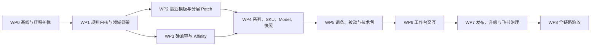

# Tackle Forger v3 开发 Handoff

> 状态：可进入开发  
> 面向对象：接手实现、重构、测试或评审的 Codex Agent  
> 权威规范：`docs/tackle-forger-development-spec-v3.md`  
> 最后对齐v3：2026-07-23  
> 文档索引：`docs/README.md`

## 1. 任务目标

在保留现有数据和工作台能力的前提下，将当前工程演进为一套可编辑、可追踪、可重放的钓具生成工具，实现以下完整链路：

```text
规则源/飞书
  → 重量基础模板
  → 钓法规则层
  → 类型规则层
  → 功能定位规则层
  → 有限结构标杆
  → 系列
  → SKU 抽屉/目标拉力
  → 最近结构标杆匹配
  → 功能强度、性能、材料、Patch与词条
  → 可购买 Model
  → 已发布 ConfigurationSnapshot
```

开发结果必须允许策划在每个派生层查看来源、计算过程、差异、校验结果，并通过分层 Patch 调整，而不是破坏上游模板。

## 2. 接手前必须遵守

1. 完整阅读根目录 `AGENTS.md`、`docs/README.md`、`docs/tackle-forger-development-spec-v3.md` 和 `docs/ux/tackle-forger-product-design-completion-v3.md`。
2. v3 规范是唯一权威产品与领域规范；历史设计稿只用于追溯，不得用来覆盖 v3 结论。
3. 当前工作区可能包含用户尚未提交的修改。不得 reset、checkout、删除、覆盖或“清理”这些修改。
4. 先记录基线，再做增量修改；不要顺手修复与当前工作包无关的问题。
5. 新增领域行为必须有测试；不能只完成界面而缺失可验证的计算内核。

## 3. 关于“词条具体公式”的结论

具体采用哪一种降低类词条公式，不影响总体架构，也不应阻塞其他模块开发。它只属于属性聚合内核中的一个可替换策略。

必须实现为显式配置，而不是散落在页面或各业务函数里的硬编码：

```ts
type ReductionStackingMode =
  | "linear_subtraction"
  | "diminishing_division";
```

两种模式的参考语义：

```text
linear_subtraction:
  Final = Base × (1 - Σr)

diminishing_division:
  Final = Base ÷ (1 + Σr)
```

实现要求：

- 配置保存在工作区级规则设置中，并纳入规则版本。
- 种子数据可暂以 `diminishing_division` 为默认值，但默认值不代表最终策划结论。
- 每次派生和发布快照必须记录实际使用的模式与规则版本。
- 两种模式都要有单元测试，包括零值、单条、多条、极值和确定性重放。
- 页面只读取配置并展示解释，不自行计算另一套公式。
- 未来切换模式只能影响新派生结果或明确发起的升级，不得静默改变已发布快照。

因此，后续 Agent 遇到这一开放项时应继续开发，不需要暂停询问；只有准备把其中一种模式永久删除时才必须请求确认。

## 4. 不可更改的领域结论

- 离散规格的权威字段是targetPullKg。只在相同部位、Method、Type、FunctionProfile的有限结构标杆中按拉力比例距离选择最近项，不插值；Affinity、Quality、Performance、Material、词条和后置Patch不参与匹配。
- 钓法和类型是两个独立规则层；界面可放在同一步，但领域模型、计算顺序、溯源和 Patch 必须分开。
- 品质映射固定为 C/绿、B/蓝、A/紫、S/橙。
- `functionIntensity` 表示功能专精强度，不是品质等级。
- SKU 是类似 RF4 的钓具抽屉；Model 才是实际展示、选择和购买对象。
- 当前`Collection → Series → SKU → Model → ConfigurationSnapshot`、`targetPullKg`、最近结构标杆匹配、甘特图和候选生成只处理竿、轮、线；SKU不包含钩、漂、真饵或拟饵。
- 钩、漂、真饵和拟饵当前完全延期。产品界面不得提供注册表只读入口、“未启用”占位、草稿、生成、发布、Snapshot或导出动作；注册表与迁移层只保留稳定ID、历史Payload和引用。未来启动任一部位必须先建立独立产品设计Issue，本handoff不构成实现授权。
- 技术是词条组合包。技术与其包含的词条不得重复贡献同名属性加成。
- 被动词条在本工具中只保存、计分和展示；不执行，也不验证钓鱼模拟器逻辑。
- 已发布 `ConfigurationSnapshot` 不得被上游规则更新静默重算。
- 硬兼容规则和软 `Affinity Score` 必须分开：硬规则决定能不能生成，软分数决定适配程度和排序解释。
- 人工修改使用分层Patch；共享中间层用DerivationLayerPatch，单个产品用Series/SKU/Model/FinalReview Patch；固定标杆选择用ProjectionPin。
- 所有保存过的Patch进入工具内权威`PatchLedger`，并幂等同步到飞书单一`Patch台账`页；该页是协作镜像而非唯一运行时来源。DerivationLayerPatch或多个个体Patch的稳定共性可经人工归纳生成RuleSourceChangeDraft；单个个案不得未经归纳提升为通用规则。写回后必须回读、显式拉取并发布RuleSetVersion。
- 先确定Series的Quality，再选择具体词条；价值分校验已选Quality并作为自动定价输入，不得反向自动改品质，Quality本身不修改面板。
- 飞书唯一规则工作簿已指定为[《钓具设计工作簿》](https://pisn3u3ony2.feishu.cn/wiki/YsEKwSUJ5i86HCkZKBVcNMw7nOh?from=from_copylink&sheet=9nE3Rx)。链接锚点虽是`06_系列/9nE3Rx`，同步对象是整个工作簿；2026-07-21首次接入基线为revision `2302`，本轮源表整改后的回读revision为`2352`。两者都不得硬编码成最新版本。
- revision `2352`的历史审计确认了176个稳定机器ID：64个重量模板、14个类型、19个功能定位、19个性能定位、36个词条和24个系列原型。这仅是历史迁移基线，不是当前工作表拓扑。revision `2869`已调整为`04_词条/zrVOxd`、`05_技术/RdZv0J`，不再有独立性能定位页。接入器必须保留历史ID且每次显式拉取后重新审计当前机器区域；缺ID新行进入`NEW_SOURCE_ROW`，经人工确认后分配并回写。长期同步不得按名称、`名称|级别`、行号或显示顺序关联。
- 工作簿`09_甘特图`是开发计划，不是“钓具系列甘特图”；`11_组合SKU`、`12_打包竿组`及`14_Rods`至`17_Item`先按历史样例/暂存输出处理，不能反向覆盖领域对象或冻结Snapshot。飞书工作簿不替代本地tackle/item/store导出。

## 5. 全局完成标准

只有同时满足以下条件，才能认为 v3 设计效果已经落地：

- 新领域模型能够完整表达规则层、系列、SKU 抽屉、Model 和配置快照。
- 1.5kg、1.8kg等离散targetPullKg能够按确定性比例距离命中最近结构标杆，并保留命中依据。
- 每一层都能预览基础值、规则贡献、Patch、最终值、警告和来源版本。
- 规则计算相同输入必得相同输出，并能从 Trace 重放。
- 硬兼容冲突会阻止生成；软 Affinity 只评分、排序、解释，不偷偷代替硬规则。
- 系列不变量可以定义、校验并在 SKU/Model 偏离时给出明确结果。
- 属性词条、被动词条、Technology、已选品质校验与词条价值分之间职责清晰且不重复计数。
- 历史数据可以迁移，无需删除旧状态；迁移前后的关键业务结果有对照测试。
- 已发布快照冻结；上游变化只能创建升级候选。
- 类型检查、静态检查、领域测试和生产构建全部通过，或明确记录与本次修改无关的既有失败。

## 6. 推荐实施顺序



WP2 与 WP3 可以在 WP1 稳定后并行开发；其余工作包按依赖顺序合并。不要先大规模重写 UI，再补领域模型。

## 7. 工作包说明

### WP0：基线与迁移护栏

目标：建立可回归的现状基线，避免用重写掩盖数据迁移问题。

任务：

- 查看工作树，识别并保留用户已有修改。
- 运行现有类型检查、静态检查和测试，记录既有失败。
- 为 `WorkspaceState.schemaVersion` 建立顺序迁移入口和迁移测试夹具。
- 保存至少一份当前版本的代表性状态，作为后续迁移回归样本。
- 对当前 Excel/飞书导入、规则计算、候选生成、发布流程建立最小回归断言。

验收：旧状态能够被读取；迁移函数幂等；没有通过删字段或删历史数据来让测试通过。

### WP1：规则内核与领域骨架

目标：建立与界面无关、确定性的 v3 计算内核。

建议落点：

- 扩展 `lib/types.ts`，或按领域拆成 `lib/domain/*.ts`。
- 新增 `lib/rule-kernel.ts` 或同职责模块。
- 更新 `lib/seed.ts`、状态迁移和序列化逻辑。

至少需要表达：

- `MethodProfile`：钓法规则层。
- `ItemTypeProfile`：类型规则层。
- `FunctionProfile` 与 `functionIntensity`。
- 可选的 `PerformanceProfile`。
- `ItemPartDefinition`：当前为竿、轮、线提供部件或子类型的约束与参数元数据；钩、漂、真饵和拟饵只允许保留注册表与迁移兼容，不接入产品流程。
- `RuleSetVersion`、工作区规则设置和 `ReductionStackingMode`。
- `DerivedProjection`、属性贡献项、规则警告和 Trace。

计算管线必须固定顺序并保留每步贡献：

```text
模板层：
BaseWeightTemplate
  → MethodProfile
  → Method-layer Patch
  → ItemTypeProfile
  → Method×Type Patch
  → FunctionProfile
  → Function-layer Patch
  → StructuralBenchmark

商品层：
StructuralBenchmark最近匹配
  → functionIntensity显式贡献
  → PerformanceProfile
  → Material策略
  → SeriesPatch
  → SkuPatch
  → ModelPatch
  → Affix/Technology结算
  → FinalReviewPatch
  → 最终边界校验
```

`functionIntensity`、Performance、Material、Quality、Affix、Technology和商品层Patch都不得进入最近标杆搜索。Affix/Technology必须位于Series/SKU/Model Patch之后，FinalReviewPatch必须位于词条结算之后；不得把“Layered Patch”作为一个可任意移动的模糊阶段。

验收：核心计算不依赖 React；给定相同输入、规则版本和 Patch，输出与 Trace 完全一致。

### WP2：最近派生模板与分层 Patch

目标：实现离散重量匹配和非破坏性人工调整。

最近模板匹配必须：

- 先要求itemPart、Method、Type、FunctionProfile身份完全一致，再排除硬不兼容候选。
- 使用确定性的距离与并列决胜规则。
- 不做连续插值。
- 返回匹配模板ID、targetPullKg、derivedPullKg、比例距离、决胜原因和规则版本。
- 支持人工 pin 到指定模板；pin 本身也要进入 Trace。

建议把匹配优先级实现为可测试的字典序比较：

```text
itemPart/Method/Type/FunctionProfile完全相同
→ 排除硬不兼容
→ 拉力比例距离
→ derivedPullKg较高者
→ 版本化templatePriority
→ 稳定模板ID
```

不得在结构标杆匹配中引入“维度匹配特异度”、范围包含、Affinity、最终属性距离或随机数。规则特异度只属于硬兼容/Affinity各自的规则选择，不属于ProjectionMatch。

新建、账本、Snapshot和飞书镜像统一使用以下规范Patch操作：

```ts
type PatchOperation =
  | { op: "set"; path: string; value: unknown }
  | { op: "add"; path: string; value: number }
  | { op: "multiply"; path: string; value: number }
  | { op: "clear"; path: string };
```

旧`ProjectionPatchOperation.remove`只在兼容读取时转换为`clear`；新记录不得写remove。`clear`表示清除当前层覆盖并重新暴露继承值，不是set null。`min/max`只属于模板/通用规则操作；旧Patch或草稿必须基于冻结revision求值并规范化为带原始意图证据的`set`，无法无损转换则进入迁移复核。所有操作还必须具有稳定`operationId`、`operationIndex`、before、after和基线revision。

Patch 作用域与优先级固定为：

```text
DerivedProjection
  → SeriesPatch
  → SkuPatch
  → ModelPatch
  → Affix/Technology
  → FinalReviewPatch
```

AdjustmentPatch作用域为Series/SKU/Model/FinalReview；共享中间层DerivationLayerPatch复用相同操作revision契约；ProjectionPin和RuleSuppressionPatch保持独立。每个Patch要保存原因、作者、时间、基于的投影/规则/对象revision，以及独立的`PatchState`和`PatchMirrorSyncState`。上游更新时生成rebase预览：旧基础、新基础、现有Patch、预计结果、冲突；不得自动吞掉冲突。

验收：1.5kg 和 1.8kg 可命中同一模板但拥有各自 Patch；上游变更后能看到 rebase 差异；`set` 不会让来源不可追溯。

### WP3：硬兼容矩阵与软 Affinity Score

目标：把“允许组合”和“组合得好不好”拆成两个可解释系统。

硬规则至少支持：

- `deny`：命中即禁止。
- `require`：缺少要求即禁止。
- `allow`：明确允许或用于覆盖更宽泛规则。
- 按钓法、类型、重量段、功能定位、部件/子类型等维度组合。
- 规则特异度、优先级、版本和命中解释。

硬规则输出应包括 `allowed`、命中规则、失败原因和建议修正方向。生成候选前先执行硬规则；失败候选不得进入正常排名。

Affinity 是软评分，不是概率。建议每个轴输出 `-3..3` 原始分，再按权重归一为展示分：

```text
Affinity = Σ(axisScore × axisWeight) ÷ Σ(axisWeight)
```

Affinity轴与v3固定为：

- `method_type`；
- `type_pull_tier`；
- `type_function`；
- `function_performance`；
- `material_function`；
- `quality_specialization`；
- `model_component`。

同一轴命中多条规则时，默认只采用最具体的一条，避免重复累加；同时保留命中解释。Affinity 可用于排序、推荐和警告，不得改变硬兼容结论。

验收：硬 deny 即使 Affinity 很高也不能生成；低 Affinity 但硬兼容的候选仍可生成并展示原因；每个分数可追溯到具体轴和规则。

### WP4：系列、SKU 抽屉、Model 与快照

目标：完成产品身份模型的迁移，并实现系列不变量。

核心实体：

- `Collection`：可选的更高层产品集合。
- `SeriesDefinition`：共享概念、类型、品质带和不变量。
- `SkuDrawer`：一个重量规格对应的钓具抽屉。
- `PurchasableModel`：抽屉内的实际选择与购买对象。
- `ConfigurationSnapshot`：发布时冻结的最终配置及来源。
- `CandidateSearchRecipe`：候选搜索/枚举配方，不再承担产品身份。

系列建议至少支持这些不变量：

- 同一 `itemType`。
- 同一品质带，固定映射 C/绿、B/蓝、A/紫、S/橙。
- 共享核心概念、主功能方向和核心词条/技术身份。
- 允许重量规格离散分布。
- 允许不同 SKU/Model 通过 Patch 做有限偏移。
- 偏移超过阈值时产生警告或阻断；阈值暂保持可配置。

每个SKU关联一个离散targetPullKg和最近结构标杆结果；每个SKU包含一个或多个Model。Model可表达快调短竿、慢调长竿等具体差异，并承载最终部件、Patch、自动价格/展示信息与发布快照。

验收：游戏侧选择和购买身份引用Model ID，不宣称现有配置表已支持`modelId + snapshotId`；Tackle Forger内部发布、审计和导出链同时保存Model与Snapshot引用；同一SKU可打开并列出多个Model；系列不变量在每次生成、修改和发布前都能校验。SKU改重量时，无已发布后代才可保留skuId创建新revision；已有已发布后代必须创建新SKU并可废弃旧SKU。

### WP5：属性词条、被动词条与技术包

目标：统一词条模型，同时保持模拟器解耦。

词条至少分为：

- `attribute`：改变具体面板数值。
- `passive`：只保存元数据、品质分和展示内容。

属性词条需声明作用属性、运算类型、数值、单位、适用范围、叠加组和规则版本。建议支持固定值、百分比加成、乘法修正和降低类策略；具体降低公式由工作区配置决定。

被动词条可包含触发条件、描述、标签、稀有度、价值分和未来模拟器引用键，但本工具不得执行触发逻辑，也不得声称验证了模拟效果。

`Technology` 是一个有身份、可复用、可版本化的词条组合包：

- 技术包含的词条参与属性聚合或被动展示。
- 若技术已经通过成员词条贡献属性，技术本体不得再次贡献同名属性。
- 编辑Series时先确定Quality，再选择词条；价值分只按原子词条成员汇总，用于校验所选Quality区间并作为自动定价输入。Technology不得重复计分，Quality本身不修改面板。
- 展开技术时必须能看到成员、来源和最终贡献。

验收：Technology展开后没有双重属性或价值分；被动词条可影响价值分但不改变面板；切换降低公式模式只改变相应属性聚合结果。

### WP6：工作台交互

目标：让策划能够沿完整链路预览、检视、调整和发布。

建议形成以下工作区，而不是把全部功能堆进一个表：

- 规则实验室：重量模板、钓法、类型、功能、性能规则的编辑与版本对比。
- 派生投影浏览器：按目标拉力查看最近结构标杆匹配、逐层贡献、警告和Trace。
- 兼容矩阵：硬规则编辑、冲突解释、Affinity 轴配置和评分预览。
- 系列设计器：系列不变量、离散重量 SKU、概念与品质带。
- SKU 抽屉：该重量下的多个 Model、差异摘要和校验状态。
- Model 详情：部件、属性、词条、技术、Patch、发布快照。
- 发布与升级：候选快照、变更影响、审批、冻结和升级候选。

钓法和类型在界面上可以同屏或同一步选择，但必须以两个独立区块展示各自贡献和错误。所有修改界面都要区分“修改规则源”和“增加当前层 Patch”。

验收：非技术用户能够从系列进入 SKU，再进入 Model；能解释一个最终数字来自哪个模板、系数、词条和 Patch；能在发布前看到全部阻断项。

### WP7：发布、升级与飞书治理

目标：防止规则更新破坏已售或已发布配置。

发布时创建不可变 `ConfigurationSnapshot`，至少冻结：

- 最终属性和部件配置。
- 所用模板、规则集和公式模式版本。
- 匹配结果与完整 Patch 链。
- 兼容校验、Affinity 分解、品质计算结果。
- 技术/词条版本与展示信息。

上游规则变化后，只创建升级候选并展示差异；必须由人工确认后生成新的快照版本。

飞书回写分为“Patch台账镜像”和“通用规则变更”两条独立链路。全部Patch先进入工具内权威`PatchLedger`，再按`patchId + patchRevision`同步到单一`Patch台账`页；通用规则变更采用`RuleSourceChangeDraft`承载影响预览和人工确认，不从局部Patch静默覆盖：

- 通用、稳定、跨系列复用的修改可以形成规则修改草稿。
- 单个系列、SKU、Model 的平衡调整保存在权威Patch账本并镜像到飞书Patch台账，但不得未经归纳直接写入通用规则页。
- Patch台账按“一条属性操作一行”保存；同一Patch的多行共享patchId，前三个机器字段为scopeType、layerType、subjectEntityId。生成时从工具账本按稳定ID重放；基线变化必须进入rebase。
- 工具应汇总Patch并识别跨对象稳定模式；只有人工归纳和影响预览通过后才能形成RuleSourceChangeDraft。新规则发布后再计算ABSORBED或PARTIALLY_ABSORBED，原Patch不得提前删除。
- Patch业务状态与镜像同步状态使用两个正交字段；操作明细以`patchId + patchRevision + operationId`幂等，并按稳定`operationIndex`重放。完整Patch revision是组级事务边界，部分飞书行成功不能标记整组SYNCED或参与半组重放。
- 飞书镜像删除不构成Patch删除，产生`PATCH_MIRROR_ROW_MISSING`并允许补写；未知ID、审计字段篡改和不完整组隔离为Patch ValidationIssue。对象缺失进入ORPHANED，禁止按名称重绑。
- PatchLedger必须有schemaVersion、幂等顺序迁移和语义回归；Snapshot冻结有序Patch revision/operationId集合及PatchSetHash。
- 回写前显示影响范围、规则版本、冲突和预计变化。
- 写回记录与回读结果进入审计；写回后必须由用户显式拉取、校验并发布RuleSetVersion，规则才生效。
- 读取工作簿时先按`sheet_id`校验关键页，再以显式revision生成`FeishuSourceRevision`；`?sheet=`仅是界面锚点。
- revision `2869`中，`07_品质评分/FqD4j7`提供品质区间、词条组合分、Quality→PricingBasket和价格系数区间；`08_价格计算/u87sRh`提供业务公式、线性插值、重量段查表、零整比、金币、舍入和价格边界。两页必须按同一revision导入为一个PricingPolicyDraft，领域内核负责确定性计算和单元格级Trace。
- 组合分按同部位无序词条对计算一次；Technology成员与直接词条先按affixId去重。当前新策略仍受S品质100分边界、性能评分来源、舍入阶段、最低价作用域和超限动作五类Issue约束；开发必须实现可追踪的Draft校验与`NON_FORMAL`试算，不能恢复旧的“全局缺参”判断，也不能自行补业务默认值。
- 领域品质仍是C/绿、B/蓝、A/紫、S/橙；映射为C→跑刀、B→稳健、A→猛攻、S→猛攻。PricingBasket是独立价格分组。

验收：旧快照在上游规则变化后字节级或语义级保持不变；升级候选可并列对比；重生成和对象改名不会丢失Patch；飞书重复同步不追加重复行；个案Patch可在Patch台账追踪，但不会自动污染飞书通用规则。

### WP8：全链路验收

目标：验证系统达到 v3 规范，而不仅是测试函数各自通过。

至少建立一条端到端样例：

```text
导入/建立重量模板
→ 建立钓法、类型、功能规则
→ 为 1.5kg 与 1.8kg 匹配最近模板
→ 建立同一系列与两个 SKU
→ 每个 SKU 建立多个 Model
→ 添加属性词条、被动词条和技术包
→ 应用 Model Patch
→ 执行硬兼容、Affinity、系列不变量校验
→ 发布快照
→ 修改上游规则
→ 验证旧快照不变并生成升级候选
```

## 8. 旧模型迁移要求

迁移原则是“先兼容读取，后统一写入；先证明无损，后考虑移除旧字段”。

建议映射：

| 现有概念 | v3 目标 | 迁移要求 |
|---|---|---|
| `Template` / `Modifier` / `Layer` | 基础模板与各规则层 | 保留原 ID 和来源，无法自动判断的层标记待审核 |
| `SeriesRecipe` | `CandidateSearchRecipe` | 保留搜索能力，不再作为系列产品实体 |
| `Candidate` | 派生候选/投影 | 保留计算结果和 Trace，逐步接入新内核 |
| `OfficialSku` | `SkuDrawer` + 默认 `PurchasableModel` | 原值进入默认 Model 和初始快照，不能丢失 |
| `DetailOverride` | Model 部件配置或 ModelPatch | 记录迁移来源和原字段 |
| `Candidate.overrides` | `set` 型 Patch | 补齐作用域、基准版本和待审核状态 |
| 旧品质显示 | C/绿、B/蓝、A/紫、S/橙 | 历史已发布展示不回写；新实体使用统一映射 |
| 现有 stat 词条 | `attribute` | 原数值与单位原样保留 |
| 现有技能/效果词条 | `passive` | 不推断模拟器执行语义 |

迁移必须有版本号、幂等测试、代表性旧状态 fixture 和字段级对照。任何无法确定的转换都应保留原始数据并产生待审核项，而不是猜测后覆盖。

## 9. 必测场景矩阵

| 编号 | 场景 | 预期 |
|---|---|---|
| M-01 | targetPullKg精确命中结构标杆 | 返回该标杆且距离为0 |
| M-02 | targetPullKg与两个标杆比例距离相同 | 先选derivedPullKg较高者，再按模板优先级和稳定ID确定唯一结果 |
| M-03 | 1.5kg 与 1.8kg 最近模板相同 | 共享基础，Patch 独立 |
| M-04 | 人工 pin 模板 | 使用 pin 结果并记录 Trace |
| P-01 | Series/SKU/Model 同时修改同一字段 | 按固定优先级得到唯一结果 |
| P-02 | 上游规则更新 | 生成 rebase 预览，不静默覆盖 Patch |
| P-03 | `set` Patch 与新基础冲突 | 标记需复核 |
| C-01 | 硬 deny 且 Affinity 高 | 禁止生成 |
| C-02 | 硬兼容且 Affinity 低 | 允许生成并警告 |
| C-03 | 同一 Affinity 轴命中宽泛与具体规则 | 采用最具体规则，不重复累加 |
| S-01 | SKU 类型偏离系列类型 | 阻断 |
| S-02 | Model 超过系列允许偏移 | 按可配置阈值警告或阻断 |
| A-01 | 技术包含属性词条 | 属性只计算一次 |
| A-02 | 被动词条参与价值分 | 面板属性不变化，所选Quality不被自动改变 |
| A-03 | 两种降低公式 | 各自产生确定且可解释的结果 |
| Q-01 | 品质阈值边界 | 精确映射 C/B/A/S 与绿/蓝/紫/橙 |
| F-01 | 发布后修改上游规则 | 旧 Snapshot 不变，只生成升级候选 |
| R-01 | 同输入重复计算 | 输出与 Trace 一致 |
| D-01 | 旧工作区状态迁移两次 | 第二次无额外变化且无数据丢失 |

## 10. 工程验证命令

在项目根目录依次运行：

```powershell
rtk npm run typecheck
rtk npm run lint
rtk npm test
```

`npm test` 已包含生产构建和现有测试。开发过程中可以先运行聚焦测试，但交付工作包前必须运行完整验证。若存在与本工作包无关的基线失败，应保留完整证据并明确区分“既有失败”和“新增失败”。

## 11. 合并与交付策略

- 一个工作包可以拆成多个小提交，但每个提交都应处于可迁移、可运行状态。
- 类型、迁移、计算、测试尽量在同一工作包内闭环。
- 新 UI 必须消费正式领域接口，不要复制一份页面专用计算逻辑。
- 旧接口可以增加兼容适配层；不要一次删除所有旧类型再修复全仓库。
- 每个工作包交付时附：修改摘要、迁移影响、验证结果、剩余开放项和下一工作包入口。
- 若实现引入新的产品语义，先更新 v3 权威规范并请求用户确认，再编码。

## 12. 必须暂停并请求确认的情况

以下情况不得自行决策：

- 需要删除、覆盖或无法无损迁移用户已有数据。
- 新需求与 v3 的固定领域结论冲突。
- 要把开放语义变成不可配置的永久规则。
- 要决定性能定位强度的最终命名与曲线。
- 任何请求要求开放钩、漂、真饵或拟饵的只读UI、占位、草稿、生成、发布或导出。当前结论是完全延期；必须先为目标部位建立独立产品设计Issue，确认业务对象与完整准入边界，不能在实现Issue中直接决定或复用竿轮线逻辑。
- 要决定 Patch 偏移超过多少时警告或阻断。
- 需要改变已发布快照的冻结语义。

“降低类词条采用哪种具体公式”不属于阻塞项；按第 3 节同时支持两种模式即可继续。

## 13. 明确不在本轮范围内

- 不实现被动词条在钓鱼模拟器中的运行逻辑。
- 不验证被动描述是否与模拟器实际效果一致。
- 不把 Affinity 解释为真实成功概率。
- 不做重量属性的连续插值。
- 不自动把个案 Patch 反推为飞书通用规则。
- 不让 SKU 直接成为最终购买对象。
- 不为钩、漂、真饵或拟饵提供产品入口、占位、草稿、生成、发布、Snapshot或导出，也不把它们塞入竿轮线SKU。
- 不为解决迁移困难而删除历史状态。

## 14. 给首个开发 Agent 的启动指令

可以把下面内容直接交给第一个接手 Agent：

```text
请先完整阅读根目录 AGENTS.md、docs/README.md、
docs/tackle-forger-development-spec-v3.md，以及本 handoff。

本轮只实现 WP0 和 WP1，不提前重写大面积 UI：
1. 记录当前工作区和测试基线，保留所有用户已有修改；
2. 建立 WorkspaceState 的顺序迁移入口与旧状态回归 fixture；
3. 增加 v3 规则层、规则版本、公式模式、派生投影和 Trace 的领域类型；
4. 抽出与 React 无关的确定性规则内核；
5. 为正常路径、边界、冲突、确定性重放和迁移幂等补测试；
6. 运行 typecheck、lint、test，并区分既有失败与新增失败。

不要删除旧字段；必要时增加兼容适配层。降低类词条公式必须支持
linear_subtraction 和 diminishing_division 两种配置，本轮不需要决定唯一公式。
完成后汇报数据迁移影响、领域接口、验证证据以及 WP2/WP3 的可接入点。
```

## 15. 增量工作包：WP4A Model五维图

本工作包在Model最终面板参数稳定后实施，可与Model详情UI并行，但不得把雷达图计算写在React组件中。

任务：

- 建立符合`five-axis/open005-2026-07-23/v1`的版本化FiveAxisViewDefinition、固定五轴顺序和按`modelFinalPullKg`选择的W重量段顶点集合；
- 实现由axisId、transformId、vertexSelectorId驱动的通用纯函数内核；拉力、耐久、抛投、感度、操控分别按权威方向计算，竿、轮、线逐件绘制且`componentAggregationId=per_component_no_aggregate`；
- 使用`five-axis-hash-input/v1`的严格Schema、CanonicalDecimal、JCS、UTF-8、SHA-256和固定测试向量实现候选/顶点哈希，禁止裸字符串拼接或扩展`vertexSetHash`字段集合；
- 以Snapshot冻结SKU revision为锚点，按`projection-reference/current-sku-frozen-match/v1`逐部位唯一选择ProjectionMatch，冻结projection ID/revision、缺失状态与`projectionReferenceSetHash`；
- 实现部件占比、未封顶比较分、0..100正式分、档位映射和完整Trace，不生成Model短板汇总线；
- 抛投顶点只使用竿的direct值；轮线在比较上下文继承第一根竿，无竿时为not_applicable，均不按0；
- 属性词条和Patch通过最终面板参数影响五维，被动词条不影响五维；
- 将五维定义/哈希/选择器版本、W段、逐件结果、顶点哈希、投影引用证据和规则版本冻结到ConfigurationSnapshot；
- 为旧`PUBLISHED`定义建立不改payload/hash的`LEGACY_SNAPSHOT_ONLY`处置；旧Snapshot只读重放，新正式Snapshot只接受唯一`FORMAL_CURRENT`新定义并在缺失时fail-closed；
- 按UX Agent已确认的位置接入Model预览，并提供计算解释入口；
- 对飞书`50..800`档位歧义产生导入warning，阈值保持配置化。

验收以权威规范第21节及其必测场景为准。当前正式档位为弱`[0,50)`、中`[50,80)`、强`[80,100]`，必须来自版本化定义；未来改变需发布新定义版本，不能散落为UI常量。

## 16. WP4A补充：五维双模式比较

五维图必须同时支持：

1. `tackle_fit`：同一Model的竿、轮、线三条单件曲线叠加，并可显示三条`projection_reference`结构投影参考线；不生成Model汇总曲线；
2. `equipment_compare`：2–5件竿、轮、线可混合部位叠加，使用用户可见且可切换的共同W段。

开发约束：

- 两种模式共用第21节五维内核，不在React图表中复制公式；
- 钓组模式三条单件曲线共用Model按最终拉力命中的W段顶点；
- 轮线抛投在钓组模式继承竿并显示继承来源，不参与匹配差值；
- 多装备比较允许混合部位，但不允许每件装备按自己的W段分别归一化；
- 轮线独立比较时抛投为not_applicable，不能画成0；
- 同时保留官方封顶分和未封顶比较分，使超过100的装备仍可区分；
- Series参考线只接受显式基准Snapshot锚定的三条`projection_reference`；独立比较未选基准时不自动回退；
- 硬兼容、Affinity和五维视觉匹配分别展示，不得互相替代；
- 实现和测试以权威规范第22节为准。

页面位置与交互采用`docs/ux/tackle-forger-product-design-completion-v3.md`第6节：Model右侧层内提供“钓组匹配”和“多装备比较”两个视图，并使用页面级比较篮；Series结构投影是参考线开关，不是第三种基准策略或独立聚合模式。

## 17. 增量工作包：WP6A系列甘特图与AI建议

### 17.1 导航和候选语义

- 把生产与发布主导航“候选池”迁移为“钓具系列甘特图”；
- 甘特图按离散重量展示Series覆盖、SKU节点、Model数量和状态；
- 页面固定说明“覆盖范围只表达系列规划跨度，不代表连续插值”；纵轴使用版本化重量分段，横轴使用品质/类型分栏；
- CandidateSearchRecipe保留为“候选搜索配方”；
- 生成动作统一为“生成 Model 候选”；
- 临时结果统一为“Model 候选”或“候选结果”；
- 旧候选池路由提供兼容跳转，不删除已有数据和Trace。

### 17.2 AI评估与建议

实现一个可选的AI辅助层：

- 甘特图工具栏支持Series或候选集合评估；
- Model抽屉提供“Model预览 / AI评估与建议”Tab；
- 固定显示“辅助建议 · 不影响系统校验”；
- 展示Finding、依据、假设、未覆盖信息和建议动作；
- 支持变化预览、创建draft Model Patch和RuleSourceChangeDraft；
- 禁止覆盖硬校验、自动批准、直接写规则或自动发布；
- 输入变化后评估标记stale；
- AI不可用时核心流程不降级。

### 17.3 实现顺序

1. 先完成导航、甘特图离散重量语义和旧路由兼容；
2. 定义AiAssessmentRecord、Finding、EvidenceRef和DraftAction；
3. 建立输入快照、inputHash和stale判定；
4. 建立provider接口、字段白名单、超时和审计；
5. 接入只读评估；
6. 接入变化预览；
7. 最后接入Patch与飞书规则修改草稿；一期、1.5期、二期和当前规划三期均不接飞书审批，只允许人工确认写回、技术回读、显式拉取和RuleSet发布。

验收以权威规范第23节为准。AI模型选择和数据出网属于OPEN-006，在连接外部服务前必须请求确认。


## 18. 增量工作包：WP6B 交互与后端契约

本工作包以权威规范第24节R1–R12为唯一语义来源，先做领域/API契约，再接正式界面。原型只用于布局和交互表达，不能作为字段或状态来源。

### 18.1 建议模块边界

- `lib/domain/entity-ref.ts`：EntityRef、Revision、父链与稳定ID。
- `lib/gantt-query.ts`：SeriesGanttQuery、游标、权限过滤、节点聚合。
- `lib/candidate-generation.ts`：run、候选fingerprint、排除统计、稳定排序、自动物化和限制批量范围。
- `lib/calculation-trace.ts`：统一TraceEntry、重放和hash。
- `lib/validation.ts`：ValidationIssue、ActionLink、聚合报告。
- `lib/workflow-state.ts`：Lifecycle/Attention/PrimaryDisplay映射与非法组合。
- `lib/upgrade-state.ts`：Patch rebase、UpgradeCandidate、SnapshotBuild状态机。
- `lib/five-axis-definition.ts`：版本化五轴配置和Series基准。
- `lib/ai-contracts.ts`：二期数据结构；一期可定义类型和空实现，不连接模型。
- `lib/rule-source-change.ts`：RuleSourceChangeDraft、影响预览、幂等写回、回读、显式拉取和rebase。

目录仅为建议；职责边界是强约束。React不得复制排序、状态优先级、权限、Trace、Issue、五维或AI动作校验。

### 18.2 最小API面

- `GET /series-gantt`：查询、游标、节点聚合。
- `GET /objects/{type}/{id}/context`：revision、父链、状态、ActionAvailability。
- `POST /candidate-runs`、`GET /candidate-runs/{id}`、`POST /candidate-runs/{id}/materialize`、`POST /candidate-runs/{id}/dismiss`。
- `GET /models/{id}/trace`、`GET /models/{id}/validation`、`GET /models/{id}/five-axis`。
- `POST /patches/{id}/rebase-preview`、`POST /patches/{id}/resolve-rebase`。
- `GET/POST /upgrade-candidates`、`POST /snapshot-builds`、`POST /snapshot-builds/{id}/publish`。
- 二期：`POST /ai-assessments`、`POST /ai-recommendations/{id}/patch-draft`、`POST /ai-recommendations/{id}/rule-source-change-draft`。
- `POST /rule-source-changes/{id}/impact-preview`、`confirm-write`、`retry-write`；另设显式`POST /feishu-source/pull`和RuleSet发布命令。

所有写接口必须带expectedRevision/inputHash和idempotencyKey；错误返回统一Issue/Action，不用只含字符串的toast错误。

### 18.3 实施顺序

1. EntityRef、Revision、Capability和ActionAvailability。
2. ValidationIssue/ActionLink及状态枚举。
3. 甘特查询和稳定聚合。
4. 候选run、排除统计、稳定排序、默认自动物化、批量限制和放弃。
5. Trace统一和旧Trace适配。
6. Patch/Upgrade/Snapshot状态机。
7. 五维定义与Series基准。
8. 一期只落AI类型、审计和禁用态；二期接评估与草稿转换。
9. 飞书规则修改草稿的影响预览、写回验证、显式拉取和失败恢复。
10. 正式UI消费这些接口。

### 18.4 完成证据

- R1–R12每项建立正常、边界、冲突、恢复、权限和Given/When/Then测试。
- 证明相同查询/输入/版本有稳定排序、Trace、Issue fingerprint和状态。
- 证明旧路由兼容、候选自动物化或人工改选都不删除CandidateRun、SKU不会被跳过。
- 证明AI禁用/不可用时核心流程不受影响。
- 证明已发布Snapshot在rebase、升级、AI、规则变化后hash不变。

## 19. 增量工作包：WP7B 内网、飞书登录与配置表交付

### 19.1 分期

- 一期：内网服务、飞书登录、统一Capability、不可提交的`NON_FORMAL`配置预览与结构关系校验；不得正式预留ID、生成生产形态xlsx/正式人工搬运包或写入本地worktree。
- 1.5期：发布权威目标目录与获批扫描Manifest、ConfigIdPolicyVersion和reservation ledger；完成历史导入复核，生成正式人工搬运包或写入用户选择的dev/test/online/release本地worktree。
- 二期：仅在OPEN-006关闭后实现已设计的AI辅助层；继续全员统一权限。
- 当前规划三期：保持统一Capability策略，不建设细粒度RBAC、对象级角色、职责分离或飞书审批。未来治理变化必须另建Issue并发布新`separationOfDutiesPolicy`版本。
- 一期、1.5期、二期和当前规划三期都不得用“统一权限”为理由省略用户身份、服务端逐动作鉴权、操作记录、expectedRevision或ActionAvailability。
- 关键共享写操作必须实现v3第20.2.7节的工作区租约与单调fencing token；服务端状态提交和持久化fenced outbox中的服务端可达副作用必须拒绝旧token，不能只实现心跳过期。浏览器本地配置文件不进入服务端outbox，按第19.2节的文件冲突与恢复路径处理。

### 19.2 导出执行器

1.5期使用Chromium File System Access API直接处理用户显式授权的目录，不要求本地伴随程序。服务端保存逻辑环境/渠道标签，目录句柄按用户、浏览器、origin、环境和渠道保存在IndexedDB；Cookie只保存飞书登录会话。每次写入前重新检查readwrite权限。

服务端fencing token只控制正式写入授权和成功证据，不能撤销已经交给本机文件系统的写操作。页面在开始、每个文件写入前和最终报告前重验租约；无论重验结果如何，文件一致性都必须依靠hash/mtime、备份、恢复Manifest和逐文件回读。配置导出租约没有已验证终态便过期、断线或取消时，服务端自动把逻辑目标置为`recoveryState=RECOVERY_REQUIRED`并记录`reason=EXTERNAL_FILE_CONFLICT`；旧页面不得报告成功，当前持锁者只可先执行回读恢复，完成前不得再次正式写入该目标。

- dev/test/online/release是首批独立人工导出环境，各自绑定用户选择的configs worktree根目录与`config.toml`。
- 每个环境的1001渠道固定写入根目录下`xlsx`。
- 正式目标集合来自配置治理负责人发布的`ConfigTargetCatalogVersion`；每个必需环境×渠道必须有获批`ConfigTargetScanManifest`。用户绑定只提供本机访问授权，不能创建、启用或豁免正式目标。
- 其他渠道只使用用户明确选择的具体目录；不从本机目录或`config_system.toml`发现/治理渠道，也不解析或修正`config_system.toml`。
- 多个“环境×渠道”可同时选择，默认让合格目标继续；确认页允许“任一失败则全部不写”。
- 一期只能下载带无效符号身份且不含生产文件名的`NON_FORMAL`预览包。1.5期已有正式Bundle、权威目标与获批Manifest且通过`config.export.commit`时，File System Access API不可用才允许下载正式人工搬运包，并审计为“已下载、未落盘”。

### 19.3 配置生成与校验

实现顺序：

1. 定义`ConfigEnvironmentProfile`、`LocalExportTargetBinding`、`ConfigExportMapping`、稳定`rangeId`、`ConfigTargetCatalogVersion`、`ConfigTargetScanManifest`、`ConfigIdBundle`和reservation ledger。
2. 一期实现`ConfigPreviewPackage(publicationState=NON_FORMAL)`：数字ID/正式name为空，只用非法生产schema的符号引用做结构检查，不生成`tackle.xlsx/item.xlsx/store.xlsx`生产文件名。
3. 1.5期实现`reserve_config_id_bundle`：携带expectedModelRevisionId/key与idempotencyKey，锁Model head并在同一事务冻结后继Model revision、名称、Bundle、ledger和rangeId游标。
4. 实现“准备发布与导出”批次：复用未变化Snapshot、批量冻结合格revision、跳过并报告阻断项，不要求逐个Model确认。
5. 从SnapshotBatch和正式Bundle构建`ExportPackage/Manifest`，冻结策略版本、目标目录版本和获批扫描Manifest。
6. 在暂存区upsert tackle/item/store，保留未知sheet、列、样式、公式和四行表头。
7. 解析该环境根`config.toml`的`tables.*`与`enums`，复用现有编译器的name-key→数字ID语义。
8. 强制生成部位tackle、item、GoodsBasic和StoreBuy；在所有渠道的StoreBuy schema、配置编译器类型/解析、迁移、导出器和校验器中新增BOOL列`enabled`。新行默认false，更新普通属性时保留各目标现值。
9. 先校验本次变更及其引用闭包；全库关系扫描作为用户主动触发的独立功能。
10. 每次策略发布、预留和正式导出都重新比较authoritative ref、commit、`config.toml`和workbook hashes与获批Manifest；正式导出还验证本地HEAD和文件基线。漂移时阻断并要求重新扫描、复核和发布策略。
11. 记录基线hash、生成备份和恢复Manifest，逐文件写入并回读；浏览器跨文件不宣称原子提交。
12. 每目标返回独立结果、hash、备份与审计；不执行任何Git命令。

upsert必须使用稳定`ID + configNameKey`：同名不同ID、同ID不同名或分裂命中均阻止；不得按行号关联、整行覆盖、删除旧行或自动排序。OPEN-008的数字区间、命名和生命周期已经确认，但正式ID仍只能由引用新鲜目标Manifest的已发布`ConfigIdPolicyVersion`和reservation ledger分配；策略/Manifest/ledger实现完成前只能做`NON_FORMAL`预览和冲突检查，不得用最大值+1或示例ID正式提交。

配置治理动作必须进入第24节统一`CapabilityCode`、`ActionCode`、`ActionAvailability`和`ActionLink.action`。写动作启用时返回绑定action、subject、expected revision和hash的不可篡改payload引用；缺权限、职责分离不允许、revision过期或Manifest stale时返回禁用原因且不返回payload，命令端仍须重新鉴权。

主飞书工作簿revision `2869`已提供品质到PricingBasket映射、评分线性插值、重量段查表、零整比、金币和三位有效数字向下取整的数值定义；实现`PricingPolicyDraft`导入、`NON_FORMAL`试算和Trace可立即开始。OPEN-007中的S=100边界、性能评分来源、`roundingStage`、`minimumPriceScope`和`overflowMode`未全部解决前，新PricingPolicyVersion、依赖它的Model发布、Snapshot和正式Store导出必须精确阻断，不得用手填或硬编码价格。

### 19.4 必测

- 两个Profile一成一败，结果互不伪装且失败目标不落盘。
- tackle写入成功、item失败时tackle按Manifest恢复，store未写入。
- 预览后Excel外部修改触发hash冲突。
- 同一幂等包重试不重复插行。
- Manifest获批后authoritative ref推进或hash变化时，预留和正式导出都阻断且不消耗ID；正式写入改变hash后旧策略不能继续下一批。
- 同一Model并发修改stableModelKey与预留时，以expectedModelRevisionId和Model head行锁保证只允许一个顺序结果，不出现Model/Bundle身份分裂。
- 缺`config.id.reserve`时，ValidationIssue中的`ActionLink.action=reserve_config_id_bundle`为禁用、说明Capability且无命令payload；权限恢复后payload仍受expected revision/hash约束。
- 断链报告精确到文件/sheet/行/字段/值/目标逻辑表。
- 未声明sheet只warning且不被删除。
- 目录授权失效时提示重新授权；一期下载仍为`NON_FORMAL`，1.5期正式下载要求完整Bundle、目标/Manifest门禁和`config.export.commit`。
- 1001只写`xlsx`，不因`config_system.toml`中的master声明改变目标。
- 新建StoreBuy默认`enabled=false`；更新普通属性不改变已有enabled。
- SnapshotBatch一次确认多Model，无变化项复用Snapshot。
