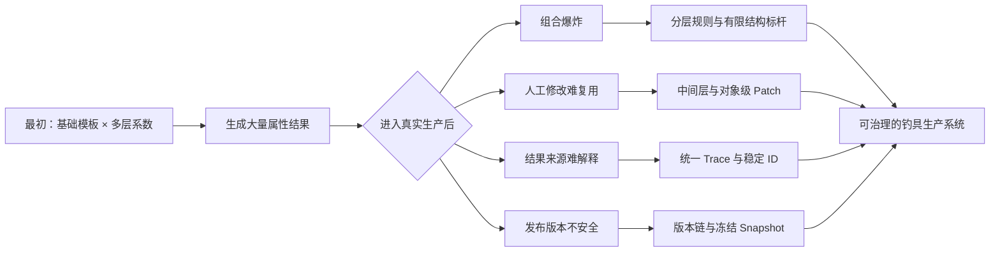
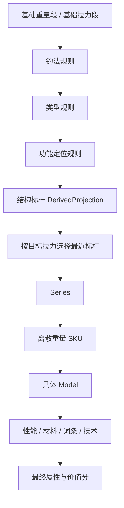
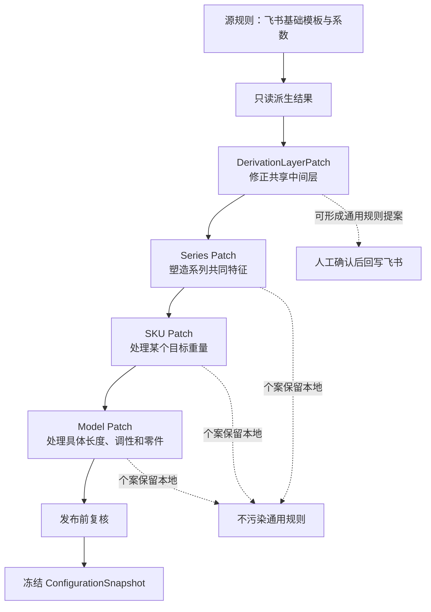
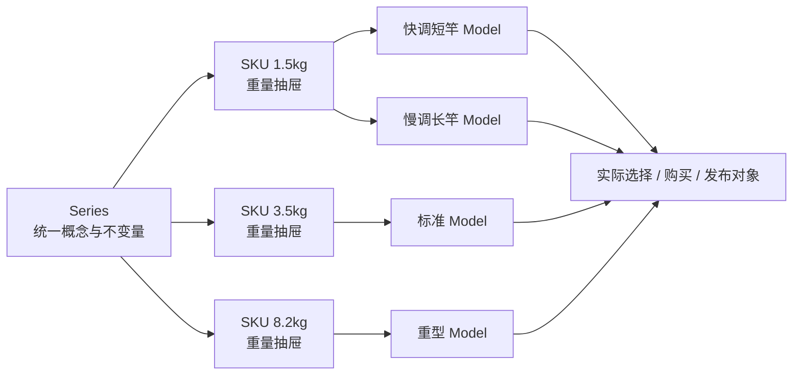
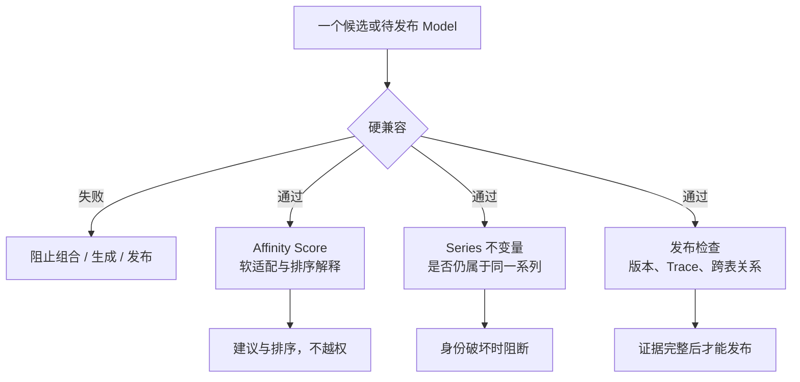
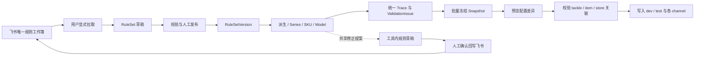

# 从“交叉相乘”到可治理的钓具生产系统

> 一份写给原始方案提出者的设计演进说明  
> 版本：2026-07-22  
> 本文用于沟通设计价值，不替代《Tackle Forger 产品与领域开发规范 v3》。文中“已确定”指需求与设计已定型；功能是否上线，以开发验收状态为准。

## 先说结论：我们保留了最初的好想法，并为它补上了生产能力

最初提出的思路是：用重量段基础模板作为底座，再叠加钓法、类型、功能定位等系数，通过交叉计算生成钓具属性。

```text
基础重量段模板 × 钓法系数 × 类型系数 × 功能定位系数 = 属性标杆
```

这个思路是整个系统最重要的起点。它把“逐件手填装备”变成“维护少量基础规则、批量生成大量装备”，带来了规模化和统一性。

我们后来没有推翻这个内核，而是解决了它进入真实生产后必然遇到的问题：组合数量失控、人工修改无处保存、上游变更误伤下游、结果来源无法解释、商品层级不清、兼容判断混乱，以及已发布配置被新规则静默改变。



因此，真正的升级不是“又多做了一批页面”，而是把一个优秀的计算方法，发展成了一条可解释、可人工接管、可持续演进、可安全发布的配置生产线。

## 1. 第一项优化：控制模板维度，避免组合爆炸

### 钓法和类型分层，但允许在同一界面操作

钓法描述玩法环境和基础倾向，例如路亚、浮钓；类型描述结构差异，例如直柄、枪柄、纺车轮、水滴轮。两者在计算语义上是独立规则层，因此不能合并成一个不可拆分的大表。

界面上可以把它们放在同一步，降低操作成本；底层仍分别保存和计算。这样修改“路亚”的通用规则时，不需要复制全部类型；修改“枪柄竿”的结构规则时，也不会把路亚规则重写一遍。

### 功能定位从标签变成显式的取舍规则

远投、精细、大物搏鱼等定位不再只是文字标签，而是明确记录每项属性怎样变化。例如，大物搏鱼可以定义为拉力增加20%、自重增加20%、长度增加10%、抛投精准度降低30%、抛投距离降低10%。

这里还有一个重要改进：系统理解属性的效用方向。拉力变大通常是优势，自重变大则是代价。我们不再把“数字变大”一律当成收益，因此能够检查一个功能定位是否真的包含合理取舍，而不是无代价地全面增强。

### 性能、品质、材料和词条不进入结构标杆

如果继续沿着交叉相乘思路，把性能定位、品质、材料和所有词条也预先组合成模板，数量会呈指数增长。特别是词条可以自由搭配，组合几乎没有上限。

所以我们把“结构身份”和“商品强化”分开。结构标杆只包含有限且稳定的维度：

```text
部位 + 重量段 + 钓法 + 类型 + 功能定位
```

品质在编辑Series前确定；性能、材料、词条和技术在具体产品生成阶段应用。即使某个词条也提供“拉力+20%”，它只改变最终Model属性、价值分、兼容性和发布结果，不会反向要求系统重新选择结构标杆。



这项收敛保住了交叉演绎的价值，又避免了为每一种商品强化组合永久复制一份模板。

## 2. 第二项优化：先完成结构演绎，再寻找最近拉力标杆

早期最容易出现的误解，是直接按原始重量段选择模板。后来我们明确：重量段本质上是基础拉力段，必须先计算钓法、类型和功能定位造成的变化，再拿演绎后的拉力去匹配。

例如，某个基础标杆是0.8–3.0kg，大物搏鱼使拉力增加20%，那么演绎后的参考范围就是0.96–3.6kg。新的钓具应与这批已经完成定位演绎的标杆比较，而不是回到0.8–3.0kg的原始模板比较。

匹配时先锁定相同部位、相同钓法、相同类型和相同功能定位，再比较目标拉力与标杆拉力的比例距离：

```text
distance = abs(ln(targetPullKg / derivedPullKg))
```

比例距离适合0.1kg到100kg这样的跨数量级范围。它比较的是“相差几成”，不会让重型区间因为绝对数字大而压倒轻型区间。

我们还明确了四条边界：不做连续插值；1.5kg和1.8kg可以命中同一个标杆，但仍然生成两个独立SKU；Affinity不参与标杆选择；词条和后置Patch也不反向改变标杆。

这样得到的不是数学上凭空混合的新模板，而是从已有设计标杆中选择最接近、最容易解释的一支。

## 3. 第三项优化：每一层都能调整，但不再直接改坏模板

### 为什么中间层也需要人工调整

实际审阅时，问题不一定只发生在最终Model。可能是“钓法 × 重量段”的结果整体偏弱，也可能是“重量段 × 钓法 × 类型”的枪柄竿普遍过重，或者某个功能定位在所有重量段上都缺少代价。

如果只能改最终值，同一个系统性问题会在几十件装备上重复修补；如果直接改派生结果，又会失去来源、版本和重算能力。

因此，我们增加了两大类Patch：共享中间层使用`DerivationLayerPatch`；具体商品使用Series、SKU和Model各自的Patch。



### Patch保存的是修改意图，而不是一个孤立结果

每条Patch都记录作用对象、参数、before、operation、operand、after、理由、作者、时间、基线规则版本和来源Trace。

`multiply`表示同比修正，适合在新基底上重新应用；`add`表示固定补偿；`set`表示锁定绝对值，上游变化后必须人工复核；`min/max`表示边界。这样，人工经验成为了可以重放和审计的数据，而不是散落在表格中的神秘数字。

### Patch带来的三项能力

**把错误修在正确层级。** 共享偏差修中间层，系列特点修Series，重量差异修SKU，型号差异修Model。越靠后的Patch影响范围越小，优先级越高。

**安全承接上游变化。** 新规则到来时，系统可以在新基底上重放`multiply`和`add`，把`set`送回复核，并将受影响的下游标成`DIRTY`或升级候选，而不是覆盖人工成果。

**把重复经验沉淀为规则。** 多个对象上反复出现的共享修正可以形成飞书规则提案；单个Series、SKU或Model的特殊需要则永久留在本地Patch，不让一个特例改坏全局。

## 4. 第四项优化：补齐Series、SKU抽屉和Model的商品层级

交叉计算解决了“属性怎么来”，但真实游戏还需要回答“玩家买的到底是什么”。我们最终明确了三层结构。



Series承载统一品质、钓法、类型、功能定位、核心词条和概念方向。一个Series可以拥有1.5kg、3.5kg、8.2kg等多个离散目标重量，但同一Series内目标拉力必须唯一。

每个目标重量生成一个SKU。SKU是“钓具抽屉”，承载这个重量的标杆命中、Patch、候选和校验上下文；它不是玩家购买对象。

SKU下面可以有快调短竿、慢调长竿等多个Model。Model才是玩家最终选择和购买的具体型号，也是最终配置与发布快照的核心对象。

对象关联不依赖名称。名称服务于显示和搜索，系统则通过稳定ID、父级ID、目标拉力和revision对齐新旧对象。这样允许改名，也能保证同一批输入重新生成时不会凭空制造一批无法对应的新SKU和Model。

## 5. 第五项优化：自动化可以一路推进，也可以被人随时接管

我们没有把每一级都做成强制审批，否则工具会变成一条处处等待点击的低效流程。默认情况下，系统批量生成Series下的多个SKU和Model候选；用户也可以主动限制生成范围。

普通阶段默认自动通过。用户显式介入，或阶段策略设为`REVIEW_ON_CHANGE`时，流程才在该处暂停。人工修改会让受影响的下游进入`DIRTY`或“有升级候选”，提醒用户重新生成、重放Patch或复核差异。

同样输入、同样规则版本和同样显式seed必须得到同样结果；没有随机需求时不强行引入seed。这保证系统既高效，又可复现。

## 6. 第六项优化：把“合理”拆成四套互不越权的判断

我们刻意没有设计一个包打天下的总分，而是区分四类完全不同的问题。



硬兼容回答“能不能用”；Affinity回答“虽然能用，但是否契合”；系列不变量回答“它还是不是这个系列”；发布检查回答“它是否具备完整、可追溯、可交付的正式版本”。

Affinity再高也不能覆盖硬不兼容。AI建议也不能改变这些裁决。所有问题统一成`ValidationIssue`，并附带严重程度、证据和`ActionLink`，让用户知道为什么出问题、影响哪些对象、可以去哪里修复。

## 7. 第七项优化：品质、词条、价值分和定价形成清晰顺序

商品设计顺序被明确为：

```text
先确定品质 → 编辑Series → 生成SKU与Model → 选择词条/技术
→ 计算价值分 → 校验品质区间 → 形成定价参考
```

品质固定映射为C/绿、B/蓝、A/紫、S/橙。`functionIntensity`表示功能专精强度，不是品质。技术是词条组合包，不能让技术自身和内部词条对同一个属性重复加成。

词条选择完成后，系统计算并留存价值分。价值分用于检查装备是否符合当前品质区间，也为定价提供依据，但不会反向偷偷修改品质。

被动词条在当前工具中只保存、展示和计分，不执行钓鱼模拟器逻辑。这个边界让工具专注于生产配置，而不冒充战斗模拟器。

## 8. 第八项优化：从飞书源规则到游戏配置，全程可追踪、可恢复

飞书电子表格仍然是策划最方便的通用规则编辑入口，但“飞书最新内容”不再自动等于“正式生效规则”。



回写不等于拉取，拉取不等于发布。工作表和规则实体都使用机器稳定ID；名称可以调整，但不能用来猜测新旧对象关系。缺少机器ID的新行进入待确认状态，不会自动冒充旧实体。

任意最终属性都能展开统一Trace：基础模板、钓法、类型、功能定位、性能或词条、Series Patch、SKU Patch、Model Patch，直到最终值。每一步记录来源对象、规则版本、before、operation、operand、after和警告。

发布时不要求草稿逐个手工冻结。系统可以批量创建`ConfigurationSnapshot`：未变化对象复用已有快照，合格的新revision创建新快照，被阻断的对象跳过并汇总报告。

快照发布后不可变。上游规则变化只会产生`DIRTY`、Patch rebase或`UpgradeCandidate`，绝不会静默重算已经发布的商品。

最终交付也不再只是导出一个Excel。工具会向设计人员本地配置Git仓库的目标环境和渠道写入`tackle`、`item`、`store`三张表；`store`强制生成并包含上架开关。写入前必须预览差异，根据目标环境的`config.toml`检查跨表关联，无法关联就明确阻断，并在确认目标后记录基线hash、生成备份和恢复Manifest，再逐文件写入与回读；任一失败按Manifest恢复已写文件，不宣称跨三文件原子替换。

## 9. 界面上的提升：让复杂能力仍然容易理解

工具采用高密度数据驾驶舱，而不是把用户困在一连串彼此割裂的表单中。

“钓具系列甘特图”按重量轴呈现Series规划和离散SKU分布。它是一种界面心智模型，不是新增领域实体，也不表示连续插值。SKU抽屉和Model右侧预览层让用户从系列逐步深入具体型号，同时保留上下文。

属性来源表把基础模板、规则层和各级Patch放在同一视野。五维属性图既支持竿、轮、线同图观察强弱与匹配关系，也支持多个同部位钓具比较。

原“候选池”被收敛成Series或SKU上下文中的“生成Model候选”动作，避免它被误认为正式产品对象。

“AI评估与建议”规划为二期辅助层：它必须引用证据，只能预览建议、生成Model Patch草稿或飞书规则提案草稿；不能自动应用、自动发布、覆盖硬兼容、改变Affinity或执行被动模拟器逻辑。三期再增加细粒度权限管理。

## 10. 关键设计决定及其价值

| 设计决定 | 直接解决的问题 | 长期价值 |
| --- | --- | --- |
| 钓法与类型分层 | 规则重复、修改耦合 | 新玩法和新结构可以独立扩展 |
| 结构标杆排除性能、品质、材料和词条 | 组合爆炸 | 模板空间有限、稳定、可缓存 |
| 先演绎结构，再按比例拉力距离匹配 | 标杆选择失真 | 轻重装备使用一致的相对距离语义 |
| 不做连续插值 | 产生不存在的混合模板 | 结果确定、可解释、可人工固定 |
| 各层使用Patch，不覆盖派生结果 | 人工修改污染源规则 | 支持重放、审计和安全升级 |
| 通用Patch与个案Patch分治 | 一个特例误伤全局 | 经验可沉淀，例外不污染规则库 |
| Series包含多个离散SKU，Model才可购买 | 商品层级混乱 | 同重量多型号与稳定配置关联 |
| 四套校验语义相互独立 | 模糊总分越权 | 每种结论都有清晰职责和阻断边界 |
| 优势和代价都进入计算 | 功能定位只涨不降 | 支持真正的横向取舍与平衡 |
| 先定品质、后选词条并留存价值分 | 品质和词条互相倒推 | 设计审核与定价拥有共同依据 |
| 飞书显式拉取、版本化发布 | 远端修改污染生产数据 | 可复现、可审计、可恢复 |
| 冻结发布快照 | 线上商品被新规则悄悄改变 | 保护历史版本和正式配置安全 |

## 11. 这套设计真正优秀的地方

**它把生成和治理放进同一个系统。** 工具不仅算数值，还负责解释、校验、人工调整、版本升级和正式发布。

**它让自动化可被接管。** 默认批量推进保证效率；阶段检查点、DIRTY传播和Patch让设计师在必要时准确介入。

**它把错误修在正确层级。** 共享偏差、系列特点、重量差异和型号差异各有自己的作用域，系统不会逐渐退化成一堆无法解释的最终值覆盖。

**它把人工判断变成可复用资产。** Patch记录修改意图和证据，重复模式可以上升为通用规则，个案仍保持边界。

**它把每次发布当作可复现的产品版本。** 即使规则和设计思路继续变化，旧商品仍能完整解释和复现。

**它没有过早写死尚未确认的语义。** 性能强度命名、Patch阈值、五维图轴、AI审核权限和定价曲线等开放事项仍保持可配置，避免开发假设偷偷变成产品规则。

## 12. 可以怎样向最初提出方案的人概括

> 最初“基础重量模板乘以钓法、类型和功能系数”的想法，仍然是今天系统最核心的计算方式。我们后来做的，是给这个内核补上长期生产所需要的结构：只让有限的结构维度进入标杆，避免词条组合爆炸；先完成结构演绎，再按比例拉力距离选择最近标杆；允许在中间层、Series、SKU和Model分别打Patch，又不破坏源模板；把硬兼容、软适配、系列一致性和发布检查分开；最后用稳定ID、完整Trace、显式飞书同步和不可变快照，把结果安全地写进游戏配置。于是它不再只是一个交叉相乘的小工具，而成为了一条可解释、可人工接管、可持续演进的钓具配置生产线。

## 结语

这次设计演进的价值，不是单纯增加了很多功能，而是保护了原始创意，并补齐了它走向真实生产所需要的边界。

交叉相乘负责提供规模化和一致性；分层规则负责控制复杂度；最近标杆负责稳定映射；Patch负责承载人工判断；校验负责阻止不合理组合；Trace负责解释；版本和快照负责保护正式结果；飞书与配置导出则把策划工作真正连接到生产环境。

最终形成的不是一个替人填表的计算器，而是一套能够沉淀设计知识、支持团队协作、经得起规则变化并保护已发布内容的钓具生产系统。
