# Tackle Forger 产品与领域开发规范 v3

> 状态：**唯一权威规范 / Canonical**  
>首次定稿：2026-07-21  
> 最后修订：2026-07-23  
> 适用对象：产品设计、领域建模、前后端开发、数据迁移、测试与代码审查  
> 源数据参考：《淡水路亚杆轮线装备设计.xlsx》

## 0. 文档权威与实现原则

本规范吸收并取代此前的系统设计和两份决策补充。历史文档只用于理解演进，不用于决定当前行为。

### 0.1 固定原则

1. 源规则、派生结果、人工Patch和发布快照必须分开。
2. 派生结果只读且可重建；正式发布快照不可变。
3. 所有数值必须能解释到模板、规则、词条或Patch。
4. 自动校验贯穿流程，人工审批集中在关键关卡。
5. 属性优势和代价都必须被计算和展示。
6. 不以复制完整组合模板的方式解决多维规则问题。
7. 未确认语义不得硬编码。

### 0.2 明确禁止

- 禁止对目标拉力做连续插值；界面“重量规格”不得改变该计算语义。
- 禁止直接修改缓存的DerivedProjection。
- 禁止把钓法和类型合并成不可拆分的数据实体。
- 禁止让软兼容分覆盖硬不兼容。
- 禁止技术规则和技术所含词条重复修改同一属性。
- 禁止把SKU当作玩家实际购买对象。
- 禁止在本工具中执行或验证被动技能运行逻辑。
- 禁止上游更新静默改写已发布配置。

## 1. 产品目标与范围

Tackle Forger是一套内部钓具配置生产工作台，负责：

```text
飞书规则源
→ 已发布规则集
→ 多维派生模板
→ 产品族与严格系列
→ SKU重量抽屉
→ 具体Model
→ 配置快照
```

### 1.1 当前负责

- 参数、重量模板、钓法、类型、功能、性能和品质规则；
- 属性词条、被动技能词条和技术组合；
- 最近派生模板匹配；
- 兼容、属性平衡、系列不变量和杆轮线闭环；
- Series、SKU和Model的人工Patch；
- 品质评分、稀有度和配置发布；
- 飞书同步、版本、冲突、回写建议和历史复现。

### 1.2 当前不负责

- 被动技能运行；
- 钓鱼、抛投、诱鱼和环境模拟；
- 玩家背包、交易、库存和经济执行；
- 动态战斗平衡热更新；
- 美术资源生产。

本工具可以为这些系统导出数据，但不承担其运行时正确性。

## 2. 权威术语与层级

```mermaid
flowchart LR
    A["Weight Template"] --> B["Method Profile"]
    B --> C["Type Profile"]
    C --> D["Function Profile"]
    D --> E["Structural Benchmark"]
    E --> F["Series"]
    F --> G["SKU Drawer / targetPullKg"]
    G --> H["Nearest Structural Match"]
    H --> I["Intensity + Performance + Material + Patch + Affix"]
    I --> J["Purchasable Model"]
    J --> K["Configuration Snapshot"]
```



| 对象 | 权威定义 |
| --- | --- |
| WeightTemplate | 某重量段的中性面板基准 |
| MethodProfile | 路亚、浮钓等玩法系数与约束 |
| TypeProfile | 纺车+直柄、水滴+枪柄等结构套系 |
| FunctionProfile | 泛用、远投、障碍强攻等玩法方向 |
| functionIntensity | 同一功能方向的专精强度1/2/3 |
| PerformanceProfile | 轻量、高强、回弹、散热等工艺方向 |
| QualityProfile | C/绿、B/蓝、A/紫、S/橙的系列品质身份；本身不直接修改面板 |
| StructuralBenchmark / DerivedProjection | 仅由基础拉力模板×钓法×类型×功能定位演绎出的只读结构标杆 |
| Collection | 营销产品族，可包含多个严格Series |
| Series | 钓法、类型、核心功能、性能和核心词条稳定的系列 |
| SKU | 玩家看到的钓具抽屉，对应一个离散targetPullKg；界面可显示为重量规格 |
| Model | SKU抽屉中的具体可购买型号 |
| ConfigurationSnapshot | Model发布时冻结的最终配置 |
| Technology | 多个原子词条的命名组合包 |
| Affix | 属性或被动技能的原子单位 |
| Patch | 对继承结果的局部、可追踪调整 |

## 3. 标准生成顺序

### 3.1 模板与定位层

```text
WeightTemplate
→ MethodProfile
→ Method-layer Patch
→ TypeProfile
→ Method×Type Patch
→ FunctionProfile
→ Function-layer Patch
→ StructuralBenchmark / DerivedProjection
```

钓法和类型保持两个数据与规则层。工作台可以把它们放在同一个“玩法与结构”操作步骤中，但执行轨迹必须分开。

真正依赖Method × Type的特殊修正使用条件规则：

```text
WHEN methodId = lure AND typeId = baitcast
APPLY rules = [...]
```

系统可以按需物化和缓存“拉力模板×钓法×类型×功能定位”的有限结构标杆，但缓存不是人工源数据。`functionIntensity`、Performance、Quality、Material、词条和Technology均不进入结构标杆维度，也不参与最近模板搜索。

### 3.2 商品层

```text
StructuralBenchmark最近匹配
→ functionIntensity显式贡献
→ PerformanceProfile
→ Material策略
→ SeriesPatch
→ SkuPatch
→ ModelPatch
→ Affix/Technology结算
→ FinalReviewPatch
→ 最终边界校验
→ ConfigurationSnapshot
```

Patch作用域越靠后，影响范围越小，优先级越高。

### 3.3 自动推进与阶段检查点

所有生成阶段默认`AUTO_CONTINUE`，不把人工选择设计成阻断式必经步骤。工作区可以为每个阶段配置`AUTO_CONTINUE`或`REVIEW_ON_CHANGE`，单次运行可临时覆盖：

1. 基础模板×Method；
2. 基础模板×Method×Type；
3. 基础模板×Method×Type×FunctionProfile；
4. 目标拉力最近标杆匹配；
5. SKU组装；
6. Model候选与自动物化；
7. 最终Model配置；
8. 发布与导出。

`REVIEW_ON_CHANGE`只在新inputHash首次计算后暂停；相同inputHash不重复要求确认。任何硬阻断都必须停止。阶段状态为`NOT_RUN/RUNNING/CURRENT/WAITING_FOR_REVIEW/DIRTY/BLOCKED/FAILED/SUPERSEDED`。上游变化只把真正依赖的下游草稿标为DIRTY：自动阶段重算，复核阶段重算后等待；已发布Snapshot永不DIRTY，只生成UpgradeCandidate。

## 4. 品质与功能专精

### 4.1 品质唯一映射

| 内部ID建议 | 字母 | 颜色 | rank |
| --- | --- | --- | --- |
| quality_c_green | C | 绿 | 1 |
| quality_b_blue | B | 蓝 | 2 |
| quality_a_purple | A | 紫 | 3 |
| quality_s_orange | S | 橙 | 4 |

字母和颜色是同一个QualityProfile的两个展示字段。不得再使用“金”作为S品质的当前名称；历史快照可以保留旧文案。

### 4.2 功能方向与强度

FunctionProfile是并列类别，不是等级。例如：

- 泛用；
- 远投；
- 精细感知；
- 快速操控；
- 障碍强攻；
- 大饵动力；
- 持久征服。

`functionIntensity`表示专精强度：

| 值 | 展示 | 含义 |
| --- | --- | --- |
| 1 | 轻度专精 | 接近中性，优势和代价较轻 |
| 2 | 标准专精 | 功能表达明确 |
| 3 | 极致专精 | 优势最大，代价也最大 |

Quality表示完成度，functionIntensity表示偏科程度，二者独立。

Series固定FunctionProfile；`functionIntensity`遵循版本化的固定值或重量曲线策略。每个`FunctionProfile × level × parameter`都必须显式定义`postMatchContributions`，不得假设统一线性倍率。它在结构标杆匹配完成后应用，数值变化不得触发重新匹配。

## 5. DerivedProjection与最近匹配

### 5.1 派生键

```text
weightTemplateId
+ methodId
+ typeId
+ functionProfileId
+ ruleSetVersion
```

StructuralBenchmark按需计算并缓存，不预先持久化其他近乎无限的词条/性能组合。缓存只存结果、来源版本和哈希，不成为人工编辑源。

### 5.2 目标拉力匹配

“重量段/重量规格”是面向设计人员的历史界面文案，权威计算语义是拉力段/目标拉力。匹配不插值，顺序固定为：

1. itemPart、Method、Type、FunctionProfile完全相同；
2. 排除硬不兼容标杆；
3. 在已经交叉演绎完成的结构标杆中比较比例距离；
4. 距离相同时优先选择`derivedPullKg`较高者；
5. 再按版本化`templatePriority`；
6. 最后按稳定模板ID排序。

```text
pullDistance = abs(ln(targetPullKg / derivedPullKg))
```

不得使用范围包含、Affinity、最终属性距离或随机数参与结构标杆选择。1.5kg和1.8kg可以命中同一标杆，但仍是两个独立SKU。词条、Performance、Quality、Material和后置Patch改变最终拉力时，不重新选择结构标杆。

### 5.3 匹配记录

```ts
interface ProjectionMatch {
  targetPullKg: number;
  matchedStructuralPullKg: number;
  projectionId: string;
  weightTemplateId: string;
  ruleSetVersion: string;
  pullDistance: number;
  reasons: string[];
  alternatives: string[];
  projectionPinId?: string;
}
```

后端统一使用`targetPullKg/derivedPullKg/matchedStructuralPullKg/modelFinalPullKg`。历史`targetWeightKg`只通过迁移适配读取，不得删除历史字段。普通Patch不得反向影响模板选择；人工固定选择使用独立`ProjectionPin`，不是Patch。

## 6. Collection、Series、SKU与Model

```text
Collection
└─ Series
   └─ SKU Drawer
      ├─ Model
      ├─ Model
      └─ Model
```

### 6.1 Collection

Collection承担品牌、视觉和营销叙事，可以跨类型或功能。例如“青芦”可以同时包含直柄泛用、枪柄操控和枪柄障碍Series。

### 6.2 Series

Series必须固定或显式约束：

- fishingMethodId；
- typeId；
- qualityId；
- coreFunctionId；
- functionIntensityPolicy；
- performanceProfileId；
- requiredCoreAffixFamilyIds；
- secondaryAffixPoolIds；
- forbiddenAffixFamilyIds；
- targetPullsKg；
- SeriesSignature。

### 6.3 SKU Drawer

SKU是玩家界面的钓具抽屉或商品卡片入口，对应Series中的一个离散`targetPullKg`。同一Series内，归一化后的`targetPullKg`必须唯一；一个Series可以拥有1.5kg、3.5kg、8.2kg等多个不同SKU。

SKU保存：

- seriesId；
- targetPullKg；
- ProjectionMatch；
- skuPatchIds；
- modelIds；
- defaultModelId；
- 展示顺序与校验摘要。

SKU不是购买对象，不保存玩家实例状态。

### 6.4 Model

Model是玩家实际选择和购买的具体型号，保存：

- action、hardness、length；
- 竿、轮、线等组件选择；
- technologyIds和affixIds；
- modelPatchIds；
- 自动定价结果、解锁和商品策略引用；
- configurationSnapshotId。

领域内Model是实际选择和购买对象。当前配置表没有Snapshot版本字段，因此不得宣称游戏侧购买记录已经支持`modelId + snapshotId`；Snapshot仅在Tackle Forger内部保证发布和导出的可追溯性。

### 6.5 稳定身份、再生成对应与重量变更

- `entityId`终身稳定；revision不可变；displayName可修改且不得作为唯一关联键。
- 再生成对应顺序固定为：显式目标ID→持久GenerationBinding→外部稳定ID→业务身份键→name/特征仅作为人工提示。
- SKU业务身份键为`seriesId + normalizedTargetPullKg`，但已有GenerationBinding优先。
- Model可以使用可选`modelVariantKey`表达跨重量的同一路线，例如`short_fast`、`long_slow`；同一SKU内非空variantKey唯一。
- SKU尚无任何已发布后代Snapshot时，可以保留skuId并以新revision修改targetPullKg；修改后重算匹配并使下游草稿DIRTY。
- SKU一旦存在已发布后代Snapshot，targetPullKg不可原地改变。新拉力必须创建新SKU，旧SKU可DEPRECATED；跨父级移动遵循同样原则。

## 7. Series不变量

### 7.1 硬不变量

以下不一致阻止Series批准或Model发布：

- Method不同；
- Type不同；
- Quality不同；
- Core Function不同；
- Performance方向不同；
- Series概念身份不同；
- 缺少必需核心词条家族；
- 包含禁用词条家族。

硬兼容、Affinity、Series不变量和发布检查是四套独立语义。硬兼容失败和发布版本链不完整可以阻止发布，但不得伪装成Series身份不变量。

### 7.2 方向签名

SeriesSignature描述相对中性基准的方向：

```ts
interface SeriesSignatureAxis {
  parameterGroup: string;
  expectedDirection: "positive" | "negative" | "neutral" | "contextual";
  importance: number;
  tolerance: number;
}
```

例如障碍强攻：拉力+、耐力+、饵重上限+、自重增加（代价）、抛投-。

所有SKU和Model必须维持核心方向，允许幅度不同。

### 7.3 重量曲线

targetPullKg升高时默认要求：

- 杆、轮、线拉力不下降；
- 安全工作拉力不下降；
- 耐力不下降；
- 饵重上限不下降；
- 推荐线号总体不下降。

长度、传动比、调性和回弹属于contextual参数，不强制单调。

## 8. Patch

```text
DerivedProjection
→ SeriesPatch
→ SkuPatch
→ ModelPatch
→ Affix/Technology
→ FinalReviewPatch
```

```ts
type CanonicalPatchOperation = "set" | "add" | "multiply" | "clear";

interface AdjustmentPatchOperation {
  operationId: string;
  operationIndex: number;
  parameterKey: string;
  operation: CanonicalPatchOperation;
  operand: unknown; // clear固定为null
  before: unknown;
  after: unknown;
}

interface AdjustmentPatch {
  id: string;
  patchRevision: number;
  scopeType: "series" | "sku" | "model" | "final_review";
  scopeId: string;
  operations: AdjustmentPatchOperation[];
  baseProjectionId: string;
  baseRuleSetVersion: string;
  baseObjectRevision: string;
  reason: string;
  author: string;
  state: PatchState;
  mirrorSyncState: PatchMirrorSyncState;
}
```

新建、批准、持久化、重放和飞书镜像统一使用`set/add/multiply/clear`四种规范操作：

| 操作 | 规范语义 |
| --- | --- |
| `set` | 把参数设为类型化operand；基底变化后必须人工复核 |
| `add` | 对数值参数加operand；参数仍存在且类型、单位兼容时可在新基底重放 |
| `multiply` | 对数值参数乘operand；参数仍存在且类型、单位兼容时可在新基底重放 |
| `clear` | 清除当前Patch层提供的覆盖，重新暴露继承值；不是把值设为`null`，operand固定为`null` |

`ProjectionPatchOperation.remove`仅是旧投影Patch/API的兼容输入别名。适配器必须在进入`PatchLedger`前确定性转换为`clear`；新API、账本、Snapshot引用和飞书镜像不得继续写`remove`。

`min/max`仍是模板与通用规则层的合法操作，但不是规范AdjustmentPatch操作。旧Patch或草稿若表达`min/max`，在批准时必须对冻结的`baseRuleSetVersion + baseObjectRevision`求值，并保存为规范`set`操作，同时在原始Payload/证据中保留原操作、边界operand、before和after；基底变化后按`set`进入人工rebase。无法无损求值的记录进入迁移复核，不得动态重放或静默丢弃。参数类型与`ParameterDefinition.allowedOperations`不允许的操作必须产生Issue并禁止批准。

`AdjustmentPatch`用于Series/SKU/Model/FinalReview；共享中间层`DerivationLayerPatch`复用同一操作明细与revision事务契约，但使用稳定阶段选择器和`scopeType=derivation`。`ProjectionPin`和`RuleSuppressionPatch`是独立记录，不伪装成数值操作。业务生命周期统一使用第14.2节的大写`PatchState`，镜像同步使用独立`PatchMirrorSyncState`；旧`draft/approved/superseded`只在迁移适配器中转换。

共享中间层人工修正使用独立`DerivationLayerPatch`，作用于稳定的阶段选择器、源模板、Method、Type或FunctionProfile，不引用易失缓存ID。它可以参与草稿试算，但正式发布前必须完成：回写飞书表格→技术回读验证→用户显式“拉取”→发布新RuleSetVersion→重算确认吸收。Series/SKU/Model Patch与ProjectionPin无需回写飞书即可发布。

重放语义：

- multiply/add在参数仍存在且类型、单位兼容时可在新基底上重放，重放后最多回到`PENDING_REVIEW`；
- set在基底变化后必须人工复核；clear只有在目标仍表示可继承覆盖时可重放，参数删除、重命名或必填性变化时进入`REBASE_REQUIRED`；
- 同作用域同参数多个set，或set与clear互相竞争，是冲突；
- 屏蔽继承规则使用独立RuleSuppressionPatch；
- `FinalReviewPatch`位于词条结算之后，只处理最终复核差异；上游变化后必须重新复核。
- `ProjectionPin`只固定结构模板选择，不冻结模板旧值；源模板删除或失配时进入`REBASE_REQUIRED`，不得静默回退。

“Patch预算”统一称为“Patch属性偏移上限”，与服务器资源无关。

## 9. 兼容规则与Affinity Score

### 9.1 硬兼容

硬兼容回答“能否成立”，结果为allow、deny或require。覆盖：

- Method × Type；
- Type × Weight；
- Type × Function；
- LineMaterial × Weight/Function；
- Model × Component；
- Rod × Reel × Line闭环。

deny永远阻止发布；require缺失时阻止或要求补足条件。

### 9.2 软Affinity Score

软兼容回答“在合法组合中有多适配”，不改变属性、不覆盖deny。

分值：

| 值 | 含义 |
| --- | --- |
| +3 | 强协同 |
| +2 | 明显适配 |
| +1 | 略有帮助 |
| 0 | 中性 |
| -1 | 略有冲突 |
| -2 | 不推荐但允许 |
| -3 | 强冲突但仍合法，复核需理由；不等同deny |

按轴分组：

```text
method_type
type_pull_tier
type_function
function_performance
material_function
quality_specialization
model_component
```

每个轴只采用最具体、优先级最高的一条规则：

```text
AffinityScore = Σ(axisScore × axisWeight) / Σ(axisWeight)
```

界面必须同时显示各轴贡献和自然语言理由，不能只显示总分。

## 10. 参数、属性平衡预算与公式

### 10.1 参数元数据

```ts
interface ParameterDefinition {
  key: string;
  label: string;
  itemPartId: string;
  unit: string;
  precision: number;
  benefitMode: "higher_better" | "lower_better" | "target_range" | "contextual";
  balanceWeight: number;
  normalizationScale: number;
  allowedOperations: string[];
  targetRange?: { min: number; max: number };
}
```

自重属于lower_better：增重是代价，减重是优势。长度、传动比和调性通常是contextual。

### 10.2 通用规则操作

模板与定位层继续支持：

```text
add | multiply | set | min | max | formula
```

所有操作记录before、operand、after、layer和source。

### 10.3 属性平衡预算

乘法规则的归一化贡献：

```text
impact = directionSign × balanceWeight × ln(after / before)
```

加法规则：

```text
impact = directionSign × balanceWeight × (after - before) / normalizationScale
```

Function必须有优势和代价；Performance和Quality可以有有限净增益；Series/SKU/Model Patch受属性偏移上限约束。

执行Pareto检查：同重量、同品质和同价格预算下，如果一个组合所有关键属性都不差且至少一项更好，则产生支配警告。

## 11. 词条与技术

### 11.1 词条分类

```text
category: attribute | passive
generationPolicy: normal | technology_only | style_only
```

属性词条改变面板。被动技能只保存、计分、展示和导出，不进入面板计算，也不在本工具执行。

### 11.2 技术

Technology是Affix组合包，负责：

- 组织词条；
- 名称和叙事；
- 稀有来源和生成限制；
- 与Performance/Series的兼容；
- 总价值评分和品质要求。

Technology不得再次提供与所含Affix重复的属性规则。

PerformanceProfile表示工艺方向并可在结构标杆匹配后显式贡献数值，Technology表示具体实现。Performance、属性词条和Technology成员都必须声明`semanticContributionKey`；同一语义默认不得重复生效，只有显式`stackingPolicy=stack`且通过校验时才可叠加。Technology本身只组织成员，不重复贡献属性或价值分。

### 11.3 属性词条叠加

正向百分比先加算，随后固定值：

```text
FinalValue = BaseValue × (1 + ΣPercentBonus) + ΣFlatBonus
```

operation至少包括：

```text
percent_bonus
flat_bonus
reduction_diminishing
flat_reduction
clamp_add
enum_add
set
```

自由文本公式只用于说明，正式计算由operation和ParameterDefinition驱动。

### 11.4 降低型公式：开放决策 OPEN-001

源资料存在两种语义：

```text
Base × (1 - Σr)
```

和：

```text
Base / (1 + Σr)
```

在用户最终确认前：

- 引擎必须通过`reductionStackingMode`配置；
- 不得把任一公式散落硬编码到页面；
- 默认建议使用`diminishing_division`，即`Base/(1+Σr)`；
- 导入、预览和快照必须记录实际使用的模式；
- 相关测试同时覆盖两种模式。

### 11.5 被动技能

当前保存：

- skillId、name、itemPartId；
- triggerType和触发条件说明；
- effectTarget和effectLogic说明；
- 示例参数；
- 持续、冷却、重置和叠加说明；
- valueScore、rarity和玩家文案。

当前不做：

- 解析effectLogic；
- 校验事件存在；
- 运行或模拟技能；
- 验证动态技能冲突。

界面必须显示：“本工具保存设计与配置资料，不执行或验证该被动技能。”

## 12. 品质评分、稀有度与部位

### 12.1 词条价值分与已选品质校验

```text
baseAffixScore
= Σ去重后的有效词条.valueScore
+ Σ同部位、无序词条对的combinationScore

finalValueScore
= baseAffixScore
× FunctionProfile.scoreFactor
× PerformanceProfile.scoreFactor（仅当当前RuleSet显式启用且来源可解析）
```

编辑Series时先由设计人员确定Quality，再选择或生成词条与Technology。价值分只验证所选品质是否落在版本化、互斥的分数区间内，并作为自动定价输入；不得根据价值分自动改变Quality。主工作簿revision `2869`的`07_品质评分/FqD4j7`给出当前策略：`C/绿 [0,20)`、`B/蓝 [20,40)`、`A/紫 [40,65)`、`S/橙 [65,100)`。这些值必须导入`QualityValuePolicyVersion`，不得硬编码为永久常量。

负分技术内专用词条参与总分；被动词条参与价值分但不进入面板。Technology只展开成员词条，不额外贡献一次价值分；同一词条同时被直接选择和Technology引用时只计算一次。`FinalReviewPatch`不改变价值分。低于或超过所选品质区间阻止Model发布，候选生成应以所选品质区间为目标，但不得自动改Quality。

`07_品质评分`还提供竿、轮、线三张词条组合矩阵。组合分按以下契约导入和计算：

- 仅同一部位的有效词条互相组合；每个无序词条对最多计算一次。
- `—`是对角线，不产生组合；空白镜像半区表示“值存于另一半区”，不等于显式`0`；显式`0`是合法规则值。
- 正分、零分和负分均为业务结果，不得用布尔“兼容/不兼容”代替；例如轻量与增重的`-20`属于价值抵消，不是硬兼容deny。
- 若同一无序词条对两侧都填值且不一致、矩阵词条无法按稳定ID解析、或跨部位引用，`QualityValuePolicyDraft`进入`SOURCE_CONFLICT`并阻止发布。
- 矩阵当前以缩写展示；导入器必须先将缩写解析为稳定`affixId`并保存源单元格坐标，运行时不得按缩写或名称关联。

`FunctionProfile.scoreFactor`来自`03_功能定位/vviXo0`的“评分系数”，当前值按乘法应用。`07_品质评分`公式同时引用“性能定位_评分系数”，但revision `2869`已不存在独立性能定位工作表。系统不得静默当作`1`：只有RuleSet显式声明`performanceScoringEnabled=false`时才使用带来源的恒等操作；否则产生`QUALITY_SCORE_SOURCE_MISSING`并阻止该策略发布。

品质上界还存在一个源表边界冲突：`07_品质评分`把S写成`[65,100)`，而`08_价格计算`包含评分`100`并计算系数`3`。导入器必须产生`QUALITY_SCORE_BOUNDARY_CONFLICT`；在源规则明确“100是否包含”前，评分100不得进入正式发布和正式定价，不能由前端自行夹取为99或100。

```ts
interface ModelAffixValueAssessment {
  modelRevisionId: string;
  selectedQualityId: string;
  baseAffixScore: number;
  combinationScore: number;
  functionScoreFactor: number;
  performanceScoreFactor?: number;
  finalValueScore: number;
  affixBreakdown: { sourceAffixId: string; valueScore: number; sourceRef: string }[];
  combinationBreakdown: {
    leftAffixId: string; rightAffixId: string; valueScore: number; sourceRef: string;
  }[];
  qualityRangePolicyVersion: string;
  scoringPolicyVersion: string;
  inSelectedQualityRange: boolean;
  inputHash: string;
}
```

Quality本身不直接修改面板。属性平衡预算判断数值是否全优，价值分判断词条价值是否符合已选品质，二者不得合并。

校验使用统一`ValidationIssue(source="quality")`，品质不匹配代码为`QUALITY_SCORE_OUT_OF_RANGE`、矩阵冲突为`QUALITY_COMBINATION_CONFLICT`、评分来源缺失为`QUALITY_SCORE_SOURCE_MISSING`，均至少携带Model、所选Quality、最终评分、命中区间、规则版本、源单元格和`ActionLink`。规则源结构或矩阵冲突可另产生`source="data_integrity"`的父Issue；不得把品质校验问题混入PricingBasket或价格计算问题。正常路径为选品质→选词条/Technology→组合计分→系数计分→品质校验→定价；边界覆盖区间端点、负分、空词条集和评分100；冲突保留草稿及Trace；源表修复后通过显式“拉取”生成新策略草稿并重算；查看、编辑词条、发布规则和发布Model分别鉴权。

验收：Given C品质Model的去重词条分为15、组合分为3、功能评分系数为1.03且性能计分被显式禁用，When 计算，Then 最终评分为18.54并通过C区间；Given 轻量与增重同时存在，When 组合计分，Then `-20`只计一次；Given S品质评分为100且源表边界仍冲突，When 发布，Then 返回`QUALITY_SCORE_BOUNDARY_CONFLICT`且不得生成正式价格或Snapshot。


### 12.2 稀有度

```text
common 普通
uncommon 少见
rare 稀有
ultra_rare 超稀有
epic 史诗
```

- technology_only按超稀有生成政策处理；
- style_only按少见处理；
- rarity控制生成池，不替代valueScore。

### 12.3 部位注册表

领域模型使用ItemPartDefinition，不继续把rod/reel/line写死为不可扩展联合类型。

预留：竿、轮、线、钩、漂、真饵、拟饵。首版界面可只启用竿、轮、线，其他部位保存但不参与当前系列生成。

## 13. 校验与审批

### 13.1 三个人工关卡

1. 规则源与RuleSetVersion发布；
2. Series及SKU重量规格批准；
3. Model和ConfigurationSnapshot发布。

### 13.2 严重级别

Severity描述问题强度，Gate描述受影响关口，State描述当前处理状态；三者不得互相代替：

| 级别 | 行为 |
| --- | --- |
| `BLOCKER` | 结果无法被信任或命中绝对业务禁令；命中的Gate必阻断且永远不可waive |
| `ERROR` | 必须修复或按版本化WaiverPolicy获得例外；OPEN时阻断命中的Gate，不等于全部ERROR永久不可waive |
| `WARNING` | 不直接越过关口；必须在命中的Gate前`ACKNOWLEDGED`并记录理由，acknowledge不是waive |
| `INFO` | 展示继承、正常取舍和解释，不阻断 |

`BLOCKER`用于硬deny/缺失require、Snapshot或Trace不可重放、必需版本缺失、配置关系断链等继续执行会产生不可信产物的情况。普通可修复字段错误使用`ERROR`。是否允许`ERROR`例外必须由版本化`WaiverPolicyVersion`按`source + code + gate`显式列出；未列出即不可waive。

### 13.3 最低校验集合

- 导入：ID、字段、单位、范围、重复和版本冲突；
- 模板：规则操作、轨迹、边界和预算；
- 兼容：硬规则、条件要求和Affinity解释；
- Series：身份、核心词条、方向签名和重量曲线；
- SKU：最近匹配、共享基底和重复规格；
- Model：部件、技术、词条、Patch和杆轮线闭环；
- 发布：目标Gate无OPEN的BLOCKER/ERROR、warning已确认、版本链完整、快照哈希成功；被策略允许且有效的ERROR waiver必须冻结到发布证据。

被动技能只校验配置完整性和文案一致性，不校验运行时逻辑。

## 14. 版本、快照与飞书治理

```text
FeishuSourceRevision
→ RuleSetVersion
→ DerivedProjectionRef
→ SeriesRevision
→ SkuRevision
→ ModelRevision
→ ConfigurationSnapshot
```

ConfigurationSnapshot至少冻结：

- modelId和上游Revision；
- RuleSetVersion和projectionId；
- PatchSetHash；
- finalPanelValues；
- technologyIds、attributeAffixIds、passiveAffixIds；
- 属性叠加轨迹；
- 被动技能设计Payload；
- 品质、兼容和校验报告；
- ModelAffixValueAssessment、PricingPolicy版本、自动价格和定价Trace；
- 发布人和发布时间。

上游变化生成UpgradeCandidate，不原地覆盖Snapshot。

飞书电子表格是唯一通用规则源。当前指定主工作簿为[《钓具设计工作簿》](https://pisn3u3ony2.feishu.cn/wiki/YsEKwSUJ5i86HCkZKBVcNMw7nOh?from=from_copylink&sheet=9nE3Rx)；`?sheet=9nE3Rx`只表示打开时定位到`06_系列`，同步边界是链接解析后的整个工作簿，不是单个工作表。2026-07-21首次接入读取基线为revision `2302`；完成本轮稳定ID、品质和定价契约整改后的回读revision为`2352`。两者都只是可审计的历史观测值，不是永久版本常量；每次显式拉取必须重新取得revision并形成新的`FeishuSourceRevision`。

当前工作簿关键稳定工作表标识为：`01_重量模板/d6e928`、`02_类型材质/fATowU`、`03_功能定位/vviXo0`、`04_词条/zrVOxd`、`05_技术/RdZv0J`、`06_系列/9nE3Rx`、`07_品质评分/FqD4j7`、`08_价格计算/u87sRh`、`10_校验规则/KZv4o2`、`11_组合SKU/eXV1dI`、`13_上传发布/M17p0j`、`14_Rods/hekdpO`、`15_Reels/oUp48w`、`16_Lines/YTYwgS`、`17_Item/VFxDxt`。工作表名称是人类文案，接入器以`sheet_id`识别并校验期望名称；改名产生warning，不把同名新表静默当成原表。

规则工作表必须使用不可变`ruleId/entityId`和稳定`parameterKey`，机器区域不得依赖行号、名称或合并单元格。revision `2869`的当前规则源拓扑已将词条和技术调整为`04_词条`、`05_技术`，且不再包含独立“性能定位”工作表。接入器必须按最新显式拉取的workbook revision核对sheet_id与机器ID，保留既有ID；任何缺ID新行进入`NEW_SOURCE_ROW`等待人工确认。历史revision中的性能定位ID不得擅自迁移、删除或复用，名称只用于显示、搜索和迁移候选，不用于长期对象关联。

`09_甘特图/wxORcd`按工作簿使用说明是开发计划表，不是产品界面的“钓具系列甘特图”数据源，也不新增领域实体。`11_组合SKU`、`12_打包竿组`和`14_Rods`至`17_Item`当前作为历史样例、映射参考或飞书侧暂存输出，不能反向覆盖Tackle Forger中的Series、SKU、Model与Snapshot真相。飞书工作簿当前也没有完整GoodsBasic/StoreBuy目标页；因此本节的飞书数据进出不替代第25节的本机配置Git仓库导出。正式发布仍从冻结Snapshot写入本地tackle/item/store工作簿，并强制生成GoodsBasic和StoreBuy。

通用修正的生效链固定为：

```text
工具内RuleSourceChangeDraft
→ 人工确认写回飞书电子表格
→ 技术回读验证
→ REMOTE_CHANGES_AVAILABLE
→ 用户显式“拉取”
→ FeishuSourceRevision + RuleSet草稿
→ 校验
→ 用户显式发布RuleSetVersion
→ 下游重算并判断DerivationLayerPatch是否吸收
```

写回不等于拉取，拉取不等于发布。Series、SKU、Model、FinalReview Patch和ProjectionPin是产品特例，不得未经归纳直接写入通用规则表。DerivationLayerPatch只有在新规则版本重算后完全覆盖其语义时才进入ABSORBED；部分覆盖保持PARTIALLY_ABSORBED。已发布Snapshot只产生UpgradeCandidate。

### 14.1 Patch权威账本与飞书Patch台账

所有保存过的Patch必须进入工具内统一、持久化、版本化的`PatchLedger`。`PatchLedger`是Patch的运行时权威来源；重新拉取、重新演绎、重新生成、对象改名、服务重启、换浏览器或换电脑均不得使Patch静默丢失。生成时按稳定对象ID、Patch作用域和基线revision加载有效Patch：基线兼容则确定性重放，基线变化则进入`REBASE_REQUIRED`，禁止跳过或按名称猜测对象。

主飞书工作簿应增加单一`Patch台账`工作表，作为全部Patch的人工可见镜像、协作界面和额外审计副本。该工作表不是通用规则表，也不是Patch的唯一运行时来源；飞书行号、显示名称、排序和合并单元格不得参与关联。Patch组由`patchId + patchRevision`定位，每条镜像明细按`patchId + patchRevision + operationId`幂等同步；飞书变化必须显式拉取后才能进入工具。已被ConfigurationSnapshot引用的Patch revision不可原地修改，只能创建新revision。

`Patch台账`采用“一条Patch操作一行”：同一Patch修改多个属性时，多行共享`patchId`。前三个机器字段固定为`scopeType`、`layerType`和`subjectEntityId`；至少还应包含`patchId`、`patchRevision`、`operationId`、`operationIndex`、`subjectName`、`parentEntityId`、`parameterKey`、`operation`、`operand`、`before`、`after`、`baseRuleSetVersion`、`baseObjectRevision`、`reason`、`evidence`、`patchState`、`mirrorSyncState`、`attentionStates`、创建/审核身份与时间、`supersedesPatchId`、`ruleProposalId`和`snapshotRefs`。名称只供显示和搜索，禁止用单一`status`混合业务与同步状态。

个体Patch必须进入统一汇总分析，但不得自动成为通用规则。工具按作用层、属性、钓法、类型、功能定位、重量段、修改方向和重复频率识别稳定模式；经人工归纳、跨对象影响预览和确认后，才可生成`RuleSourceChangeDraft`并写回对应通用规则页。新RuleSetVersion发布并重算后，原Patch分别进入`ABSORBED`、`PARTIALLY_ABSORBED`、继续`ACTIVE`或`REBASE_REQUIRED`，不得因规则提案或写回而提前删除。

同步权限必须区分Patch创建、Patch审核、Patch台账写入、Patch台账拉取、规则提案创建、通用规则写回和RuleSet发布。飞书Patch台账默认只开放人工备注、复核意见和“建议提升为共享规则”等协作字段；ID、基线、before/after、Snapshot引用等审计字段由工具控制。同步失败保留本地权威记录、幂等键和远端回读结果，可安全重试。

验收至少覆盖：重新生成后已批准Patch被重放；对象改名后仍按ID关联；基线变化进入rebase而非消失；多属性Patch按同一patchId形成多行；重复同步不重复追加；飞书排序或改名不改变关联；Snapshot引用的Patch不能原地改写；个体Patch未经人工归纳不能写入通用规则；新规则只吸收完全覆盖的Patch；飞书同步失败不影响本地Patch可恢复性。
### 14.2 Patch状态、操作顺序、镜像同步与迁移契约

Patch业务生命周期与飞书镜像同步状态必须正交保存，禁止用一个`status`混合表达：

```ts
type PatchState = "DRAFT" | "PENDING_REVIEW" | "APPROVED" | "ACTIVE"
  | "REBASE_REQUIRED" | "ABSORBED" | "PARTIALLY_ABSORBED"
  | "WITHDRAWN" | "SUPERSEDED";
type PatchMirrorSyncState = "NOT_SYNCED" | "PENDING" | "WRITING" | "SYNCED"
  | "REMOTE_CHANGED" | "CONFLICT" | "WRITE_FAILED";

interface PatchOperationRecord {
  patchId: string; patchRevision: number;
  operationId: string; operationIndex: number;
  parameterKey: string; operation: "set" | "add" | "multiply" | "clear";
  operand: unknown; before: unknown; after: unknown;
}
```

`PatchOperationRecord`是账本、Snapshot和飞书镜像的规范明细。`clear`行的`operand`固定为`null`；飞书导入遇到`remove`时先转换为`clear`再计算幂等键。飞书出现`min/max`不得直接进入ACTIVE revision：只有能从冻结基底验证before/after的记录才可规范化为`set`，并保留原始意图证据；否则整组进入`REBASE_REQUIRED`或迁移复核。

`operationId`在Patch内稳定且不可复用，飞书镜像明细的幂等键为`patchId + patchRevision + operationId`。`operationIndex`是确定性执行顺序，不得使用数据库自然顺序、飞书行号或当前排序；同一参数存在多个操作时也必须按它执行。Patch revision是组级事务边界：审核、批准、撤回、rebase、重放、吸收和Snapshot引用均针对完整revision；只有全部必需操作有效时才可重放。镜像部分写入成功不得把整组标为`SYNCED`。

飞书删除、清空、隐藏、移动或过滤镜像行不构成删除Patch的命令，不得级联改变本地账本、业务状态或Snapshot。缺失行产生`PATCH_MIRROR_ROW_MISSING`，允许按幂等键补写。飞书中未知`patchId`、重复明细键、受控审计字段被改写或明细组不完整时必须隔离问题行并产生`ValidationIssue(source="patch")`；不得按名称自动认领。协作字段中，备注和复核意见采用带作者、时间、revision的追加记录；“建议提升为共享规则”等状态字段使用expectedRevision，冲突进入`CONFLICT`并人工解决。

`PatchLedger`必须有独立`schemaVersion`和顺序迁移。迁移保留未知字段和原始Payload，重复执行幂等；迁移前后至少校验Patch revision数量、操作顺序、PatchSetHash、代表性最终值和Trace语义。无法无损迁移的记录保留原值并进入人工复核，不得删除。对象归档、缺失、合并或迁移后无法按稳定ID解析的Patch进入`ORPHANED`注意状态，保留原`subjectEntityId`和历史引用，禁止按名称重新绑定。

ConfigurationSnapshot必须冻结有序Patch引用集合（`patchId + patchRevision + ordered operationIds`）及`PatchSetHash`。被引用revision及其操作顺序不可原地修改；镜像行变化、Patch吸收、rebase和数据库迁移均不得改变历史Snapshot。同步命令和补偿重试记录独立`idempotencyKey`、expected remote revision、逐操作结果和回读证据；超时先回读，部分失败可安全续传但不可产生半组生效状态。

新增验收：Given同一参数含set/add/multiply，When多次重放，Then严格按operationIndex得到同一结果；Given三行镜像只写成两行，When同步结束，Then组状态不是SYNCED且Patch仍可从本地完整重放；Given人工删除镜像行，When显式拉取，Then本地Patch和Snapshot不变并产生PATCH_MIRROR_ROW_MISSING；Given旧schema迁移两次，When比较结果，Then无重复revision且PatchSetHash、最终值和Trace语义一致；Given对象缺失且存在同名新对象，When加载，ThenPatch进入ORPHANED而不重绑；GivenSnapshot引用revision 1，When产生revision 2或改变镜像，Then旧Snapshot的有序引用与hash不变。

## 15. 工作台信息架构

1. 数据源与参数注册表；
2. 模板与规则实验室；
3. 兼容规则与Affinity；
4. 派生模板浏览器；
5. Collection/Series设计器；
6. SKU重量跨度与抽屉；
7. Model和配置明细；
8. 属性词条库；
9. 被动技能库；
10. Technology编辑器；
11. 审阅、发布、版本和规则学习。

每一级预览固定展示：来源、before、operation、operand、after、优势/代价、兼容解释、Patch和校验状态。

被动技能只显示设计字段、分值、稀有度、技术来源和玩家文案。

## 16. 部署基线

目标环境为内网Dell R730，同时运行十多个服务。系统按需计算派生模板，不预生成完整组合，资源需求较低。

建议初始配额：

| 组件 | 常态 | 批量峰值 |
| --- | --- | --- |
| Web/API | 0.5–1 CPU、1GB RAM | 1–2 CPU、2GB RAM |
| 可选Worker | 与Web合并 | 1–2 CPU、1–2GB RAM |
| 数据库 | 复用PostgreSQL优先 | 按并发和备份调整 |
| 文件与快照 | 初期数GB | 配置保留和备份策略 |

初期单容器即可；批量重算影响交互后再拆Worker。无需首版引入Redis。

## 17. 当前实现迁移

### 阶段1：兼容基础

- ParameterDefinition增加效用、单位、允许操作；
- 增加MethodProfile、RuleSetVersion和DerivedProjection；
- 旧Candidate.overrides迁移为operation=set的Patch；
- 历史字段保持只读兼容。

### 阶段2：商品身份

- 增加Collection、严格Series、SkuDrawer和PurchasableModel；
- SeriesRecipe改为CandidateSearchRecipe；
- OfficialSku迁移为SKU抽屉加Model；
- DetailOverride迁移到Model作用域。

### 阶段3：匹配与兼容

- 实现最近Projection匹配；
- 建立硬CompatibilityRule；
- 实现按轴Affinity Score；
- 增加Series不变量和重量曲线。

### 阶段4：词条与技术

- Affix拆分attribute/passive；
- Technology改为Affix组合包；
- 实现属性词条聚合内核；
- 品质改为C/绿、B/蓝、A/紫、S/橙；
- 增加被动技能结构化编辑，不执行逻辑。

### 阶段5：发布治理

- 发布ConfigurationSnapshot；
- 保留升级候选与历史复现；
- 聚合DerivationLayerPatch形成RuleSourceChangeDraft；
- 人工确认回写飞书、回读验证、显式拉取并发布新RuleSetVersion。

## 18. 必须具备的回归测试

### 18.1 匹配

- 1.5kg和1.8kg可以命中同一模板；
- Patch不改变ProjectionMatch；
- 用户固定模板后不自动切换；
- 只在相同部位、钓法、类型和功能定位内按拉力比例距离匹配；
- Affinity、范围包含和词条后的最终拉力都不参与结构标杆选择。

### 18.2 层级与身份

- Method和Type分别留下轨迹；
- Series出现不同Type时阻止批准；
- SKU可包含多个Model；
- 游戏侧购买身份只引用Model；Tackle Forger内部发布、审计和导出链引用Model与Snapshot；
- 历史Snapshot不被重算。

### 18.3 Patch

- add/multiply在新基底重放；
- set在新基底进入复核；
- clear清除本层覆盖而不是写null；旧remove迁移后只留下clear；
- 旧min/max按冻结基底规范化为set，无法无损转换时进入复核；
- 同层多个set或set/clear竞争冲突；
- Series/SKU/Model优先级确定。

### 18.4 兼容

- deny不能被高Affinity覆盖；
- 每个Affinity轴只采用最具体规则；
- Affinity贡献和理由可解释；
- 杆轮线闭环失败阻止发布。

### 18.5 词条

- 百分比词条加算后再加固定值；
- 两种reductionStackingMode均有测试；
- Technology不会与词条双重加成；
- 被动技能不改变面板；
- 被动技能参与分值和品质；
- technology_only不进入普通池；
- S/A/B/C阈值正确。

## 19. Agent交付检查表

开发Agent提交前必须确认：

- [ ] 已阅读本规范和开放决策；
- [ ] 没有引用历史文档中的冲突结论；
- [ ] 没有把派生结果作为人工源数据修改；
- [ ] 没有对重量做插值；
- [ ] 没有混淆Quality和functionIntensity；
- [ ] 没有混淆SKU和Model；
- [ ] 没有让Technology和Affix重复加成；
- [ ] 没有在本工具实现被动技能运行时；
- [ ] 新行为有轨迹、校验和测试；
- [ ] 发布快照保持不可变；
- [ ] 数据迁移保留历史兼容；
- [ ] 未确认公式通过配置表达，没有散落硬编码。

## 20. 未决事项登记表

本节是唯一产品语义、规则源阻断和公司策略缺口登记表。“开放”不表示实现可以留空。每个未决项都必须有可确定执行的未决行为：使用明确的草稿/种子配置、显示状态和Issue，并在指定关口fail-closed；不得使用隐藏默认值。部署凭据、某台机器的目录绑定和某次服务不可用等环境状态不属于产品决策，记录在“当前实现差距矩阵”，不得伪装成OPEN项。

| ID | 类型 | 状态 | 当前可执行边界 | 未决时的必须行为 | 关闭证据/决策责任 |
| --- | --- | --- | --- | --- | --- |
| OPEN-001 降低型词条叠加 | 产品决策 | `OPEN_CONFIGURED_SEED` | 两种算法均必须实现、版本化并测试 | 工作区可用`diminishing_division`种子试算；没有已发布`ReductionStackingPolicyVersion`时禁止新Model发布 | 规则负责人确认算法，发布策略版本并通过两模式回归 |
| OPEN-002 Performance后续扩展 | 延后产品决策 | `DEFERRED_NON_BLOCKING` | 一期仅支持显式`PerformanceProfile`，不引入`performanceIntensity` | 不生成强度、曲线或线性倍率；不阻断一期其他功能 | 产品/规则负责人提供新策略语义、源数据和迁移方案 |
| OPEN-003 扩展部位启用 | 延后产品决策 | `DEFERRED_UI_DISABLED` | 一期主流程仅启用竿、轮、线 | 钩、漂、真饵和拟饵可在注册表保留，但UI、生成、发布和导出必须关闭 | 产品负责人确认启用批次，并提供参数、兼容、映射和验收覆盖 |
| OPEN-004 Patch属性偏移阈值 | 规则策略缺口 | `BLOCKED_ON_POLICY` | 计算和展示精确偏移，阈值从版本化策略读取 | 缺策略时产生`PATCH_OFFSET_POLICY_MISSING`；允许草稿试算，阻止依赖该阈值的批准和发布 | 平衡/规则负责人提供Series、SKU、Model各级warning/review/block阈值及边界归属 |
| OPEN-005 五维图定义 | 产品决策 | `DECIDED_PENDING_DEFINITION_VERSION` | 第21、22和24.6节已记录2026-07-23确认的正式语义；实现仍须从版本化定义读取，不得写死在UI/数据库 | 已发布定义前只允许明确标记的草稿预览；缺轴不补0，草稿定义不进Snapshot | 决策证据为GitHub Issue #13及2026-07-23用户确认；发布可校验的`FiveAxisViewDefinition`后改为`RESOLVED` |
| OPEN-006 AI供应方与数据出网 | 安全/产品决策 | `RESOLVED` | 使用`ai-provider/open006-v1`：Fancy Hub、`ai-request/v1`严格Schema、动态模型修订、字段级保留和分层限额 | 本决策只解除产品策略阻断；真实连接器在Issue #25完成、测试并启用前继续禁用，不得发送真实数据 | 2026-07-23用户确认本节策略；AI无批准、写回或发布能力，无需另设三方会签 |
| OPEN-007 定价执行与源表一致性 | 外部规则源阻断 | `BLOCKED_ON_RULE_SOURCE` | 可导入同revision策略并输出`NON_FORMAL`试算 | S=100边界、性能评分来源、`roundingStage`、`minimumPriceScope`和`overflowMode`任一未解决时，禁止新PricingPolicyVersion、依赖它的Model发布、Snapshot和Store导出 | 规则负责人修订飞书源；显式拉取、校验并发布新PricingPolicyVersion |
| OPEN-008 ConfigIdPolicy区间与命名 | 公司策略（已确认） | `DECIDED_PENDING_POLICY_VERSION` | 按本节确认规则实现策略版本、ledger、权威目标目录/扫描Manifest和冲突预检 | `ConfigIdPolicyVersion`尚未发布，或其引用的`ConfigTargetCatalogVersion`中任一必需目标没有获批扫描Manifest时，不得正式预留ID或提交配置；禁止用“最大值+1”、示例ID、用户临时绑定或单一渠道扫描代替 | 配置治理负责人发布策略版本；权威目录覆盖完整；reservation、导入和分裂命中验收通过 |
| OPEN-009 工作流治理策略 | 产品/安全决策 | `RESOLVED` | 使用第20.2节发布的五类`open009-v1`策略；所有已登录公司用户拥有全部已启用业务Capability；AI一期禁用，二期连接器仍需独立实现准入 | 不接飞书审批、不在本工具实行职责分离；OPEN-006安全配置只由部署管理员修改；关键写操作使用工作区单写锁与单调fencing token，普通操作记录保留1年 | 2026-07-23用户确认；策略正文见第20.2节，迁移与验收见Issue #18 |
| OPEN-010 飞书Patch台账远端契约 | 外部规则源阻断 | `BLOCKED_ON_SOURCE_SCHEMA` | 本地PatchLedger、镜像命令、幂等与失败恢复可以运行 | 主工作簿未提供稳定sheet_id、机器列与协作字段权限前，真实镜像写入/拉取保持禁用；不得伪造SYNCED | 规则源负责人建表并确认机器区域；完成写入、回读、缺行和冲突联调 |

状态只能在决策证据进入权威规范且对应策略版本可校验后改为`RESOLVED`。代码、原型、测试种子或某次人工输入都不能单独关闭决策。

### OPEN-001：降低型词条叠加

待用户最终确认：

- `linear_subtraction`：`Base × (1-Σr)`；
- `diminishing_division`：`Base/(1+Σr)`。

当前推荐默认`diminishing_division`，实现必须保持可配置并同时测试。

### OPEN-002：Performance后续扩展

一期保留能够显式贡献数值的`PerformanceProfile`，但不引入`performanceIntensity`。Series固定性能概念/方向，具体表达通过Quality、词条家族与等级、Technology、Model路线和Patch变化。若以后新增性能强度或重量曲线，必须作为新的版本化策略另行确认，不能预埋线性倍率。

### OPEN-003：扩展部位启用时间

领域注册表预留钩、漂、真饵和拟饵；首轮实现是否同时开放界面和生成流程，需按开发优先级确认。

### OPEN-004：Patch属性偏移阈值

Series、SKU和Model的默认属性偏移上限尚未确定。实现应从配置读取，不得写死。

### OPEN-008：ConfigIdPolicy数字区间与命名规则

本项的公司治理语义已经确认，但在对应`ConfigIdPolicyVersion`发布，且其引用的`ConfigTargetCatalogVersion`中每个必需环境×渠道都有获批只读扫描Manifest前，状态保持`DECIDED_PENDING_POLICY_VERSION`，正式预留和配置提交继续fail-closed。TOML枚举固定通过可读`configNameKey`唯一解析数字ID，本项不得重新改为按数字ID直接配置。

#### 对象区间与作用域

每次为Model预留一个按部位分区的稳定`ConfigIdBundle`。Tackle与Item共享基础ID；GoodsBasic和StoreBuy由同一个基础ID确定性派生，不各自漂移游标。

| 稳定`rangeId` | 部位 | Tackle / Item共享ID | GoodsBasic ID | StoreBuy ID |
| --- | --- | --- | --- | --- |
| `rod_301800001_301899999` | 竿 `rod` | `301800001–301899999` | `10301800001–10301899999` | `30301800001–30301899999` |
| `reel_302800001_302899999` | 轮 `reel` | `302800001–302899999` | `10302800001–10302899999` | `30302800001–30302899999` |
| `line_303800001_303899999` | 线 `line` | `303800001–303899999` | `10303800001–10303899999` | `30303800001–30303899999` |

GoodsBasic ID按十进制字符串`"10" + baseId`派生，StoreBuy ID按`"30" + baseId`派生；禁止把前缀当成运行时可变渠道码。所有末三位为`000`的编号保留，不进入普通分配。区间为公司专属区间；外部未知对象一旦占用其中编号，必须登记为永久占用而不是覆盖。

`rangeId`是allocation pool的永久身份，不属于策略版本命名空间。后续`ConfigIdPolicyVersion`引用同一`rangeId`时，其部位、上下界、保留规则和派生规则必须逐字节等价；任何语义变化或扩容都必须创建新的`rangeId`。新`rangeId`的基础ID和派生ID空间不得与任何历史或当前`rangeId`重叠，重叠策略版本禁止发布。ledger游标、占用唯一约束和容量统计均跨策略版本绑定`rangeId`，`policyVersionId`只记录本次分配采用的审计规则，不得创建新游标或重置高水位。

同一个Model跨Snapshot、`dev`、`test`、`online`、`release`以及各渠道沿用同一套Bundle。环境和渠道不是ID命名空间，不能为同一个Model重复分配。首批人工导出环境为`dev/test/online/release`，各自绑定用户选择的本地Git worktree；每个环境的`1001`写入根目录`xlsx`，其他渠道绑定用户明确选择的目录。工具只负责生成、校验和写入人工导出目标，不负责后续Git合并、发布或部署。

“所有启用目标”只以配置治理负责人发布的`ConfigTargetCatalogVersion`为权威集合，不从用户本机绑定数量、`config_system.toml`或目录扫描结果反推。目录中的每个条目至少冻结`environmentId`、`channelKey`、仓库身份、分支/引用规则、仓库内逻辑目录、`config.toml`路径、是否为正式必需目标和目录版本审批信息；本机绝对路径与目录句柄不进入目录版本。用户可以自由选择本机worktree完成绑定，但绑定只满足访问授权，不能创建、启用或豁免正式目标。

每个必需条目必须有获批`ConfigTargetScanManifest`，至少记录目录版本、环境、渠道、仓库、authoritative ref名称、扫描时解析到的不可变commit、逻辑目录、`config.toml` hash、各workbook/sheet/hash、扫描器与规则版本、所验证`rangeId`集合、问题清单、结果hash、扫描人与复核人及时间。`ConfigIdPolicyVersion`必须冻结引用一个目录版本和覆盖其全部必需条目的Manifest集合；缺失、重复、失败、commit不可解析、Manifest所验区间不一致或未经`config.target.scan.approve`复核时禁止发布。目录新增或变更目标时发布新目录版本；新目标在新Manifest和引用它的新策略版本生效前只能做`NON_FORMAL`预览，不能正式预留或提交。工具仍不读取、修改或治理`config_system.toml`；权威目录由配置治理流程显式维护。

获批Manifest不是永久豁免。发布策略、每次正式预留、生成正式人工搬运包和本地正式提交前，都必须重新解析目录条目的当前authoritative ref，并逐项验证当前commit、该commit中的`config.toml` hash和所有受管workbook hash与策略冻结的Manifest完全一致；远端不可读、ref不存在、commit变化、文件缺失或任一hash变化均产生`CONFIG_TARGET_SCAN_MANIFEST_STALE`并禁止动作。预留命令在选择候选ID前检查一次，并在ledger数据库事务提交前再次解析authoritative ref；两次结果不一致则回滚且不消耗编号。正式导出还必须验证本地worktree HEAD、逻辑目录、`config.toml`和workbook基线hash与同一Manifest一致，不能用“远端一致但本地脏”或“本地一致但远端已推进”绕过。

Manifest失效后，旧`ConfigIdPolicyVersion`只保留历史审计用途，不再允许新预留或任何正式包/落盘；必须从当前authoritative ref重新扫描、复核Manifest并发布引用新Manifest的新策略版本。一次正式提交会改变workbook hash，因此提交结果必须记录post-write文件hash；待现有外部发布系统形成新的不可变commit后，再从该commit扫描和复核。在新Manifest进入新策略版本前，旧策略不得用于下一批正式预留或提交。已成功预留的Bundle仍永久保留，后续目标若外部占用同一ID则产生`RESERVED_ID_EXTERNAL_COLLISION`并隔离，不自动换号、复用或覆盖。

#### `configNameKey`格式与唯一性

| 对象 | 格式 |
| --- | --- |
| Tackle / Item | `tf_<part>_<stableModelKey>` |
| GoodsBasic | `store_tf_<part>_<stableModelKey>` |
| StoreBuy | `buy_tf_<part>_<stableModelKey>` |

`stableModelKey`是Model revision上的显式稳定字段，不从显示名、中文拼音、数据库ID或时间戳自动生成。没有该字段的Model必须先通过普通Model编辑创建新revision，再由用户基于该revision发起预留；界面可以给建议，但建议不构成保存或预留。规范化算法固定为：只移除首尾ASCII空白`U+0009–U+000D/U+0020`，再把ASCII`A–Z`映射为`a–z`，不做Unicode转写、字符替换、下划线折叠或截断。规范化结果必须满足`^[a-z][a-z0-9_]{0,39}$`，因此非空且长度为1–40字符；否则返回`STABLE_MODEL_KEY_INVALID`。

`part`只能是`rod/reel/line`。按表中模板拼接后的完整`configNameKey`最长64字符且必须满足`^[a-z][a-z0-9_]*$`。禁止随机后缀、静默截断和按环境/渠道加后缀。`stableModelKey`在正式预留前可以修改；名称与Bundle成功预留后一起冻结。业务需要改名或让新旧版本共存时创建新Model和新Bundle。

名称在每个逻辑表内唯一；`part + stableModelKey`在受管Model中唯一，且`ABANDONED`、`DEPRECATED`、`LEGACY_IMPORTED`、`EXTERNAL_OCCUPIED`等永久占用状态仍参加名称冲突检查。Tackle与Item的同名同ID配对是唯一允许的跨表重复；对任一TOML合法枚举目标集合，同名必须唯一解析到同一个数字ID。同名不同ID、同ID不同名或同名解析到多个数字ID均为阻断冲突。名称唯一性检查、Model唯一Bundle检查、四个对象ID占用、ledger记录和`rangeId`游标推进必须在同一个数据库事务内完成；并发重名只有一个请求成功，失败方返回`CONFIG_NAME_KEY_CONFLICT`并由用户选择新key，系统不得自动追加后缀。

#### Reservation ledger、生命周期与权限

全公司只使用服务端权威reservation ledger。普通设计用户可以预览候选；动作`reserve_config_id_bundle`要求`config.id.reserve`，其命令至少携带`modelId + expectedModelRevisionId + part + expectedNormalizedStableModelKey + policyVersionId + idempotencyKey`。完成Manifest新鲜度预检后，数据库事务必须先锁定Model head row，验证当前head revision等于`expectedModelRevisionId`、其part和规范化key等于命令期望值且尚无Bundle；任一不一致返回`MODEL_REVISION_CONFLICT`并且不锁游标、不写ledger。验证通过后才按策略声明顺序锁定稳定`rangeId`游标，跳过保留号，并以ledger中基础ID、两个派生ID、名称和Model的数据库唯一约束作为最终防线；禁止扫描Excel最大值后加一，也禁止回填ledger空洞。

同一事务必须再次验证authoritative refs未漂移，完成名称与ID占用、ledger和幂等记录写入，创建冻结`stableModelKey + configIdBundleRef`的后继Model revision，并以条件更新推进Model head。事务失败不留下预留或半个Model revision，事务成功后永久占用并返回`reservedAgainstModelRevisionId + resultingModelRevisionId + ConfigIdBundle`。Bundle存在后的所有Model revision必须原样继承冻结key与Bundle；任何修改key、part或Bundle引用的命令均拒绝。

幂等记录与Bundle在同一事务提交。命令先查幂等记录：相同完整payload的`modelId + idempotencyKey`重试必须返回第一次已提交的原Bundle、原/新Model revision和原审计结果，不重新执行当前revision或Manifest校验，也不推进游标；数据库已提交但响应丢失也遵守此规则。同一idempotencyKey携带不同Model、expected revision或规范化输入时返回`IDEMPOTENCY_KEY_REUSED`；同一Model已存在兼容Bundle时返回该Bundle，不再分配，输入与冻结身份冲突时返回`MODEL_CONFIG_IDENTITY_CONFLICT`。

- 成功预留但未使用的Bundle标记`ABANDONED`；已经导出后退役的Bundle标记`DEPRECATED`。二者都计入占用且永不复用，不提供管理员释放入口。
- 迁移和修订不得改变既有ID或名称。需要线上新旧并存时创建新Model；仅替换当前配置时仍更新原Bundle对应行，历史Snapshot保持不可变。
- `config.export.commit`只授权生成正式人工搬运包或写入用户已选择并授权的本地worktree。预留、导入、策略发布、Manifest复核和提交是否允许同一操作者，完全由当前有效`separationOfDutiesPolicy`决定；本节不为一期或1.5期写死豁免或强制分离。
- 配置治理负责人分别通过`config.id.policy.publish`、`config.target.catalog.publish`、`config.target.scan.approve`发布策略/目标目录和复核Manifest；历史纳管使用`config.id.legacy_import`，ledger元数据纠错使用`config.id.ledger.correct`。纠错不得删除已成功预留记录、推进或回退游标、释放编号、修改冻结ID/name或将编号转给另一Model。
- 审计至少记录操作者、时间、原因、Model、完整Bundle、原状态/新状态、策略版本、目标环境×渠道和关联revision/Snapshot。

容量按每个部位`rangeId`的可分配编号计算，`ABANDONED`、`DEPRECATED`和外部占用均计入。达到80%产生预警；达到95%产生严重预警并要求准备扩容，但已有区间尚未耗尽时继续分配；只有该部位全部可分配编号耗尽时才阻止该部位的新预留，既有Bundle的更新和导出不受影响。扩容只能通过新`ConfigIdPolicyVersion`追加新`rangeId`，不迁移旧ID、不重排或重建原游标、不回收历史空洞。

#### Upsert、分裂命中与多目标行为

每个环境×渠道独立读取实际目标表并以`ID + configNameKey`联合判断：

- ID和名称均未命中时新增；二者命中同一行时只更新工具负责的列；
- 只命中ID、只命中名称、二者命中不同行、同ID不同名、同名不同ID，或Tackle/Item/GoodsBasic/StoreBuy任一对象部分缺失，均视为分裂命中并阻止该目标；
- 不自动改名、换ID、补占未知行、合并重复行或删除历史行；冲突必须返回文件、sheet、行、ID、名称和可执行复核动作；
- 默认只隔离发生冲突的环境×渠道，其他已通过预检的目标可以继续；用户仍可在确认页选择“任一失败则全部不写”。

#### 历史与未知ID导入

首次接管和新增渠道时先生成只读扫描报告，不写Excel、不预留ID、不写ledger。人工复核只能选择：关联现有Model、登记`LEGACY_IMPORTED`、登记`EXTERNAL_OCCUPIED`、保持`EXTERNAL_UNKNOWN`不纳管。

- Tackle、Item、GoodsBasic、StoreBuy关系一致且业务归属明确的历史对象可登记`LEGACY_IMPORTED`，保留原ID和原名称。历史名称即使不满足新模板也按祖父条款保留，但不能成为新对象的命名模板。
- 归属无法证明且位于专属区间外的对象保持`EXTERNAL_UNKNOWN`，工具不得覆盖；位于本策略专属区间内的未知对象登记`EXTERNAL_OCCUPIED`并永久占用。
- 重复名称、重复ID、对象断链、部分命中、跨环境不一致或跨渠道不一致必须隔离到实际目标，未经人工选择不得自动推断。
- 文档示例、测试夹具、下载文件名和某次扫描结果都不是正式占用证据；正式导入必须记录源仓库、环境、渠道、commit、workbook、sheet和行。

2026-07-23对内网`common/configs`的`dev@79b3ac1a`、`test@fe6b5f40`、`online@5c03518b`、`release@a2f4aa5c`四个分支中1001渠道的`tackle.xlsx`、`item.xlsx`、`store.xlsx`进行了只读实表扫描：上述候选区间占用数为0；同时发现`301200101 / rod_spinning01_1`等现行对象、`3015007 / rod_spinning05_worn`等历史短ID，以及`reel_spin208_7`重复名称，证明不能从最大值或名称形态推断治理状态。该扫描只用于支持区间决策；非1001渠道尚须逐一扫描，扫描完成和策略版本发布前不得正式启用分配。

验收至少覆盖：

- Given 两个并发请求争用同一部位游标，When 事务预留，Then 只产生两个不同且完整的Bundle，失败重试不留下半Bundle；
- Given v1已从某`rangeId`分配Bundle且v2继续引用同一`rangeId`，When v2首次分配，Then 继承原游标和全ledger占用，不重新发放v1的任何基础或派生ID；
- Given 预留事务已经提交但响应丢失，When 以相同`modelId + idempotencyKey`重试，Then 返回原Bundle且游标、占用数和审计记录不增加；
- Given 两个Model并发预留相同`part + stableModelKey`，When 提交，Then 仅一个事务成功，另一方得到`CONFIG_NAME_KEY_CONFLICT`且没有自动后缀或半Bundle；
- Given Model revision A的key为`alpha`且预留命令携带A，When 并发编辑先把Model head推进到revision B/key=`beta`，Then 预留返回`MODEL_REVISION_CONFLICT`且不消耗编号；Given 预留先锁定A并成功，Then 后续编辑不能改变冻结key或Bundle；
- Given 候选基础ID末三位为`000`，When 分配，Then 跳过该编号及其GoodsBasic/StoreBuy派生ID；
- Given 预留事务失败，Then 不产生占用；Given 事务成功后Model放弃，Then 标记`ABANDONED`且后续永不复用；
- Given 部位容量达到80%、95%和100%，Then 分别返回预警、严重预警但继续分配、仅阻止该部位新预留；
- Given 目录版本列出四个必需目标但只有三个获批Manifest，When 发布ConfigIdPolicyVersion，Then 返回缺失目标并阻止发布；Given 用户另外绑定一个未入目录的渠道，Then 该绑定不能补足门禁或执行正式提交；
- Given Manifest获批后任一authoritative ref推进且新workbook占用候选ID，When 请求预留，Then 返回`CONFIG_TARGET_SCAN_MANIFEST_STALE`，不推进游标、不写ledger，并要求重新扫描、复核和发布策略；
- Given 远端ref仍与Manifest一致但本地worktree的`config.toml`或workbook已修改，When 请求正式提交，Then 阻止写入且不允许用本地文件覆盖Manifest基线；
- Given 一批正式写入成功并改变workbook hash，When 使用原策略请求下一批预留或正式提交，Then 原策略因Manifest基线过期被拒绝，直到新commit完成扫描、复核并由新策略引用；
- Given `dev/1001`同ID不同名而`test/1001`完整命中同一行，When 多目标提交，Then 默认只隔离`dev/1001`并允许`test/1001`继续；
- Given 首次扫描发现专属区间内未知ID，When 尚未人工复核，Then Excel与ledger均不写；When 选择外部占用，Then 登记`EXTERNAL_OCCUPIED`并永久占用。

### 20.1 价值分自动定价与PricingPolicy

本节的当前未决源表项统一登记为`OPEN-007`；这里定义确定性计算与关闭条件，不另设第二套开放项编号。

定价权威来源是主工作簿`07_品质评分/FqD4j7`与`08_价格计算/u87sRh`的联合策略。revision `2869`中，07提供品质区间、Quality→PricingBasket映射和品质内最小/最大价格系数；08提供业务公式、评分插值、重量段查表、零整比、货币、舍入和价格边界。两页必须按同一`FeishuSourceRevision`导入为一个`PricingPolicyDraft`，禁止跨revision拼接。

```text
维修价格(part)
= 维修消耗速度(pricingWeightBandId, pricingBasketId)
× 部位占比(part, pricingWeightBandId)
× 维修系数(part, Type)
× 全损时间(part, pricingWeightBandId, pricingBasketId)
× 评分插值系数(finalValueScore, Quality, PricingPolicyVersion)

购买价格(part)
= 维修价格(part)
× 购买系数(part, Type)
÷ 零整比(part, pricingWeightBandId, pricingBasketId, PricingPolicyVersion)
```

`维修系数`和`购买系数`来自`02_类型材质/fATowU`；当前竿、轮、线种子值均为`1`，仍须按普通版本化输入处理，不能在代码中省略。`pricingWeightBandId`默认取Model最近结构标杆所引用的源重量段ID，必须进入Trace，禁止按最终拉力重新做第二套隐式分段。表中的“跑刀/稳健/猛攻”在领域中建模为独立`PricingBasket`，不得复用Performance、Function或Quality枚举。

当前映射为`C/绿→跑刀`、`B/蓝→稳健`、`A/紫→猛攻`、`S/橙→猛攻`。领域品质仍固定为`C/绿、B/蓝、A/紫、S/橙`；导入器必须通过版本化`QualityPricingBasketMapping`显式映射，并对缺失、重复或未知映射阻断。PricingBasket是价格策略分组，不代表品质高低；A与S共享猛攻篮子，但通过各自的价格系数区间继续形成不同价格。

当前表中的业务公式是说明文本，查表参数是静态单元格值，不是可执行单元格公式。工具必须将其导入为`PricingPolicyDraft`后在领域内核中确定性计算，不依赖浏览器打开表格或飞书公式重算。每项定价Trace至少记录源revision、sheet_id、单元格/行键、输入值、查表命中、乘除步骤、未舍入值、舍入结果和警告。

revision `2869`已经显式定义：

- 评分系数在所选品质区间内线性插值：`Lerp(minPriceFactor, maxPriceFactor, (finalValueScore-minScore)/(maxScore-minScore))`；
- 各重量段、PricingBasket、部位的维修消耗速度、部位占比、全损时间和零整比；
- 货币单位为金币；数值源声明“三位有效数字向下取整”、最低价格100和价格上限300,000,000；这些是策略输入，不代表舍入阶段、最低价作用域和超限动作已经确定；
- 定价重量段策略为`MATCHED_STRUCTURAL_SOURCE_BAND`，沿用结构标杆命中的源重量段，不做连续插值。

“三位有效数字向下取整”的数值变换定义为：`step=10^(floor(log10(rawPrice))-2)`，`rounded=floor(rawPrice/step)*step`。但revision `2869`尚未显式定义：维修价和购买价分别在何阶段舍入、购买价使用未舍入还是已舍入维修价、最低价作用于维修价/购买价中的哪些输出，以及超过300,000,000时采用`BLOCK`还是`CLAMP`。这些必须建模为`roundingStage`、`minimumPriceScope`和`overflowMode`并从飞书导入；缺失时PricingPolicyDraft只能试算，不能发布正式版本。试算若越界必须fail-closed并返回`PRICE_OVERFLOW_POLICY_MISSING`，不得把“阻断”或“封顶”固化成永久业务规则。

PricingPolicyDraft只有在以下校验全部通过后才能发布：品质区间互斥且无空洞；每个Quality恰有一个PricingBasket和一组价格系数；所有启用重量段×篮子×部位均能唯一查表；分母大于0；部位占比合法；评分策略来源完整；07与08的评分边界一致；`roundingStage`、`minimumPriceScope`和`overflowMode`均显式存在。当前revision `2869`仍有S品质100分边界冲突、性能评分来源缺失和三项定价执行语义缺失，因此可以生成带`NON_FORMAL`标记的价格试算，但不得发布新的正式PricingPolicyVersion；依赖该新策略的Model发布、Snapshot和Store导出必须精确阻断，不能退回手填价格。此前已经发布且输入版本完整的PricingPolicyVersion仍可继续服务其历史Snapshot。

正常路径：同revision导入07/08→校验并发布PricingPolicyVersion→以Model最终价值分和结构源重量段计算维修价/购买价→按已发布执行语义舍入和应用边界→写入Snapshot和Store预览。边界：区间下界命中当前品质；上界按显式包含性处理；零整比不得为0；最低价和上限按已发布scope/mode执行。冲突：跨revision、重复映射、缺查表、源边界矛盾或定价执行语义缺失阻止新策略发布。恢复：修复飞书后显式拉取并生成新Draft，旧PricingPolicyVersion与已发布Snapshot不变。权限：规则拉取、策略发布、Model发布和配置导出分别鉴权。

验收：Given B品质最终评分30、价格系数区间0.8至1.2，When 插值，Then 评分插值系数为1.0；Given A与S都映射猛攻，When 同重量段同部位计算，Then 两者共享篮子基础参数但分别使用各自价格系数区间；Given 原始价12,345,678金币且已发布策略声明按最终购买价执行三位有效数字向下取整，When 计算，Then 结果为12,300,000；Given `overflowMode`缺失，When 尝试发布PricingPolicyDraft，Then 返回`PRICING_EXECUTION_SEMANTICS_MISSING`；Given 试算价格超过300,000,000且mode缺失，When 预览，Then 返回非正式结果和`PRICE_OVERFLOW_POLICY_MISSING`，不得写Store。

### 20.2 OPEN-009：AI与发布工作流治理策略

OPEN-009于2026-07-23关闭，统一策略版本为`open009-2026-07-23-v1`。本节只定义Tackle Forger内部治理，不启用AI、不选择AI供应方、不接飞书审批，也不改变ConfigurationSnapshot不可变、显式拉取、确定性校验和配置关系校验。OPEN-006关闭后仍须通过独立实现Issue完成连接器准入，不能仅凭策略决策启用AI。

#### 20.2.1 分期与责任边界

一期只允许内网可达且通过指定公司飞书租户登录的用户进入。AI保持禁用；除OPEN-006的`ai.provider_policy.manage`仅授予部署管理员外，所有已登录用户拥有全部当前已启用业务Capability；不设置其他业务角色、对象级权限、职责分离、代理人或应用内成员管理。飞书规则写回不接审批，关键写操作使用工作区单写锁。

二期只有在OPEN-006关闭后才允许启用AI连接器。启用后继续采用全员统一权限，所有已登录用户均可运行AI、采纳建议和创建AI草稿。AI仍只能提供解释、建议和草稿，不能裁决规则、覆盖校验、直接写回飞书或发布产物。

当前规划中的三期不再引入细粒度RBAC、业务审核角色、职责分离或飞书审批。如果未来出现明确合规要求、团队规模变化或实际事故证据，必须另立Issue并发布新策略版本，不得静默改变本节结论。

Tackle Forger中的“发布”只表示发布内部RuleSetVersion、冻结ConfigurationSnapshot或把Excel配置提交到本机config Git工作区，不表示游戏配置已经正式上线。JSON编译、上传和正式发布的审核属于下游配置发布流程。

#### 20.2.2 `aiRefreshPolicy`

策略版本为`ai-refresh/open009-v1`。批量限制是该策略引用的独立已发布配置`ai-batch-limits/open009-v1`，当前值固定为：

```json
{
  "policyVersion": "ai-batch-limits/open009-v1",
  "maxAssessmentsPerBatch": 20,
  "maxConcurrentAssessmentsPerWorkspace": 8,
  "softConcurrentAssessmentsPerUser": 1,
  "softConcurrentAssessmentsPerWorkspace": 4,
  "softPerAssessmentWarningMs": 60000,
  "batchHardTimeoutMs": 600000,
  "maxEstimatedInputTokensPerBatch": 200000,
  "maxEstimatedOutputTokensPerBatch": 40000,
  "maxEstimatedCostMicroUsdPerBatch": 1000000
}
```

- 输入对象Revision、Patch、RuleSetVersion、五维定义或顶点、证据内容哈希、promptTemplateVersion或promptTemplateHash等参与`inputHash`的内容变化时，旧评估立即自动标记为`stale`；标记状态本身不得调用AI。
- 系统不得自动、定时或无人值守重新评估。已登录用户可以显式重跑单个评估，也可以明确选择范围后批量刷新。
- 批量刷新必须命中第23.6节的批量硬准入上限，并逐项保存结果；不得用后台全量扫描替代用户选择。交互软提示不能替代或越过批量准入、provider容量与租户费用硬上限。
- `maxAssessmentsPerBatch`在对象范围展开、权限过滤和按`scopeRef + revisionId`去重后计算；只允许`1..20`项，超过上限整体拒绝，不静默截断或拆成无人确认的后续批次。
- 并发硬上限按工作区计算，包含同一工作区所有批次和单次重跑；工作区达到8个在途请求时拒绝新派发。每用户1个、工作区4个和单项60秒只触发软提示、排队或用户中断选项，不会单独取消调用；Fancy Hub/provider实际硬上限更低时优先适用。
- 输入/输出token预算使用请求前确定性估算；连接器必须把输出上限传给供应方。费用统一按版本化供应方价格表换算为micro-USD，`1000000`表示每批最多1.00美元。价格版本缺失、币种无法换算、token或费用无法估算时禁止批量刷新；估算超过任一预算时整批在首次AI调用前拒绝。
- 批次达到10分钟硬期限后取消尚未派发项；已派发项按provider硬超时或实际结果逐项保存，不能继续启动新调用。不得用后台全量扫描替代用户选择。
- `ai-batch-limits`配置缺失、无已发布版本、字段非整数/非正数或版本不受支持时，服务端返回`AI_BATCH_LIMIT_POLICY_MISSING_OR_INVALID`并禁用批量刷新；页面默认值不得代替。未来改变任一数值必须发布新策略版本并把版本写入AssessmentBatch审计。
- `stale`评估保持只读，不能继续转换为Model Patch或RuleSourceChangeDraft。
- 三期仍不默认增加定时刷新；未来如需定时刷新，必须发布新策略版本。

#### 20.2.3 `aiModelRecordPolicy`

策略版本为`ai-model-record/open009-v1`。每次AI调用至少生成供应方与不可变模型描述、promptTemplateVersion、promptTemplateHash、调用人、作用域对象及Revision、input/output hash、证据引用、字段白名单与脱敏策略版本、请求时间、耗时、用量、费用、结果状态、建议、未覆盖信息、假设和采纳状态。保存时必须按第23.6节的字段级矩阵分层，不能把所有字段统称为“调用元数据”。

- provider、modelId、不可变modelRevisionDescriptor、promptTemplateVersion、promptTemplateHash、调用人、作用域引用、input/output hash、策略版本、时间、耗时、用量、费用和结果状态属于操作元数据，保留3年。
- 实际发送的白名单输入、完整提示、原始输出和请求级别名映射属于加密原始内容，保留180天。
- 结构化Finding、Recommendation、assumptions、uncoveredInformation、EvidenceRef和采纳/忽略反馈属于未采纳语义内容，保留1年。
- 被人工采纳的建议只把assessmentId、实际模型描述、选中建议、证据内容哈希、人工修改差异及其生成的Patch或规则草稿稳定引用随对应产物永久保留，不永久保留整份原始请求或回答。
- provider、上游训练/留存/地域、字段白名单、密钥禁发和Fancy Hub网关留存按第23.6节的`ai-provider/open006-v1`执行；OPEN-009不另设供应方约束。
- 飞书令牌、应用密钥和其他认证材料或密钥绝对禁止进入AI请求或记录；姓名等身份字段当前不进默认白名单，但不作为永久绝对禁区。

#### 20.2.4 `aiReviewPolicy`

策略版本为`ai-review/open009-v1`：

- 仅查看AI解释、比较或调整方向无需审批，也不影响批准、发布或导出资格。
- 将建议转换为Model Patch草稿或RuleSourceChangeDraft前，用户必须显式查看依据、假设、未覆盖信息和确定性差异预览。
- 输入已经`stale`、证据不足、目标Revision变化或建议与硬校验冲突时禁止转换草稿。
- 草稿保存前必须重新执行确定性计算与校验；AI输出不能改变硬兼容、ValidationIssue、Affinity、品质分或Snapshot值。
- AI只能创建草稿，不能创建approved Patch、确认飞书写回、执行拉取或发布产物。
- 同一名已登录用户可以完成采纳、复核和后续业务动作，但每一步必须是独立显式操作并分别记录。
- 批量采纳必须逐项展示作用域和差异；阻断、Revision不一致或作用域不一致的条目必须单独处理。

#### 20.2.5 `separationOfDutiesPolicy`与Capability

策略版本为`separation-of-duties/open009-v1`，模式固定为`disabled_in_tackle_forger`：

- 一期、二期和当前规划三期均不要求经办人与审核人、发布人或导出人为不同人员。
- 不设置Operator、Publisher、Auditor等业务角色，也不建设请假代理、临时授权、代审批或应用内成员管理。
- 所有符合内网与公司飞书登录条件的用户统一获得全部当前已启用业务Capability；未启用模块的Capability仍由功能开关关闭。第23.6节的provider、模型降级、字段白名单、保留和软运行参数属于部署安全配置，只允许部署管理员修改，不属于全员业务Capability。
- 服务端继续返回并校验Capability，前端不得绕过服务端或根据角色名猜动作；保留Capability适配器，以便未来通过新策略版本改变策略而不修改业务命令契约。
- 人员离职或需要停权时，在飞书账号、部署访问名单或服务端会话层撤销，并使现有会话失效。

#### 20.2.6 飞书审批与规则生效

一期、二期和当前规划三期均不接飞书审批。规则修改继续使用以下链路：

```text
本地草稿
→ 影响预览
→ 人工确认写回
→ 技术回读验证
→ REMOTE_CHANGES_AVAILABLE
→ 用户显式拉取
→ RuleSet草稿校验
→ 用户显式发布RuleSetVersion
```

写回不等于拉取，拉取不等于发布。AI只能生成本地草稿，不能执行链路中的后续动作。

#### 20.2.7 工作区单写锁、失败恢复与轻量操作记录

系统不建设超级权限、强制解锁或复杂紧急流程。飞书规则写回与恢复、显式拉取、RuleSetVersion发布、Snapshot批次确认、配置文件正式写入与恢复等会改变共享发布状态的关键操作，必须取得工作区级单写锁。

- 锁由系统自动取得和释放，不要求用户手工管理。持锁期间其他用户仍可读取、查看差异和执行不落盘的预览或AI评估，但不能保存状态变更。
- 前端必须显示锁持有人、正在执行的动作、开始时间和被禁用动作的原因。
- 每次取得或重新取得锁，数据库必须在同一事务中为该工作区分配严格单调递增、永不复用的正数64位有符号`BIGINT fencingToken`，并创建含`workspaceId/leaseId/holderUserId/action/fencingToken/acquiredAt/expiresAt`的租约。API、JSON、outbox和操作记录统一把token编码为无前导零的十进制字符串，禁止经过JavaScript `number`；比较时按数据库整数值而非字符串字典序。释放、超时、失败和数据库恢复都不得回退计数器或再次发放旧token；计数器达到`9223372036854775807`或无法证明其连续性时必须fail-closed并禁止新写入。
- 所有服务端共享状态变更、持久化事务、服务端可达副作用命令、恢复命令和最终成功证据都必须携带`leaseId + fencingToken`。服务端存储在实际写入点比较token是否仍等于该工作区最新授予值；仅检查“调用方看起来仍持锁”、只检查leaseId或只在请求开始时检查均不合格。旧token返回`STALE_FENCING_TOKEN`，不得提交服务端业务状态或标记成功。
- 飞书等服务端可达但不能原生校验token的外部副作用不得由请求线程直接执行，必须进入按工作区串行的持久化fenced outbox。worker在每项副作用开始前重验最新token；同一目标的低token结果处于超时/未知状态时，必须先按幂等键回读并确认结果或进入人工恢复，禁止更高token命令越过。服务端outbox不包含第25.2节的浏览器本地配置文件写入或下载变更包，也不得保存或索取浏览器IndexedDB中的目录句柄或本机绝对路径。
- 服务端外部调用返回后、写入成功证据前再次校验token。若调用期间租约过期且新token已经发放，旧操作只能向协调器报告未知结果，不能用旧token写入任何业务状态或成功证据；协调器必须以当前有效token追加`SUPERSEDED/RECOVERY_REQUIRED`回读证据并完成回读/补偿，再允许更高token继续。
- 浏览器本地配置写入由持有`FileSystemDirectoryHandle`的页面按第25.2至25.5节执行，不能由服务端worker代写，也不能声称fencing token能撤销或阻止已经交给本机文件系统的写操作。取得租约只授权本次正式写入并限定服务端成功证据：页面在开始写入、每个文件写入前及报告最终结果前向服务端重验`leaseId + fencingToken`，但文件一致性仍必须依靠基线hash/mtime、备份、恢复Manifest、逐文件回读和恢复事务。
- 浏览器本地写入期间若租约失效或出现更高token，即使部分字节已经落盘，旧客户端也不得提交成功证据。任一配置导出租约在没有已验证终态时过期、断线或取消，服务端必须先把`workspaceId + bindingId + environmentId + channelKey`对应逻辑目标置为`recoveryState=RECOVERY_REQUIRED`并记录`reason=EXTERNAL_FILE_CONFLICT`；不能因为客户端未回报就假定文件未变。后续只允许持有当前token的恢复操作先确认目录授权，必要时重新绑定，并回读全部目标文件，按Manifest恢复或前向协调且记录新hash；恢复完成前阻止该目标新的正式写入。
- 操作成功、失败或取消后自动释放；浏览器断开或服务异常时，通过心跳和短期租约自动过期，防止永久锁死。租约过期只允许发放更高token，不代表旧操作可以继续提交。
- 不提供绕过硬校验、Revision冲突、显式拉取、Snapshot不可变或配置关系校验的紧急通道。失败写入继续通过幂等键、回读、备份和恢复Manifest处理。

本工具只建设用于故障定位、恢复和结果复现的轻量“操作记录”，不建设独立合规审计系统。飞书写回/回读/拉取、RuleSet与Snapshot发布、AI调用与草稿转换、单写锁、配置写入/恢复、功能开关和会话撤销的成功、失败和取消都应记录。每条至少保存飞书用户稳定ID与显示名、时间、动作、对象与Revision、请求或幂等ID、必要的before/after hash、结果和错误原因。

普通操作记录保留1年，到期自动清理。RuleSet、Snapshot、Patch和导出Manifest中用于复现结果的来源关系随产物永久保留；AI原始内容和AI元数据分别按180天和3年策略保存。操作记录不能在界面修改或删除；当前不接外部审计平台，也不建设复杂审计报表。

#### 20.2.8 最低验收

- inputHash变化只把旧评估标记为stale，不触发AI调用；stale评估不能转草稿。
- 批量刷新必须由用户选择范围并受数量、并发和费用限制；没有无人值守刷新。
- 原始AI内容到期删除，但已采纳建议的assessmentId、人工差异和产物来源仍可追溯。
- AI建议与硬校验冲突时，硬校验保持不变且草稿转换被阻止。
- 任一已登录公司用户可以执行已启用业务动作；一期AI关闭时不能通过直接API绕过功能开关，普通用户也不能修改OPEN-006部署安全配置。
- 三个阶段均不存在飞书审批依赖，同一用户可以连续完成规则链路中的显式动作。
- 两名用户同时尝试关键写操作时只有一人取得锁，另一人仍可读取并看到明确的持锁提示。
- Given A持有token 41并在服务端可达的远端写入中卡住，When 租约过期且B取得token 42，Then A恢复后的任何服务端状态提交都返回`STALE_FENCING_TOKEN`；B不能越过A的未知远端结果，必须先完成幂等回读/恢复，最终同一目标不会出现A在B之后生效。
- Given 浏览器A用token 41写完第一份配置文件后断线且租约无已验证终态地过期，When 服务端处理过期并由B取得恢复token 42，Then 目标已是`recoveryState=RECOVERY_REQUIRED, reason=EXTERNAL_FILE_CONFLICT`且A不能再提交成功证据；B必须先确认或重新请求目录授权、逐文件回读并按Manifest恢复或前向协调，不能把本机写入伪装为outbox已隔离。
- 持锁客户端断开后租约可以自动过期并发放更高fencing token；服务端副作用通过幂等回读恢复，浏览器本地文件通过hash/mtime、逐文件回读和Manifest恢复，均不得伪装重复成功。
- 普通操作记录到期清理不改变历史Snapshot、Patch、RuleSet或导出Manifest的复现关系。


## 21. Model五维图预览

### 21.1 定位与权威来源

每个装备Model提供版本化、可配置的五维雷达图。2026-07-23经GitHub Issue #13确认，正式五轴及顺序固定为拉力、耐久、抛投、感度、操控，全部统一表达为“越靠外，能力越强”。轴、顺序、输入、变换、顶点、状态、档位和比较规则必须由已发布`FiveAxisViewDefinition`提供，不能作为前端常量。

五维图是最终Model配置的只读派生预览，不是新的人工编辑源，也不得反写面板属性。

业务来源为飞书知识库《装备面板+装备详情》3.3“[五维图属性计算逻辑（钓组实际属性）](https://pisn3u3ony2.feishu.cn/wiki/WUHewtYiaiaw9Jk2raUcSsQan8b#share-V5hsdvk5ZotZ05xhPkKc5Uv0n2f)”。本次读取的飞书文档revision为`3563`；后续修订必须生成新的`fiveAxisRuleVersion`，不得静默改变历史Snapshot。

计算时序：

```text
DerivedProjection
→ Series/SKU/Model Patch
→ Attribute Affix/Technology结算
→ FinalReviewPatch
→ 最终Model面板参数
→ 以modelFinalPullKg确定W重量段
→ FiveAxisPreview
→ ConfigurationSnapshot
```

被动词条不进入五维计算。属性词条和Technology成员词条仅在修改五维底层参数时，通过最终面板参数间接影响五维。

### 21.2 正式五轴输入、方向与变换

| 顺序 | 维度 | 直接适用部位 | 输入 | 能力方向 | W段共享顶点 |
| --- | --- | --- | --- | --- | --- |
| 1 | 拉力 | 竿、轮、线 | `drag` | 越大越强 | 全部合法直接值取MAX |
| 2 | 耐久 | 竿、轮、线 | `durability` | 越大越强 | 全部合法直接值取MAX |
| 3 | 抛投 | 竿 | `max_cast_distance` | 越大越强 | 合法竿直接值取MAX |
| 4 | 感度 | 竿、轮、线 | 有效`sensitivity` | 原始分母越小越强 | 全部合法直接值取MIN |
| 5 | 操控 | 竿、轮、线 | `energy_cost_factor` | 原始系数越小越强 | 全部合法直接值取MIN |

拉力、耐久和抛投的部件比例为：

```text
componentRatio = componentValue / vertexValue
```

感度能力：

```text
effectiveSensitivity = defaultSensitivityValue + sensitivityConfig
sensitivityAbility = 1 / effectiveSensitivity
```

如果`tackle.sensitivity`已保存合并后的有效值，则直接使用`1 / sensitivity`。参数元数据必须声明数据形态，禁止重复加默认值。

操控能力：

```text
controlAbility = 1 / energy_cost_factor
```

感度和操控的部件比例为：

```text
componentRatio = vertexRawValue / componentRawValue
```

倒数分母和顶点必须大于0；缺失、0或负值产生`error`，不能以0分代替坏数据。

抛投轴中，轮、线在包含竿的钓组或比较组里继承比较组“第一根竿”的抛投比例。第一根按用户加入比较组的稳定顺序确定，不受名称排序、筛选或ID排序影响；调整比较顺序后参考竿随之更新。继承点标记为`context_inherited`，界面必须提示“此抛投值继承自参考竿，仅用于完整展示，不代表轮或线自身具备该抛投属性”。继承点不参与顶点、排名或差值分析。比较组没有竿时，轮、线抛投为`not_applicable`，不得补0或伪造闭合五边形。

### 21.3 W重量段、顶点集合与逐件曲线

五维图引用已发布重量段策略中的六个大重量段W。Model以属性词条、Technology成员和全部Patch结算后的`modelFinalPullKg`归入W段；不得使用`targetPullKg`、最近结构模板重量或结算前拉力。最终拉力跨越区间边界时直接切换W段，不连续插值。

顶点集合身份必须同时包含：

```text
weightBandId
+ weightBandPolicyVersion
+ fiveAxisDefinitionId
+ fiveAxisDefinitionVersion
+ fiveAxisRuleVersion
```

同一完整身份、同一轴的竿轮线共用一个整体顶点，不按部位分别建立顶点。顶点候选池只包含：

- `ACTIVE`且已有正式发布ConfigurationSnapshot的装备；
- 在当前五维定义下输入完整、计算合法的`direct`值；
- 以各自`modelFinalPullKg`落入当前W段的装备。

草稿、候选、已废弃、已归档和计算错误的数据不得进入候选池。轮线继承的抛投值不得进入抛投顶点。`vertexSetHash`至少覆盖上述完整身份、有序候选对象Revision及其有效直接输入、各轴顶点值和顶点选择规则版本。每次发布顶点集合必须冻结这些输入；重量段策略、五维定义、五维规则、新增更强装备或候选池变化均只能发布新顶点版本并生成UpgradeCandidate，不得复用旧顶点身份或改变历史Snapshot。

竿、轮、线各自计算并绘制五个点，不做部件最小值、平均值、中位数或其他Model聚合。完整钓组中三件装备分别形成闭合五边形；系统不生成“Model最弱环节汇总分”或汇总线。短板只通过曲线差值、直接值排名和解释面板展示。

Series基准固定采用`projection_reference`，不采用显式Model或已批准Model中位数。基准分别读取竿、轮、线对应的`StructuralBenchmark / DerivedProjection`，表达加入functionIntensity、Performance、Material、Affix/Technology和Patch之前的理论结构状态，并输出三条独立参考曲线。参考曲线使用与当前视图相同的W段、五维定义、规则版本和顶点集合，不得聚合；某部位投影不可用时只显示该部位基准不可用，不得自动回退到Model、中位数或其他投影。

每个点同时保留：

```text
comparisonScore = componentRatio × 100
officialDisplayScore = round(clamp(componentRatio, 0, 1) × 100)
```

`comparisonScore`不封顶、不取整，用于绘图、排名和差异计算。排名只接受合法`direct`点；精确`comparisonScore`相同的点共享同一业务名次。界面需要稳定排列并列项时，按`comparisonOrder`再按稳定`entityId`排列，但该次序只用于展示，不得打破业务并列或产生额外优劣结论。`officialDisplayScore`限制在0至100并四舍五入为整数，用于正式面板、档位和Snapshot。

每个点必须区分以下来源与状态：

- `direct`：合法直接输入，正常绘制并可参与排名；
- `context_inherited`：轮线继承参考竿的抛投点，正常绘制但使用继承样式，不参与排名；
- `not_applicable`：规则上本来不适用，不补0、不排名，也不视为错误；
- `missing`：按规则应有输入但数据缺失，不绘制该点并阻止正式发布；
- `error`：输入、分母、顶点或计算非法，不绘制该点并阻止正式发布。

缺少合法顶点时不得使用隐藏默认值、其他W段顶点或历史无关顶点。

### 21.4 展示档位与源文档歧义

五轴均显示精确正式分。感度、操控额外显示强/中/弱摘要；拉力、耐久和抛投保留分数及原始单位，不用档位替代精确信息。策划工作台的解释面板可以查看原始值、顶点、精确比例、比较分、规则版本和Trace。

飞书revision `3563`把中档上限写为`800`，与0..100比例语义冲突。该值不得硬编码。档位必须是版本化配置，并通过以下校验：

- `0 <= min < max <= 100`；
- 区间没有重叠和空洞；
- 边界归属唯一；
- 非法飞书值产生导入warning并阻止发布该档位配置。

正式档位按`officialDisplayScore`判断：`弱[0,50)`、`中[50,80)`、`强[80,100]`。50属于中，80和100属于强。飞书revision `3563`中的越界值不得进入正式定义。

### 21.5 建议数据结构

```ts
type FiveAxisAxisId = string;

interface FiveAxisMetric {
  axisId: FiveAxisAxisId;
  axisDefinitionVersion: string;
  entityId: string;
  itemPartId: string;
  source: "direct" | "context_inherited" | "not_applicable" | "missing" | "error";
  rawValue: number | null;
  vertexValue: number | null;
  componentRatio: number | null;
  comparisonScore: number | null;
  officialDisplayScore: number | null;
  displayBand?: "strong" | "medium" | "weak";
  trace: CalculationTraceEntry[];
}

interface ModelFiveAxisPreview {
  modelId: string;
  modelFinalPullKg: number;
  weightBandId: string;
  weightBandPolicyVersion: string;
  fiveAxisDefinitionId: string;
  fiveAxisDefinitionVersion: string;
  fiveAxisRuleVersion: string;
  vertexSetHash: string;
  sourceRevision: string;
  componentSeries: { entityId: string; itemPartId: string; metrics: FiveAxisMetric[] }[];
  projectionReferenceSeries: { itemPartId: string; projectionRef: string; metrics: FiveAxisMetric[] }[];
  inputHash: string;
}
```

`axisId`由版本化定义提供，不得在前端联合类型、数据库列或图表组件中写死。同一个预览中的每条曲线必须与冻结的`fiveAxisDefinitionId + fiveAxisDefinitionVersion`逐项对应，缺轴按第22节状态语义返回，不能临时补0。

缓存键至少包含：

```text
modelRevision
+ finalPanelHash
+ modelFinalPullKg
+ weightBandPolicyVersion
+ fiveAxisDefinitionId
+ fiveAxisDefinitionVersion
+ vertexSetHash
+ fiveAxisRuleVersion
```

Model最终参数、组件或相关Patch变化后必须重算，包括最终拉力变化导致W段切换。发布Snapshot冻结最终拉力、W段及策略版本、五维定义ID/版本、三条部件曲线、三条结构投影参考曲线、顶点候选Revision集合与hash、输入哈希、飞书源revision和`fiveAxisRuleVersion`。上游顶点变化只能生成UpgradeCandidate。

### 21.6 必测场景

- 拉力、耐久使用同W段共享MAX顶点，竿轮线分别绘制且不聚合；
- 抛投顶点只取竿的direct值，轮线继承第一根竿并显示提示；
- 感度按有效`sensitivity`倒数表达能力，MIN原始值为顶点；
- 操控按`energy_cost_factor`倒数表达能力，MIN原始值为顶点；
- 词条或Patch使最终拉力跨W段时切换共同顶点且不插值；
- 部件超过顶点时正式分显示100，绘图分保持未截断；
- 分母缺失、为0或负数时阻止发布；
- 属性词条或Patch修改底层参数后五维重算；
- 被动词条不影响五维；
- 相同输入与版本产生相同分值和Trace；
- 重量段策略或五维定义版本变化后不得命中旧顶点集合或旧vertexSetHash；
- 顶点规则变化不改变历史Snapshot；
- `50..800`等越界档位触发导入警告。

## 22. 五维图双模式叠加比较

第21节定义五维数据与逐件曲线。本节增加两种叠加模式；二者必须复用同一个五维计算内核、W重量段和顶点版本，不得在图表组件内重新计算另一套数值。

### 22.1 模式A：竿轮线钓组匹配

在同一个五维图中同时显示当前Model的Rod、Reel、Line曲线。所有曲线使用Model按最终拉力命中的同一W重量段、同一`vertexSetHash`和同一`fiveAxisRuleVersion`。禁止让竿轮线分别按自己的W段归一化。

显示要求：

- 竿、轮、线使用稳定且可区分的颜色、线型、图例和悬浮说明；
- 支持单独隐藏或显示任一曲线，默认保留三件装备；
- 每个轴标出direct点的排名、最高最低差值和未截断比值；
- 不生成Model最弱环节汇总曲线；
- 图表附近同时给出硬兼容结论，视觉接近不能替代CompatibilityRule；
- 配置缺失或无效时显示error或不可计算，不能默认为0。

抛投轴的特殊语义：

- 竿使用自己的max_cast_distance，来源为direct；
- 轮和线沿用比较顺序中第一根竿的抛投值，来源为context_inherited；
- 继承点使用虚线、链接图标或等价提示，并注明不代表轮线自身具有抛投参数；
- 继承抛投不参与竿轮线匹配差值，也不评价轮线的独立强弱。

每个轴可输出离散程度：

```text
if count(directApplicableRatios) < 2:
  axisSpread = unavailable
else:
  axisSpread = max(directApplicableRatios) - min(directApplicableRatios)
```

axisSpread只使用合法direct点，描述共同基准下的强弱跨度，不是硬兼容分，也不改变Affinity Score。合法direct点少于两个时不得把`unavailable`替换为0，也不得进入匹配良好、需要关注或明显失衡的阈值评级；这些评级阈值保持配置化。

### 22.2 模式B：多装备比较

用户可以选择竿、轮、线的任意组合，在同一个五维图中叠加比较；比较组不要求itemPartId相同。

约束：

- 每组至少2件；最大数量从当前已发布`FiveAxisViewDefinition.comparisonPolicy.maximumItems`读取，本次确认版本为5件。在该定义版本内，5是服务端强制的硬上限；未来调整必须发布新定义版本，因此5不是永久领域常量；
- 所有对象使用用户可见、可切换的同一W重量段、同一顶点集合和`fiveAxisRuleVersion`；
- 从Model或SKU进入时，默认采用当前Model按最终拉力命中的W段；
- 从独立装备库进入时必须明确显示并允许选择共同W段；
- 不得把每件装备分别归一化到各自W段后再叠加；
- 图例显示装备名称、部位、最终拉力、所属W段、品质和比较顺序；
- Series结构投影参考线不占5件装备名额。

多装备比较中的抛投：

- 竿的抛投是可比较的direct轴；
- 轮和线继承比较顺序中的第一根竿；只有一根竿时自然以该竿为参考，多根竿时仍按稳定比较顺序取第一根；
- 没有竿时轮线抛投为not_applicable，不绘制为0、不参与排序；
- 轮线继承点必须使用继承样式和提示，且不参与差异排名。

雷达图之外必须提供差异摘要：

- 每个轴的排序；
- 相对选定基准装备的增减值；
- 原始值、精确比例、顶点值、comparisonScore和officialDisplayScore；
- 超过100的未封顶比较分；
- not_applicable、context_inherited、missing和error四种不同状态。

### 22.3 100上限与超顶点比较

正式面板继续截断在0至100：

    officialDisplayScore = round(clamp(ratio, 0, 1) × 100)
    comparisonScore = ratio × 100
    overflow = max(comparisonScore - 100, 0)

雷达图外圈固定表示100分。`comparisonScore > 100`的节点和线段按真实比例直接伸出外圈，不设置视觉上限，也不把外圈自适应改写为其他数值。界面必须扩展绘图区或预留空间，不能裁掉外侧节点，并在外侧节点显示真实比较分。超出绘制不改变正式面板值、档位、品质、兼容、Affinity或Snapshot中的官方分值。

### 22.4 数据契约

FiveAxisSeriesPoint至少保存axisId、axisDefinitionVersion、rawValue、componentRatio、officialDisplayScore、comparisonScore、source和Trace。source枚举为direct、context_inherited、not_applicable、missing、error。

FiveAxisSeries至少保存entityId、itemPartId、label、modelFinalPullKg、weightBandId、comparisonOrder和五轴points。

FiveAxisComparisonView至少保存：

- mode：tackle_fit或equipment_compare；
- referenceWeightBandId与weightBandPolicyVersion；
- fiveAxisDefinitionId与fiveAxisDefinitionVersion；
- fiveAxisRuleVersion；
- vertexSetHash；
- referenceRodEntityId；
- series列表。

钓组模式中，已发布Snapshot冻结竿、轮、线单件曲线及Series对应的三条结构投影参考曲线，不保存Model汇总线。临时多装备比较选择不进入商品Snapshot；保存为评审记录时，单独保存比较对象ID、Revision、比较顺序、共同W段、参考竿和规则版本。

### 22.5 双模式必测场景

- 同一Model的竿轮线共享W重量段、顶点集合和规则版本；
- 不允许三个部件分别按自身W段归一化；
- 不生成部件最小占比或其他Model汇总曲线；
- 钓组模式下轮线抛投继承竿，标记context_inherited且不进入匹配差值；
- 多装备比较允许混合竿、轮、线；
- 多根竿的五个直接轴可以正确排序；
- 多个轮线无参考竿时抛投为not_applicable而非0；
- 多根竿时轮线稳定继承比较顺序中的第一根竿；
- 不同W段装备使用用户选择的共同W段比较；
- 只有一个合法direct点的轴返回axisSpread=unavailable且不进入匹配评级；
- 精确comparisonScore相同的direct点业务排名并列，稳定展示顺序不改变并列语义；
- 当前定义拒绝第6件比较对象；新定义版本可以发布不同maximumItems而不改变历史评审记录；
- 两个超过顶点的对象官方分均为100，但comparisonScore和overflow仍能区分；
- 超过100的曲线按真实比例伸出外圈且不被裁剪；
- 缺失、继承、不适用和错误状态不会互相混淆；
- Series结构基准分别输出竿轮线三条投影参考曲线且不聚合；
- 被动词条不改变单件曲线。

## 23. 系列甘特图与AI评估

### 23.1 “候选池”术语迁移

生产与发布模块的主导航统一使用“钓具系列甘特图”。它是Series、离散重量SKU Drawer和Model状态的规划与导航视图，不是Candidate的长期存储容器。

页面语义固定为：

| 层级 | 推荐文案 | 含义 |
| --- | --- | --- |
| 主导航与页面标题 | 钓具系列甘特图 | 按离散重量规划和查看Series、SKU与Model |
| 生成动作 | 生成 Model 候选 | 运行CandidateSearchRecipe |
| 临时结果 | Model 候选 / 候选结果 | 尚未成为正式Model的计算结果 |
| 规则变化结果 | 升级候选 | 针对已发布Snapshot的新版本建议 |

旧“候选池”不再作为主导航和产品领域层级。CandidateSearchRecipe继续存在，但权威中文名是“候选搜索配方”，只负责枚举、过滤和排序，不承担Series、SKU或Model身份。

甘特图采用纵向重量分段、横向品质与类型分栏。纵向重量分段是版本化、可配置的规划坐标，不是连续数轴；Series覆盖块只连接真实离散SKU节点。页面必须固定显示说明：

> 覆盖范围只表达系列规划跨度，不代表连续插值。

甘特条表示系列覆盖和规划范围；SKU节点表示真实离散重量；Model数量、发布状态、硬冲突和升级状态附着在SKU节点上。不得从条带长度推导连续属性，也不得自动补齐中间重量。

历史路由、书签或权限中使用candidate pool标识时应提供兼容别名或跳转；迁移不得删除已有Candidate、Recipe或计算轨迹。

### 23.2 AI评估与建议的定位

工作台增加“AI评估与建议”，但它是辅助解释与方案生成层，不是规则引擎、校验器或审批人。

固定界面文案：

> 辅助建议 · 不影响系统校验

AI可以读取当前权限范围内的：

- 最终面板属性及Calculation Trace；
- Series、SKU和Model Patch链；
- 硬Compatibility结果和失败原因；
- Affinity各轴贡献；
- Series不变量和重量曲线；
- 五维图逐件曲线、Series结构投影基准和比较结果；
- RuleSetVersion、Projection、Revision和Snapshot引用。

AI允许输出：

- 对硬冲突、warning、属性代价和系列偏离的自然语言解释；
- 问题优先级和可能根因；
- 多个调整方向及预期取舍；
- 调整前后差异预览；
- 当前Model作用域的ModelPatch草稿；
- 通用规则变更的RuleSourceChangeDraft（飞书规则修改草稿）；
- 候选Model之间的比较摘要。

AI不得：

- 改写或覆盖确定性计算结果；
- 把deny、error或硬冲突降级；
- 自动确认warning；
- 直接创建approved Patch；
- 直接写回飞书通用规则；
- 自动批准Series、SKU或Model；
- 自动发布ConfigurationSnapshot；
- 修改已发布Snapshot；
- 执行或推断被动技能的模拟器效果；
- 在没有依据引用时把建议描述为系统事实。

### 23.3 建议到动作的安全链路

AI建议只能沿以下链路进入正式数据：

    AI Finding
    → 查看依据和假设
    → 预览建议后的数值、五维、兼容和不变量变化
    → 创建draft Model Patch或RuleSourceChangeDraft
    → 执行确定性重算和校验
    → 人工审核
    → 批准或发布

AI生成草稿时必须记录生成者为AI，并保留人工创建者、审核者和最终修改差异。用户可以采纳、编辑、忽略或重新评估；忽略建议不得影响发布资格。

### 23.4 可追溯记录

每次AI评估至少保存：

- assessmentId；
- scopeType：series、sku、model或candidate_set；
- scopeId和输入对象Revision；
- inputHash；
- RuleSetVersion和fiveAxisRuleVersion；
- promptTemplateVersion；
- promptTemplateHash；
- 完整`AIModelDescriptorV1`；
- 生成时间；
- Finding、依据引用、假设和未覆盖信息；
- 建议动作与Patch或规则修改草稿预览；
- 状态：fresh、stale、accepted、dismissed或superseded。

当任何输入Revision、Patch、规则版本、五维顶点、promptTemplateVersion或promptTemplateHash发生变化，旧评估自动标记stale，不能继续一键生成草稿；用户必须重新评估或显式查看旧依据。

AI评估结果不进入finalPanelValues、Affinity Score或品质分。发布Snapshot可以保存所采纳草稿的来源assessmentId，但不需要冻结所有未采纳建议。

### 23.5 界面入口与视觉分层

提供两个入口：

1. 钓具系列甘特图工具栏：评估整个Series、多个SKU或一组Model候选；
2. Model预览抽屉的“AI评估与建议”Tab：分析当前Model并创建Patch草稿。

界面必须把三类结果分开：

- 硬校验：确定性、可阻断；
- Affinity：规则化软评分，不阻断；
- AI建议：概率性辅助解释，不改变前两者。

三者不能只依赖颜色区分，必须有明确标签、图标和行为文案。AI区域固定提供“查看依据”“预览变化”“创建草稿”“忽略”和“重新评估”。

### 23.6 AI服务与数据边界

AI能力是可选模块。AI服务不可用、超时或被关闭时，模板派生、候选生成、校验、Patch、发布和历史复现必须正常工作。

#### 23.6.1 Provider、不可变模型描述与降级

本节使用策略版本`ai-provider/open006-v1`。AI连接器只接入公司内网Fancy Hub，Tackle Forger不直接连接外部模型供应方。模型列表在运行时从Fancy Hub取得，不在代码或规范中写死具体模型。部署管理员从当前列表配置一个主模型和有序降级列表。

Fancy Hub模型列表中的可用项必须同时提供`modelId`和至少一个不可变修订标识：`modelVersion`、`deploymentRevision`或`modelArtifactDigest`。连接器把它规范化为：

```ts
interface AIModelRevisionSetV1 {
  modelVersion?: SafeCode;
  deploymentRevision?: SafeCode;
  modelArtifactDigest?: SafeCode;
}
interface AIModelDescriptorV1 {
  provider: "fancy_hub";
  modelId: SafeCode;
  revisions: AIModelRevisionSetV1;
  revisionIdentityHash: Sha256Hex;
  modelListSnapshotHash: Sha256Hex;
}
```

`revisions`递归使用`additionalProperties=false`，三个已知字段中至少一个非空。Fancy Hub同时返回多个标识时必须全部规范化并冻结，禁止任选、按客户端偏好丢弃或建立优先级。`revisionIdentityHash`固定为第23.6.3节算法对`revisions`对象计算的SHA-256。计算`modelListSnapshotHash`时，每项只包含`provider + modelId + revisions + revisionIdentityHash`，先按`modelId`、再按`revisionIdentityHash`的ASCII字节升序排序，随后对完整数组使用第23.6.3节算法；不得把`modelListSnapshotHash`自身放入哈希输入。缺少全部不可变修订标识的模型不得进入可选列表，产生`AI_MODEL_REVISION_UNAVAILABLE`。主模型不可用时只按已配置顺序跳到下一个满足要求的模型；列表耗尽时本次评估失败。响应必须回显完全相同的`modelId + revisions + revisionIdentityHash`，缺失、增加、减少或改变任一修订标识均产生`AI_MODEL_REVISION_MISMATCH`，原始响应只按失败调用留存且不得展示为有效建议或转换草稿。每次评估记录并展示完整`AIModelDescriptorV1`。

Fancy Hub可以把白名单数据转发给任意上游供应方；本工具不对上游训练、服务改进、正文留存、合同、处理地域或跨境流转增加限制。该风险接受不改变Tackle Forger到Fancy Hub之间的字段白名单和密钥禁发边界。Fancy Hub网关自身不得永久保留请求正文或回答；不含正文的运行日志最多保留7天。

#### 23.6.2 可执行出站Schema

`ai-provider/open006-v1`只允许发送`ai-request/v1`。这里的DTO是安全投影，不得直接序列化第24节含`unknown`、自由文本、URL或任意嵌套对象的领域DTO。

```ts
type SafeCode = string;      // ASCII，匹配^[A-Za-z0-9_.:-]{1,128}$
type RequestAlias = string;  // 匹配^[a-z][0-9]{3,7}$，仅本次请求有效
type Sha256Hex = string;     // 匹配^[a-f0-9]{64}$
type SafeValue =
  | { kind: "number"; value: number }   // 必须是有限数
  | { kind: "boolean"; value: boolean }
  | { kind: "enum"; value: SafeCode }
  | { kind: "null"; value: null };

interface AIRequestEnvelopeV1 {
  schemaVersion: "ai-request/v1";
  policyVersion: "ai-provider/open006-v1";
  promptTemplateVersion: SafeCode;
  promptTemplateHash: Sha256Hex;
  assessmentAlias: RequestAlias;
  analysisIntent: "explain_conflicts" | "prioritize_findings" | "suggest_tradeoffs"
    | "compare_candidates" | "draft_model_patch" | "draft_rule_change";
  model: AIModelDescriptorV1;
  scope: {
    scopeType: "series" | "sku" | "model" | "candidate_set";
    scopeAlias: RequestAlias;
    revisionAlias: RequestAlias;
  };
  panelValues: Array<{
    subjectAlias: RequestAlias; parameterKey: SafeCode; value: SafeValue; unitCode?: SafeCode;
  }>;
  traces: Array<{
    subjectAlias: RequestAlias; parameterKey: SafeCode; sequence: number;
    layerCode: SafeCode; sourceAlias: RequestAlias; sourceVersionAlias: RequestAlias;
    operationCode: SafeCode; before: SafeValue; operand: SafeValue; after: SafeValue;
    effectCode: "benefit" | "cost" | "neutral" | "contextual";
    warningCodes: SafeCode[];
  }>;
  patches: Array<{
    patchAlias: RequestAlias; patchRevisionAlias: RequestAlias;
    chainIndex: number; operationIndex: number;
    scopeType: "series" | "sku" | "model" | "final_review";
    subjectAlias: RequestAlias; parameterKey: SafeCode;
    operation: "set" | "add" | "multiply" | "clear";
    operand: SafeValue; before: SafeValue; after: SafeValue;
  }>;
  compatibility: Array<{
    subjectAlias: RequestAlias; result: "allow" | "deny" | "require";
    ruleCode: SafeCode; parameterKeys: SafeCode[]; conditionCodes: SafeCode[];
  }>;
  affinity: Array<{
    subjectAlias: RequestAlias; axisCode: SafeCode; ruleCode: SafeCode;
    score: number; weight: number; weightedContribution: number;
  }>;
  invariants: Array<{
    subjectAlias: RequestAlias; invariantCode: SafeCode; parameterKey?: SafeCode;
    expectedDirection?: "positive" | "negative" | "neutral" | "contextual";
    expected?: SafeValue; actual?: SafeValue;
  }>;
  fiveAxis: Array<{
    subjectAlias: RequestAlias; axisCode: SafeCode; componentAlias?: RequestAlias;
    source: "direct" | "context_inherited" | "not_applicable" | "missing" | "error";
    rawValue?: number; normalizedRatio?: number; officialDisplayScore?: number;
    comparisonScore?: number;
  }>;
  evidenceRefs: Array<{
    evidenceType: "trace" | "validation_issue" | "hard_compatibility" | "affinity_axis"
      | "series_invariant" | "five_axis" | "rule" | "snapshot";
    evidenceAlias: RequestAlias; contentHash: Sha256Hex;
  }>;
}
```

每一层对象都必须执行`additionalProperties=false`。固定硬上限为：UTF-8序列化后总请求不超过131,072字节；`panelValues<=256`、`traces<=1000`、`patches<=256`、`compatibility<=256`、`affinity<=64`、`invariants<=256`、`fiveAxis<=128`、`evidenceRefs<=256`；任一内部`warningCodes/parameterKeys/conditionCodes<=32`。数字必须有限，整数`sequence/chainIndex/operationIndex`必须在`0..1,000,000`。超出时产生`AI_PAYLOAD_SCHEMA_REJECTED`或`AI_PAYLOAD_LIMIT_EXCEEDED`，要求用户缩小范围，不得截断后静默发送。

禁止发送领域对象中的`name/displayName/label/title/message/reason/assumptions/user_note/excerpt/anchor/url/path/author/createdBy/updatedBy`、真实实体ID、真实Revision、飞书用户ID、任意`unknown`值、自由文本公式、完整规则Payload和ActionLink。硬兼容“原因”只能投影为`ruleCode + conditionCodes`，Evidence只能投影为`evidenceType + evidenceAlias + contentHash`；不得发送正文摘录。当前提示由受控、版本化模板和`analysisIntent`组成，不接受用户自由文本插入。prompt模板注册表中的version与正文hash绑定后不可原地修改；同一version出现不同hash时产生`AI_PROMPT_TEMPLATE_VERSION_CONFLICT`并禁止调用。未来要加入任一字段必须发布新Schema与白名单策略版本。

#### 23.6.3 别名、脱敏与发送前检查

每次请求新建独立局部别名表。先收集本次安全投影引用的全部本地身份，身份键固定为`(referenceKindCode, stableLocalId, stableRevisionIdOrEmpty)`。`referenceKindCode`只能取以下`ai-request/v1`固定值，新增种类必须发布新Schema版本：

```ts
type AliasReferenceKindV1 =
  | "adjustment_patch" | "affinity_axis" | "assessment" | "collection"
  | "configuration_snapshot" | "evidence" | "five_axis" | "five_axis_component"
  | "hard_compatibility" | "model" | "model_candidate" | "revision" | "rule"
  | "rule_source_change_draft" | "rule_source_version" | "ruleset_version"
  | "series" | "series_invariant" | "sku_drawer" | "trace"
  | "upgrade_candidate" | "validation_issue";
```

三个分量均使用持久化稳定引用的原始UTF-8字节，不使用显示名、数据库返回位置、创建时间或进程内对象地址，也不做Unicode归一化。比较时逐分量按无符号UTF-8字节字典序升序，空Revision排在非空之前；禁止把分量拼成带分隔符的字符串后比较。相同身份键必须合并为一个引用，不同实体出现相同键时产生`AI_ALIAS_IDENTITY_CONFLICT`并禁止调用。

排序完成后按唯一身份键依次分配`a001`、`a002`……，再替换安全投影中的全部引用。这里“请求级”表示别名映射对象、真实引用和加密映射存储不得跨请求复用；不禁止新的请求再次使用`a001`等别名字符串。相同本地身份集合即使以不同查询或遍历顺序返回，也必须得到相同别名布局；真实ID、Revision和用户身份只保存在该请求的本地加密映射中，不进入Envelope。响应引用无法解析的别名时产生`AI_RESPONSE_ALIAS_UNKNOWN`，对应内容不得生成草稿。

别名替换后、Schema校验前，必须规范化所有数组。字符串按ASCII字节升序，数字按数值升序，可选值按“缺失在前、存在值在后”，枚举按其在`ai-request/v1`联合类型中的声明顺序；复合键必须逐分量比较，不能使用本地化collation。内部`warningCodes`、`parameterKeys`和`conditionCodes`先按ASCII字节升序排列；内部数组或任一顶层数组存在完全相同的重复元素时产生`AI_PAYLOAD_DUPLICATE_ELEMENT`，不得依赖稳定排序保留重复项。顶层数组排序键固定为：

- `panelValues`：`subjectAlias, parameterKey, unitCode?, JCS(value)`；
- `traces`：`sequence, JCS(element)`；
- `patches`：`chainIndex, operationIndex, patchAlias, patchRevisionAlias, JCS(element)`；
- `compatibility`：`subjectAlias, result, ruleCode, JCS(element)`；
- `affinity`：`subjectAlias, axisCode, ruleCode, JCS(element)`；
- `invariants`：`subjectAlias, invariantCode, parameterKey?, JCS(element)`；
- `fiveAxis`：`subjectAlias, axisCode, componentAlias?, source, JCS(element)`；
- `evidenceRefs`：`evidenceType, evidenceAlias, contentHash`。

其中`JCS(value)`或`JCS(element)`只作为前述键相同时的最终字节级tie-breaker，使用本节相同RFC 8785实现。规范化完成后的数组顺序是Envelope契约的一部分，provider响应、数据库默认顺序、语言容器迭代顺序和调用方输入顺序都不得覆盖。

`traces[].sequence`是一次评估的全局且唯一的执行序号，不是subject或parameter内的局部序号；它由确定性内核在执行时产生并持久化，安全投影不得按查询结果重新编号。允许因作用域投影而存在序号间隙；重复或越界产生`AI_TRACE_SEQUENCE_CONFLICT`。`patches[].chainIndex`是本次输入中Patch revision按第8节层级和冻结有序Patch引用展开后的全局、从0开始、连续且唯一的revision链路序号；同一Patch revision的所有操作共享一个`chainIndex + patchAlias + patchRevisionAlias`。`operationIndex`直接投影第8节和第14.2节的权威Patch内执行顺序，不得按`operation`名称、参数或数据库位置重算；同一revision内必须唯一，允许保留历史序号间隙。一个`chainIndex`映射多个revision、同一revision出现不同chainIndex、或同一revision内operationIndex重复时产生`AI_PATCH_ORDER_CONFLICT`并禁止调用。由此`multiply → add`与`add → multiply`产生不同Envelope和inputHash，且provider能恢复原业务顺序。

prompt模板正文先统一为UTF-8、无BOM、换行符LF，并保留其他Unicode码点不做NFC/NFD转换；`promptTemplateHash = lowerHex(SHA-256(promptTemplateBytes))`。Envelope必须同时携带version和hash，因此模板正文或版本任一变化都会改变`inputHash`。

序列化顺序固定为：领域对象→显式安全投影→按本地稳定引用生成请求级别名→替换引用→规范化内部及顶层数组→严格Schema校验→大小/数量校验→密钥扫描→按[RFC 8785 JSON Canonicalization Scheme（JCS）](https://www.rfc-editor.org/rfc/rfc8785)生成canonical JSON→计算inputHash→发送。JCS实现必须完整遵循RFC 8785的对象属性排序、JSON字符串转义和ECMAScript数字序列化；只接受有效Unicode，数字必须有限，`-0`按JCS规范化为`0`，不添加空白。`canonicalBytes = UTF-8(canonicalJson)`且无BOM，`inputHash = lowerHex(SHA-256(canonicalBytes))`。禁止使用语言运行时默认的对象顺序、数组原始输入顺序、pretty-print、平台换行或非JCS数字格式。密钥扫描同时检查已加载凭据的精确值及令牌、私钥、Cookie和Authorization格式；命中时产生`AI_SECRET_DETECTED`并fail-closed。飞书令牌、应用密钥、会话Cookie、Fancy Hub凭据及其他认证材料或密钥在任何情况下都不得进入请求、提示、错误正文、日志或审计正文，且不能被单次操作覆盖。

JCS与哈希最低测试向量固定如下；该对象只用于canonicalization单元测试，不是完整Envelope：

```json
{"schemaVersion":"ai-request/v1","promptTemplateVersion":"prompt-v1","policyVersion":"ai-provider/open006-v1"}
```

规范化结果必须为：

```text
{"policyVersion":"ai-provider/open006-v1","promptTemplateVersion":"prompt-v1","schemaVersion":"ai-request/v1"}
```

上述UTF-8字节的SHA-256必须为`4e455bbba4a0c3a6d3048e2f5e372ab76a26336485ad1b26359b15f8add46e97`。实现还必须覆盖嵌套对象、数组、转义字符、`-0`和RFC 8785数字边界向量。

姓名等身份字段不是永久绝对禁区，但当前Schema没有相应路径，因此不能发送。完整飞书文档、工作簿原始行、附件、未分类自由文本、本机路径、`config.toml`、配置仓库文件、配置表和导出包同样没有Schema路径。未知字段和未知嵌套字段一律拒绝，不得以“脱敏后对象”“必要引用”或通用`metadata`容器绕过。

#### 23.6.4 字段级保留与删除矩阵

| 数据级别 | 精确字段 | 主存储周期 | 用户删除未采纳评估 | 到期/删除后的备份 | 已采纳后 |
| --- | --- | --- | --- | --- | --- |
| 操作元数据 | `assessmentId`、调用人稳定ID、作用域稳定引用、`AIModelDescriptorV1`、prompt/Schema/白名单/脱敏策略版本、input/output hash、请求/完成时间、耗时、token、费用、重试/取消和结果状态码 | 3年 | 保留，但状态改为`USER_DELETED`；不含语义正文 | 主存储到期后30天内清除备份 | 随3年周期；产物另存永久来源子集 |
| 加密原始内容 | 实际Envelope、完整提示、原始模型响应、请求级别名映射 | 180天 | 立即从界面和普通查询隐藏，24小时内从主存储清除 | 删除墓碑阻止恢复；30天内从备份清除 | 仍按180天删除，不因采纳永久保存 |
| 未采纳语义内容 | Finding、Recommendation、assumptions、uncoveredInformation、EvidenceRef、采纳/忽略反馈及理由 | 1年 | 立即隐藏，24小时内从主存储清除 | 删除墓碑阻止恢复；30天内从备份清除 | 选中子集转入产物来源，其余仍按1年删除 |
| 普通操作记录 | OPEN-009第20.2.7节的动作、对象/hash、结果和错误码 | 1年 | 不随评估删除；不得包含原始或语义正文 | 主存储到期后30天内清除备份 | 不变 |
| 产物来源 | `assessmentId`、实际模型描述、选中建议、证据contentHash、人工修改差异、Patch/规则草稿稳定引用 | 随产物永久保留 | 不随评估删除；删除界面必须明确提示 | 随产物备份与不可变规则 | 永久 |

手工删除和定时到期以较早发生者为准。删除事务先写不可变墓碑，再隐藏读取，随后清除主存储和搜索/缓存副本；备份不得被普通应用查询或恢复已经有墓碑的数据。备份清除失败产生运维Issue并重试，不能撤销主存储删除。审计事件、权限和可见性复用OPEN-009，不建立第二套语义。

#### 23.6.5 硬准入与软体验阈值

以下边界不可由单次用户确认越过：严格出站Schema、密钥禁发、不可变模型描述、登录与Capability、Fancy Hub返回的provider硬token/并发/速率/超时限制、部署租户的硬费用上限，以及`ai-batch-limits/open009-v1`中的`maxAssessmentsPerBatch`、`maxConcurrentAssessmentsPerWorkspace`、`batchHardTimeoutMs`、`maxEstimatedInputTokensPerBatch`、`maxEstimatedOutputTokensPerBatch`和`maxEstimatedCostMicroUsdPerBatch`。provider和租户硬值必须在启用连接器前从Fancy Hub能力或部署配置取得且大于0；缺失时产生`AI_HARD_LIMIT_POLICY_MISSING`并禁止调用。批量策略缺失或无效按第20.2.2节fail-closed，批量范围超过硬上限时必须拆分为新的显式批次。

初始软体验阈值为`softPerAssessmentWarningMs=60000`、临时错误自动重试1次、`softConcurrentAssessmentsPerUser=1`、`softConcurrentAssessmentsPerWorkspace=4`、单次参考输入24k token与输出4k token、工作区每日100次参考量，以及软预算80%和100%提示。超过软阈值但仍低于全部硬准入上限时，显示延迟、排队或成本风险，允许用户继续、排队、再次尝试或主动中断；软阈值不改变发布资格。达到任一硬上限时拒绝新请求；已派发调用只按Fancy Hub/provider硬超时终止，只影响AI，不影响核心流程。系统记录Fancy Hub能够返回的token、延迟、重试和成本信息。

#### 23.6.6 权限与动作边界

所有通过公司身份认证的用户都可以运行AI、查看建议并把建议转换为允许的ModelPatch或RuleSourceChangeDraft草稿。只有拥有`ai.provider_policy.manage`的部署管理员可以修改provider、主模型、降级顺序、字段Schema/白名单、保留策略、硬准入和软体验参数。AI永远只能提供解释、建议和草稿，不能批准Patch、确认warning、写回飞书、发布RuleSet、发布ConfigurationSnapshot或修改已发布Snapshot。AI连接器本身不执行发布，因此本策略不要求额外的安全、产品和数据负责人会签；本次用户决策记录和Issue记录构成决策证据。

### 23.7 必测场景

- 旧“候选池”入口兼容跳转到钓具系列甘特图；
- 甘特条不产生连续重量或属性插值；
- 生成Model候选仍由CandidateSearchRecipe执行；
- AI建议不能覆盖deny、error或硬冲突；
- AI只能创建draft Model Patch或RuleSourceChangeDraft；
- AI草稿进入正式数据前重新执行确定性计算和校验；
- inputHash变化后旧评估标记stale；
- AI失败或关闭不影响核心工作流；
- 未采纳建议不影响Snapshot和发布资格；
- 已发布Snapshot不会被AI修改；
- 被动技能不会被AI当作已验证模拟结果；
- 外部AI请求不包含未授权敏感字段；
- Fancy Hub模型缺少不可变修订时不可选择；同时返回多个修订标识时全部冻结且顺序无关；增加、减少或改变任一标识都使响应不匹配并禁止形成建议或草稿；
- `ai-request/v1`正常字段可以确定性序列化；领域`unknown`、自由文本、真实ID、正文Evidence和任意层未知字段均被拒绝且请求计数保持0；
- prompt模板version或正文hash任一变化都会改变inputHash并使旧评估stale；同version不同hash禁止调用；
- RFC 8785测试向量、嵌套对象、数组、转义字符、`-0`和数字边界在不同受支持运行时产生完全相同的canonical JSON与SHA-256；
- 对同一业务输入随机重排数据库查询返回顺序、实体遍历顺序、集合型顶层数组及内部code数组至少100次；对Patch/Trace查询结果只改变返回位置而保留其`chainIndex/operationIndex/sequence`，随后必须恢复业务执行顺序；每次都产生完全相同的别名布局、canonical Envelope字节和inputHash。跨请求允许重新出现`a001`，但映射对象、真实引用或存储实例不得复用；
- Given同一Patch链包含`multiply → add`，When查询以相反行序返回，Then Envelope仍按chainIndex/operationIndex恢复`multiply → add`；When显式交换两个operationIndex，Then Envelope、inputHash和重放结果都必须变化；
- Given全局Trace sequence为`0,2,5`且跨多个subject/parameter，When查询随机返回，Then Envelope仍为`0,2,5`；重复或按subject重新编号均fail-closed且请求计数保持0；
- 改变任一稳定引用身份键、数组元素或数组元素内容必须改变canonical Envelope与inputHash；别名身份冲突或完全重复元素必须fail-closed且请求计数保持0；
- Envelope超过字节、数组或内部列表硬上限时不得静默截断；实体稳定ID只以请求级代号发送；
- 任意密钥出现在候选请求字段、提示或错误对象时，连接器fail-closed且不发送请求；
- 低于provider/租户/批量硬上限但超过软体验阈值时只提示并允许继续或中断；命中任一硬上限时拒绝请求且不影响核心流程；
- 普通用户不能修改provider、白名单、保留或运行策略；
- 3年元数据、180天原始内容、1年语义/操作记录、永久产物来源互不混淆；用户删除按隐藏→24小时主存储清理→30天备份清理执行且墓碑阻止恢复。

### OPEN-006：AI供应方与数据出网策略

2026-07-23已确认并关闭产品决策，策略版本为`ai-provider/open006-v1`：使用公司内网Fancy Hub；模型从provider动态读取并由管理员配置主模型与降级顺序；请求严格采用版本化字段白名单和请求级实体代号；密钥绝对禁发；上游训练、留存和地域不另设限制；保留、删除、硬准入、软体验阈值、权限和审计按第23.6节执行。

关闭OPEN-006不等于真实连接器已经实现或获准启用。本Issue只固化安全与产品策略；连接器实现、契约测试、密钥扫描、白名单验证、失败降级、保留清理和上线准入由GitHub Issue [#25](https://github.com/futouyiba/tackle-forger/issues/25)跟踪，并必须使用独立Pull Request。在这些验证完成前，真实AI连接器继续保持禁用，只允许本地假数据和契约测试。


## 24. 交互与后端统一需求契约

本节把第23节和UX定稿转成开发可直接实现的领域/API契约。“钓具系列甘特图”只是Series、SKU Drawer和Model的查询/导航投影，不新增领域实体；“AI评估与建议”只是带证据的辅助层，不新增规则裁决层。

### 24.1 共同底座

```ts
interface EntityRef {
  workspaceId: string;
  entityType: "collection" | "series" | "sku_drawer" | "model"
    | "configuration_snapshot" | "model_candidate" | "adjustment_patch"
    | "upgrade_candidate" | "rule_source_change_draft" | "config_id_bundle"
    | "config_id_policy" | "config_target_catalog" | "config_target_scan_manifest"
    | "config_export_package";
  entityId: string;
  revisionId: string;
}
interface ActionAvailability {
  action: ActionCode;
  enabled: boolean;
  requiredCapabilities: CapabilityCode[];
  disabledReasonCode?: string;
  disabledReasonText?: string;
}
type CapabilityCode =
  | "series.read" | "series.edit" | "series.approve"
  | "sku.read" | "sku.edit"
  | "model.read" | "model.edit" | "model.review" | "model.publish"
  | "candidate.generate" | "candidate.materialize" | "candidate.override_selection" | "candidate.dismiss"
  | "model.patch.create" | "model.patch.review" | "patch.rebase"
  | "snapshot.read" | "snapshot.export"
  | "ai.evaluate" | "ai.patch_draft.create" | "ai.rule_source_change_draft.create" | "ai.provider_policy.manage"
  | "feishu.rule_change.confirm_write" | "feishu.source.pull" | "ruleset.publish"
  | "config.id.reserve" | "config.id.policy.publish" | "config.id.legacy_import" | "config.id.ledger.correct"
  | "config.target.scan" | "config.target.scan.approve" | "config.target.catalog.publish"
  | "config.export.preview" | "config.export.commit"
  | "validation.waiver.request" | "validation.waiver.approve"
  | "rules.five_axis.publish" | "workspace.policy.manage";

type ActionCode =
  | "open_series" | "open_sku" | "preview_model"
  | "edit" | "review" | "publish" | "generate_candidates"
  | "materialize_candidates" | "override_candidate_selection" | "dismiss_candidate_run"
  | "create_patch" | "review_patch" | "open_rebase"
  | "view_snapshot" | "export_snapshot"
  | "run_ai_assessment" | "create_ai_patch_draft" | "create_ai_feishu_draft" | "manage_ai_provider_policy"
  | "confirm_feishu_write" | "pull_feishu_source" | "publish_ruleset"
  | "reserve_config_id_bundle" | "publish_config_id_policy"
  | "import_legacy_config_id" | "correct_config_id_ledger_metadata"
  | "scan_config_target" | "approve_config_target_scan" | "publish_config_target_catalog"
  | "preview_config_export" | "commit_config_export"
  | "request_validation_waiver" | "approve_validation_waiver"
  | "publish_five_axis_definition" | "manage_workspace_policy";

```

配置身份治理动作固定映射为：

| ActionCode | requiredCapabilities |
| --- | --- |
| `reserve_config_id_bundle` | `config.id.reserve` |
| `publish_config_id_policy` | `config.id.policy.publish` |
| `import_legacy_config_id` | `config.id.legacy_import` |
| `correct_config_id_ledger_metadata` | `config.id.ledger.correct` |
| `scan_config_target` | `config.target.scan` |
| `approve_config_target_scan` | `config.target.scan.approve` |
| `publish_config_target_catalog` | `config.target.catalog.publish` |
| `preview_config_export` | `config.export.preview` |
| `commit_config_export` | `config.export.commit` |

读接口必须按当前对象、策略版本和操作者返回这些`ActionAvailability`；命令端再次校验Capability和`separationOfDutiesPolicy`。发布策略还必须校验其目标目录/Manifest覆盖，浏览器目录授权不能替代任何服务端权限。

Series、SKU、Model的ID终身稳定且不复用；改名和更换默认Model不改ID。SKU修改`targetPullKg`必须遵守第6.5节：没有任何已发布后代Snapshot时保留skuId并创建新revision；已有已发布后代时原SKU的重量身份冻结，新重量创建新SKU，旧SKU可`DEPRECATED`。Revision只增不改；已批准/已发布revision不可原地改写。Snapshot ID与payload/hash永久绑定。前端不得从角色名、状态或颜色猜动作；读接口返回`ActionAvailability[]`，写接口再次鉴权。按第20.2节，所有已登录公司用户统一获得全部当前已启用业务Capability，`separationOfDutiesPolicy`使用`disabled_in_tackle_forger`；按第23.6节，`ai.provider_policy.manage`只授予部署管理员。服务端仍必须独立鉴权，功能开关关闭或未授予的Capability不得通过直接API调用。

### 24.2 R1：钓具系列甘特图

```ts
interface SeriesGanttQuery {
  text?: string;
  collectionIds?: string[]; methodIds?: string[]; typeIds?: string[];
  qualityIds?: string[]; functionIds?: string[]; itemPartIds?: string[];
  lifecycleStates?: LifecycleState[]; attentionStates?: AttentionState[];
  issueSeverities?: ValidationSeverity[]; hasUpgradeCandidate?: boolean;
  minTargetPullKg?: number; maxTargetPullKg?: number;
  ruleSetVersion?: string;
  sort: "series_name" | "weight_span" | "attention" | "recently_changed";
  cursor?: string; pageSize: number;
}
interface GanttNodeAggregate {
  directLifecycle: LifecycleState;
  directAttention: AttentionState[];
  descendantStateCounts: Record<string, number>;
  modelCountTotal: number; modelCountMatched: number;
  blockingIssueCount: number; warningCount: number;
  upgradeCandidateCount: number; hasMoreChildren: boolean;
}
```

- 主矩阵纵轴为版本化、可配置的重量显示分段；横轴第一层固定按品质C/绿、B/蓝、A/紫、S/橙分组，第二层按当前启用的Type分组。
- 每个Series放入其固定Quality + Type列，并以覆盖块跨越该Series离散`targetPullsKg`的最小/最大显示位置；覆盖块只是规划轮廓，不是连续SKU或插值区间。
- 覆盖块内部只绘制真实SKU节点。显示分段或节点位置只用于布局，最近模板匹配仍使用SKU的精确targetPullKg。
- 同字段OR、不同字段AND；文本搜索当前工作区中的ID、名称、别名。
- 默认加载矩阵Series摘要；选中/展开Series覆盖块时，在底部摘要按重量升序加载真实SKU；展开SKU摘要时按展示顺序加载Model，使用服务端游标。
- 聚合区分总数和当前查询命中数；`modelCountMatched`只表达筛选结果，不表达对象权限或安全裁剪。
- 主状态优先级：硬冲突 > rebase > 待复核 > 警告 > 待发布 > 升级候选 > 已发布 > 草稿；全部计数保留。
- 点击Series覆盖块只更新底部Series摘要；点击SKU节点选中对应SKU并展示抽屉入口，不因单Model跳级；点击Model行才打开右侧预览。“打开Series/进入SKU抽屉”使用显式动作。
- 矩阵空白和重量分段标签不创建SKU；新建重量必须使用“添加重量规格”。

正常路径：筛选矩阵，选中Series覆盖块，在底部摘要展开SKU与Model并打开预览。  
边界：单SKU仍有一个真实节点；无SKU草稿Series显示未覆盖占位，不绘制虚假跨度。  
冲突：翻页ETag变化使游标失效，不静默拼接新旧聚合。  
恢复：保留筛选、矩阵滚动和选中Series刷新；节点移除则回最近仍存在的父级。

权限：按第20.2节使用全员统一的已启用Capability和功能开关；R1不得实现对象级过滤、对象级总数隐藏或部分谱系披露。功能未启用或Capability不可用时，服务端返回禁用原因且写接口再次鉴权。
验收：Given 1.5kg与1.8kg命中同一模板，When 查看同一Series覆盖块，Then 两个精确重量以独立SKU节点显示且各自状态独立，并显示“覆盖范围不代表连续插值”。

### 24.3 R2：稳定标识、面包屑和权限

```ts
interface BreadcrumbItem {
  ref: EntityRef; label: string;
  objectLabel: "Collection" | "Series" | "SKU 抽屉" | "Model" | "冻结快照";
  current: boolean; navigable: boolean; unavailableReason?: string;
}
```

谱系固定为`Collection? → Series → SKU Drawer → Model → ConfigurationSnapshot`。SKU显示拉力规格与“SKU抽屉”，Model显示型号与“Model”。Collection可缺省，其他父链不可缺失。跨父级移动是受审计迁移命令并重验不变量。只删除未引用草稿；其余只能废弃。从Snapshot返回Model默认定位快照对应revision。对象关联使用稳定entityId、revisionId、业务代码与GenerationBinding；name只能用于展示、检索和人工候选提示，不能作为唯一关联键。

正常路径：逐层导航且身份标签稳定。  
边界：无Collection从Series开始；多Snapshot显式选版本。  
冲突：父链与不变量不一致产生数据完整性error。  
恢复：返回有效父级/迁移审计/修复引用，不自动猜父级。  
权限：read/edit/review/publish继续映射为独立Capability和`ActionAvailability`，但当前策略把全部已启用Capability统一授予所有已登录公司用户，不按对象、父级或业务角色裁剪。
验收：Given 已登录公司用户深链接打开Model或Snapshot，When 服务端解析对象，Then 返回完整稳定父链；写动作只因功能开关、领域关口、revision或当前Capability未启用而禁用，并显示服务端原因，不产生“仅披露部分父链”的对象级权限分支。

### 24.4 R3：“生成 Model 候选”

```ts
interface CandidateGenerationRequest {
  requestId: string; seriesRef: EntityRef; skuRefs: EntityRef[];
  recipeRef: EntityRef; recipeInput: Record<string, unknown>;
  enabledVariantKeys: string[]; perSkuLimit: number;
  minimumAffinity?: number; acceptWarnings: boolean;
  sortDefinitionVersion: string;
  inputHash: string; idempotencyKey: string;
}
interface ModelCandidate {
  candidateId: string; runId: string; skuRef: EntityRef;
  candidateFingerprint: string; projectionMatchRef: string;
  proposedConfiguration: Record<string, unknown>;
  hardCompatibility: HardCompatibilityResult; affinity: AffinityBreakdown;
  invariantIssues: ValidationIssue[]; rank: number; rankReasons: string[];
  state: "generated" | "shortlisted" | "selected" | "discarded" | "expired" | "superseded";
}
```

输入冻结Series/SKU/Recipe/RuleSet/Patch revision。deny/缺require只进排除统计。权威排序为版本化字典序：配方键→warning数→Affinity降序→拉力距离升序→fingerprint；AI不得改写。结果含排除分组、枚举总数、截断、版本、hash、耗时。CandidateRun是不可变审计产物，候选不是Model。

默认行为是自动物化：对每个`SKU × enabledModelVariantKey`选取排名最高的合法候选并创建或更新一个Model草稿revision。用户可通过范围、重量、启用路线、每SKU数量、最低Affinity、warning接受和`REVIEW_ON_CHANGE`检查点克制批量生成。若`skuId + modelVariantKey`唯一命中旧Model，则创建新revision；无命中新建；多重或歧义命中则跳过并报Issue，禁止按name猜测。内容hash未变化时不创建空revision。同输入、版本与算法必须产生相同结果和顺序，正常流程不使用random seed。

正常路径：预览输入、生成、确定性排序并自动创建/更新Model草稿。  
边界：0结果显示排除统计；截断明确提示。  
冲突：运行中revision变化则superseded且不可选择。  
恢复：复制最新输入重跑；凭requestId恢复/重试。  
权限：generate与materialize分离，自动物化也必须由服务端重新鉴权。  
验收：Given 高Affinity候选命中deny，When 完成，Then 只在排除统计；合法低分候选仍可展示。

### 24.5 R4：统一Trace

```ts
interface CalculationTraceEntry {
  traceEntryId: string; subjectRef: EntityRef; parameterKey: string; sequence: number;
  layer: "weight_template" | "method" | "type" | "function" | "performance"
    | "quality" | "boundary" | "attribute_affix" | "technology_affix"
    | "series_patch" | "sku_patch" | "model_patch" | "final_review_patch"
    | "rule_suppression" | "projection_pin";
  sourceRef: EntityRef | { sourceType: string; sourceId: string };
  sourceVersion: string; ruleSetVersion: string;
  before: unknown; operation: string; operand: unknown; after: unknown; unit?: string;
  effect: "benefit" | "cost" | "neutral" | "contextual";
  warningIssueIds: string[]; actions: ActionLink[];
  inputHash: string; outputHash: string;
}
```

Trace由内核按sequence产生/重放；`sequence`是单次确定性计算Trace中的全局且唯一的执行序号，跨subject和parameter共享同一序列，持久化和查询不得按对象分组后重新编号；作用域投影可以保留原序号并出现间隙。前端不重算。formula携带formulaId/version和结构化操作数。Technology只记录成员Affix贡献。无贡献层返回no_effect摘要，不伪造执行。警告引用Issue，动作来自服务端。Snapshot冻结Trace或内容寻址引用/hash。

正常路径：逐层查看来源和四段数值。  
边界：枚举/区间/非数值set使用类型化值；缺单位不猜。  
冲突：重放hash不符产生`TRACE_REPLAY_MISMATCH`并阻止发布。  
恢复：同版本重放；源缺失保留payload进入归档修复。  
权限：可看脱敏贡献但无权来源跳转禁用。  
验收：Given 多层修改一个属性，When 打开Trace，Then 顺序、版本、before/operation/operand/after、警告、动作均由后端返回。


### 24.6 R5：五维图

```ts
interface FiveAxisAxisDefinition {
  axisId: string; label: string; order: number;
  sourceParameterKeys: string[]; applicablePartIds: string[];
  direction: "higher_better" | "lower_better" | "target_range" | "contextual";
  transformId: string; vertexSelectorId: string;
  componentAggregationId: "per_component_no_aggregate";
  missingPolicy: "error" | "unavailable" | "ignore_not_applicable";
}
interface FiveAxisViewDefinition {
  definitionId: string; version: string;
  axes: [FiveAxisAxisDefinition, FiveAxisAxisDefinition, FiveAxisAxisDefinition, FiveAxisAxisDefinition, FiveAxisAxisDefinition];
  weightBandPolicyVersion: string;
  displayBandConfigId: string;
  seriesBaselinePolicy: { mode: "projection_reference" };
  comparisonPolicy: {
    minimumItems: 2; maximumItems: 5;
    mixedItemPartsAllowed: true;
    referenceRodMode: "first_rod_by_comparison_order";
    outerRingScore: 100; visualOverflowCap: null;
  };
}
```

正式视图恰好五轴，顺序为拉力、耐久、抛投、感度、操控；定义仍通过版本发布和引用，不得散落硬编码。同图共享definition、W重量段、`weightBandPolicyVersion`和`vertexSetHash`。每点返回direct/context_inherited/not_applicable/missing/error、原始值、未封顶比例、comparisonScore、officialDisplayScore、Trace和来源。not_applicable不画0，分母非正永远error。Series基准返回竿轮线三个projectionRef、理由和revision，禁止聚合或静默回退。

正常路径：以最终拉力确定W段，按发布定义计算三条部件曲线与三条Series结构投影参考线，并提供数值表。  
边界：某部位无结构投影时只省略对应参考线；轮线无参考竿时抛投为not_applicable；均不得画全0。  
冲突：规则版本或顶点hash不同拒绝叠加。  
恢复：发布有效定义、顶点集合或重算；历史Snapshot仍用冻结版本。  
权限：发布定义需rules.five_axis.publish；临时比较不改变Series或Snapshot。  
验收：Given 两件装备来自不同W段，When 选择共同W段比较，Then 二者使用同一顶点集合；Given comparisonScore为123.7，When 绘图，Then 节点按123.7伸出100分外圈、officialDisplayScore仍为100且无视觉封顶。

### 24.7 R6：AIRecommendation

```ts
interface EvidenceRef {
  evidenceType: "trace" | "validation_issue" | "hard_compatibility" | "affinity_axis"
    | "series_invariant" | "five_axis" | "rule" | "snapshot" | "user_note";
  refId: string; revisionId?: string; anchor?: string; contentHash: string; excerpt?: string;
}
interface AIRecommendation {
  recommendationId: string; assessmentId: string; scopeRefs: EntityRef[];
  title: string; summary: string; evidence: EvidenceRef[];
  assumptions: string[]; uncoveredInformation: string[];
  impactedParameters: { subjectRef: EntityRef; parameterKey: string; before: unknown; proposedAfter?: unknown; unit?: string }[];
  suggestedAction: "preview_only" | "create_model_patch_draft" | "create_rule_source_change_draft";
  suggestedPatch?: SuggestedPatchPayload;
  generatedAt: string; inputHash: string; ruleSetVersion: string;
  fiveAxisRuleVersion?: string; promptTemplateVersion: string; promptTemplateHash: string;
  modelDescriptor: AIModelDescriptorV1;
  state: "fresh" | "stale" | "accepted" | "dismissed" | "superseded";
}
```

每条建议至少一个证据；推测进assumptions。影响对象/属性显式；无作用域只能preview_only。任一输入revision、Patch、规则、五维定义、证据hash、promptTemplateVersion或promptTemplateHash变化即stale。AI不进入面板、品质、Affinity、Issue裁决、Snapshot值。刷新、模型版本记录、审核权限保持策略化。

正常路径：白名单数据生成带证据建议。  
边界：证据不足只返回未覆盖信息。  
冲突：AI与确定性校验冲突时以后者为准并显示护栏。  
恢复：重新评估；旧建议只读且不可转草稿。  
权限：evaluate、patch draft、Feishu draft独立；AI只读调用者有权数据。  
验收：Given AI建议降低硬冲突，When 展示，Then 硬冲突不变且建议无覆盖动作。

### 24.8 R7：AI转Model Patch草稿

命令含recommendationId、assessmentInputHash、targetModelRef、selectedChanges、userReason、idempotencyKey。目标只能是未冻结Model。确认页展示作用域、before、operation/operand、确定性after、五维/Issue/Affinity/不变量差异；后四者由内核重算。保存draft并记录AI来源、创建人、理由与人工改动差异。stale、revision变化、非法operation、冻结时禁用。

正常路径：确认差异后建草稿并人工审核。  
边界：部分参数移除时要求剔除，不静默忽略。  
冲突：已有未决set进入合并/rebase。  
恢复：保留表单，刷新before重算再确认。  
权限：model.patch.create与review仍是独立Capability和审计动作，但当前统一策略允许同一用户连续执行。

验收：Given 建议后Model变化，When 创建，Then 阻止旧before并要求确认新差异。

### 24.9 R8：AI转飞书规则修改草稿

```ts
interface RuleSourceChangeDraft {
  changeDraftId: string;
  originRecommendationId?: string;
  sourceObjectRefs: EntityRef[];
  targetRuleRef: {
    spreadsheetToken: string;
    sheetId: string;
    stableRuleId: string;
    parameterKey: string;
    sourceRevision: string;
  };
  proposedChange: Record<string, unknown>;
  evidenceRefs: EvidenceRef[];
  impactPreview: {
    evaluatedRuleSetVersion: string;
    affectedSeries: number;
    affectedSkus: number;
    affectedModels: number;
    newErrors: number;
    resolvedErrors: number;
    sampleDiffRefs: string[];
    publishedSnapshotsChanged: 0;
    upgradeCandidatesExpected: number;
  };
  state: "LOCAL_DRAFT" | "IMPACT_PREVIEW_READY" | "NEEDS_REBASE"
    | "CONFIRMED" | "WRITING" | "WRITE_VERIFIED" | "WRITE_FAILED"
    | "REMOTE_CHANGES_AVAILABLE" | "PULLED" | "ABSORBED"
    | "PARTIALLY_ABSORBED" | "SUPERSEDED";
  idempotencyKey: string;
}
```

飞书电子表格是唯一规则源，一期、二期和当前规划三期均不引入飞书审批。AI只能生成`LOCAL_DRAFT`，不能确认写入、执行写入、拉取或发布RuleSet。人工确认后直接写回飞书表格，并立即技术回读验证；写回成功只表示远端有变化，绝不自动激活规则。用户必须显式点击“拉取”，生成FeishuSourceRevision和RuleSet草稿，通过校验后再显式发布RuleSetVersion。

影响预览使用沙盒RuleSet，Snapshot变化恒为0，潜在变化转UpgradeCandidate。写入前比较sourceRevision，变化则进入`NEEDS_REBASE`。写入超时先回读目标单元格和写回日志，以幂等键确认是否已经成功，禁止重复追加。

正常路径：本地草稿→影响预览→人工确认写回→回读验证→远端变化可拉取→显式拉取→发布RuleSetVersion→重算吸收。  
边界：无法完整重算时显示覆盖率，抽样不冒充完整。  
冲突：源revision变化进入NEEDS_REBASE；部分参数吸收时保持PARTIALLY_ABSORBED。  
恢复：WRITE_FAILED保留草稿、幂等键和回读结果，可安全重试；不删除DerivationLayerPatch。  
权限：AI草稿、确认写回、拉取、RuleSet发布分别鉴权和记录；当前统一策略允许同一用户连续执行，不额外增加审核策略。

验收：Given 写回请求超时但远端单元格已更新，When 回读恢复，Then 进入WRITE_VERIFIED而不重复写；未点击拉取前运行规则版本保持不变。

### 24.10 R9：ValidationIssue与ActionLink

```ts
interface ValidationIssue {
  issueId: string; fingerprint: string; code: string;
  source: "hard_compatibility" | "affinity" | "series_invariant" | "patch"
    | "publish" | "data_integrity" | "import" | "five_axis" | "ai_guardrail"
    | "config_identity" | "config_relationship" | "quality" | "pricing";
  severity: "INFO" | "WARNING" | "ERROR" | "BLOCKER";
  gate: "NONE" | "REVIEW" | "PUBLISH" | "EXPORT";
  subjectRef: EntityRef; affectedRefs: EntityRef[]; parameterKeys: string[];
  title: string; message: string; evidenceRefs: EvidenceRef[]; ruleRefs: string[];
  state: "OPEN" | "ACKNOWLEDGED" | "RESOLVED" | "WAIVED" | "STALE";
  waiverRef?: string;
  actions: ActionLink[];
}
interface ValidationWaiver {
  waiverId: string; issueFingerprint: string;
  policyVersion: string; gate: "REVIEW" | "PUBLISH" | "EXPORT";
  scopeRef: EntityRef; reason: string; approvedBy: string; approvedAt: string;
  expiresAt?: string; evidenceRefs: EvidenceRef[];
}
type IssueRemediationActionCode =
  | "navigate" | "edit_rule" | "edit_patch" | "open_rebase"
  | "satisfy_requirement" | "acknowledge_warning" | "request_permission"
  | "request_waiver" | "approve_waiver"
  | "retry" | "recompute" | "create_rule_source_change";
interface ActionCommandPayloadRef {
  payloadRefId: string;
  action: ActionCode;
  subjectRef: EntityRef;
  expectedRevisionId?: string;
  inputHash: string;
  payloadHash: string;
  idempotencyKey: string;
  expiresAt?: string;
}
interface ActionLink {
  actionId: string;
  action: ActionCode | IssueRemediationActionCode;
  label: string; targetRef?: EntityRef; targetRoute?: string; enabled: boolean;
  requiredCapabilities: CapabilityCode[];
  disabledReasonCode?: string; disabledReasonText?: string;
  commandPayloadRef?: ActionCommandPayloadRef;
}
```

四套语义共用壳但source独立；Severity说明问题强度，Gate说明阻断哪个关口，二者不得合并成一个持久化boolean。`NONE`只展示；`REVIEW`要求在批准前处理且约束后续发布；`PUBLISH`阻止创建/发布新Snapshot；`EXPORT`只阻止命中的环境×渠道目标。fingerprint至少由source、code、subject、规则版本和渠道构成。动作由服务端生成并在执行时重新鉴权。AI数量不计Issue。

`ActionLink.action`必须复用统一`ActionCode`表达可执行领域命令；`IssueRemediationActionCode`只保留导航、请求权限、重试等通用问题处置。对任何会改变状态的`ActionCode`，`enabled=true`时必须返回不可篡改的`commandPayloadRef`，其`action/subjectRef/inputHash/payloadHash`必须与服务端保存的类型化payload一致；配置身份动作的具体字段遵循OPEN-008和第25节，例如预留payload必须包含`expectedModelRevisionId`和`expectedNormalizedStableModelKey`。客户端只提交`actionId + payloadRefId`，不得替换action、subject、expected revision或策略/Manifest引用；服务端执行前重新读取payload、校验hash/有效期、重算`ActionAvailability`并再次鉴权。

缺Capability、职责分离策略不允许、expected revision过期、Manifest stale或其他关口未满足时，`ActionLink`必须返回`enabled=false + requiredCapabilities + disabledReasonCode + disabledReasonText`且不得携带`commandPayloadRef`；直接伪造命令仍返回403或领域冲突，不能依赖按钮禁用。只读导航类动作可以没有payload。`ActionAvailability`与同一subject上的`ActionLink`对相同`ActionCode`必须给出一致的enabled、requiredCapabilities和禁用原因。

状态语义固定：`OPEN`表示当前有效；`ACKNOWLEDGED`只用于已记录理由的WARNING；`RESOLVED`表示同一输入版本下根因已消失；`STALE`表示输入变化后旧Issue只读留痕；`WAIVED`只用于版本化策略明确允许的ERROR。WARNING确认不得伪装成WAIVED。

`BLOCKER`是绝对不可waive的严重度：用于硬deny/缺失require、Snapshot完整性错误、配置断链、缺少必需版本和不可重放结果等继续执行会产生不可信产物的情况。`ERROR`是否可waive由`WaiverPolicyVersion`按source、code、gate、作用域和有效期决定；默认不可waive，只有服务端返回有效waive动作时UI才展示。Waiver必须独立保存、审计并冻结到批准/发布/导出证据；策略变化或Issue fingerprint变化不会自动沿用旧waiver。

正常路径：校验器产Issue，页面按来源、Severity和Gate分区并执行后端动作。  
边界：一根因多对象用主Issue+affectedRefs。  
冲突：互斥动作执行前重验。  
恢复：失败保留Issue并返回retry/recompute/request_permission。  
权限：可看不等于可修；无权动作说明原因。  
验收：Given deny、-3 Affinity、不变量偏离并存，When 返回，Then source、Severity、Gate、State和动作独立，Affinity不能抵消deny；Given策略未允许某ERROR waiver，When渲染动作，Then不显示可执行waive入口；Given 用户缺少`config.id.reserve`，When 返回预留Issue动作，Then `action=reserve_config_id_bundle`、`enabled=false`、列出所需Capability和禁用原因且没有payload；Given 权限和全部门禁恢复，Then 返回同一ActionCode及绑定subject、expected revision和hash的payload引用，篡改payload或revision时服务端拒绝。

### 24.11 R10：Rebase、UpgradeCandidate与Snapshot

```text
Patch: draft → pending_review → approved
base_changed → rebase_required → rebasing → pending_review
draft/pending_review → withdrawn；任意未发布状态 → superseded

UpgradeCandidate:
generated → analyzing → blocked | rebase_required | ready_for_review
ready_for_review → approved → published_as_new_snapshot
generated/ready_for_review → dismissed
任意非终态 + upstream_changed → superseded
```

set基线变化、参数删除/重命名、边界/公式/兼容变化必须rebase。clear在目标仍是可继承覆盖时可以确定性重放；目标删除、重命名或必填性变化时必须rebase。add/multiply自动重放最多到pending_review。rebase生成新Patch revision。approved/dismissed候选不改旧Snapshot；只有发布命令新建Snapshot。SnapshotBuild可building/failed/ready；ConfigurationSnapshot创建即frozen，只允许查看、导出、审计、复制新修订、生成升级候选，禁止原地编辑/重算/rebase/换hash/删除引用。

正常路径：解决rebase并发布新Snapshot。  
边界：语义相同也只关闭候选，不重写hash。  
冲突：处理时基线再变则superseded。  
恢复：复制决定到最新候选；失败Build可重试且无半快照。  
权限：rebase、审核、发布分开；冻结快照无edit。  
验收：Given S1已发布，When 批准升级候选，Then S1/hash不变；再次发布才生成S2。

### 24.12 R11：状态与文案

```ts
type LifecycleState = "ACTIVE" | "DEPRECATED" | "ARCHIVED";
type RevisionState = "DRAFT" | "PENDING_REVIEW" | "CHANGES_REQUESTED" | "APPROVED" | "SUPERSEDED";
type ValidationState = "NOT_EVALUATED" | "EVALUATING" | "PASSED" | "WARNING" | "BLOCKED" | "ERROR";
type PublicationState = "UNPUBLISHED" | "READY_TO_PUBLISH" | "PUBLISHING" | "PUBLISHED" | "PUBLISH_FAILED";
type AttentionState = "HAS_UPGRADE_CANDIDATE" | "REBASE_REQUIRED" | "SOURCE_STALE"
  | "IMPORT_CONFLICT" | "EXPORT_RELATION_BROKEN";
type PrimaryDisplayState = "HARD_CONFLICT" | "REBASE_REQUIRED" | "REVIEW_REQUIRED"
  | "WARNING" | "READY_TO_PUBLISH" | "HAS_UPGRADE_CANDIDATE" | "PUBLISHED" | "DRAFT";
```

| 后端码 | 文案 |
| --- | --- |
| DRAFT | 草稿 |
| PENDING_REVIEW | 待复核 |
| HARD_CONFLICT | 硬冲突 |
| REBASE_REQUIRED | Patch需要rebase |
| READY_TO_PUBLISH | 待发布 |
| PUBLISHED | 已发布 |
| HAS_UPGRADE_CANDIDATE | 有升级候选 |
| WARNING | 有警告 |
| DEPRECATED | 已废弃 |
| ARCHIVED | 已归档 |
| PUBLISH_FAILED | 发布失败 |

生命周期、revision、校验、发布、注意状态和派生主状态分开；数据库不存UI文案。`IN_REVIEW`不是生命周期，“已计算”只是元数据。主状态按R1优先级，其他状态仍显示。“已冻结”是Snapshot固有属性；一个Model可以同时拥有有效的已发布Snapshot和被阻断的新revision。

正常路径：后端返回Lifecycle、Revision、Validation、Publication和Attention状态，前端按i18n映射。  
边界：未知码显示未知状态并只读降级。  
冲突：不存在当前revision却返回RevisionState、Publication=PUBLISHED却缺少Snapshot引用等非法组合报完整性error；DRAFT与HAS_UPGRADE_CANDIDATE可以合法并存。  
恢复：重新同步或进入审计。  
权限：文案不决定动作。  
验收：Given 已发布Model有硬冲突修订和升级候选，When 聚合，Then 主标签硬冲突，同时保留已发布、升级候选和各自动作。

### 24.13 R12：版本化策略与完成门槛

仍保持开放、版本化但不固化最终值的策略包括`patchOffsetPolicy`、`FiveAxisViewDefinition`、`enabledItemPartPolicy`、`qualityValueRangePolicy`、`PricingPolicy`与未来Performance扩展策略。`aiRefreshPolicy`、`aiModelRecordPolicy`、`aiReviewPolicy`和`separationOfDutiesPolicy`已由第20.2节的`open009-2026-07-23-v1`关闭，但仍以策略版本保存，未来只能通过新决策和新版本改变。三个阶段均不接飞书审批，当前不在Tackle Forger内实行职责分离。Snapshot冻结语义不是配置项，改变它必须先改权威规范并获用户明确确认。

正常路径：使用已发布策略版本并记录。  
边界：配置缺失报配置不完整，不用页面默认；历史可只读。  
冲突：草稿策略试算标草稿，不混入正式发布。  
恢复：回到有效策略或发布新版本，不回写历史快照。  
权限：策略编辑、审核和发布仍是独立动作；第20.2节当前允许同一已登录用户连续执行。Agent不得永久固化仍未确认的其他OPEN项。

验收：Given Patch阈值未确认，When 实现，Then 阈值来自版本化配置且测试多套策略，无永久数值。

### 24.14 完成标准

后端必须独立表达身份、revision、状态、Trace、Issue、Action和权限；命令支持幂等、并发检查、审计、恢复；列表区分对象、投影、临时候选；确定性结果可重放且AI不裁决；R1–R12分别自动化覆盖正常、边界、冲突、恢复、权限和Given/When/Then；历史Snapshot内容/hash在所有测试中不变。

## 25. 内网部署、飞书身份与配置表交付

### 25.1 分期边界

| 阶段 | 必做 | 明确不做 |
| --- | --- | --- |
| 一期 | 公司内网部署、飞书登录、统一Capability接口、全员统一权限、核心规则/Series/SKU/Model/Snapshot、不可提交的`NON_FORMAL`配置预览与结构关系校验 | 正式ID预留、生产形态xlsx/正式人工搬运包、本地worktree提交、AI运行连接器、细粒度RBAC、职责分离、飞书审批 |
| 1.5期 | 发布`ConfigTargetCatalogVersion`、获批扫描Manifest、`ConfigIdPolicyVersion`与reservation ledger；历史导入复核；生成正式人工搬运包或把正式配置差异写入用户选择的`dev/test/online/release`本地worktree | Git合并、远端发布、部署、替代现有发布系统 |
| 二期 | OPEN-006关闭后实现第23、24节已设计的AI评估、证据、变化预览和草稿转换；继续全员统一权限 | 自动应用、自动发布、AI裁决、细粒度RBAC、职责分离、飞书审批 |
| 三期 | 保持统一Capability策略并完成既定业务能力；治理变化必须另立Issue和策略版本 | 预设业务角色、对象级RBAC、职责分离、飞书审批，以及改变既有ID、操作记录和Snapshot语义 |

当前飞书登录同时构成身份边界和统一权限入口：

- 仅接受配置的公司飞书租户；保存稳定飞书用户标识、显示名和最近登录时间。
- 登录回调使用state/nonce和安全会话；令牌只保存在服务端，不进入浏览器日志、AI输入或导出包。
- 轻量操作记录按第20.2节记录当前用户。未登录返回401；功能未启用或Capability不可用时返回403和可恢复Action。
- 除`ai.provider_policy.manage`只授予部署管理员外，所有已登录用户统一获得全部当前已启用业务Capability；统一策略也必须由服务端Capability适配器返回，不在页面写`if user`，不得通过直接API绕过功能开关或管理员边界。
- 不建设应用内成员、代理或临时授权；停权通过飞书账号、部署访问名单或服务端会话撤销完成。
- 内网服务不可用时显示明确登录/服务状态；不得进入离线匿名编辑后再冒充用户提交。

### 25.2 本机配置目录与环境/渠道边界

一期可以完成并下载不可提交的`NON_FORMAL`预览；1.5期才允许生成正式人工搬运包或通过支持File System Access API的Chromium内核浏览器正式写入本地，默认通过HTTPS提供内网页面。无内网DNS且明确接受降级时，可通过默认关闭的显式配置，仅对RFC 1918私网IP开放HTTP；此时会话Cookie不设置Secure，且浏览器依赖安全上下文的能力（包括File System Access API）可能不可用。用户通过目录选择器显式授权本地配置worktree；不要求安装本地伴随程序，也不让服务器访问设计人员电脑。

```ts
interface ConfigEnvironmentProfile {
  environmentId: string;       // dev、test、online、release
  label: string;
  configTomlRelativePath: "config.toml";
}

interface LocalExportTargetBinding {
  bindingId: string;
  environmentId: string;
  channelKey: string;          // 1001或用户自定义标签
  targetKind: "DEFAULT_1001" | "EXPLICIT_CHANNEL_DIRECTORY";
  directoryHandleStorageKey: string;
  userLabel: string;
}
```

- `dev`、`test`、`online`、`release`是首批人工导出环境，不是渠道；每个环境对应一个用户选择的独立configs worktree根目录，并使用自己的`config.toml`。
- 每个环境的1001渠道固定写入该环境根目录下的`xlsx`。
- 其他渠道只处理用户明确选择的具体目录，例如`xlsx_channel/numerical`；正式提交还必须匹配当前`ConfigIdPolicyVersion`引用的权威目标目录条目，未列入的绑定只能用于`NON_FORMAL`预览。工具不从本机目录发现、启用、停用或治理渠道，也不解析或修正`config_system.toml`。
- 服务端只保存环境、渠道和用户标签等逻辑信息，不保存本机绝对路径。
- `FileSystemDirectoryHandle`按`userId + browserProfile + siteOrigin + environmentId + channelKey`保存在IndexedDB中；不进入用户业务数据库，Cookie仅用于飞书登录会话。切换环境或渠道时自动切换到对应绑定，不要求用户重复输入目录。
- 导出前调用`queryPermission({ mode: "readwrite" })`；状态至少表达已绑定已授权、已绑定需重新授权、未绑定、目录失效。
- 换电脑、浏览器配置、站点origin或无痕会话时允许重新绑定；不同用户不共享目录句柄。
- File System Access API不可用时，一期仍只能下载`NON_FORMAL`预览包；1.5期在已有正式Bundle、目标已列入权威目录且通过`config.export.commit`鉴权后，才可下载正式变更包作为人工搬运降级。下载结果审计为`FORMAL_PACKAGE_DOWNLOADED_NOT_APPLIED`，不得声称已经写入本机Git工作区。

一期下载物固定为`ConfigPreviewPackage`：`packageKind=CONFIG_PREVIEW`、`publicationState=NON_FORMAL`、`formal=false`。没有正式Bundle时，数字ID和正式`configNameKey`字段必须为空，并只在预览Manifest中使用不符合生产schema的`NON_FORMAL:<modelId>:<objectKind>`符号引用来做结构关系检查。包内不得出现可被配置编译器直接接受的`tackle.xlsx`、`item.xlsx`、`store.xlsx`，只允许带明显水印/说明的`*.preview.xlsx`或差异报告；每个预览文件顶部和Manifest都必须写明“不可提交、不可人工搬运到configs”。`commit_config_export`必须拒绝`NON_FORMAL`包、占位身份和没有已预留Bundle的请求。

1.5期的正式`ExportPackage`必须引用已预留Bundle、有效策略版本、目标目录版本和对应获批扫描Manifest，并要求`config.export.commit`；无论选择浏览器落盘还是正式人工搬运包，都不能由一期预览包原地升级或仅移除`NON_FORMAL`标记，必须从当前Snapshot和目标基线重新生成、重新校验。

### 25.3 发布末端两步

1.5期正式流程固定为：

```text
选择Series/SKU/Model范围
→ 准备发布与导出
→ 批量预检并生成SnapshotBatch
→ 一次确认：复用未变化Snapshot、为合格新revision创建Snapshot
→ 选择一个或多个环境×渠道目标
→ 步骤1：生成配置表差异预览
→ 步骤2：关系校验、人工确认、恢复型提交
→ 每目标独立结果与审计
```

不要求逐个Model手工冻结。SnapshotBatch必须列出复用、新建和因问题跳过的Model；批次由用户显式发起并一次确认，禁止后台静默冻结。无内容变化时复用现有Snapshot，不创建空版本。正式写入始终读取明确的Snapshot，不读取可变草稿。

步骤1不直接覆盖正式文件。它在内存或浏览器暂存区生成：

- `tackle.xlsx`：按部位写入Rods、Reels、Lines等目标sheet；
- `item.xlsx`：写入Item及必要的展示/引用字段；
- `store.xlsx`：每个Model强制生成GoodsBasic和StoreBuy；
- `ExportManifest`：目标Profile、源Snapshot、正式Bundle、`ConfigIdPolicyVersion`、`ConfigTargetCatalogVersion`、目标扫描Manifest、目标workbook/sheet/row、before/after、原文件hash、生成器版本、映射版本。

映射必须按该环境根目录`config.toml`的逻辑表名解析`workbook + sheet`，不能只凭文件名或固定sheet猜测。装备Model的最小强制映射为部位tackle表、item、goods_basic和store_buy；TackleSet及其他摆放表只有在用户显式生成相应对象时才写。

配置身份规则：

- 配置ID由服务端的版本化`ConfigIdPolicy`和reservation ledger按`OPEN-008`已确认规则分配；禁止把“扫描当前最大值+1”作为永久策略。分配必须事务化，已预留ID即使放弃也不复用。策略版本未发布，或其引用的权威目标目录/获批扫描Manifest覆盖不完整时，仍按`OPEN-008`阻止正式预留和提交。
- 一个Model拥有稳定`ConfigIdBundle`；tackle与item共享`configNumericId + configNameKey`，GoodsBasic与StoreBuy使用各自稳定ID/名称键。
- 同一个Model跨Snapshot、环境和渠道沿用同一套ID；若游戏中需要新旧版本并存，必须创建新Model。
- 同一Model的新Snapshot导出时更新相同配置行；旧Snapshot继续在Tackle Forger内部不可变、可审计，但配置Git仓库只表达该Model最近一次成功导出的当前状态。
- 找到相同`ID + configNameKey`时更新工具负责的列；未找到时新增；同名不同ID、同ID不同名或ID/名称分裂命中时阻止该目标写入。
- 工具不按行号关联、不整行覆盖、不删除未导出的旧行，也不自动整理顺序；未知列、人工列、样式、公式和表头必须保留。
- `store_buy.enabled`是BOOL“上架开关”。必须同步更新所有渠道StoreBuy schema、配置编译器类型/解析、迁移、导出器和校验器。新建StoreBuy默认false；更新普通数值时保留每个环境×渠道现有值，只有用户显式修改上架状态时才改变。
- 定价必须来自已发布`PricingPolicyVersion`；主飞书工作簿revision `2869`已补齐线性插值、零整比、金币和三位有效数字向下取整的数值定义，但S品质100分边界、性能评分来源、舍入阶段、最低价作用域和超限动作仍是当前规则源Issue。新策略发布和依赖它的正式导出必须按Issue精确阻断；不得用代码默认值或手填价格替代。

写入要求：

- 保留未管理sheet、未知列、样式、公式和表头；当前工作簿前4行为元数据/表头，数据从第5行开始，生成器不得破坏。
- 多目标可同时选择，每个“环境×渠道”独立预检、暂存、校验和提交；默认继续写入其他合格目标，用户可以在确认页改为“任一失败则全部不写”。
- 预览后原文件hash或mtime变化则阻止提交并要求重新生成。
- 浏览器不能保证三个工作簿跨文件原子替换。每个目标使用恢复型事务：记录基线hash→生成备份与恢复Manifest→逐文件写入→逐文件回读验证；任一失败则按Manifest恢复已经写入的文件。
- 备份保留周期和清理策略配置化；用户可下载Manifest和校验报告。
- 工具只修改工作区文件并报告差异，不执行git add、commit、pull、push。

### 25.4 TOML关系校验

根`config.toml`以`[tables.<logicalName>]`声明workbook/sheet，并以`enums = [{ field, table }]`声明引用。校验器必须复用现有配置编译器的解析语义。当前表内引用值使用可读`configNameKey`，解析后必须唯一落到目标记录及其数字ID；逗号分隔目标表按合法目标并集处理。

最低校验：

1. 目标文件、sheet、字段和前4行schema存在且与Profile预期兼容；
2. 主键/业务键非空且不重复；
3. 每个`enums.field`能解析到一个允许目标表；逗号分隔目标表示合法目标并集；
4. 标量、分段列表、重复列组和NULL哨兵按现有编译器语义解析；
5. tackle/item/store新增行之间的引用完整；
6. 未声明sheet、孤儿记录和未使用对象按策略产生warning，不直接删除；
7. 同一ExportPackage在多个channel结果可不同，但schema/mapping版本必须显式记录。

校验分两层：

- 强制增量校验：本次新增/更新行及其必需引用闭包。断链、重复ID/名称、类型和schema错误以`gate=EXPORT`阻止该目标。
- 可选全库检查：用户主动触发后扫描`config.toml`声明的全部关系。与本次变更无关的历史问题只提示和记录，不阻止本批导出。

统一错误返回`ValidationIssue(gate=EXPORT)`，至少包含环境、渠道、源文件、sheet、Excel行、字段、原值、目标逻辑表、规则和ActionLink。缺workbook/sheet/field、重复键、断链、类型错误为ERROR或BLOCKER；未声明sheet和可接受孤儿默认为WARNING。

本工具不读取或治理`config_system.toml`，也不根据其中的渠道声明决定写入路径。

### 25.5 导出场景与验收

正常路径：选择dev/test/online/release中的多个显式目标，在暂存区生成三表，关系全通过后确认并提交，各目标返回新hash与备份。  
边界：某目标缺必需Store映射时阻止该目标，不能生成半行；一期或没有正式Bundle时只能下载`NON_FORMAL`预览；1.5期浏览器不支持或未授权目录时，在完成正式鉴权后可下载人工搬运包。  
冲突：预览后文件被Excel或其他人修改，hash冲突阻止覆盖。  
恢复：保留ExportPackage和报告；重新读取目标做三方差异，或从备份回滚；幂等提交不得重复插行。  
权限：选择目标和生成`NON_FORMAL`预览需`config.export.preview`；生成正式人工搬运包或实际落盘需`config.export.commit`；浏览器目录授权不能替代服务端Capability。  
验收：

- Given 选择两个目标且其中一个StoreBuy引用不存在的GoodsBasic，When 校验，Then 该目标阻止提交并精确定位store.xlsx/sheet/行/字段，另一目标显示独立结果。
- Given 一期Model没有正式Bundle，When 下载配置预览，Then 只生成标记`NON_FORMAL`的预览文件和符号引用，不出现生产文件名或有效数字ID；When 尝试提交该包，Then `commit_config_export`拒绝。
- Given 1.5期用户绑定了未列入当前权威目标目录的渠道，When 请求正式导出，Then 只能生成`NON_FORMAL`预览并提示先发布新目录、扫描Manifest和策略版本。
- Given 预览后tackle.xlsx发生外部修改，When 确认提交，Then 系统返回文件冲突、保留暂存包且不覆盖三张正式表。
- Given 三张表写入到第二张失败，When 执行恢复，Then 第一张按备份恢复、第三张未写入，目标结果为失败且有完整审计。
- Given dev/1001与test/numerical同时选择且前者预检失败，When 用户保持默认继续策略，Then test/numerical仍可写入，dev/1001标记未执行。
- Given 当前Model revision未变化且已有Snapshot，When 批量准备发布与导出，Then SnapshotBatch复用原Snapshot，不创建重复版本。
- Given 新建StoreBuy，When 生成差异，Then`enabled=false`；Given 更新已有StoreBuy且未显式改变上架状态，Then保留该目标原enabled值。
