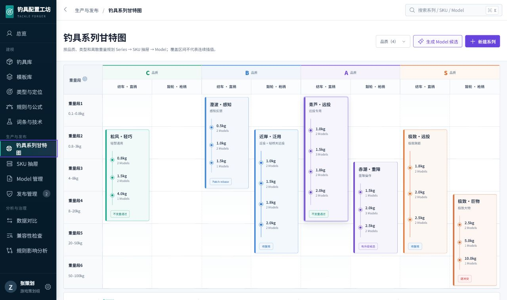
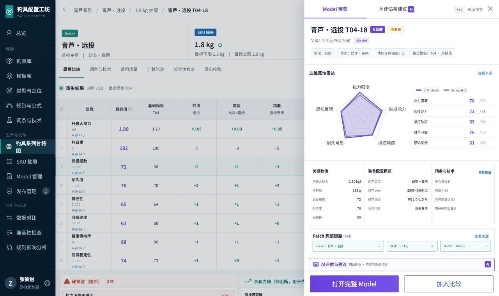
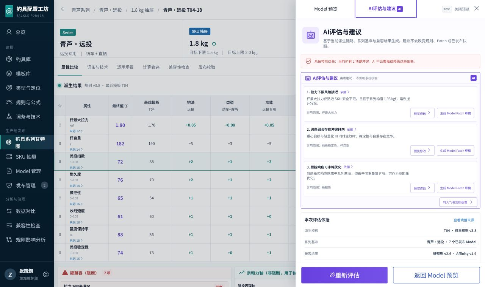
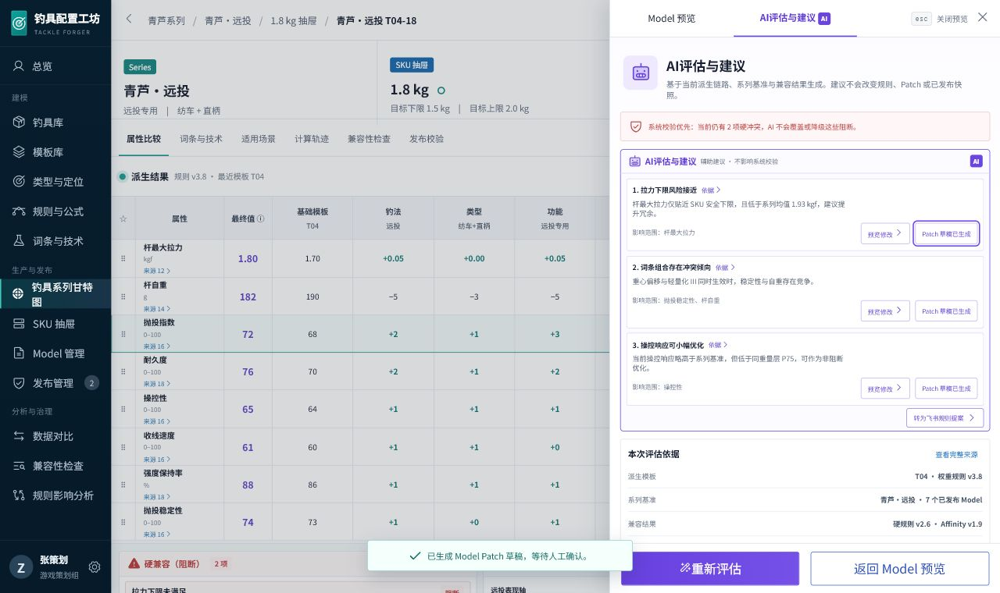
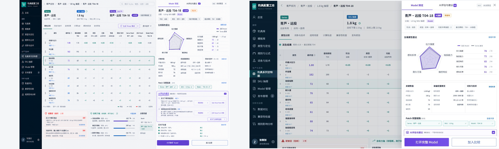
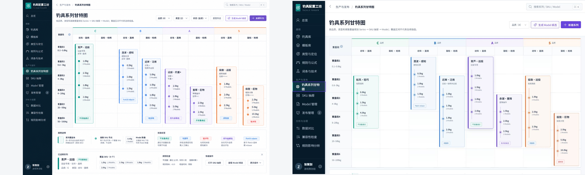

# Tackle Forger 产品设计完成审查（2026-07-20）

> 结论：产品设计交付通过，可作为开发依据。  
> 审查对象：v3 领域规范、开发 Handoff、产品设计完成交付、当前 React 原型。  
> 证据原则：视觉与交互结论只使用本次重新构建、重新捕获的截图；后端冻结、权限、飞书和配置校验属于正式实现验收，不由截图代替。

## 1. 本轮审查结果

| 检查项 | 结果 | 证据 |
| --- | --- | --- |
| 当前原型构建 | 通过 | Vite production build 成功；仅有 bundle size 提示 |
| 甘特图视觉方向 | 通过 | 纵向重量分段、横向品质/Type、Series 覆盖块、离散 SKU 节点均成立 |
| Series → SKU → Model | 通过 | Series 选择、显式“打开 SKU 抽屉”、Model 右侧层可走通 |
| Model 预览 | 通过 | 身份、来源矩阵、五维、硬兼容、Affinity、不变量分区清楚 |
| AI 护栏 | 通过 | AI 与 Model 共用右侧层，明确“系统校验优先” |
| AI → Model Patch 草稿反馈 | 通过 | 点击后显示“等待人工确认”，未自动应用或发布 |
| 浏览器控制台 | 通过 | 本轮主路径 warning/error 为 0 |
| v3 自洽性 | 通过（已修订） | 清理旧横向重量轴、五维轴写死、AI 可建 Series/SKU Patch 三处冲突 |
| 开发无猜测契约 | 通过 | `tackle-forger-product-design-completion-v3.md` 补齐页面、状态、动作、恢复、权限和验收 |
| 开放决策保护 | 通过 | 五维、Patch 阈值、AI 策略、职责分离、会签等仍保持版本化 |

## 2. 当前截图

### 甘特图

### Model 预览

### AI 评估与建议

### AI 生成 Model Patch 草稿反馈

## 3. 同屏视觉对照

对照图左侧为选定视觉目标，右侧为本轮重新构建的当前实现。

可见结论：

- 高密度驾驶舱、深色导航、浅色数据面、紫/青/红语义分层保持一致。
- 甘特图已采用最终的“纵向重量段 × 横向品质/Type”方向，没有回退为时间轴或横向重量轴。
- Model 工作台保持三层身份、来源矩阵和共享右侧层。
- 默认 1280px 宽度下主矩阵会被右侧层遮罩并保留上下文，这是推入层的既定交互；完整属性通过关闭层或“打开完整 Model”查看。
- 当前原型只演示主路径，不把候选结果、rebase、发布、配置交付和权限错误伪装为已实现页面；这些流程以正式交互契约约束开发。

## 4. 截图无法替代的正式验收

以下事项已经完成产品设计，但必须在后端/集成实现中验证：

- CandidateRun 幂等、superseded、排除统计和审计留存；
- Trace 重放 hash；
- 五维定义、顶点 hash、双模式比较和缺值状态；
- Patch rebase 与 UpgradeCandidate 状态机；
- ConfigurationSnapshot 数据库不可变和发布并发；
- 飞书登录、提案幂等、审批策略和失败恢复；
- 多 ExportProfile、本机 companion/服务器挂载与 TOML 关联校验；
- 对象级权限、聚合防泄露、职责分离；
- 200%/400% 缩放、键盘、读屏和真实大数据性能。

这些不是“待补产品决定”，而是开发验收项；其数据、交互、失败恢复和权限契约已在 v3 与产品设计完成交付中给出。

## 5. 完成结论

产品设计现在形成三层闭环：

1. `tackle-forger-development-spec-v3.md`：唯一领域权威。
2. `tackle-forger-product-design-completion-v3.md`：开发可执行的页面与交互契约。
3. `prototype-v1`：核心视觉和主路径参照。

开发 Agent 不需要从视觉稿猜测对象身份、状态组合、动作权限、AI 边界、错误恢复或 Snapshot 冻结语义。
