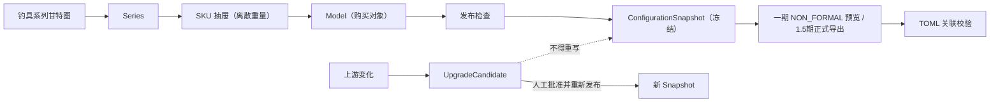

# Tackle Forger 产品设计完成交付 v3

> 状态：开发可执行  
> 领域权威：`docs/tackle-forger-development-spec-v3.md`  
> 交互权威：本文；不得改变 v3 领域语义  
> 视觉方向：`docs/ux/tackle-forger-ux-design-v1.md` 与 `docs/ux/prototype-v1/`  
> 审查日期：2026-07-20
> 最后对齐v3：2026-07-23

## 0. 核心边界

**“钓具系列甘特图”是界面心智模型，不是新增领域实体；“AI评估与建议”是带证据的辅助层，不是新的规则裁决层。**

固定语义：有限结构标杆只由基础拉力模板×Method×Type×FunctionProfile组成；在相同身份内按拉力比例距离取最近且不插值，Affinity不参与匹配；`functionIntensity`、Performance、Material、Quality和词条均在匹配后处理；C/绿、B/蓝、A/紫、S/橙；SKU是抽屉，Model是实际选择/购买对象；Technology不重复叠加成员属性；被动只保存、计分、展示；已发布Snapshot永不被静默替换。

部位边界：现有Series/SKU/Model、目标拉力、甘特图和候选生成只处理竿、轮、线。钩、漂、真饵和拟饵当前完全延期；产品界面不提供注册表只读入口、“未启用”占位、草稿、生成、发布或导出动作。历史Payload只在注册表、迁移和审计层保留，未来启用必须先建立独立产品设计Issue。



## 1. 页面与全局交互

| 一级入口 | 主对象 | 主任务 |
| --- | --- | --- |
| 钓具系列甘特图 | Series、SKU 摘要 | 查询、规划、下钻 |
| SKU 抽屉 | SKU、Model 列表 | 管理一个离散重量下的 Model |
| Model 管理 | Model Revision | 属性、Trace、兼容、五维、Patch |
| 发布管理 | Model、SnapshotBuild | 发布检查、冻结、升级候选 |
| 配置表交付 | SnapshotBatch、环境×渠道目标 | 一期NON_FORMAL预览；1.5期正式包/写入与关联校验 |

采用高密度数据驾驶舱。左侧稳定一级导航；顶部面包屑与全局搜索；主区优先矩阵、表格和差异；右侧 520–640px 推入层按“1 常用概览 → 2 五维与适配 → 3 来源与版本”渐进披露，并保留独立的“Patch / Rebase”和“AI评估与建议”入口。常用概览默认展示对象身份、离散目标拉力、调性/硬度、长度、发布/冻结面、品质定价和四套独立裁决；五维层才展开钓组匹配与多装备比较两个视图；来源层展示完整Trace。所有写按钮消费后端 `ActionAvailability`，前端不从角色、颜色或状态猜动作。

## 2. 钓具系列甘特图

查询直接使用 v3 `SeriesGanttQuery`：

- 同字段 OR、不同字段 AND；文本只搜索当前工作区内服务端返回的ID、名称和别名。当前统一Capability策略不做当前工作区内的对象级过滤。
- 支持Collection、Method、Type、品质、功能、部位、生命周期、注意状态、Issue、升级候选、精确targetPullKg、RuleSetVersion；部位筛选只返回当前主流程的竿、轮、线，不展示钩、漂、真饵或拟饵占位。
- 筛选和排序写入 URL；刷新保留滚动和选择。对象已删除或路由过期时，只能在当前工作区内回到服务端返回的稳定父链；引用不属于当前工作区时进入不可用/错误状态，不返回或渲染其父链，并显示明确原因。
- 纵轴是版本化重量分段；横轴先按 C/B/A/S，再按启用 Type。
- Series 覆盖块只连接真实离散 SKU 节点。固定提示：**覆盖范围只表达系列规划跨度，不代表连续插值。**
- 点击 Series 只更新底部摘要；点击 SKU 只进入 SKU 上下文；只有点击 Model 行才打开右侧预览。单 Model 也不得跳级。
- 展开 Series 后 SKU 按精确重量升序；展开 SKU 后 Model 使用服务端游标。
- 聚合返回直接生命周期、全部注意状态、后代计数、Model总数、硬阻断、warning和升级候选；当前策略不因对象权限隐藏总数或改写为“可见数”。
- 主状态优先级：硬冲突 > rebase > 待复核 > warning > 待发布 > 升级候选 > 已发布 > 草稿；副状态与计数保留。
- 矩阵空白和重量分段不创建 SKU；只能通过“添加重量规格”输入精确重量并预览最近模板。

## 3. 稳定身份、面包屑和权限

正式路由与命令必须携带 `EntityRef { workspaceId, entityType, entityId, revisionId }`，`revisionId`不得省略；仅搜索建议、未解析外部链接等非命令输入可以暂时没有Revision，但必须先解析成完整`EntityRef`才可执行动作。ID 终身稳定、不复用；重命名和更换默认 Model 不改 ID。SKU重量变更遵循条件化身份规则：没有任何已发布后代Snapshot时保留skuId并创建新revision；已有已发布后代时旧SKU的`targetPullKg`冻结，新重量创建新SKU，旧SKU可废弃。父链固定：

```text
Collection（可缺省） → Series → SKU 抽屉 → Model → 冻结快照
```

SKU 显示“精确重量 + SKU 抽屉”；Model 显示型号并标明“实际选择/购买对象”；Snapshot 显示版本、冻结时间和 hash。已登录用户打开当前工作区内可解析对象的深链接时返回完整稳定父链，不渲染脱敏父级占位或部分谱系披露；跨工作区引用必须拒绝且不得返回父链。read/edit/review/publish分别消费服务端`ActionAvailability`，按钮显示disabledReason和requiredCapabilities；动作只受功能开关、当前已启用Capability、领域Gate、revision与Manifest等契约约束。按`separation-of-duties/open009-v1`，一期、1.5期、二期和当前规划三期均由服务端返回全员统一的已启用Capability，不建设职责分离或对象级RBAC；未来只能通过新策略版本及同步修订的R1/R2契约改变权限分配，不得由页面角色判断。

## 4. 生成 Model 候选

入口位于 Series/SKU 上下文，不是一级实体。生成前确认：

- Series、SKU精确targetPullKg、最近结构标杆；
- CandidateSearchRecipe/Revision、RuleSetVersion、Patch Revision；
- 搜索空间、启用modelVariantKey、每SKU数量、最低Affinity、warning接受、排序版本、截断；
- 明示“硬 deny/缺 require 会被排除，Affinity 只排序”。

结果按 SKU 分组、组内使用后端稳定 rank；前端和 AI 不得二次改序。候选展示 fingerprint、rankReasons、模板距离、硬兼容、Affinity 分轴、不变量偏离、warning 和 Trace。顶部展示枚举总数、合法数、排除分组、截断、输入 hash、耗时。

默认对每个`SKU × enabledModelVariantKey`自动物化排名最高的合法候选：唯一命中旧Model时创建新revision，无命中新建Model，多重/歧义命中则跳过并报Issue，内容不变不创建空revision。用户通过范围、路线、数量、阈值或REVIEW_ON_CHANGE限制批量行为，也可显式改选/放弃。候选run保留审计；“放弃本次结果”不删除Series/SKU/Model/Trace。运行中Revision改变则superseded；失败或超时按requestId/idempotencyKey恢复。同输入、规则和算法必须同序，不使用常规random seed。

## 5. 属性来源 Trace

前端只消费内核产生的 `CalculationTraceEntry`。每步必须显示 subjectRef、parameterKey、sequence、layer、sourceRef、sourceVersion、ruleSetVersion、before、operation、operand、after、unit、effect、warningIssueIds、ActionLink、inputHash/outputHash。

属性矩阵展示来源层摘要；“来源 N”打开按 sequence 排列的 Trace。公式展开 formulaId/version 和结构化操作数；no_effect 显示“本层无贡献”，不得伪造 +0；Technology 只展示成员 Affix 的贡献。warning 跳统一 Issue。Snapshot Trace 只读；重放 hash 不符产生 `TRACE_REPLAY_MISMATCH` 并阻止发布。

## 6. 可配置五维图

前端只消费符合`five-axis/open005-2026-07-23/v1`的版本化`FiveAxisViewDefinition`。正式五轴及顺序固定为拉力、耐久、抛投、感度、操控，但axisId、输入、变换、W重量段、顶点、缺值、档位和比较策略仍由发布定义提供，页面不得复制公式。图旁显示definition/version、fiveAxisRuleVersion、`modelFinalPullKg`、weightBandId/policyVersion、vertexSetHash、`projectionReferenceSelectorVersion`、`projectionReferenceSetHash`、刻度和“查看来源”。定义、W段或vertex hash不同的曲线不得叠加。

右侧层提供两个视图：

1. **钓组匹配**：当前Model的Rod/Reel/Line三条单件曲线同图，共享Model最终拉力命中的W段；不生成Model最弱环节汇总线。可开关显示竿、轮、线三条Series结构投影参考线。
2. **多装备比较**：比较篮中2–5件竿、轮、线可混合部位，共用用户可见、可切换的一个W段；上限由当前定义实例配置且服务端强制。

“加入比较”写入页面级比较篮，不因混合部位阻止。轮/线按稳定比较顺序继承第一根竿的抛投并显示`context_inherited`提示，不参与排名；无竿时为`not_applicable`，不得补0。拉力、耐久、抛投使用直接比例，感度、操控使用反向比例；`officialDisplayScore`封顶100，`comparisonScore`不封顶并按真实比例伸出100分外圈，绘图区不得裁切。

Series基准只允许`projection_reference`。Model/钓组视图从当前Snapshot冻结的SKU revision按`projection-reference/current-sku-frozen-match/v1`逐部位唯一读取ProjectionMatch；必须显示基准Snapshot、SKU revision、选择器版本、projectionMatch/projection ID与revision、逐部位`available/missing/error`状态和理由。同Series其他SKU、默认SKU、查询第一项、同W段其他投影及页面上下文均不得作为回退。独立多装备比较未显式选择`baselineSnapshotId`时不显示Series参考线；选择后锚点保持稳定，共同W段变化不改锚点。

旧`PUBLISHED`五维定义及其Snapshot只读展示并标记“历史定义”；新正式Snapshot只接受唯一`FORMAL_CURRENT`定义。若当前只有legacy定义，发布动作禁用并显示`FIVE_AXIS_FORMAL_DEFINITION_UNAVAILABLE`，不得以旧种子预览冒充正式结果。

状态：direct 实线；context_inherited 虚线/链接标；not_applicable 不画 0；missing 显示补齐动作；error 阻断且不画 0。雷达图下必须有原始值、归一化比值、正式分、comparisonScore、overflow、相对差、来源状态和 Trace 的数值表。

## 7. AI 评估与建议

`AIRecommendation` 卡片至少显示 recommendationId/assessmentId、scopeRefs、标题摘要、EvidenceRef、assumptions、未覆盖信息、影响属性 before/proposedAfter、建议动作、generatedAt、inputHash、RuleSetVersion、fiveAxisRuleVersion、提示模板和模型记录策略、fresh/stale 状态。

固定护栏：**辅助建议 · 不影响系统校验**。硬兼容、Affinity、系列不变量、AI建议是四个独立区块。AI只允许`preview_only`、`create_model_patch_draft`、`create_rule_source_change_draft`。

### 7.1 转 Model Patch 草稿

1. 确认目标 Model ID/Revision 和建议中的属性子集；不能改成 Series/SKU Patch。
2. 展示 before、operation/operand、确定性 after、五维/Issue/Affinity/不变量差异。
3. 必填人工理由；保存 draft，记录 AI 来源、创建人和人工改动，再走正常审核。

recommendation stale、Model 变化、已有未决 set、非法 operation、目标冻结时禁用并提供刷新/rebase/复制新 Revision。保存失败保留表单与幂等键。

### 7.2 转飞书规则修改草稿

AI只创建`RuleSourceChangeDraft(LOCAL_DRAFT)`。人工确认稳定规则ID/参数键/sourceRevision、变更、证据、跨Series/SKU/Model影响、新增/解决error、样例差异、预计UpgradeCandidate和覆盖率。固定`publishedSnapshotsChanged = 0`。

sourceRevision变化进入NEEDS_REBASE，显示旧值/远端新值/草稿值。人工确认写回后必须技术回读；写回成功只进入REMOTE_CHANGES_AVAILABLE。用户再显式拉取、校验和发布RuleSetVersion。AI不得确认写回、拉取或发布。一期、1.5期、二期和当前规划三期均不接飞书审批或职责分离；未来治理变化必须发布新策略版本。

## 8. ValidationIssue 与 ActionLink

| 来源 | Severity/Gate语义 | 典型动作 |
| --- | --- | --- |
| hard_compatibility | deny/缺require为不可waive的BLOCKER，命中Gate必阻断 | 满足require、改Patch/规则 |
| affinity | INFO/WARNING且`gate=NONE/REVIEW`，不抵消硬规则 | 查看分轴、优化候选、确认理由 |
| series_invariant | 按不变量规则返回BLOCKER或ERROR | 恢复不变量；只有策略允许的ERROR显示申请例外 |
| patch/publish/export | Severity与Gate独立 | rebase、重算、确认warning、重试、按策略申请waiver |
| ai_guardrail | 不裁决规则 | 查看证据、重新评估 |

页面先按Gate分区，再按`BLOCKER > ERROR > WARNING > INFO`排序。`BLOCKER`表示继续执行会产生不可信产物，永远不可waive；`ERROR`在OPEN状态阻断命中的Gate，默认不可waive，仅当服务端依据版本化`WaiverPolicyVersion`返回有效动作时显示申请入口；`WARNING`使用`ACKNOWLEDGED`记录理由，不得显示为waiver；`INFO`只解释。`REVIEW`约束批准及下游发布，`PUBLISH`约束新Snapshot，`EXPORT`只约束命中的环境×渠道目标。

Issue 展示 code、title、message、影响对象/属性、证据、状态和 ActionLink。fingerprint 用于重算去重；已解决或过期仍保留审计。Waiver单独展示policy版本、范围、批准人、理由和有效期，并冻结到相关证据；硬deny、缺require、Snapshot/Trace完整性、必需版本缺失和配置断链不提供waive。可执行ActionLink复用统一ActionCode；缺Capability、职责分离不允许、Revision过期或Manifest stale时显示disabledReason且不携带命令payload。启用的写动作使用服务端绑定action、subject、expected revision和hash的payload引用；执行前后端再次鉴权和重验，前端不得自行拼接或改写payload。

## 9. Rebase、UpgradeCandidate 与 Snapshot

Patch编辑器只提供`set/add/multiply/clear`；`clear`文案为“清除本层覆盖并恢复继承值”，不能写成删除对象或设null。旧remove只在迁移详情中显示“已转换为clear”；min/max只出现在模板/通用规则编辑器，旧Patch规范化为set时必须同时展示原边界意图、冻结基底和before/after。页面分别展示Patch业务状态、镜像同步状态和ORPHANED等注意状态，不用一个“状态”徽标混合表达。

Rebase 同屏显示旧基础、新基础、现有Patch、预计结果、冲突原因、Issue。set基线变化、参数删除/重命名、边界/公式/兼容变化必须人工rebase；clear仅在目标仍是可继承覆盖时可重放，目标删除、重命名或必填性变化时必须rebase；add/multiply可自动重放，但最多回到pending_review。rebase生成新Patch Revision。

UpgradeCandidate 只描述“升级会怎样”。批准不改变旧 Snapshot；显式发布才创建新 Snapshot。

冻结 Snapshot 可查看、导出、审计、复制新 Revision、生成升级候选；不可原地编辑、重算、rebase、换 hash、删除引用、被 AI 或上游覆盖。失败 SnapshotBuild 可幂等重试，不产生半快照。

## 10. 状态与文案

| 后端码 | 文案 | 类型 |
| --- | --- | --- |
| ACTIVE | 有效 | lifecycle |
| DEPRECATED | 已废弃 | lifecycle |
| ARCHIVED | 已归档 | lifecycle |
| DRAFT | 草稿 | revision |
| PENDING_REVIEW | 待复核 | revision |
| CHANGES_REQUESTED | 需修改 | revision |
| APPROVED | 已批准 | revision |
| READY_TO_PUBLISH | 待发布 | publication |
| PUBLISHED | 已发布 | publication |
| PUBLISH_FAILED | 发布失败 | publication |
| REBASE_REQUIRED | Patch 需要 rebase | attention |
| HAS_UPGRADE_CANDIDATE | 有升级候选 | attention |
| SOURCE_STALE | 规则源已过期 | attention |
| IMPORT_CONFLICT | 导入冲突 | attention |
| EXPORT_RELATION_BROKEN | 配置关联断裂 | attention |
| HARD_CONFLICT | 硬冲突 | derived primary |
| REVIEW_REQUIRED | 待复核 | derived primary |
| WARNING | 有警告 | validation / derived primary |

前端同时接收Lifecycle、Revision、Validation、Publication、Attention[]和Primary。“已发布 + 有升级候选”同时显示；Primary只决定主标签。未知码显示未知状态并只读降级。“已冻结”仅属于Snapshot。文案不决定权限。

## 11. 内网、登录和配置表交付

部署在公司内网 Dell R730。飞书登录建立公司会话；令牌/密钥不得进入前端日志、AI 输入或导出。一期使用统一公司Capability策略且AI禁用；1.5期只扩展正式配置治理与本地导出，权限策略不变；二期只有OPEN-006关闭后才启用AI；当前规划三期继续统一权限，不建设细粒度RBAC、职责分离或飞书审批。关键共享写入显示锁持有人和动作；服务端可达副作用使用fenced outbox，浏览器本地配置写入不进入outbox。租约失效后旧token不能提交成功证据，本地目标显示“外部文件冲突/需要恢复”，引导重新授权、逐文件回读并按Manifest恢复。登录失败提供重试、错误编号、管理员入口；会话过期保留表单，重登后重验 Revision。

配置表交付按阶段分层：一期只能生成`NON_FORMAL`预览，数字ID和正式name为空，使用不可进入生产schema的符号引用，不生成`tackle.xlsx/item.xlsx/store.xlsx`生产文件名，也不能人工搬运或提交。1.5期在正式Bundle、权威`ConfigTargetCatalogVersion`和新鲜获批`ConfigTargetScanManifest`齐备后，才进入以下两步：

1. 先通过SnapshotBatch一次确认多个Model：复用未变化Snapshot、为合格revision新建Snapshot、跳过阻断项。再选择一个或多个已进入权威目标目录的环境×渠道；1001固定写入各环境的`xlsx`，其他渠道由用户显式选择目录。目录句柄保存在浏览器IndexedDB，服务端不保存绝对路径。固定导出tackle/item/GoodsBasic/StoreBuy；先预览新增/修改、主键冲突和格式变化，再逐目标确认。正式写入只读取冻结Snapshot，并使用恢复型写入策略。
2. 读取该环境根`config.toml`的tables、workbook/sheet、enums；强制增量校验本次变更及其引用闭包。每个断链生成`ValidationIssue(gate=EXPORT)`，带环境、渠道、文件、sheet、Excel行、字段、原值、目标表、规则和动作。全库检查由用户主动触发。

一个目标失败不伪装全成功；默认继续写入其他合格目标，失败项保留预览和恢复Manifest。工具不读取`config_system.toml`，不执行Git命令。StoreBuy新增`enabled`上架开关：新行默认false，更新普通属性保留目标原值。

策略发布、每次ID预留和每次1.5期正式导出前都重新比较authoritative ref、commit、`config.toml`和workbook hashes与获批Manifest；导出还检查本地worktree HEAD与文件基线。任何漂移显示`CONFIG_TARGET_SCAN_MANIFEST_STALE`，禁用预留/正式导出动作并引导重新扫描、复核和发布策略。预留动作同时绑定Model expected revision；并发改key时显示`MODEL_REVISION_CONFLICT`且不消耗ID。

价值分自动定价的未决源表项统一登记为v3 `OPEN-007`。主飞书工作簿revision `2869`中，`07_品质评分/FqD4j7`已提供品质区间、Quality→PricingBasket映射和价格系数区间，`08_价格计算/u87sRh`已提供评分线性插值、重量段查表、零整比、金币和三位有效数字向下取整。当前精确阻断项是：`QUALITY_SCORE_BOUNDARY_CONFLICT`（S品质100分边界）、`QUALITY_SCORE_SOURCE_MISSING`（性能评分来源），以及缺少`roundingStage`、`minimumPriceScope`和`overflowMode`。界面可展示带`NON_FORMAL`标记的价格试算、来源revision和逐步Trace；上述Issue未解决时，新PricingPolicyVersion、依赖它的Model发布、Snapshot和Store导出均必须精确阻断，不提供手填价格兜底。

## 12. 六面验收矩阵

| 编号 | 正常 | 边界 | 冲突 | 恢复 | 权限 | Given/When/Then |
| --- | --- | --- | --- | --- | --- | --- |
| R1 甘特图 | 筛选→Series→SKU→Model | 单/无 SKU | 游标 ETag 失效 | 保留筛选退父级 | 聚合不泄露 | G 1.5/1.8 同模板，W 展开，T 两个独立 SKU |
| R2 身份 | 稳定父链 | 无 Collection/多 Snapshot | 父链不一致 | 审计迁移 | 权限逐动作 | G Model 只读，W 深链，T 写动作给原因 |
| R3 候选 | 冻结输入→自动物化 | 0结果/截断 | Revision变化/歧义对应 | requestId恢复/重跑 | generate/materialize分离 | G高Affinity命中deny，W完成，T只进排除 |
| R4 Trace | 完整顺序来源 | 非数值/no_effect | hash 不符 | 同版本重放 | 来源可脱敏 | G 多层修改，W 查来源，T 显示 before/op/operand/after |
| R5 五维 | 共享定义叠加 | 无基准/不适用 | hash 不同 | 选基准/重算 | 基准与定义发布分离 | G 基准失效，W 预览，T 不静默换基准 |
| R6 AI | 带证据建议 | 证据不足 | 与硬校验冲突 | 重评，旧建议只读 | evaluate/draft 分离 | G AI 要降硬冲突，W 展示，T 冲突不变 |
| R7 AI→Patch | 确认差异建 draft | 部分参数移除 | Model 已变/未决 set | 保留表单并刷新 | create/review 分离 | G Revision 变化，W 创建，T 阻止旧 before |
| R8 AI→飞书 | 草稿→影响→人工确认写回→回读→显式拉取 | 覆盖率不足 | sourceRevision变 | 幂等回读/重试 | AI草稿、写回、拉取、发布分离 | G超时但已写入，W回读恢复，T不重复 |
| R9 Issue | 分区并执行动作 | 一根因多对象 | 互斥动作 | retry/recompute | 可看不等于可修 | G deny/Affinity/不变量并存，W 返回，T 不互抵 |
| R10 冻结 | rebase→新快照 | 语义相同 | 基线再变 | 复制到最新候选 | rebase/review/publish 分离 | G S1 已发布，W 批准升级，T S1 不变 |
| R11 状态 | 三组状态映射 | 未知码只读 | 非法组合 | 重同步/审计 | 文案不授权 | G PUBLISHED+UPGRADE，W 渲染，T 两标签并存 |
| R12 开放配置 | 已发布策略驱动 | 配置缺失 | 草稿混正式 | 回有效版本 | 策略三权分离 | G 阈值未确认，W 实现，T 从配置读取 |
| R13 导出 | 一期NON_FORMAL；1.5期多profile→校验 | 未登记目标/只读profile | Manifest stale、Model revision、主键/TOML断链 | 重扫复核/保留结果重跑 | preview/commit及ID治理动作分离 | G ref推进或并发改key，W预留/导出，T禁用且不消耗ID/不落盘 |
| R14 登录 | 飞书会话 | AI 关闭 | 会话过期 | 重登并重验 | 一期仍返回 capability | G 会话过期，W 重登，T 表单保留且重验 |

## 13. 保持开放、不得固化

本界面只消费v3第20节的唯一未决事项登记表：OPEN-001降低型叠加、OPEN-002未来Performance扩展、OPEN-003扩展部位、OPEN-004 Patch偏移阈值、OPEN-005五维定义、OPEN-006 AI供应方与出网、OPEN-007定价源表、OPEN-008 ConfigIdPolicy和OPEN-010飞书Patch台账远端契约。未决值全部通过版本化策略或明确禁用态表达。OPEN-003的产品方向已经确认“当前完全延期”，但尚无可校验的已发布`enabledItemPartPolicy`，所以继续保持`DEFERRED_UI_DISABLED`；这不是等待UI选择批次，页面不得为钩、漂、真饵或拟饵提供入口或占位。OPEN-009已经解决，界面必须消费`open009-2026-07-23-v1`及其引用的批量刷新、记录、复核和职责分离策略版本，不再显示“治理待确认”。

TOML枚举引用不是开放项：当前编译器契约已确定使用可读`configNameKey/name`解析到唯一数字ID，页面不得提供“按ID或name任选”的产品开关。Snapshot冻结语义也不是配置项，改变它必须先获得用户明确确认并修订v3。

## 14. 开发顺序

1. EntityRef、Revision、Capability、ActionAvailability、审计。
2. Projection、Patch、Trace、ValidationIssue、硬兼容、Affinity。
3. Series/SKU/Model 查询与甘特图。
4. 候选生成、稳定排序、默认自动物化与批量限制。
5. 五维通用内核与三种视图。
6. Rebase、UpgradeCandidate、发布证据、冻结 Snapshot。
7. 一期NON_FORMAL预览与TOML结构校验；1.5期目标目录/Manifest、ID ledger、正式多ExportProfile交付。
8. 二期AIRecommendation、Model Patch草稿、RuleSourceChangeDraft。
9. 三期继续统一Capability策略；只实现既定业务能力。未来若改变权限或审批治理，另建Issue并发布新策略版本，不预建细粒度RBAC或职责分离。

每个工作包同时交付：正常、边界、冲突、恢复、权限、Given/When/Then；领域测试、API 契约测试、前端状态测试、冻结回归和失败恢复测试。
