# Tackle Forger UX / UE 设计 v1

> 阶段：已完成——体验审查、系统设计、方向定稿、交互原型、开发 Handoff 与最终 Audit  
> 日期：2026-07-20  
> 最后对齐v3：2026-07-23
> 设计基准：桌面端 1440 × 1024，中文优先  
> 面向对象：游戏策划、规则维护、发布核验、数据维护、只读复盘与后续开发 Agent
> 权威依据：docs/tackle-forger-development-spec-v3.md  
> 状态：UX 设计完成；开发 Agent 可按本文、v3 规范与逐页面验收标准进入实现

## 0. 设计结论摘要

Tackle Forger 应从“实体表格集合”重组为一条可解释、可局部修订、可冻结发布的配置生产链：

重量基础模板 → 钓法规则 → 类型规则 → 功能定位 → 最近结构标杆匹配 → functionIntensity → 材料、Patch与词条/Technology结算 → Series → SKU 抽屉 → Model → PerformanceSummary只读派生 → ConfigurationSnapshot。

性能定位是配置完成后根据Technology、词条与最终属性统计得到的只读结果，例如“抛投+、重量-、竿度+”。它不是配置输入、独立属性贡献层或价值分乘数，不进入候选搜索、结构标杆、兼容、Affinity或定价。

第一阶段的核心设计结论：

1. 主导航按任务工作区组织，不按每个领域实体机械拆页。
2. Series、SKU 抽屉、Model 必须始终使用稳定且不同的身份标签；只有 Model 是实际选择和购买对象。
3. “最终值”旁必须有统一的属性来源入口，逐层展示来源版本、before、operation、operand、after、警告和下一步。
4. 所有编辑动作先选择作用域并预览影响：通用规则修改草稿、Series Patch、SKU Patch、Model Patch、FinalReview Patch。
5. 硬兼容与 Affinity 是两套界面语义：前者决定能否生成或发布，后者只做软适配、排序与解释。
6. 发布页不是确认弹窗，而是完整证据包：版本、公式、Patch 链、兼容、系列不变量、差异、确认项和冻结结果。
7. 上游变化只产生 UpgradeCandidate；历史 Snapshot 永远保持只读、可复现、不可被静默替换。
8. 降低型公式保持配置化；Patch按已决的最终范围与整体复核策略执行，不再引入独立偏移阈值；性能摘要只消费版本化统计定义，不在UX中恢复为可编辑输入；扩展部位已确认当前完全延期，UX不提供钩、漂、真饵或拟饵入口、“未启用”占位或启用开关。

---

## 1. 现有体验审查

### 1.1 审查范围与方法

- 产品表面：当前本地 Tackle Forger 工作台。
- 核心任务：从规则与模板出发，形成系列、候选配置并尝试发布。
- 证据来源：本次审查在 1440 × 1024 视口重新构建并运行当前工作区，逐页截取当前状态；未使用旧截图代替本次证据。
- 覆盖页面：总览、重量模板、规则图执行、系列配方、候选池与计算轨迹、数据交换。
- 证据限制：当前种子状态没有正式 SKU，无法从现有 UI 实走“已发布快照 → 升级候选”完整链路；键盘、读屏、缩放与真实飞书权限仍需第二阶段实测。

### 1.2 审查步骤与健康度

#### 步骤 1：进入总览——健康度：需重构

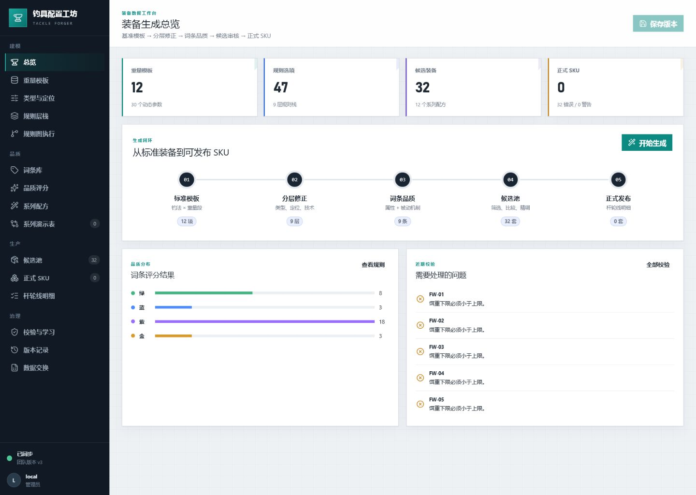

优点：

- 左侧导航稳定，工作台整体视觉克制，适合长时间桌面操作。
- 首页能快速看到模板、规则选项、候选和发布数量。
- 已有“生成闭环”的过程意识。

主要问题：

- 流程仍写成“候选审核 → 正式 SKU”，与 v3 的“SKU 是抽屉、Model 才是购买对象”冲突。
- “品质分布”仍出现“金”，与 S/橙固定映射冲突。
- 首页只汇总数量，没有按“阻断 / 待复核 / Patch 需 rebase / 升级候选”组织工作。
- 总览显示 0 错误 / 0 警告，但下方实际存在多条问题，反馈口径不一致，削弱信任。

#### 步骤 2：编辑重量模板——健康度：可用但高风险

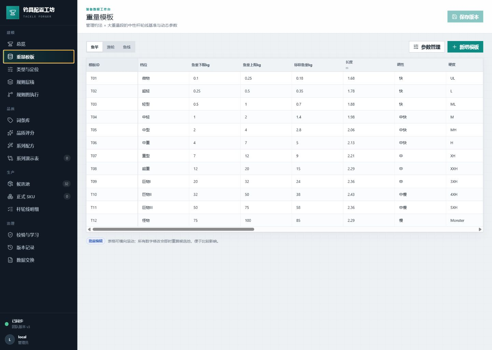

优点：

- 高密度横向表格适合批量维护数值。
- 鱼竿、渔轮、鱼线分组清晰，参数单位出现在表头。

主要问题：

- `[UX-001]`表格默认看起来像只读数据，但单元格实际可直接修改，编辑意图、待保存状态和撤销方式不明显。
- 修改模板会即时重算候选，却没有在动作前展示影响哪些 Series、SKU、Model 或升级候选。
- 没有“草稿规则版本”与“已发布规则版本”的明显边界。
- 当前页面缺少导入校验的逐行错误、单位冲突、范围冲突和恢复入口。
- 最近模板匹配依据不在此处可见，策划无法验证离散重量如何命中模板。

#### 步骤 3：编排规则图——健康度：局部强、概念错位

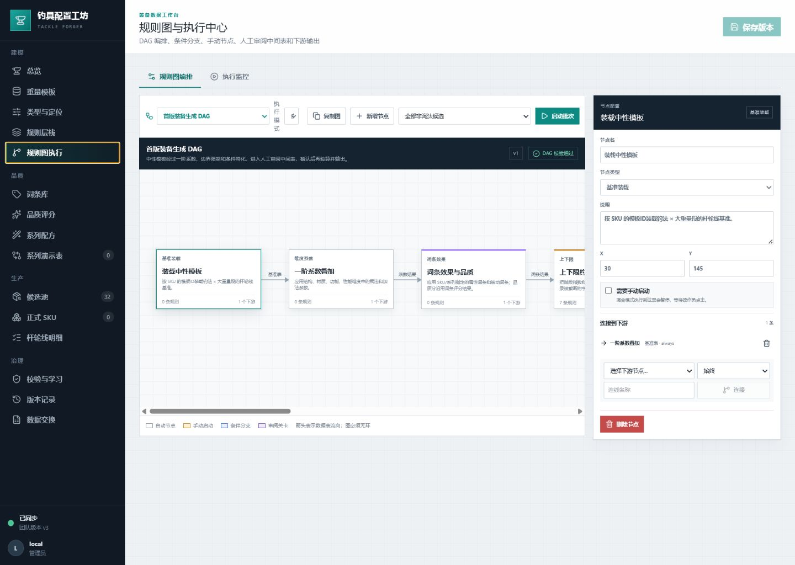

优点：

- 已有可视化规则执行、人工关卡、条件分支和节点检查器。
- 图与右侧检查器的组合适合复杂规则维护。

主要问题：

- 图更像通用 DAG 编辑器，尚未把 v3 的固定领域层明确表达为“钓法层”和“类型层”两条独立轨迹。
- 节点画布横向滚动且大部分阶段不可见，缺少流程缩略图、当前作用域和影响范围。
- “词条效果与品质”容易继续强化“品质与词条计算混在同一层”的误解。
- 没有区分硬兼容节点与 Affinity 评分轴，可能让用户把“可生成”和“适配度”混为一谈。
- 删除节点是高风险动作，但当前检查器缺少依赖影响、替代路径和版本保护提示。

#### 步骤 4：维护“系列 / SKU 配方”——健康度：领域语义阻断

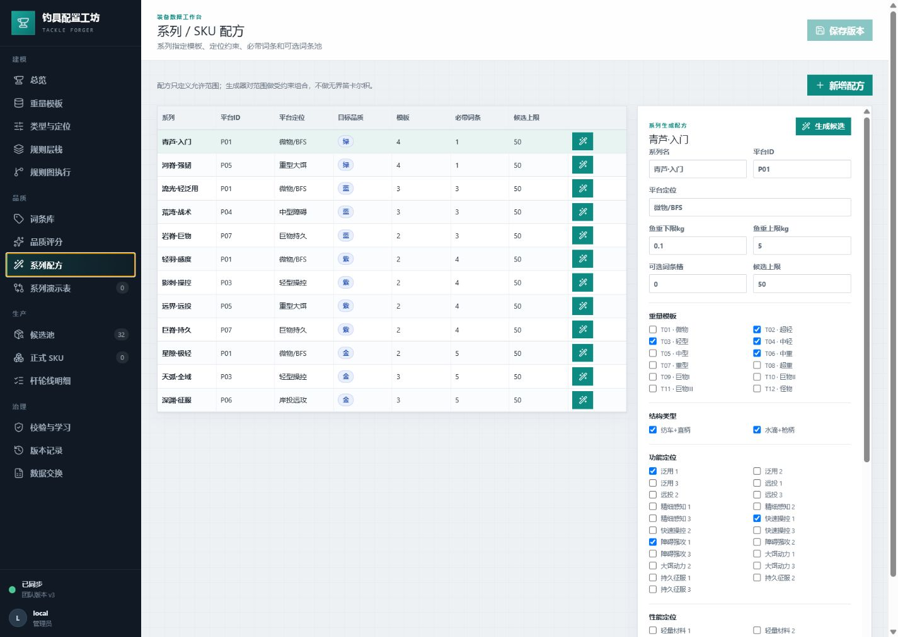

优点：

- 列表 + 右侧检查器适合快速切换对象。
- 已能设置模板、结构、功能、性能和词条约束。

主要问题：

- 页面把 CandidateSearchRecipe 作为产品 Series 使用，无法承载严格系列不变量。
- 页面标题把 Series 和 SKU 合在一起，但没有真实 SKU 抽屉，也没有抽屉下多个 Model 的关系。
- 大量复选框平铺导致功能专精强度、性能方向、技术与词条难以理解，缺少互斥、依赖和来源说明。
- “生成候选”是主动作，但用户不知道生成范围、硬兼容排除数、预计 Model 数量或计算成本。
- 仍显示“金”品质；技术与词条缺少展开成员和重复贡献防护。

#### 步骤 5：检查候选与计算轨迹——健康度：有基础，缺少可执行解释

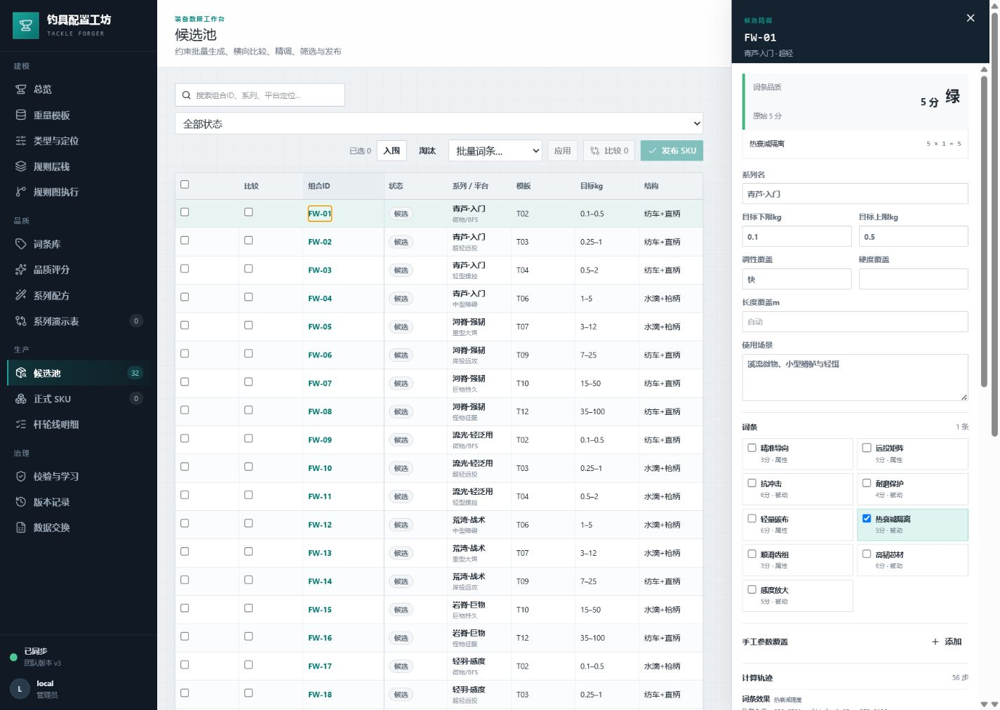

优点：

- 高密度候选表支持搜索、筛选、批量入围和比较。
- 右侧抽屉已经出现“计算轨迹”，是统一来源追踪模式的良好基础。
- 词条类别和分值已经可见。

主要问题：

- 候选表的发布动作仍是“发布 SKU”，身份模型错误。
- 轨迹是按执行顺序的 56 步长列表，无法先看最终值，再按来源层渐进展开。
- “手工参数覆盖”没有明确它属于 Series、SKU 还是 Model Patch，也没有基于哪个规则版本。
- 每条候选只有“1 错误”总数，错误原因、硬兼容、Affinity、系列不变量未分区。
- 被动词条缺少“仅保存、计分、展示，不执行模拟器逻辑”的明确提示。
- 列表需要横向理解大量字段，右侧抽屉又过窄；来源和修复动作被挤到长滚动尾部。

#### 步骤 6：连接飞书与数据交换——健康度：结构良好，治理链不完整

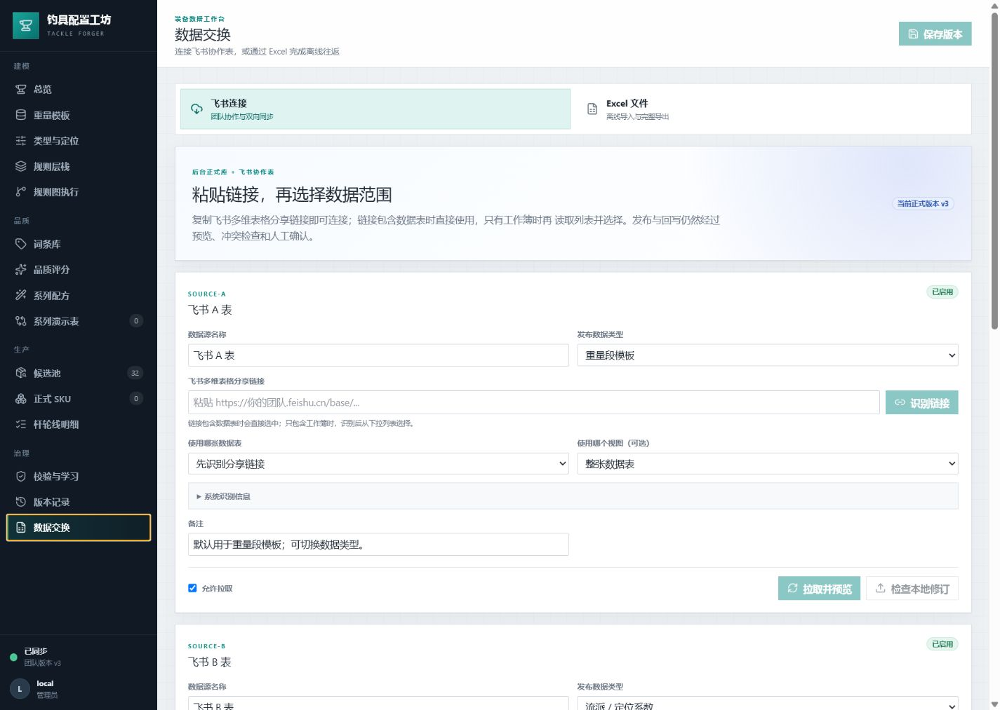

优点：

- 飞书与 Excel 入口分开，能表达在线协作和离线往返。
- 明确说明密钥不进入浏览器，建立了基本安全信任。
- 拉取、预览、冲突检查、人工确认的治理方向正确。

主要问题：

- 当前主要是数据源连接，缺少“把共享DerivationLayerPatch晋升为通用规则”的修改草稿链路。
- 缺少草稿依据、影响对象、旧/新规则版本、写回回读、显式拉取和发布RuleSetVersion闭环。
- A/B数据源按技术结构呈现，策划更需要看“模板源、规则源、词条源、规则修改草稿”的业务结构。
- 空状态只说明“尚无记录”，没有示例、权限缺失原因或下一步。

### 1.3 跨页面高优先级问题

| 优先级 | 问题 | 用户后果 | 设计要求 |
| --- | --- | --- | --- |
| P0 | Series、SKU、Model 身份混淆 | 可能把候选或 SKU 当作购买对象发布 | 全局对象谱系、稳定身份标签、Model 才可发布 |
| P0 | 直接修改通用规则与局部 Patch 未分离 | 个案修改可能污染全局规则 | 所有编辑必须先选作用域并展示影响范围 |
| P0 | 硬兼容与软 Affinity 未分区 | 高分可能掩盖不能生成的组合 | 两套组件、两套状态、两套动作 |
| P0 | 发布快照冻结语义缺失 | 用户无法信任历史版本 | Snapshot 只读、锁定、哈希、升级候选并列 |
| P1 | 计算轨迹不可快速理解 | 最终数字可追溯但不可操作 | 统一属性来源检查器与层级摘要 |
| P1 | 规则版本和 Patch 基线不显著 | 上游变化后无法安全 rebase | 版本标签、三方比较、冲突恢复 |
| P1 | 系列不变量未成为一等对象 | SKU/Model 偏离难以及时发现 | 系列身份、方向签名、曲线、严重度 |
| P1 | 品质仍使用“金” | 与 v3 冲突 | 全量迁移到 C/绿、B/蓝、A/紫、S/橙 |
| P2 | 导航围绕旧实体与旧流程 | 用户跨页拼接任务 | 任务工作区 + 对象上下文栏 |

### 1.4 可访问性风险

从截图与 DOM 可确认或推断的风险：

- 多处状态以浅色标签和边框为主，需验证文字与背景至少满足 WCAG 2.2 AA 对比度。
- 大量图标按钮没有可见文字；需提供稳定可访问名称和悬浮说明。
- 规则画布、横向表格、右侧抽屉形成多个滚动容器；需定义键盘进入/退出、焦点保持和滚动位置恢复。
- 品质、状态、兼容不可仅用颜色表达；必须同时有字母、图标和文字。
- 图形连线、Affinity 条形和属性趋势必须有文本等价描述。
- 错误汇总需把焦点移动到错误摘要，并能跳转到首个阻断项。

本阶段不能仅凭截图确认键盘完整性、读屏顺序、400% 缩放、重排和动态提示朗读；这些属于第二阶段 Design QA 验证项。

### 1.5 持续体验问题

本表是当前体验改进的单一待办入口。前文截图和逐页问题只作为证据，不再重复登记为独立问题。

| ID | 优先级 | 状态 | 问题 | 验收条件 |
| --- | --- | --- | --- | --- |
| UX-001 | P1 | OPEN | 表格与单元格编辑缺少清晰的可编辑提示、键盘焦点、待保存状态、提交/取消和撤销反馈。 | 可编辑单元格在浏览、聚焦和编辑状态下可区分；键盘可进入、提交和取消；离开前能识别未保存修改；提交结果和撤销入口明确；批量修改先显示影响范围。 |
| UX-002 | P1 | OPEN | 规则设定依赖大面积复选框和通用DAG检查器，缺少按领域层分组、约束说明、影响预览和高频批量操作。 | 钓法、类型、功能、性能、词条和Technology按领域层与作用域组织；互斥、依赖、来源和权限就地说明；保存前展示受影响Series/SKU/Model、规则版本及阻断；常用筛选、复制和批量操作无需逐格重复设置。 |

---

## 2. 用户任务视角与核心任务

### 2.1 主要任务视角

以下视角用于组织页面、培训和任务入口，不是业务角色，也不分配权限。同一已登录公司用户可以在一次工作中切换或连续完成这些任务；所有动作统一消费服务端`ActionAvailability`，当前策略下所有用户获得全部已启用Capability。

| 任务视角 | 主要目标 | 高频任务 | 关键完成证据 |
| --- | --- | --- | --- |
| 设计与编辑 | 快速设计合法且有取舍的系列和 Model | 匹配模板、配置规则、加 Patch、比较属性、修冲突 | 草稿revision、Trace与ValidationIssue |
| 规则维护 | 维护可复用规则与版本 | 编辑模板/规则、评估影响、确认写回、显式拉取、发布 RuleSetVersion | FeishuSourceRevision、回读证据与RuleSetVersion |
| 发布核验 | 确保 Model 可发布且历史可信 | 查阻断、核warning理由、核Patch链、冻结Snapshot | Snapshot ID、payload hash与操作记录 |
| 数据维护 | 维护飞书与 Excel 数据来源 | 配置连接、预览导入、处理冲突、回读恢复 | source revision、ExportManifest与恢复结果 |
| 只读复盘 | 复盘历史设计与差异 | 查看来源、历史快照、升级候选、操作记录 | 不可变Snapshot、版本差异与来源关系 |

### 2.2 核心 Jobs-to-be-Done

1. 当我看到一个最终属性时，我要快速知道它从哪一层产生，谁改过，为什么改，以及继续修改会影响谁。
2. 当我为某个重量设计 SKU 时，我要知道它为何命中某个最近模板，并确认共享模板不会让不同重量失去独立性。
3. 当我建立系列时，我要固定系列身份，同时允许有限、可解释的 SKU/Model 偏移。
4. 当组合出现问题时，我要先知道它是“不能成立”的硬冲突，还是“成立但不推荐”的软适配问题。
5. 当上游规则变化时，我要在不破坏旧快照的前提下比较、rebase，并选择是否生成新版本。
6. 当一个局部 Patch 有通用价值时，我要先创建飞书规则修改草稿，预览影响并确认写回；写回后仍需显式拉取和发布RuleSetVersion。

---

## 3. 产品信息架构

### 3.1 全局导航

建议一级导航按工作任务分为五个工作区：

1. 今日工作
   - 待我处理
   - 阻断与复核
   - 最近对象
2. 规则与派生
   - 规则实验室
   - 派生模板浏览器
   - 兼容矩阵
3. 产品设计
   - 系列设计器
   - SKU 抽屉
   - Model 工作台
   - 词条与技术库
4. 发布与升级
   - Patch / Rebase 对比器
   - 发布与升级中心
5. 数据与治理
- 数据源与规则修改
   - 审计记录
   - 参数与工作区设置

不为Method、Type、Function分别创建孤立一级页面；它们在规则实验室中按独立规则层维护。`PerformanceSummaryDefinition`只维护派生摘要的统计与展示定义，不提供Performance配置层或商品输入页。

### 3.2 全局对象上下文

所有对象页顶部固定提供：

- 对象面包屑：Collection / Series / SKU 抽屉 / Model / Snapshot。
- 对象类型标签：Series、SKU 抽屉、Model、Snapshot，不能只显示名称。
- 当前状态与版本。
- 全局对象搜索：支持 ID、名称、规则、参数、词条、版本。
- 快速切换：最近对象、同级 SKU、同抽屉 Model、上一 Snapshot。
- 影响与审计入口。

### 3.3 关键对象关系

~~~mermaid
flowchart LR
    RS["RuleSetVersion"] --> WT["WeightTemplate"]
    RS --> M["MethodProfile"]
    RS --> T["TypeProfile"]
    RS --> F["FunctionProfile + functionIntensity"]
    WT --> DP["DerivedProjection（只读）"]
    M --> DP
    T --> DP
    F --> DP
    DP --> PM["ProjectionMatch（不插值）"]
    C["Collection"] --> S["Series"]
    S --> SKU["SKU Drawer（离散重量）"]
    PM --> SKU
    SKU --> MD["Purchasable Model"]
    AX["Affix"] --> TECH["Technology（组合包）"]
    AX --> MD
    TECH --> MD
    MD --> PS["PerformanceSummary（只读派生）"]
    SP["Series Patch"] --> MD
    KP["SKU Patch"] --> MD
    MP["Model Patch"] --> MD
    MD --> SNAP["ConfigurationSnapshot（冻结）"]
    RS2["新 RuleSetVersion"] --> UC["UpgradeCandidate"]
    SNAP -. "保持不变" .-> UC
~~~

### 3.4 对象身份视觉规范

| 对象 | 固定标签 | 主语义 | 默认可编辑性 |
| --- | --- | --- | --- |
| Series | Series | 共享身份与不变量 | 草稿可编辑；批准后变更需修订 |
| SKU | SKU 抽屉 | 某离散targetPullKg下的Model容器，界面显示重量规格 | 可增删Model；不是购买对象 |
| Model | Model | 实际选择与购买对象 | 草稿可编辑；发布后新建修订 |
| Snapshot | 冻结快照 | 某次发布的不可变配置 | 永久只读 |
| CandidateSearchRecipe | 搜索配方 | 枚举与筛选候选的工具 | 不作为产品系列身份 |

---

## 4. 关键任务流

### 4.1 建立或导入重量基础模板

- 入口：规则实验室 / 重量模板；数据源 / 导入。
- 用户目标：建立中性重量段基准并形成可发布规则版本草稿。
- 主路径：选择部位 → 新建或导入 → 字段映射 → 单位/范围/重复校验 → 预览差异 → 保存草稿 → 提交规则版本审核。
- 关键决策：新增模板还是修订模板；重量段边界；来源是飞书还是 Excel。
- 错误与恢复：重复 ID、范围倒置、单位不匹配、空表覆盖时阻断；提供逐行定位、下载错误清单、重新映射、恢复上次预览。
- 成功反馈：显示“已保存至规则草稿 vX”，并列出预计影响的派生模板数量。
- 动作与证据：保存规则草稿与发布RuleSetVersion是两个显式动作，分别消费服务端`ActionAvailability`并记录操作者、expectedRevision和结果；不绑定固定角色。
- 最终落点：规则实验室的重量模板版本详情。

### 4.2 编辑钓法、类型、功能和可选性能规则

- 入口：规则实验室 / 规则层。
- 用户目标：维护独立规则层并即时验证贡献和代价。
- 主路径：选择层 → 选择规则 → 编辑操作 → 用样例投影试算 → 查看 before/after、预算和边界 → 保存草稿。
- 关键决策：钓法与类型必须分层；性能是否启用；功能方向与 functionIntensity 1/2/3。
- 错误与恢复：无代价的功能、非法操作、公式错误、硬兼容冲突时标记具体字段；可回滚到上次保存点。
- 成功反馈：显示规则 Trace、优势/代价、影响对象和规则版本草稿号。
- 动作与证据：编辑、影响预览和发布通用规则是独立显式动作；当前策略允许同一已登录用户连续完成，但每步都必须重新鉴权、校验revision并记录证据。
- 最终落点：规则草稿或影响分析。

### 4.3 输入离散拉力规格并查看最近模板匹配依据

- 入口：系列设计器“添加重量 SKU”；派生模板浏览器。
- 用户目标：为目标拉力得到确定且可解释的最近结构标杆。
- 主路径：输入 targetPullKg → 相同部位/钓法/类型/功能定位过滤 → 排除硬不兼容 → 按拉力比例距离排序 → 查看命中标杆与备选 → 接受或显式 pin。
- 关键决策：接受系统命中还是人工 pin；是否创建新模板。
- 错误与恢复：无合法模板时显示被排除原因和“去修复兼容 / 新建模板”；pin 失效时要求重新确认。
- 成功反馈：保存 ProjectionMatch；明确“未插值”与规则版本。
- 动作与证据：创建SKU与pin模板分别消费服务端动作；pin必须填写理由并进入操作记录，不按用户角色限制。
- 最终落点：新 SKU 抽屉。编辑已有SKU的targetPullKg时，页面必须先查询是否存在已发布后代Snapshot：没有时保存同skuId的新revision；存在时把动作明确改为“创建新重量SKU”，旧SKU重量不可原地改写且可在确认后废弃。

### 4.4 对派生结果增加 Patch

- 入口：属性来源检查器；Series/SKU/Model 编辑页。
- 用户目标：局部修正继承结果而不覆盖派生模板。
- 主路径：选择属性 → 添加 Patch → 选择作用域 → 选择set/add/multiply/clear → 填写原因 → 预览结果与影响 → 保存草稿。clear明确显示“清除本层覆盖并恢复继承值”，不得显示成“设为空”。
- 关键决策：通用规则还是哪一层Patch；是否使用set；是否清除本层覆盖；是否超出可配置偏移上限。min/max只在模板/通用规则编辑器出现，不是新AdjustmentPatch选项。
- 错误与恢复：同层多set、set与clear竞争、非法操作、超阈值、基线过期时阻断或待复核；可改为相对操作、缩小作用域或进入rebase。导入旧remove时只展示已转换的clear；旧min/max无法在冻结基底上规范化为set时进入迁移复核。
- 成功反馈：Trace 新增一层，显示 Patch 作者、版本、前后值和影响对象。
- 动作与证据：Series/SKU/Model Patch分别绑定对象、作用域和expectedRevision；warning确认需理由，不增加对象角色或职责分离。
- 最终落点：对象详情的 Patch 链。

### 4.5 创建系列并定义系列不变量

- 入口：系列设计器 / 新建 Series。
- 用户目标：建立共享概念、类型、品质、核心功能与词条/技术身份。
- 主路径：先选择Quality → 选择Collection并填写概念 → 固定Method、Type、Function → 定义必需/可选/禁用词条家族而非具体词条 → 设方向签名和拉力曲线 → 预览校验 → 保存。性能摘要在词条、Technology和最终属性结算后只读派生，不在此处选择。
- 关键决策：固定强度还是 weight_curve；偏移等级如何映射到可配置阈值。
- 错误与恢复：缺失硬不变量或规则冲突时指出来源；支持返回规则实验室、修改 Series 或保存未完成草稿。
- 成功反馈：生成 SeriesSignature 与“6/6 不变量通过”摘要。
- 动作与证据：创建Series与批准Series是两个显式人工动作；当前策略允许同一用户连续完成，批准仍须通过硬校验、expectedRevision和操作记录。
- 最终落点：Series 总览及 SKU 轨道。

### 4.6 为系列添加多个拉力规格SKU

- 入口：Series 设计器 / 添加重量规格。
- 用户目标：建立多个离散拉力规格抽屉并比较覆盖、曲线与共享标杆。
- 主路径：批量输入targetPullKg → 分别执行最近结构标杆匹配 → 查看共享标杆和独立Patch提示 → 校验拉力曲线 → 创建抽屉。
- 关键决策：是否保留重复规格；是否为某重量 pin 模板；是否添加 SKU Patch。
- 错误与恢复：完全重复关键属性时 warning；曲线倒退时定位参数并给出修复建议。
- 成功反馈：Series 轨道显示各 SKU、模板、状态和 Model 数。
- 动作与证据：Series批准前可编辑当前草稿；批准后新增SKU必须创建新修订。这是对象状态约束，不是角色授权。
- 最终落点：Series 的 SKU 轨道。

### 4.7 在一个 SKU 抽屉中创建多个 Model

- 入口：SKU 抽屉 / 新建 Model。
- 用户目标：在同一重量规格下提供不同长度、调性、部件或技术的真实购买选择。
- 主路径：从结构标杆创建 → 命名Model → 配置action/hardness/length、杆轮线与Model Patch → 选择具体词条和Technology → 计算价值分并校验已选Quality区间 → 保存。
- 关键决策：默认 Model；差异是否仍符合系列身份；是否复制已有 Model。
- 错误与恢复：误把 SKU 当作购买对象时 UI 不提供发布入口；Model 名称重复、闭环失败时给出修复。
- 成功反馈：抽屉显示多个 Model 的差异摘要和默认标记。
- 动作与证据：编辑Model与发布Model是两个显式动作；当前策略不设置专用审核人，同一用户可在全部Gate通过后发布并留下操作记录。
- 最终落点：Model 工作台。

### 4.8 配置属性词条、被动词条和技术包

- 入口：Model / 词条与技术；词条与技术库。
- 用户目标：配置面板贡献、品质分和展示内容且避免重复加成。
- 主路径：添加词条或技术 → 展开技术成员 → 查看属性贡献与分值 → 检查生成策略/稀有度 → 保存。
- 关键决策：属性或被动；normal / technology_only / style_only；实际 Technology 还是候选预览系数。
- 错误与恢复：技术与成员重复同名属性时阻断并定位重复项；被动字段缺失只校验配置完整性。
- 成功反馈：更新面板 Trace、品质分与技术成员清单。
- 动作与证据：词条/技术库变更按通用规则的编辑、影响预览和发布动作执行；Model只引用已发布版本，不绑定固定审核角色。
- 最终落点：Model 的词条与技术区。

### 4.9 查看硬兼容和 Affinity 解释

- 入口：Model 校验；兼容矩阵；派生模板浏览器。
- 用户目标：先判断能否成立，再理解合法组合的适配程度。
- 主路径：查看硬结果 allow/deny/require → 展开命中规则和修复 → 若合法，再看各 Affinity 轴、权重、最具体规则和排序解释。
- 关键决策：修复硬冲突还是更换对象；低 Affinity 是否带理由继续。
- 错误与恢复：deny 永远阻断；require 提供补足条件；低分只 warning，不改变合法性。
- 成功反馈：硬兼容通过计数与 Affinity 轴解释分别完成。
- 动作与证据：硬deny不可人工越过；-3 Affinity确认需理由、expectedRevision和操作记录，不要求专用复核角色。
- 最终落点：Model 校验或兼容矩阵。

### 4.10 处理 Patch rebase 冲突

- 入口：待我处理；Patch / Rebase 对比器；升级候选。
- 用户目标：在新基底上重放 Patch，不丢失原意。
- 主路径：查看旧基础、新基础、现有Patch、预计结果 → 识别set/多set/已删参数冲突 → 选择保留目标值、保留相对偏移、转RuleSourceChangeDraft或放弃 → 再校验。
- 关键决策：Patch 原意；新基底是否已吸收修改；是否晋升通用规则。
- 错误与恢复：任何未解决冲突保持“Patch 需要 rebase”；保留旧版本草稿，可撤销单个解决决定。
- 成功反馈：生成已解决的 Patch 修订和新的可重放 Trace。
- 动作与证据：持有已启用动作的用户可解决Patch rebase；转通用规则后，确认写回、显式拉取和RuleSet发布分别鉴权并记录，不绑定固定对象责任角色。
- 最终落点：升级候选或对象修订。

### 4.11 发布 Model 配置快照

- 入口：Model / 发布；发布与升级中心。
- 用户目标：冻结一个可选择、可购买、可复现的 Model 配置。
- 主路径：核对身份 → 版本与公式 → 完整 Patch 链 → 硬兼容 → Affinity → 系列不变量 → 品质/词条 → warning 理由 → 与上一版本差异 → 发布。
- 关键决策：是否接受 warning；是否选择当前 Model 为默认；是否推迟发布。
- 错误与恢复：error 阻断并跳转修复；warning 未确认不能发布；哈希失败可重试，不产生半成品快照。
- 成功反馈：显示 Snapshot ID、哈希、发布人/时间；对象转“已发布/已冻结”。
- 动作与证据：发布动作消费服务端`ActionAvailability`；按`separation-of-duties/open009-v1`，当前不设置专用发布角色或作者回避，同一用户可在全部Gate通过后发布自己的Model，并记录操作者、理由、expectedRevision和Snapshot hash。
- 最终落点：只读 ConfigurationSnapshot。

### 4.12 上游变化后比较旧快照与升级候选

- 入口：发布与升级中心；Model 的“有升级候选”状态。
- 用户目标：理解上游变化是否值得生成新快照，同时保持旧快照不变。
- 主路径：选择旧 Snapshot → 打开 UpgradeCandidate → 比较规则/公式/Patch/属性/兼容/不变量 → 处理 rebase → 审核 → 发布新 Snapshot。
- 关键决策：继续沿用旧快照、升级、部分吸收或放弃候选。
- 错误与恢复：候选失效或基线再次变化时重新生成；旧 Snapshot 始终可返回。
- 成功反馈：新旧 Snapshot 并列，旧版本仍显示“冻结且有效”。
- 动作与证据：处理UpgradeCandidate与发布新Snapshot是两个显式动作；当前不绑定策划或审核角色，同一用户可依次执行，但旧Snapshot保持不可变且新发布必须重新通过全部Gate。
- 最终落点：新 Snapshot 修订历史。

### 4.13 将通用修改写回飞书规则源

- 入口：作用域选择器“创建飞书规则修改草稿”；数据源与规则修改中心。
- 用户目标：把经验证的局部经验晋升为可复用通用规则。
- 主路径：从DerivationLayerPatch生成修改草稿 → 选择稳定规则ID与参数 → 描述证据 → 查看跨对象影响 → 人工确认写回 → 技术回读验证 → 显示远端变化 → 用户显式拉取 → 校验并发布新RuleSetVersion。
- 关键决策：保留个案 Patch 还是通用化；影响对象；是否需要迁移已有草稿。
- 错误与恢复：飞书冲突、权限不足、来源revision变化时暂停并保留草稿；支持三方差异和幂等重试。
- 成功反馈：修改草稿ID、飞书定位、写回/回读/拉取/吸收状态与预计RuleSetVersion。
- 动作与证据：一期、1.5期、二期和当前规划三期均不接飞书审批；确认写回、显式拉取、RuleSet发布是三个独立动作，当前允许同一用户连续完成。
- 最终落点：规则修改详情与审计记录。

---

## 5. 页面清单与页面职责

| 页面/工作区 | 核心职责 | 主要对象 | 不应承担 |
| --- | --- | --- | --- |
| 今日工作 | 汇总阻断、待复核、rebase、待发布、升级候选 | 跨对象任务 | 直接编辑复杂规则 |
| 全局对象搜索 | 搜索并跳转任意对象、版本、规则、参数 | 全部 | 替代工作区导航 |
| 规则实验室 | 建立/导入模板，编辑规则层，试算与发布 RuleSetVersion | Template、Method、Type、Function、PerformanceSummaryDefinition | Series 商品身份；把Performance恢复为配置输入 |
| 派生模板浏览器 | 输入重量、查看最近匹配、备选与完整来源 | DerivedProjection、ProjectionMatch | 直接修改派生缓存 |
| 兼容矩阵 | 编辑硬规则与 Affinity 轴，测试组合 | CompatibilityRule、AffinityRule | 用总分覆盖 deny |
| 系列设计器 | 定义 Series 身份、不变量、方向签名、重量 SKU 轨道 | Collection、Series、SKU | 候选搜索配方 |
| SKU 抽屉 | 管理单个离散重量下多个 Model | SKU、ProjectionMatch、SkuPatch | 作为购买对象发布 |
| Model 工作台 | 配置实际可购买型号、属性、部件、词条、技术与 Patch | Model | 修改历史 Snapshot |
| 词条与技术库 | 维护属性/被动词条、Technology 组合包与版本 | Affix、Technology | 执行被动模拟 |
| Patch / Rebase 对比器 | 处理上游变化、三方比较与冲突恢复 | Patch、UpgradeCandidate | 自动吞掉冲突 |
| 发布与升级中心 | 证据校验、冻结 Snapshot、管理升级候选 | Snapshot、UpgradeCandidate | 原地覆盖已发布版本 |
| 数据源与规则修改 | 写回、回读、显式拉取、RuleSet发布和冲突处理 | FeishuRevision、RuleSourceChangeDraft | 让个案 Patch 自动生效 |
| 审计记录 | 按对象、用户、版本回放所有关键行为 | Revision、AuditEvent | 允许修改历史 |
| 工作区设置 | 参数、公式策略、阈值和权限 | WorkspaceSetting | 提供扩展部位入口、占位或启用开关 |

---

## 6. 统一页面状态模型

状态不能只依靠颜色。每个状态必须同时提供：图标、短文案、辅助说明、允许动作与禁用原因。

| 状态 | 颜色语义 | 图标建议 | 展示文案 | 允许操作 | 不可执行 |
| --- | --- | --- | --- | --- | --- |
| 草稿 | 中性灰/蓝灰 | 铅笔 | 草稿 | 编辑、删除未引用草稿、提交计算 | 发布 |
| 已计算 | 青绿 | 计算器/勾 | 已计算 · 基于 vX | 查看 Trace、继续配置、重新计算 | 在输入过期时发布 |
| 有警告 | 琥珀 | 三角感叹号 | 有警告 · N 项待确认 | 查看、修复、填写理由 | 未确认 warning 时发布 |
| 硬冲突 | 红 | 八边形停止 | 硬冲突 · 阻断生成/发布 | 定位规则、修正组合 | 生成、批准、发布 |
| 待复核 | 紫灰 | 眼睛 | 待复核 · 需人工判断 | 对比、批准、退回 | 未复核时进入下一关 |
| Patch 需要 rebase | 橙红 | 分叉箭头 | Patch 需要 rebase | 打开三方比较、解决冲突 | 自动重放、发布 |
| 待发布 | 蓝紫 | 上传/印章 | 待发布 · 校验已通过 | 查看证据、发布、退回 | 修改冻结证据 |
| 已发布 | 绿色 | 发布勾 | 已发布 · Snapshot vN | 查看、复制为新修订、生成升级候选 | 直接编辑 |
| 有升级候选 | 靛蓝 | 上行箭头 | 有升级候选 · 旧快照不变 | 比较、处理、忽略候选 | 自动替换当前快照 |
| 已冻结 | 深蓝灰 | 锁 | 已冻结 · 哈希 … | 查看；下载原样审计归档；完整性门禁通过时正式导出 | 任何修改、重算覆盖；以审计归档绕过正式导出门禁 |
| 已废弃 | 灰 | 归档箱 | 已废弃 · 保留历史引用 | 查看历史、恢复为新修订 | 新引用、发布 |

状态优先级：硬冲突 > Patch 需要 rebase > 待复核 > 有警告 > 待发布 > 有升级候选 > 已发布/已冻结 > 已计算 > 草稿。

---

## 7. 核心交互模式

### 7.1 属性来源与计算解释

默认展示：

- 属性名、最终值、单位、收益方向。
- “来源 N 层”链接。
- 与上一 Snapshot 或中性基准的差异。
- 当前 warning/error。

展开后按固定顺序展示：

1. 重量基础模板
2. 钓法贡献
3. 类型贡献
4. 功能定位贡献
5. 词条/技术贡献
6. Series Patch
7. SKU Patch
8. Model Patch

每一层必须包含：来源名称、规则/对象版本、before、operation、operand、after、优势/代价、状态、查看规则、在此层创建Patch或RuleSourceChangeDraft。

性能定位单独显示为“派生性能摘要”，列出抛投+/重量-/竿度+等标签、定义版本、Technology/Affix/最终属性证据和inputHash；不得混入属性贡献层，也不得提供“在此层创建Patch”。

### 7.2 作用域选择器与影响预览

任何数值修改先打开作用域选择器：

- 修改通用规则——展示受影响的规则、派生模板、Series、SKU、Model 数。
- 添加 Series Patch——影响本 Series 下全部 SKU/Model。
- 添加 SKU Patch——影响当前重量抽屉下全部 Model。
- 添加 Model Patch——只影响当前 Model 草稿/新修订。
- 创建飞书规则修改草稿——不立即生效；确认写回后仍需显式拉取和发布规则版本。

确认区固定显示：

- 影响范围。
- 基于的 projectionId / RuleSetVersion。
- 已发布 Snapshot 不会改变。
- 是否会触发 rebase。
- 所需权限与审核。

### 7.3 最近模板匹配说明

匹配卡必须写出：

- 目标拉力规格与目标身份。
- 命中模板、重量范围、标称重量。
- “未插值”标识。
- 对数距离。
- 硬兼容排除项。
- Affinity 仅作为后续决胜的分项解释。
- 备选模板与未选原因。
- 是否由用户 pin。

共享模板提示示例：“1.5 kg 与 1.8 kg 均命中 T04；二者拥有独立 SKU Patch，互不影响。”

### 7.4 硬兼容与 Affinity

硬兼容：

- 只显示 allow、deny、require。
- deny 使用阻断组件，说明规则、版本、失败原因、建议修正方向。
- require 显示缺少的对象或条件。
- 不展示可被误解为“概率”的百分比。

Affinity：

- 只在硬兼容通过后展示。
- 按轴列出分数、权重、采用的最具体规则和自然语言解释。
- 总分可排序，但默认折叠在各轴摘要之后。
- -3 可批准但必须记录理由。

### 7.5 系列不变量

Series 顶部固定显示不变量条：

- 正常继承：勾 + “继承 Series”。
- 允许偏移：双向箭头 + 偏移量与可配置阈值。
- 需要复核：眼睛 + 原因与审核动作。
- 阻断发布：停止图标 + 违反的硬不变量。

重量曲线使用参数趋势表，不只用折线颜色；每个非单调点必须可跳转到对应 SKU/Model 和来源层。

### 7.6 Patch / Rebase 三方比较

布局固定为：

- 旧基础（Patch 创建时）。
- 新基础（目标 RuleSetVersion）。
- 现有 Patch。
- 候选结果。

按参数给出冲突类型：set 基线变化、同层多 set、参数删除/重命名、边界变化、兼容变化、公式模式变化。

恢复动作：保留目标值、保留相对偏移、转为RuleSourceChangeDraft、放弃Patch。每个动作先展示结果与风险。

### 7.7 发布冻结

发布前检查清单按严重度排序：

1. 身份与版本链。
2. 硬兼容。
3. 系列不变量。
4. Patch/rebase。
5. 品质、词条、技术重复贡献。
6. Affinity 与 warning 理由。
7. 与上一 Snapshot 差异。
8. 公式模式、哈希、发布人。

发布后页面整体进入只读样式，顶部显示锁、Snapshot ID、哈希、版本和“上游变化不会改写此快照”。

### 7.8 技术与词条

- Technology 默认折叠为一个身份对象；展开显示成员 Affix。
- 属性贡献只在成员处计入一次；Technology 本体不重复显示同名数值贡献。
- 被动词条固定提示：“本工具仅保存、计分和展示，不执行或验证模拟器逻辑。”
- 品质分与属性平衡预算并列但不合并。

### 7.9 错误与恢复

- 页面顶部有错误摘要，按阻断/警告/信息分组。
- 点击问题跳转到字段并保持问题面板可见。
- 每个问题至少有一个下一步：定位规则、补条件、修改 Patch、发起 rebase、填写理由或请求权限。
- 保存失败保留本地草稿和用户输入；不得只用短暂 toast。

---

## 8. 低保真线框图

以下线框只定义区域、层级与交互责任，不代表最终视觉方向。

### 8.1 Model 工作台

~~~mermaid
flowchart TB
    A["全局栏：搜索 / 待办 / 用户"] --> B["对象上下文：Collection / Series / SKU 抽屉 / Model + 状态/版本"]
    B --> C["Model 身份与最终属性摘要"]
    C --> D["主工作区：配置 / 属性 / 词条与技术 / 兼容 / 发布"]
    D --> E["属性列表或部件配置"]
    D --> F["来源检查器：9 层贡献 + 版本 + 动作"]
    E --> G["阻断与 Affinity 分区"]
    F --> H["作用域选择器 + 影响预览"]
    G --> I["发布证据栏"]
~~~

### 8.2 规则实验室

~~~mermaid
flowchart LR
    A["规则版本列表"] --> B["规则层导航"]
    B --> C["重量模板"]
    B --> D["钓法"]
    B --> E["类型"]
    B --> F["功能 + functionIntensity"]
    B --> G["可选性能"]
    C --> H["编辑区"]
    D --> H
    E --> H
    F --> H
    G --> H
    H --> I["样例投影试算"]
    I --> J["Trace / 优势代价 / 兼容"]
    J --> K["影响范围"]
    K --> L["保存草稿或提交审核"]
~~~

### 8.3 发布与升级中心

~~~mermaid
flowchart LR
    A["待发布 Model / 有升级候选"] --> B["版本与 Patch 链"]
    B --> C["硬兼容"]
    C --> D["系列不变量"]
    D --> E["品质 / 词条 / 技术"]
    E --> F["Affinity 与 warning 理由"]
    F --> G["与上一 Snapshot 差异"]
    G --> H{"阻断为 0？"}
    H -- "否" --> I["跳转修复 / Rebase"]
    H -- "是" --> J["生成哈希并冻结 Snapshot"]
    J --> K["旧 Snapshot 保持只读"]
~~~

---

## 9. 三套视觉与布局方向

本节恰好包含三套方向。三者均以 1440 × 1024 为基准，遵循现有深色工具导航、克制青绿色和高密度桌面工作台的基础气质，但在结构与交互模型上实质不同。

### 方向一：高密度数据驾驶舱

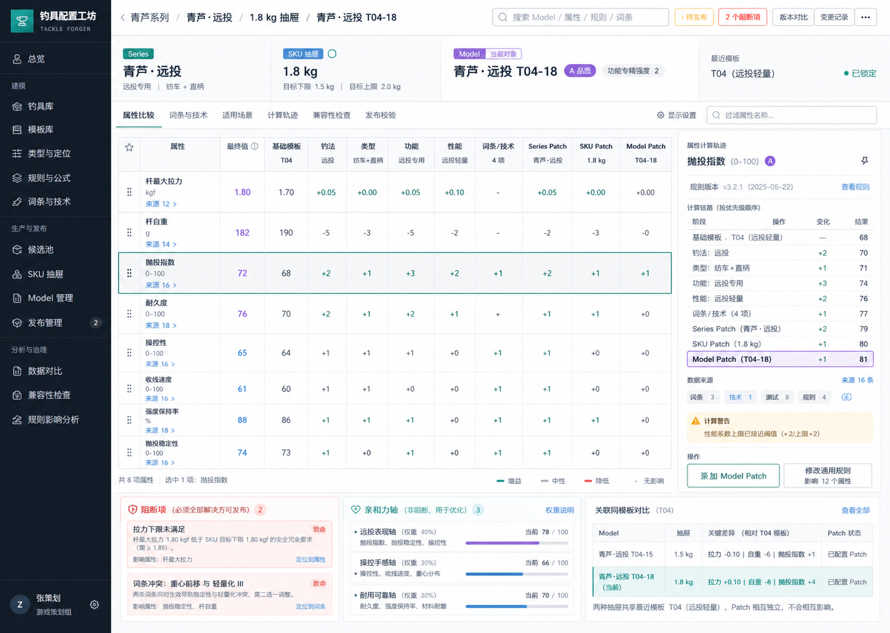

> 选择状态：已选为产品主框架。

- 适用场景：资深数值策划进行多属性横向比较、追踪和快速微调。
- 信息密度：最高。
- 导航：紧凑左侧工作区导航 + 顶部对象面包屑。
- 表格/画布/检查器比例：属性贡献矩阵约 65%，右侧计算检查器约 25%，底部兼容与发布约 10%。
- 多层规则表达：每层作为稳定列，适合观察多个属性在同一层的贡献。
- 来源追踪：选择属性行后，在右侧显示完整顺序 Trace。
- Series–SKU–Model：顶部三段身份条，强调当前对象和相邻层。
- Patch/版本差异：Patch 是矩阵列；版本与阻断在检查器和底部栏。
- 优点：比较效率最高；能快速发现某一规则层对多个属性的系统性影响；最接近当前团队的表格心智。
- 风险：首次使用学习成本高；1440 以下容易横向拥挤；需要严格列冻结、列分组和自定义视图。
- 开发复杂度：中高。依赖高性能虚拟表格、列配置、同步选择和来源查询接口，但不需要重型实时画布。
#### 已选方向修订：右侧推入式 Model 预览层

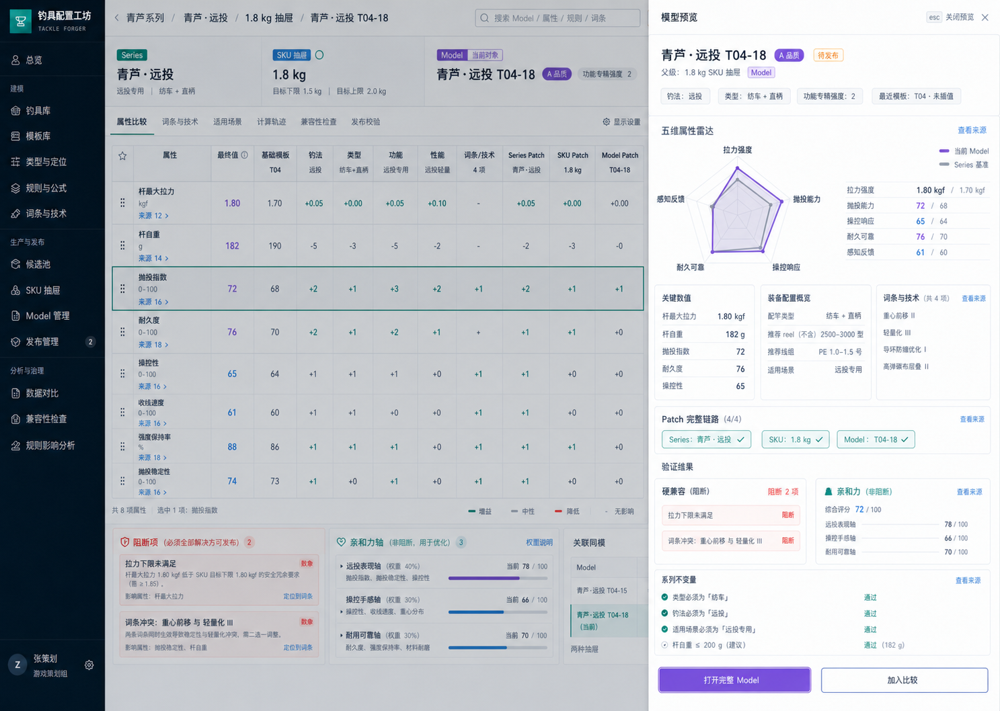

修订原则：

- 高密度属性贡献矩阵保持为主工作区，不改变方向一的核心心智。
- 用户点击“预览 Model”后，从右侧推入约 520–640px 的只读预览层；背景矩阵保持可识别，关闭后恢复原滚动和选择位置。预览按“1 常用概览 → 2 五维与适配 → 3 来源与版本”分层，Patch / Rebase 与 AI 建议作为独立任务入口，避免把完整 Trace 和五维细节同时压在默认首屏。
- 预览层不是编辑表单，也不直接发布；主要动作是“打开完整 Model”，次要动作是“加入比较”。
- 固定展示 Model 身份、父级 SKU 抽屉、品质、状态、钓法、类型、功能专精强度、最近模板和“未插值”说明。
- 属性五维图对比“当前 Model”和“Series 基准”，并同步展示数值列表，不能只靠图形或颜色传达。
- 五维轴暂用拉力强度、抛投能力、操控响应、耐久可靠、感知反馈作为可配置示例；正式实现从工作区配置或聚合规则读取，不固化为不可变领域结论。
- 硬兼容、Affinity、系列不变量继续使用三个独立区块；硬冲突不能被五维图或 Affinity 总分掩盖。
- 完整 Patch 链至少显示 Series、SKU、Model 三层身份和状态，并提供“查看来源”入口。
- 支持点击另一 Model 行原位刷新预览、Escape 关闭、关闭按钮、焦点陷阱与关闭后的焦点归还。

### 方向二：分栏式对象谱系检查器

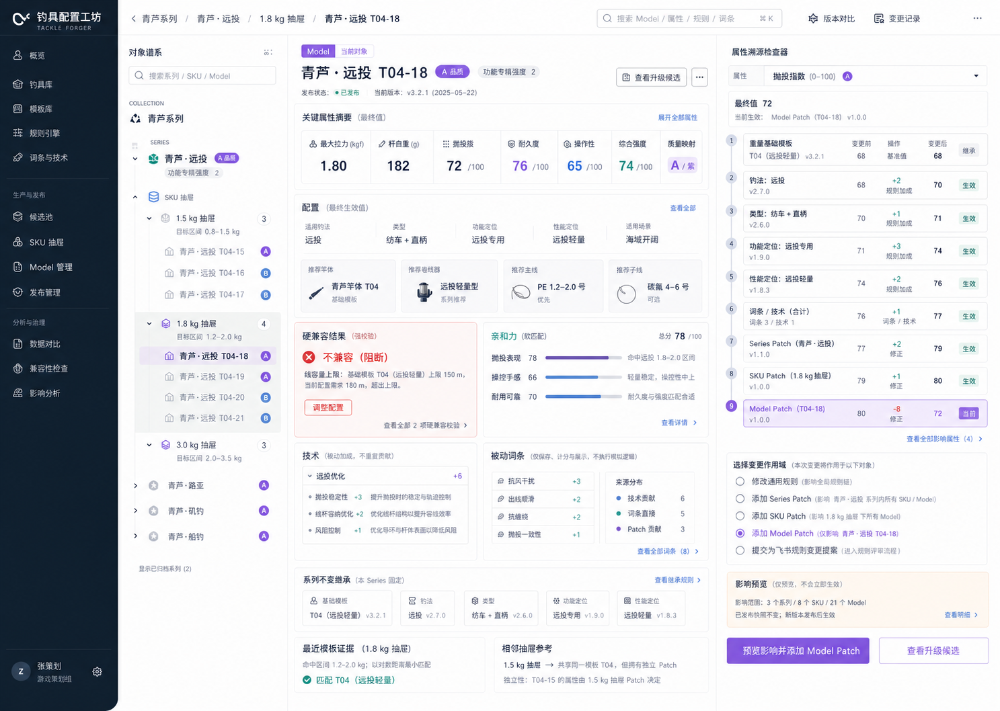

- 适用场景：从 Series 逐层进入 SKU 抽屉和 Model，完成日常配置、定位问题和局部 Patch。
- 信息密度：中等，渐进披露最强。
- 导航：窄全局栏 + 左侧对象树。
- 表格/画布/检查器比例：对象树约 18%，Model 内容约 52%，来源检查器约 30%。
- 多层规则表达：右侧垂直贡献链，适合逐层理解一个最终值。
- 来源追踪：天然成为持久检查器，可在属性、兼容、不变量间切换。
- Series–SKU–Model：三层对象树最明确，SKU 抽屉下多个 Model 一目了然。
- Patch/版本差异：作用域单选器 + 影响预览；旧 Snapshot 与升级候选并列入口。
- 优点：最适合非技术策划；身份层级清楚；局部操作路径短；能沿用当前列表 + 检查器模式。
- 风险：跨多个 Model 横向比较不如方向一；对象树在大型 Collection 下需要搜索和虚拟化；右侧检查器可能产生长滚动。
- 开发复杂度：中等。最容易分阶段落地，复用现有右侧抽屉和列表结构。

### 方向三：规则旅程画布与发布关卡

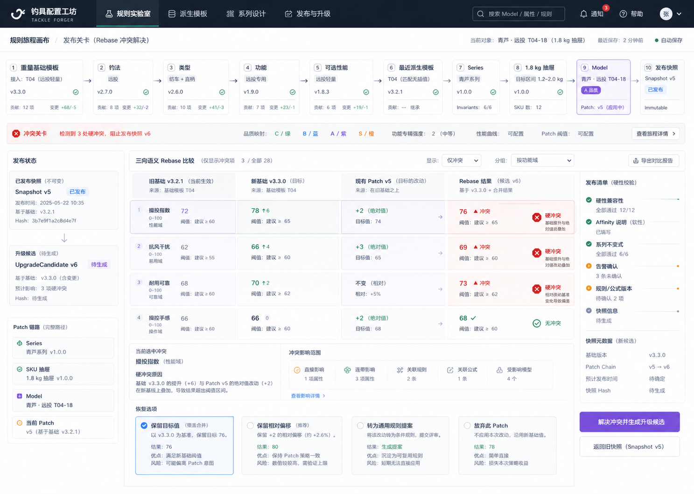

- 适用场景：规则变更、Patch rebase、发布审核、升级候选和跨层故障定位。
- 信息密度：中高，但按流程分段。
- 导航：顶部工作区切换 + 当前对象上下文，弱化永久侧栏。
- 表格/画布/检查器比例：顶部规则旅程约 25%，下方语义 Diff 约 60%，发布证据约 15%。
- 多层规则表达：横向阶段门，钓法与类型保持独立，最后进入产品与发布层。
- 来源追踪：强调端到端因果链和阶段状态，而非单属性列表。
- Series–SKU–Model：作为旅程后半段的独立阶段，能看见从派生到商品身份的转折。
- Patch/版本差异：三方 Rebase 比较是主工作区；冻结 Snapshot 与 UpgradeCandidate 分栏。
- 优点：发布与升级最可信；冲突恢复路径清楚；非常适合培训和跨角色评审。
- 风险：日常批量编辑效率低于前两案；若画布自由度过高会重回通用 DAG 的复杂性；必须限制为固定领域旅程。
- 开发复杂度：高。需要统一阶段状态、语义 Diff、Rebase 决策和发布证据接口；可采用静态布局与按需计算，避免重型实时渲染。

### 9.4 三案对比

| 维度 | 方向一 | 方向二 | 方向三 |
| --- | --- | --- | --- |
| 主心智 | 数据矩阵 | 对象谱系 | 生产旅程 |
| 最强任务 | 多属性横向比较 | 日常对象设计 | Rebase 与发布 |
| 新手友好 | 中低 | 高 | 中高 |
| 专家效率 | 高 | 中高 | 中 |
| 身份层级 | 中高 | 最高 | 高 |
| 属性溯源 | 横向分层 | 垂直分层 | 端到端阶段 |
| Patch 表达 | 矩阵列 | 作用域检查器 | 三方语义 Diff |
| 发布可信度 | 高 | 高 | 最高 |
| 实施风险 | 中高 | 中 | 高 |

---

## 10. UX 风险与待确认问题

### 10.1 必须保留为配置或待确认

1. 钩、漂、真饵、拟饵当前完全延期：产品界面不得展示注册表只读入口、“未启用”占位、创建或启用开关；历史Payload只由注册表、迁移和审计层保留。未来任一部位必须先建立独立产品设计Issue。
2. 已发布 Snapshot 冻结语义：不得以“自动升级”“保持最新”等交互改变。
3. 无法无损迁移的现有数据：必须保留原值、标记待审核，不能用 UX 流程掩盖删除或覆盖。
4. 降低型词条公式：只展示全局`bidirectional_ratio`的`ReductionStackingPolicyVersion`、主工作簿规则来源和当前是否为非正式预览；不得提供参数、部位或词条族级公式选择器。主工作簿机器规则缺失时显示`REDUCTION_POLICY_SOURCE_MISSING`并禁用策略、Model、Snapshot发布和正式导出。

### 10.2 权限治理结论与剩余产品确认

- 按`separation-of-duties/open009-v1`，一期、1.5期、二期和当前规划三期均不要求Series批准与Model发布职责分离，也不增加确认写回或RuleSet发布会签。
- 最近模板pin、-3 Affinity warning复核和导出等动作继续消费服务端Capability；当前策略下所有已登录公司用户拥有全部已启用Capability，页面不得自建角色或为任何阶段预设差异权限。
- -3 Affinity warning 的理由格式仍以v3动作契约为准，不因统一权限而省略理由、expectedRevision或操作记录。
- Collection 是否首版可编辑，还是只读品牌分组。
- 普通操作记录保留1年；导出权限按服务端已启用Capability判定。未来变化必须另建Issue并发布新策略版本。

### 10.3 实施风险

- 当前 WorkspaceState 与 UI 仍基于旧 SeriesRecipe、Candidate、OfficialSku；在新 UI 前必须先完成兼容迁移层。
- 现有计算轨迹可复用，但需要按 v3 层级聚合，不能由前端猜测来源。
- 当前种子品质仍使用“金”，迁移时需区分历史 Snapshot 文案和新实体映射。
- 当前工作台大表、画布、抽屉并存，若无统一焦点管理会造成键盘陷阱。
- 属性来源、兼容、不变量、发布若分别实现自己的“问题”模型，会产生严重口径不一致；应先定义统一 ValidationIssue 与 ActionLink。
- 当前 3000 端口曾出现构建后资源引用失效；生产部署需验证静态资源哈希和回滚路径。此项是工程风险，不是视觉方向依据。

---

## 11. 开发优先级建议

### P0：领域与交互契约

1. 建立 Collection / Series / SkuDrawer / PurchasableModel / ConfigurationSnapshot 的兼容领域接口。
2. 建立 ProjectionMatch、分层 Patch、Patch 基线与 UpgradeCandidate。
3. 建立统一 TraceContribution、ValidationIssue、HardCompatibilityResult、AffinityBreakdown。
4. 完成品质映射迁移；历史已发布文案只读保留。
5. 明确已发布 Snapshot 只读接口与哈希。

验收门槛：前端不需要从旧字段推断身份、来源或严重度。

### P1：最小可用主链

1. 全局对象上下文与搜索。
2. 钓具系列甘特图：纵向重量分段 × 横向品质/类型的 Series 覆盖矩阵。
3. SKU 抽屉 + 多 Model。
4. Model 工作台 + 属性来源检查器。
5. 作用域选择器 + 影响预览。
6. 硬兼容与 Affinity 分区。

验收门槛：策划能从 Series 创建两个离散重量 SKU，每个 SKU 创建多个 Model，并解释任一最终属性。

### P2：安全发布与升级

1. 系列不变量与重量曲线。
2. Patch / Rebase 三方比较。
3. 发布检查清单与冻结 Snapshot。
4. 上游变化后的 UpgradeCandidate。
5. 历史快照并列比较。

验收门槛：上游规则变化后旧 Snapshot 语义级不变；未解决 set 冲突不能发布。

### P3：治理与效率

1. 规则实验室版本对比与批量导入校验。
2. 兼容矩阵规则编辑。
3. 词条与技术库的成员展开和重复贡献检查。
4. 飞书规则修改草稿、写回验证、显式拉取和RuleSet发布审计。
5. 保存视图、批量比较、键盘快捷操作和性能优化。

---

## 12. 第二阶段入口与验收范围

用户选择方向后，第二阶段应：

1. 读取 product-design:image-to-code 并以选中图片作为唯一视觉目标。
2. 不直接重写正式 Workbench；先在隔离原型目录实现核心交互。
3. 至少实现以下可交互场景：
   - Series → SKU 抽屉 → Model 导航。
   - 属性来源 9 层展开。
   - 编辑作用域与影响预览。
   - 硬冲突与 Affinity 分区。
   - Patch rebase 冲突恢复。
   - 发布检查与冻结 Snapshot。
4. 形成组件规范、交互规则、响应式策略和无障碍要求。
5. 为每个页面提供开发 Agent 可执行的 Given / When / Then 验收标准。
6. 用选中视觉与实现截图进行 Design QA，不只做代码检查。

方向已定稿。正式实现必须遵守 v3 领域规范、本文交互契约与逐页面验收标准；不得以原型示例值替代可配置项。

---

## 13. 第二阶段定稿：方向一交互原型与开发 Handoff

### 13.1 最终视觉目标

#### 具体 Model 属性工作台

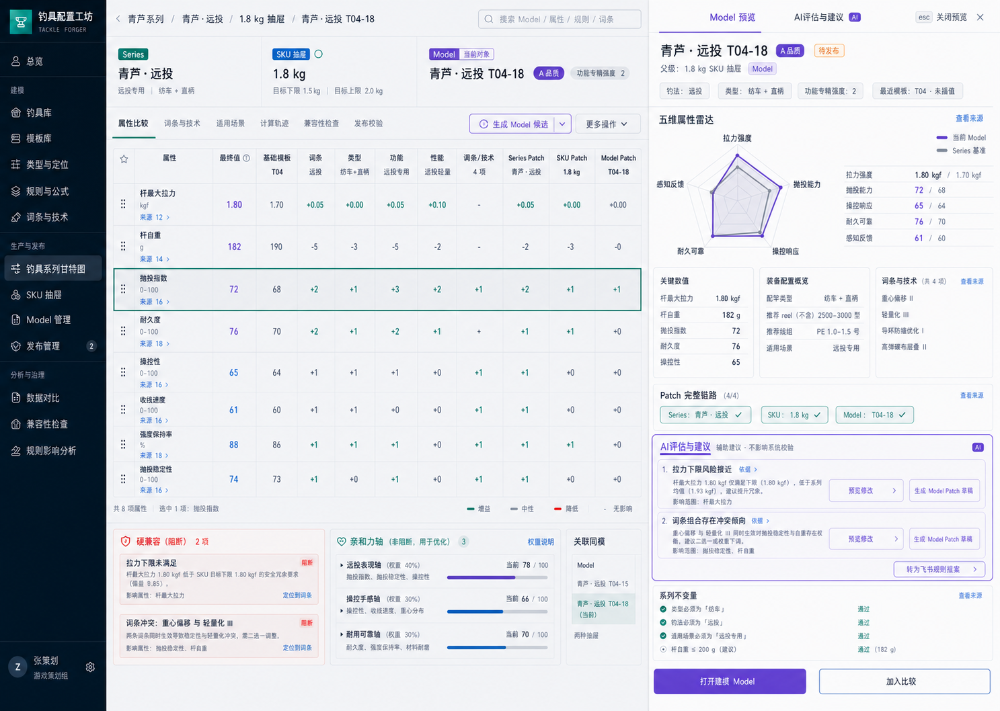

此图只表达具体 Model 的属性来源矩阵与右侧预览层，不是“钓具系列甘特图”主页面。

#### 钓具系列甘特图

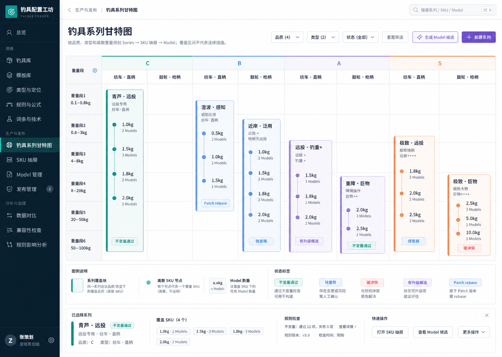

甘特图采用转 90 度后的系列覆盖矩阵：纵轴是可配置重量分段，横轴第一层为品质 C/绿、B/蓝、A/紫、S/橙，第二层为类型组合。表格只提供坐标骨架；Series 使用跨重量行的图形化覆盖块，内部连接多个离散 SKU 节点并显示 Model 数量。覆盖块绝不表示连续插值。

本轮确认并锁定以下产品决策：

1. 以“高密度数据驾驶舱”为主框架。主区承担属性横向比较、来源追踪和确定性校验。
2. 一级入口正式命名为“钓具系列甘特图”。构图采用纵向重量分段、横向品质/类型的系列覆盖矩阵；Series 覆盖块内部只连接真实离散 SKU 节点，不改变最近模板匹配规则，也不暗示连续插值。
3. 原“候选池”不再作为与系列并列的一级产品概念；候选能力收进系列/SKU 上下文，动作命名为“生成 Model 候选”。
4. Model 预览从右侧推入，与主矩阵保持上下文连续；抽屉宽度基准 520px，1440 以下缩至 500px。
5. 五维属性图是可配置聚合视图，必须同时提供数值对照与来源入口；示例轴不构成固定领域结论。
6. “Model 预览”和“AI评估与建议”共用同一右侧层，通过顶部分段切换，避免叠加第二个抽屉。
7. AI 只提供解释与建议。允许动作只有预览修改、生成Model Patch草稿、生成RuleSourceChangeDraft；不得自动应用、确认写回、拉取、发布、覆盖硬冲突、改写Affinity或改变Snapshot冻结语义。

### 13.2 可交互原型

- 本地原型入口：http://127.0.0.1:4174/
- 隔离原型目录：[prototype-v1](./prototype-v1/)
- 属性矩阵与预览截图：[implementation-matrix-preview.png](./prototype-v1/implementation-matrix-preview.png)
- 钓具系列甘特图截图：[implementation-gantt-vertical-v2.png](./prototype-v1/implementation-gantt-vertical-v2.png)
- 甘特图视觉对照：[design-comparison-gantt-vertical-v2.png](./prototype-v1/design-comparison-gantt-vertical-v2.png)
- 甘特图重点区域对照：[design-comparison-gantt-vertical-focus.png](./prototype-v1/design-comparison-gantt-vertical-focus.png)
- Design QA：[design-qa.md](./prototype-v1/design-qa.md)
- 产品设计完成审查：[completion-audit-2026-07-20.md](./prototype-v1/completion-audit-2026-07-20.md)
- 全景对照：[design-comparison.png](./prototype-v1/design-comparison.png)
- 抽屉重点对照：[design-comparison-drawer.png](./prototype-v1/design-comparison-drawer.png)

原型覆盖的可操作核心路径：

1. 从左侧“钓具系列甘特图”进入 Series 规划视图。
2. 在纵向重量分段 × 横向品质/类型矩阵中查看 Series 覆盖块、离散 SKU 节点、Model 数量与状态。
3. 点击青芦·远投 1.8 kg SKU，进入属性来源矩阵并打开 Model 预览。
4. 在五维图中比较当前 Model 与 Series 基准。
5. 切换到 AI 评估模式，查看“不影响系统校验”的护栏说明与证据。
6. 将一条建议生成 Model Patch 草稿；界面只反馈草稿已生成，不改变最终值。
7. 使用 Escape 关闭抽屉，再从“预览 Model”恢复。
8. 在甘特图或矩阵中使用“生成 Model 候选”；默认按SKU×启用型号路线自动选取排名最高的合法候选并创建/更新Model草稿，用户可在运行前限制范围或启用REVIEW_ON_CHANGE。

### 13.3 组件与交互规范

| 组件 | 结构 | 交互 | 禁止行为 |
| --- | --- | --- | --- |
| 钓具系列甘特图 | 纵向重量分段 × 横向品质/类型；Series 覆盖块内连接离散 SKU 节点 | 点击 Series 更新底部摘要；从摘要下钻 SKU 抽屉和 Model | 不得把覆盖范围解释为连续插值；不得把 SKU 写成可购买对象 |
| 对象上下文头 | Series、SKU 抽屉、Model 三段；不同色标与父子关系 | 点击 Series 返回甘特图；切换 Model 时保持矩阵位置 | 不得把 SKU 写成可购买对象 |
| 属性来源矩阵 | 属性行 + 最终值 + 模板/规则/词条/Patch 贡献列 | 选中行后高亮；“来源 N”打开完整 Trace；冻结关键列 | 不得由前端推断贡献值或隐藏负贡献 |
| Model 预览层 | 固定头、内部滚动体、固定底；Model/AI 两种模式 | 从右推入；Escape、关闭按钮；关闭后归还焦点 | 不得在抽屉内直接发布或绕过校验 |
| 五维属性图 | 雷达轮廓 + 图例 + 数值列表 + 来源 | Hover/聚焦时同步高亮轴与数值；缺值显示“未配置” | 不得只靠面积判断优劣；轴名不得硬编码为唯一产品结论 |
| 验证结果 | 硬兼容、Affinity、系列不变量三个独立区 | 每条结果提供原因、证据、影响对象与下一步 | 不得用一个总分覆盖硬冲突 |
| AI 建议 | 建议标题、证据、影响范围、动作、护栏 | 预览修改、生成Patch草稿、生成RuleSourceChangeDraft | 不得自动应用、写回、拉取、发布、执行模拟器或修改已冻结快照 |
| 作用域选择器 | 通用规则修改草稿、Series Patch、SKU Patch、Model Patch、FinalReview Patch | 选择前展示影响对象数量；保存前展示before/after | 不得默认选择通用规则；不得无理由set |
| 状态标签 | 图标 + 文案 + 颜色 | 状态变化需要可读反馈并写审计 | 不得只靠颜色；品质与功能强度不得共用语义 |

推荐设计令牌：

- 基础背景：#F7F9FC；主表面：#FFFFFF；深色导航：#071E2E。
- 主交互紫：#6845E4；来源/继承青：#087D79；软评分蓝：#236BC6；阻断红：#DF4B4B。
- 品质：C/绿、B/蓝、A/紫、S/橙；必须同时显示字母与“品质”。
- 正文字号 14px；高密度表格可降至 12px，来源微文案最低 11px；原型为截图密度使用的更小示意字号不得直接复制到生产。
- 表格行高建议 44–52px；普通按钮高 32px；主要操作 36px；触控不是主目标，但可点击区域不低于 28px。
- 分隔优先使用间距与 1px 分隔线；抽屉使用单次阴影，不做卡片套卡片。

### 13.4 响应式要求

- 1440px 及以上：152px 全导航 + 自适应主区 + 520px 预览层。
- 1280–1439px：导航缩至 142px；预览层缩至 500px；低频工具动作收进“更多操作”；页面不得产生 body 横向滚动。
- 1024–1279px：不是首要编辑工作区。默认折叠全局导航，抽屉最大宽度为视口的 55%；矩阵允许容器内横向滚动并冻结属性/最终值两列。
- 低于 1024px：提供只读检查与审批视图，不承诺完整批量编辑；发布阻断仍必须完整展示。
- 高度低于 900px：矩阵行高可收紧，验证区内部滚动；抽屉头尾保持固定。
- 不使用重型实时画布；甘特图采用静态布局、虚拟化行和按需展开，适配共用 Dell R730 内网服务器。

### 13.5 无障碍要求

1. 所有状态同时提供图标、文案和颜色；红绿之间必须有形状或文本差异。
2. 抽屉打开后焦点进入标题或首个可操作控件；Tab 限制在抽屉；Escape 关闭；关闭后焦点回到触发按钮。
3. 五维图必须提供等价数据表；轴标签可被键盘聚焦并读取当前值与基准值。
4. 表格表头使用真实语义；排序、冻结、展开与来源按钮具有独立可访问名称。
5. Toast 使用 polite live region；硬冲突新增使用 assertive 提示，但不得重复朗读整页。
6. 动画遵循减少动态效果偏好；抽屉推入在该偏好下取消位移，仅做即时显示。
7. 文字/背景对比至少达到 WCAG 2.2 AA；焦点框对比明确且不被裁切。
8. 缩放 200% 时核心发布信息不得丢失；400% 时允许切换为单列只读检查。

### 13.6 逐页面开发验收标准

#### 钓具系列甘特图

- Given 已存在多个 Series 与离散重量 SKU，When 用户进入甘特图，Then 纵轴显示可配置重量分段，横轴按品质 C/绿、B/蓝、A/紫、S/橙及类型分组，并显示 Series 覆盖块、离散 SKU 节点、Model 数量和状态。
- Given 1.5 kg 与 1.8 kg 命中同一最近模板，When 用户查看同一 Series 覆盖块中的两节点，Then 两者仍为独立 SKU，分别展示 Patch/Model 状态，并显示“覆盖范围不代表连续插值”。
- Given 用户点击 Series 覆盖块，When 底部摘要更新，Then 显示系列不变量、品质、类型和全部离散 SKU；用户再选择 SKU 后进入抽屉。
- Given 用户从摘要进入某 SKU 抽屉，When Model 工作区打开，Then 面包屑明确到 Series → SKU 抽屉 → Model，且购买对象只标记为 Model。

#### 规则实验室与派生模板浏览器

- Given 用户输入离散重量，When 计算派生，Then 显示最近模板、距离、平局规则与规则版本，不显示连续插值。
- Given 用户编辑钓法与类型，When 保存，Then 两层贡献在 Trace 中独立存在，即使界面同一步。
- Given 用户尝试固定开放曲线或阈值，When 提交，Then 系统要求选择配置版本或记录待确认，不把原型示例写成领域常量。

#### 属性来源矩阵

- Given 任一最终属性，When 用户打开来源，Then 按模板、钓法、类型、功能、性能、词条/技术、Series Patch、SKU Patch、Model Patch 展示 before/operation/operand/after、来源版本、警告和动作。
- Given 某层无贡献，When 表格显示，Then 使用“—/无影响”而不是空白。
- Given 同名技术包与成员词条重复贡献，When 计算，Then 作为确定性问题显示并阻止重复加成。

#### Model 预览层

- Given 用户在矩阵中选择 Model，When 点击“预览 Model”，Then 右侧层在不丢失选中行/滚动位置的前提下打开。
- Given 抽屉打开，When 用户按 Escape 或关闭，Then 抽屉关闭并将焦点归还触发按钮。
- Given Model 有硬冲突，When 用户查看五维图或 Affinity，Then 阻断仍在独立区域清晰可见，发布动作保持不可执行。

#### AI评估与建议

- Given 系统存在硬冲突，When AI 生成建议，Then 顶部明确显示“系统校验优先”，AI 不得更改冲突级别。
- Given 用户选择“生成 Model Patch 草稿”，When 动作完成，Then 只创建带来源、理由和建议 before/after 的草稿；最终值、快照和发布状态不变。
- Given 建议具有通用性，When 用户选择规则源修改，Then 仅创建RuleSourceChangeDraft并先展示跨对象影响；AI不得确认写回、拉取或发布。
- Given 被动词条，When AI 评估，Then 仅基于保存、计分和展示信息提出建议，不声称已执行模拟器逻辑。

#### Patch / Rebase 对比器

- Given 上游基线变化，When Patch 需要 rebase，Then 同屏显示旧基础、新基础、现有 Patch、预计结果和冲突原因。
- Given set冲突未解决，When用户尝试发布，Then发布被阻断并提供保留目标值、转相对偏移、转RuleSourceChangeDraft或放弃等恢复动作。
- Given 用户完成 rebase，When 保存，Then 生成新候选版本，已发布 Snapshot 保持不变。

#### 发布与升级中心

- Given Model 待发布，When 用户进入发布检查，Then 显示规则/公式版本、完整 Patch 链、硬兼容、Affinity、系列不变量、与上一版本差异、阻断/警告/确认项。
- Given 仍有硬冲突，When 用户点击发布，Then 操作不可执行并聚焦首个阻断项。
- Given 发布成功，When Snapshot 冻结，Then 显示不可编辑状态、快照哈希与冻结时间；上游变化只创建 UpgradeCandidate。
- Given 存在升级候选，When 用户比较旧快照，Then 旧值与冻结语义不被重算，用户必须显式选择是否生成新版本。

#### 数据源、飞书规则修改与审计

- Given用户从共享DerivationLayerPatch发起通用规则修改，When打开草稿页，Then预填来源对象、证据、稳定目标规则和影响范围，并允许人工修改。
- Given 飞书提交失败，When 返回工具，Then 本地草稿和审计上下文保留，可重试且不会重复创建。
- Given 任一规则、Patch、发布或 AI 草稿动作，When 审计记录生成，Then 记录操作者、时间、作用域、before/after、理由、版本和关联对象。

### 13.7 Design QA 结论

最终结果：passed。

- 1440 × 1024 全景对照通过。
- 右侧预览层重点对照通过。
- 1280 × 800 桌面回退无 body 横向溢出；导航与抽屉按规范收窄。
- 甘特图 → 1.8 kg SKU → Model 预览路径通过。
- Model 预览 / AI 模式切换通过。
- AI 建议生成 Model Patch 草稿的反馈通过，未自动修改最终值。
- Escape 关闭与“预览 Model”恢复通过。
- 完整路径浏览器 console warning/error：0。

正式实现仍需在真实数据和权限环境中补做：屏幕阅读器顺序、200%/400% 缩放、飞书失败重试、真实大数据虚拟化性能，以及已发布快照的后端不可变验证。

---

## 14. 最终 Audit 与完成结论

### 14.1 Audit 范围

本轮 Audit 使用 1440 × 1024 可交互原型，验证核心策划路径：

1. 在钓具系列甘特图中理解品质、类型、重量分段、Series、SKU 与 Model 数量。
2. 从选中 Series 下钻到具体 Model 属性工作台。
3. 查看属性来源、五维图、硬兼容、Affinity、系列不变量与 Patch 链。
4. 切换 AI评估与建议，确认其不覆盖系统校验。
5. 从 AI 建议生成待人工确认的 Model Patch 草稿。

### 14.2 审查步骤与健康度

#### 步骤 1：系列规划——健康

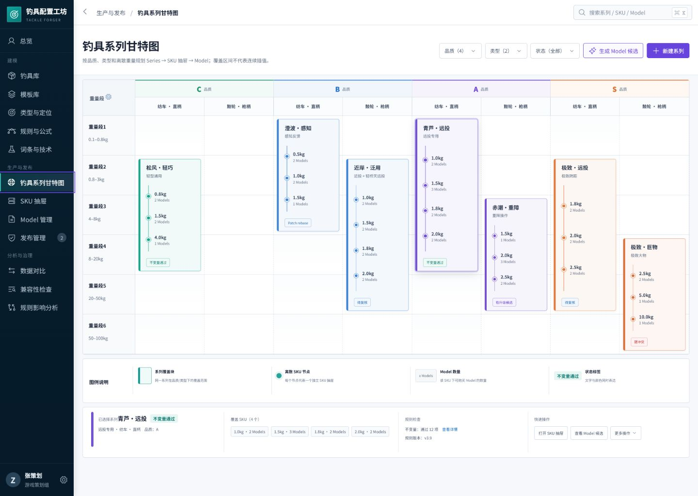

- 纵向重量段、横向品质/类型形成稳定扫描坐标。
- Series 覆盖块、离散 SKU 节点和 Model 数量具有不同视觉身份。
- C/绿、B/蓝、A/紫、S/橙同时使用字母和颜色。
- “覆盖范围不代表连续插值”已写入页面说明和验收标准。
- 风险：原型用于表达高密度结构，生产实现不得直接复制低于 11px 的示意字号。

#### 步骤 2：Model 解释与预览——健康

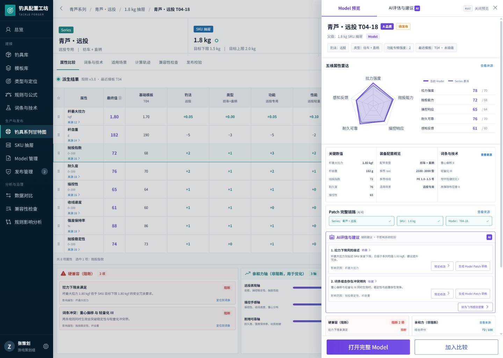

- 面包屑和身份标签清楚区分 Series、SKU 抽屉与 Model。
- 属性矩阵支持逐层追踪模板、规则、词条/技术和三层 Patch。
- 五维图同时提供 Series 基准、当前 Model 和数值列表。
- 硬兼容、Affinity 与系列不变量没有被合并为模糊总分。
- 风险：真实大数据下仍需验证虚拟表格、冻结列和抽屉滚动性能。

#### 步骤 3：AI 护栏——健康

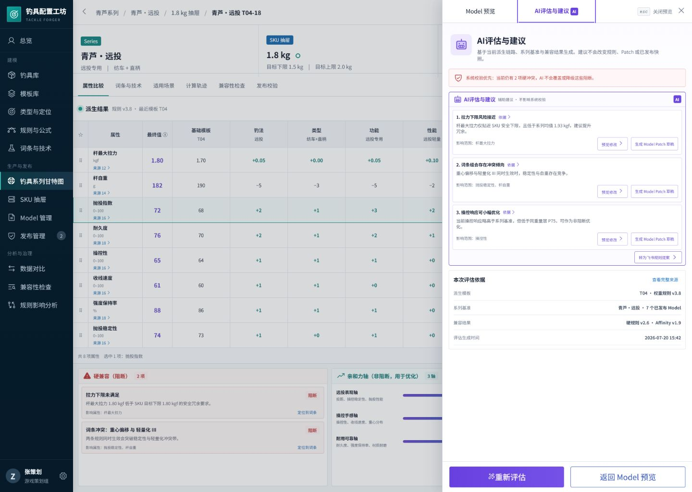

- AI 模式明确显示“系统校验优先”和当前硬冲突数量。
- 建议包含依据、影响范围和可选动作。
- AI 与确定性校验使用不同视觉语义。
- 风险：正式实现必须记录评估所用规则版本、证据版本和生成时间。

#### 步骤 4：Patch 草稿反馈——健康

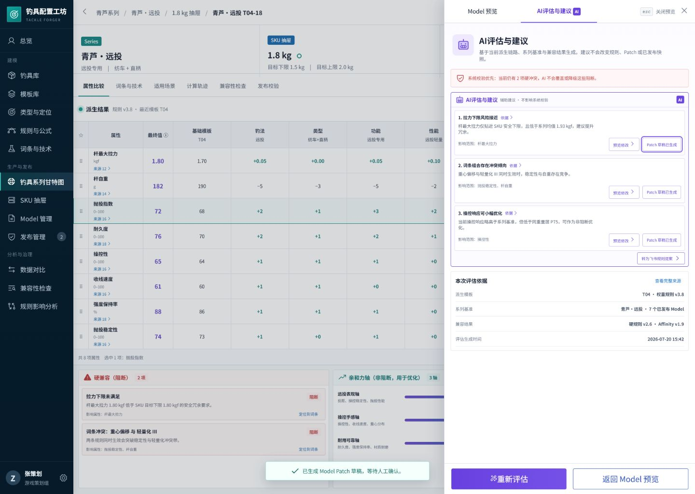

- 操作只生成草稿，界面明确提示“等待人工确认”。
- 最终属性、硬冲突和发布状态不会因 AI 动作自动改变。
- 草稿动作可恢复、可审计，并保留转飞书规则修改草稿的路径。

### 14.3 最终 UX 结论

UX 设计完成，无需再等待视觉方向或核心交互决策。开发 Agent 可以开始正式实现，但必须满足以下进入条件：

1. 以 v3 为唯一权威领域规范。
2. 使用本文第 13.6 节 Given / When / Then 作为逐页面验收基础。
3. 先建立对象身份、TraceContribution、ValidationIssue、分层 Patch、ConfigurationSnapshot 和 UpgradeCandidate 契约，再实现高密度页面。
4. 五维轴配置继续版本化；OPEN-001公式决策已经确认，界面只展示全局`bidirectional_ratio`策略版本、主工作簿来源和非正式预览/阻断状态，不提供公式模式配置。Patch按OPEN-004已决策略实现，PricingPolicy按v3第20.1节已决契约实现。扩展部位按OPEN-003保持`DEFERRED_UI_DISABLED`，不在现有UX中预留产品入口。未来只允许扩展`PerformanceSummaryDefinition`的统计与展示，若要恢复可编辑Performance输入必须重新提出产品变更并修订v3。
5. 不迁移或覆盖用户现有数据；不能无损迁移的记录必须保留原值并进入人工复核。
6. 已发布 Snapshot 必须在后端保证不可变，不能只依赖前端只读样式。
7. AI只能生成建议、Model Patch草稿或RuleSourceChangeDraft，不能成为规则裁决、飞书写回、拉取或发布执行者。

### 14.4 证据限制与开发期验证

以下项目不能仅凭 UX 原型宣布完全通过，必须在正式实现阶段验证：

- 屏幕阅读器阅读顺序与动态提示。
- 200% 和 400% 缩放下的重排。
- 真实大数据量下的表格/矩阵虚拟化性能。
- 飞书统一Capability、写回回读、显式拉取、失败重试、幂等和带fencing token的单写租约；服务端可达副作用与浏览器本地文件恢复必须分别验证，一期、1.5期、二期和当前规划三期均不建设职责分离。
- Snapshot 后端不可变、升级候选和 Patch rebase 的集成测试。
- 多人同时编辑、锁定、冲突合并与审计完整性。

最终 Audit 结论：通过。UX 状态：完成。
## 15. 正式实现的前端消费契约

本节只规定页面如何消费权威规范第24、25节，不新增领域语义。字段、状态、权限、排序和错误恢复以服务端契约为准。

### 15.1 甘特图

- 筛选栏：全文、Collection、钓法、类型、品质、功能、部位、生命周期、注意状态、Issue严重度、升级候选、重量范围、规则版本；部位选项只包含竿、轮、线。
- 主矩阵保持“纵向重量分段 × 横向品质/类型”；重量显示分段来自配置，品质顺序固定C/绿、B/蓝、A/紫、S/橙。
- Series覆盖块放在固定品质/类型列，跨越离散SKU的最小/最大显示位置；块内只连接真实SKU节点。
- 搜索/筛选变化后保留仍可见的选中Series、底部摘要和矩阵滚动位置。
- 点击Series覆盖块只更新底部摘要；摘要展开控件与“打开Series/进入SKU抽屉”动作分开。
- SKU节点气泡至少显示精确targetPullKg、最近结构标杆/未插值、Model总数/当前查询命中数、主状态、Issue与升级数量。
- 点击SKU节点不因单Model跳级；Model行才打开右侧预览。
- 矩阵空白/重量分段不支持双击创建；使用明确“添加重量规格”。
- 当前统一Capability策略始终显示服务端返回的总数与本次查询命中数，不实现“可见N个”或对象级计数隐藏；游标失效时保留筛选和滚动锚点。

### 15.2 对象上下文与右侧层

- 顶部三段身份条始终为Series / SKU抽屉 / Model；缺当前Model时第三段显示“尚未选择Model”，不把SKU伪装成Model。
- 面包屑每段同时显示对象类型标签和名称；Snapshot增加锁与版本。
- 右侧层切换Model时不关闭，主矩阵选中行/滚动位置保持；对象已删除、路由过期或不属于当前工作区时显示明确不可用原因，不残留前一对象数据。
- `Model预览 / AI评估与建议`共用同一层；AI二期未启用时保留明确“二期能力/当前未启用”，不显示假建议。
- 所有按钮直接消费`ActionAvailability`；禁用按钮保留功能开关、领域Gate、revision、Manifest或Capability原因。当前不建设应用内成员管理或请求对象权限动作。

### 15.3 候选结果

- 生成前摘要Series、SKU数量、Recipe revision、RuleSet、搜索空间、预计上限和“硬冲突会被排除”。
- 运行中支持离开页面后恢复；返回时按requestId继续，不重新开run。
- 结果分“可选候选”和“已排除统计”；deny不得因调试开关混入普通排序。
- 每个候选显示稳定rank、rankReasons、Affinity分解、warning、不变量偏离、模板距离。
- 默认按`SKU × enabledModelVariantKey`自动物化排名最高的合法候选；结果页显示已创建、已更新、无变化复用、因歧义跳过。
- 运行前提供SKU范围、重量、启用路线、每SKU数量、最低Affinity、warning接受与REVIEW_ON_CHANGE等批量限制。
- 用户显式介入某候选时，可以改选或放弃并使依赖下游DIRTY，但不得按name猜旧Model。
- “放弃本次结果”是run级动作，确认文案明确不会删除Series/SKU/已有Model/Trace。

### 15.4 Trace、Issue与状态

- 属性来源固定展示后端Trace顺序；无影响层显示后端no_effect摘要。
- 硬兼容、Affinity、系列不变量、发布检查分别分区，但使用同一Issue/Action组件。
- Issue卡展示source、severity、gate、影响对象、证据和可执行动作；不可只显示“N个错误”。
- 状态组件分别接收Lifecycle、Revision、Validation、Publication、Attention数组和派生Primary；主标签之外显示副标签/计数。
- 未识别状态或Action时进入只读安全态，并提供刷新/审计，不隐藏问题或回退为草稿。

### 15.5 五维图

- 图、图例、数值表和“查看来源”共同消费同一个FiveAxis结果；图表组件不含公式。
- 预览固定显示definition version、鱼重基准、vertex hash的可读摘要。
- Series基准名称旁显示选择策略与来源；基准不可用时保留Model曲线和设置/请求权限动作。
- missing、error、not_applicable、context_inherited使用不同文案和图形；均不可画成0。
- 版本/hash不一致时不叠加轮廓，展示“基准不可比较”及重算动作。
- 最终轴和聚合仍开放；原型中的轴名只做种子配置。

### 15.6 AI动作

- 建议卡固定有证据、假设、未覆盖信息、影响对象/属性、生成时间、规则版本、状态。
- stale建议的转换按钮禁用，保留查看旧证据与重新评估。
- 转Patch使用独立确认页/步骤，不在建议卡一键完成；显示作用域、before/after和确定性校验差异。
- 转飞书规则修改先进入RuleSourceChangeDraft与跨对象影响预览；AI不能确认写回。写回、回读、显式拉取和RuleSet发布使用独立状态与动作。
- AI与系统校验冲突时，在建议上显示“与系统校验冲突”，系统Issue区域不变化。

### 15.7 配置表交付

发布流程末端增加批量准备与两步交付：

0. “准备发布与导出”：一次选择多个Model，列出复用Snapshot、新建Snapshot和跳过项，只确认一次。
1. “生成配置表”：选择一个或多个明确的环境×渠道目标，查看三张表的行级变更、原文件hash和暂存状态。
2. “关联校验与写入”：按目标展示error/warning、文件/sheet/行/字段、关系目标、备份与提交结果。

- dev/test是环境；1001固定写入各环境的`xlsx`；其他渠道只由用户明确选择目录。页面不展示或管理`config_system.toml`渠道。
- 目录句柄保存在浏览器IndexedDB；授权失效时引导重新授权。服务端不显示或保存绝对路径。
- 浏览器本地写入不进入服务端fenced outbox；租约失效时旧页面不能报告成功，目标显示“外部文件冲突/需要恢复”，后续写入前必须重新授权、逐文件回读并按恢复Manifest恢复或前向协调。
- 每个Model强制生成tackle、item、GoodsBasic和StoreBuy；新StoreBuy的`enabled=false`，更新普通属性时保留该目标已有上架状态。
- 多目标使用独立状态卡；一个目标失败不能让全局按钮显示“全部成功”。
- 默认继续写入其他合格目标，同时在确认页提供“任一失败则全部不写”。
- 浏览器不支持File System Access API时提供下载变更包，不提示安装一期不存在的本机助手。
- hash冲突和恢复均使用持久结果区并提供重新预览或按恢复Manifest复原；不宣称跨文件原子写入。
- 强制增量关联校验阻断本次断链；全库检查由用户主动触发，历史无关问题不阻断本批。

### 15.8 前端验收补充

- Given 甘特图Series仅一个Model，When 点击SKU节点，Then 仍先进入SKU上下文，不自动跳到Model。
- Given 服务端返回PUBLISHED + HAS_UPGRADE_CANDIDATE，When 渲染状态，Then 同时显示已发布和有升级候选。
- Given 功能开关、领域Gate、revision、Manifest或当前已启用Capability使Action disabled，When 用户查看，Then 按钮显示服务端返回的精确原因和可恢复动作，不自行推断角色或对象权限。
- Given 五维基准hash不同，When 打开预览，Then 不叠加误导曲线。
- Given AI功能一期未启用，When 打开AI Tab，Then 核心校验、发布和Model预览仍完整可用。
- Given 配置目标发生外部修改，When 用户提交，Then 页面保留暂存变更并引导重新预览，不覆盖文件。
- Given 批量选择25个Model且18个Snapshot未变化，When 准备发布与导出，Then 复用18个、只为合格变化项新建Snapshot，不要求逐个确认。
- Given 注册表或历史迁移中存在钩、漂、真饵或拟饵记录，When 用户进入产品导航、筛选或工作区设置，Then 不展示这些部位的入口、“未启用”占位或启用动作；草稿、生成、发布和导出请求返回“部位未启用”，且历史记录不被删除。
